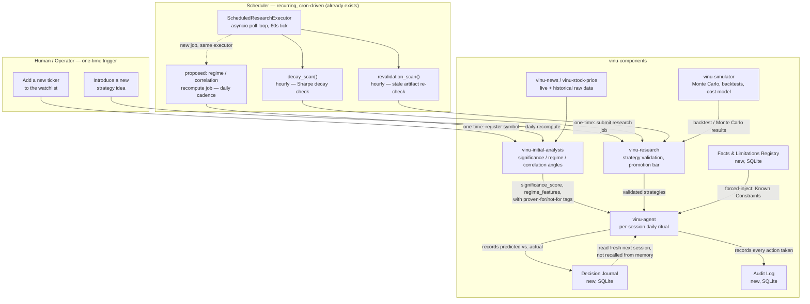

# The Integration Plan — Where Everything Actually Lands in `vinu-components`

## What was checked, and the headline finding

Went through `vinu-agent`'s context/tool-injection code, every service's
storage layer, and `vinu-research`'s scheduler — specifically to answer
Decision 1 (does a pluggable seam exist), Decision 2 (does a scheduler
exist), and Decision 4 (is SQLite enough, no vector DB needed). All three
questions have real, concrete answers now, not assumptions:

1. **The seam already exists and is already shaped like a provider
   pattern** — good news, this is smaller than expected.
2. **A real scheduler already exists** (`vinu-research`) — the Freshness
   Contract's "who triggers recompute" question is not a new
   infrastructure category, it's a new job registered against an existing
   executor pattern.
3. **SQLite is the universal storage pattern** across every single
   service in this stack — confirms Decision 4 outright, and gives the new
   stores an exact, reusable base class instead of inventing one.

One genuinely new finding surfaced while checking, not something carried
in from earlier analysis — see §1's "gap found" note.

## 1. The seam — `ContextBuilder.build_messages()`

`vinu_agent/vinu_agent/agent/context.py:113-171`. This already does almost
exactly what Decision 1 asked for: it builds a `combined_context: list[str]`
by appending independent blocks — one for `persistent_memory.find_relevant()`
recalls, one per symbol found in the user's message via `unified_memory`
— before joining them onto the user message. **New providers (ground-truth
prices, the Facts & Limitations Registry, staleness labels) are new blocks
appended to this same list, following the exact pattern already there** —
this is not a rewrite, it's three more blocks in an existing loop shape.

**Gap found here, not previously documented anywhere in this project**:
`_extract_symbols()` (`context.py:82-89`) — the function that decides which
symbols get a memory block injected — only regexes the **current user
message** for capitalized 1-5 letter tokens. It has no awareness of the
session's actual held positions. This means today, if a user's message on
a given turn doesn't happen to mention "AAPL," the AAPL position gets no
memory/context block at all, regardless of whether it's held. This is a
different bug from the replay's tool-call dropout, but compounds it: even
when the model *does* reason, the symbol-injection logic itself has no
concept of "what do I actually hold" — only "what was just typed." Item 2
(forced ground-truth injection) must **not** reuse `_extract_symbols` as
its source of "which symbols matter" — it must pull from the session's
actual position state instead, exactly as originally scoped, and this
finding is the concrete reason why, not just a theoretical preference.

Also noted, lower priority: `ContextBuilder.__init__` is defined twice in
this file (lines 37-49 and 91-107) — the second silently overrides the
first, adding `max_memory_tokens`/`as_of`. Not a functional bug (Python
just keeps the last definition), but worth cleaning up whenever this file
is next touched, since it's exactly the kind of duplication that makes a
future diff harder to read.

## 2. Storage — one relational pattern, reused, not reinvented

Every service in `vinu-components` already stores state in its own SQLite
file under `data/<service>/*.db` (`data/agent/unified_memory.db`,
`data/initial-analysis/runs.db`, `data/research/research_meta.db`, etc.),
and `vinu_tools/storage/sqlite_backend.py`'s `SQLiteBackend` (schema string
+ thread lock, `_SCHEMA = "CREATE TABLE IF NOT EXISTS ..."`) is the shared
base class pattern most of them build on
(`vinu_agent/memory/unified_store.py`'s `UnifiedMemoryStore(SQLiteBackend)`
is a direct example, with real FTS on top). This settles Decision 4
concretely: no vector database, no new storage technology — each new store
below is one more small SQLite-backed class following this exact shape.

- **Facts & Limitations Registry** → new table/store in `vinu_agent`,
  e.g. `vinu_agent/facts/registry.py`, `SQLiteBackend` subclass, own
  `.db` file under `data/agent/`. Written to by whichever service
  establishes a finding (initially: manually seeded from this project's
  own already-proven findings — direction-prediction AUC, the replay's
  bug list — not new research).
- **Structured decision journal** (item 3 from `03-on-agent-consiuness/
  01-plan-and-implementations/03-structured-decision-journal.md`) → same
  pattern, `vinu_agent/journal/registry.py`, own table, own `.db` file.
- **Audit-log schema** (item 4) → same pattern again,
  `vinu_agent/audit/log.py`.

None of these need a new store-per-item — they could even share one
`.db` file with three tables if that's simpler operationally; that's an
implementation-time call, not an architectural one, since the pattern is
identical either way.

## 3. Scheduler — already exists, reuse the shape, don't build new infra

`vinu-research/vinu_research/scheduled/` is a complete, working scheduled-
job system: `cron.py` (`parse_cron`/`next_run`, real 5-field cron
expressions), `ScheduledResearchJobStore` (persisted job state — `PENDING`/
`RUNNING`, `next_run_at`, `interval_ms` or `schedule`), and
`ScheduledResearchExecutor` (`executor.py`) — an `asyncio` polling loop
(`_run_loop`, 60s default tick) that dispatches due jobs and already runs
two genuinely relevant periodic scans: `decay_scan()` (hourly, checks if a
strategy's rolling Sharpe has decayed vs. its initial value and triggers
re-research) and `revalidation_scan()` (hourly, re-validates artifacts
whose `last_validated_ts` is older than a configured interval). **This is
almost exactly the Freshness Contract's shape already, just applied to
strategies instead of regime/correlation features** — `decay_scan`'s
"is this stale/degraded, and if so trigger a refresh" logic is the direct
precedent for what regime-feature freshness needs.

Separately, `vinu-live/vinu_live/scheduler.py`'s `LiveScheduler` confirms
the simpler `while True: cycle(); sleep(interval)` shape is the standard
pattern "used by every other worker process in the stack" per its own
docstring (news-ingest, stock-ingest).

**Resolution of Decision 2's open question**: a scheduler does exist. The
Freshness Contract's recompute trigger should be a new scheduled job
registered the same way `decay_scan`/`revalidation_scan` are — either as a
third scan inside `vinu-research`'s existing executor, or an analogous
small executor inside `vinu-initial-analysis` calling its own existing
`POST /analysis/run/{symbol}?angle_names=regime_analysis` route
(`vinu-initial-analysis/vinu_initial_analysis/server/routes_read.py`) on a
cadence for whatever symbols are currently held/watchlisted. Which of the
two hosts it is an implementation-time call; the mechanism itself needs no
new infrastructure category, only a new job definition.

**Correction, found later by static code review (see
[`end-to-end-test/bugs-fixes-while-test/freshness-recompute-scan-never-started-in-production.md`](end-to-end-test/bugs-fixes-while-test/freshness-recompute-scan-never-started-in-production.md))**:
this section's "a scheduler does exist" was true of the code, but
`ScheduledResearchExecutor` — the class hosting `regime_recompute_scan()`,
`revalidation_scan()`, and its own `decay_scan()` — was never actually
instantiated or started anywhere in `vinu-research/vinu_research/server/app.py`
or `entrypoint.sh`. It shipped fully built and fully unit-tested, and still
never ran a single real cycle in the deployed system. Fixed by adding a
`schedule-freshness` CLI loop (running only `revalidation_scan`/
`regime_recompute_scan`, not the executor's own diverging `decay_scan`,
which would have run concurrently with the separate decay-scan
implementation already live via `schedule-decay`) to `entrypoint.sh`. The
lesson for this file specifically: confirming a scheduler "exists" in the
codebase is not the same claim as confirming it runs — the latter needs a
check against the actual container startup path, not just the class
definition.

## 4. Where the four `01-plan-and-implementations` items land — confirmed, not just proposed

**Update: all four items are now implemented** (224 tests passing) —
table below updated from "planned" to "actual," including two corrections
to what this file originally guessed:

| Item | Actual plug-in point (as built) |
|---|---|
| 1 — Fact-verification audit | `FactAuditor` (`vinu_agent/audit/fact_audit.py`), run from `AgentLoop._build_result`, verdicts stored in `result["audit"]` — matches this file's original plug-in guess |
| 2 — Forced ground-truth injection | `GroundTruthInjector` (`vinu_agent/audit/ground_truth.py`) wired into `ContextBuilder.build_messages()` via `session/service.py::_run_with_agent`, resolving held symbols from the real broker (**not** `_extract_symbols()` — the gap flagged in §1 was correctly avoided) |
| 3 — Structured decision journal | **Correction from this file's original guess**: no new store was built. Reused `vinu-research`'s existing `HypothesisRegistry` (already had a status lifecycle + evidence, just aimed at research hypotheses) — `trade_plan_tool.py`'s `_schedule_journal_write` populates it |
| 4 — Audit-log schema | **Correction from this file's original guess**: no new store was built here either. Extended the existing `AuditLogger` in `vinu_agent/broker/kill_switch.py:57` (already wired into `trade_tool.py:143-208`) with the fixed schema fields and 13 action constants, rather than inventing a parallel log |

The lesson from both corrections: §2's "reuse the existing SQLite pattern"
was right in spirit, wrong in specifics — the actual reuse target wasn't
"build a new store following an existing pattern," it was "there's already
a working store doing 80% of this, extend it." Worth internalizing before
the next round of planning: check harder for an existing near-miss before
assuming greenfield, even after a codebase pass already happened once.

**Still to verify, not yet done**: none of the above has been re-run
against the actual replay failure it was built to fix. 224 passing unit
tests confirm the mechanisms work in isolation; they don't confirm the
16-of-20-day tool-call dropout or the JNJ `$162.45` fabrication would
actually be caught if replayed today. That's the real acceptance test,
still outstanding.

## 5. What's still open after this check

- Exact host for the Freshness Contract's scheduled job
  (`vinu-research` vs. a new small executor in `vinu-initial-analysis`) —
  implementation-time call, not blocking.
- Whether the three new stores (§2) live in one shared `.db` file or three
  separate ones — implementation-time call, not blocking.
- Everything already flagged as out of scope in `01-plan-and-
  implementations/AGENTS.md` (hard escalation/confidence-thresholding)
  remains out of scope here too — this file does not reopen that.

## 6. Diagram — how the pieces actually connect, and where each trigger comes from

The three trigger types that matter, named explicitly since §3 didn't give
them a single clear label:

- **One-time, human-triggered** — a person adds a new ticker to the
  watchlist, or submits a new strategy idea for research. This goes
  through `vinu-initial-analysis` (register the symbol, backfill its
  history) or `vinu-research` (`ScheduledResearchJobStore.create(...,
  schedule="")` with no recurring schedule — a single dispatch, not a
  cron job) — a person is the only thing that starts this path.
- **Recurring, cron-driven** — already exists:
  `ScheduledResearchExecutor`'s hourly `decay_scan()`/`revalidation_scan()`
  in `vinu-research`. The Freshness Contract's regime/correlation
  recompute (§3, "proposed") is the same shape, new job, likely daily
  cadence rather than hourly since regime doesn't move as fast as a
  strategy's rolling Sharpe.
- **Per-session, agent-triggered** — `vinu-agent`'s own daily ritual
  (`01-vinu-questions-prompt.md`), running once per trading session, not
  on a fixed clock — it's driven by a session starting, not by time.

The point of drawing this out: **the only box a human ever touches
directly is the top one.** Everything below it — recompute, staleness
checks, journaling, auditing — has to run without a person in the loop,
because that's the entire premise of an unattended daily agent. If any of
those boxes ever need a person to remember to click something, the diagram
is lying about what's actually automatic.

## Related documents

- [`01-vinu-questions-prompt.md`](01-vinu-questions-prompt.md),
  [`02-knowledge-library-entities.md`](02-knowledge-library-entities.md),
  [`03-question-entity-mapping-and-freshness.md`](03-question-entity-mapping-and-freshness.md)
  — the three planning files this one grounds against real code.
- [`../03-on-agent-consiuness/01-plan-and-implementations/AGENTS.md`](../03-on-agent-consiuness/01-plan-and-implementations/AGENTS.md)
  — the four items this file confirms plug-in points for.
