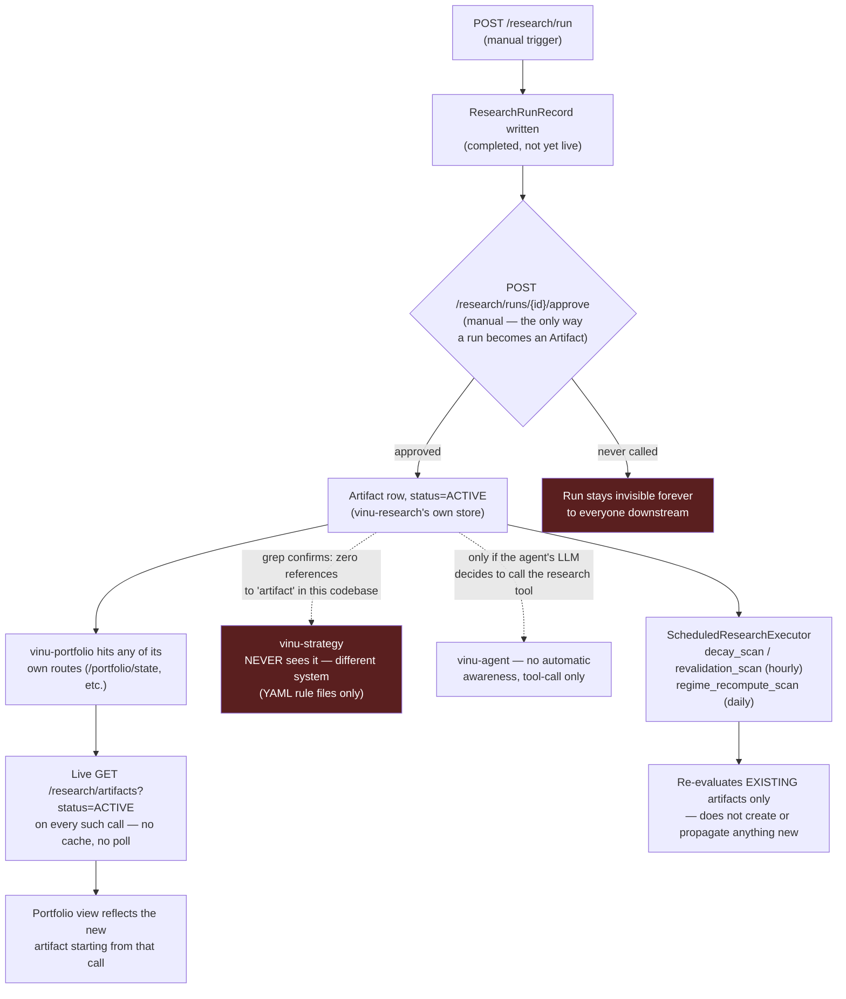

# Scenario A — A New Strategy Gets Generated and Promoted

## The short answer

- **`vinu-portfolio` picks it up automatically** — but only the next time
  someone hits one of its own routes, not on a timer.
- **`vinu-strategy` never sees it, ever.** Not a bug to fix here — it's a
  different, unrelated concept that happens to share the word "strategy."
- **Promotion itself is always a manual call.** Nothing in `vinu-research`
  auto-approves a run.

## Walking it end to end

1. `POST /research/run` (or `/research/ensure`) runs the actual
   generate → backtest → validate pipeline and writes a `ResearchRunRecord`
   (`vinu_research/service.py`'s `run_research()`). This does **not** by
   itself create anything `vinu-portfolio` or anyone else can see yet — a
   completed run is not an artifact.
2. Turning a run into something live requires an explicit approve call:
   `POST /research/runs/{run_id}/approve` (`vinu_research/server/routes_read.py:194`)
   → `approve_run()` → `_create_artifact_from_run()`
   (`vinu_research/service.py:268`, `:312`) writes a real `Artifact` row
   with `status: ACTIVE`.
3. `vinu-portfolio` never polls research on its own — there's no
   scheduler for this. Instead, every time one of its own read routes is
   hit (`GET /portfolio/strategies`, `/portfolio/state`,
   `/portfolio/weights`, `/portfolio/daily-allocation`,
   `/portfolio/daily-game-plan` — all registered in
   `vinu_portfolio/server/app.py:24-41`), it makes a **live** call out to
   `GET {research_api_url}/research/artifacts?status=ACTIVE`
   (`vinu_portfolio/service.py:100-113`) and rebuilds its view from
   whatever's ACTIVE right now. So: no separate "sync" step, but also no
   background awareness — if nobody calls a portfolio route, portfolio
   doesn't know or care that a new artifact exists.
4. `vinu-strategy` is a YAML rule engine (`vinu_strategy/loader.py:9-28`,
   `StrategyRegistry` loads files from `vinu-strategy/strategies/`). It
   has **zero references to `artifact` anywhere in its codebase** —
   confirmed by grep. A newly-promoted research artifact is invisible to
   it permanently, not just until the next sync. If you need a new
   research-generated strategy to be evaluatable through `vinu-strategy`'s
   own routes, that's a real, unbuilt integration gap, not a timing issue.
5. `vinu-agent` only ever sees research output through an LLM-invoked
   tool call (`vinu_agent/tools/research_tool.py:40-43`) — the agent has
   to decide to ask, there's no push into its context. (The
   `<recent-research>` digest block from `implementation-plan-from-04` is
   a separate, narrower mechanism — it surfaces a run's `summary_text`,
   not artifact promotion.)
6. Inside `vinu-research` itself, three scans run automatically
   (`ScheduledResearchExecutor._run_loop()`,
   `vinu_research/scheduled/executor.py:238-275`): `decay_scan` and
   `revalidation_scan` hourly, `regime_recompute_scan` daily. All three
   only touch artifacts that **already exist** in research's own store —
   they re-evaluate or flag them, they don't create new promotions and
   don't propagate anything to strategy/portfolio/agent.

## Diagram



## If you're trying to make a new strategy actually "go live" end to end

```bash
# 1. Run research (already covered in end-to-end-test/03)
curl -X POST http://localhost:8087/research/run \
  -H "Content-Type: application/json" \
  -d '{"symbol": "AAPL", "from_date": "2022-01-01", "to_date": "2026-06-30"}'

# 2. Approve the run that came back (required — nothing does this for you)
curl -X POST http://localhost:8087/research/runs/{run_id}/approve

# 3. Confirm vinu-portfolio actually sees it (this call is what refreshes
#    portfolio's view — there's nothing to "wait for")
curl -s http://localhost:8090/portfolio/strategies
```

Step 2 is the one people skip, because step 1 already returns a
`completed` status that *looks* like the strategy is done. A completed
run and a promoted artifact are two different things — only the second
one is visible to `vinu-portfolio`.
