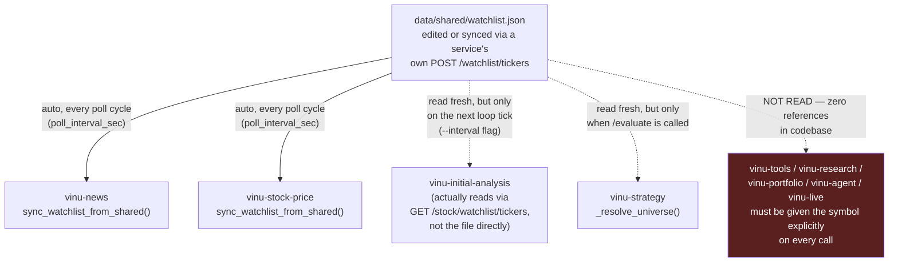

# Scenario B — A New Ticker Is Added to the Watchlist

## The short answer

Only two services (`vinu-news`, `vinu-stock-price`) keep their own
watchlist state that needs syncing. Three more
(`vinu-initial-analysis`, `vinu-strategy`, and, at request time,
`vinu-tools`) read the shared file fresh every time they act, so there's
nothing to "sync" for them — but that also means they only notice a
change the next time they run, not the instant the file changes. The
remaining services (`vinu-tools` outside of an explicit request,
`vinu-research`, `vinu-portfolio`, `vinu-agent`, `vinu-live`) have **no
watchlist concept at all** — confirmed by grepping every one of their
`.py` files for `watchlist` and getting zero hits. They must be told the
symbol explicitly, every single call.

## Per-service breakdown

| Service | Own watchlist store? | How it learns of a new ticker |
|---|---|---|
| `vinu-news` | Yes — `WatchlistStore` (`vinu_news/watchlist/store.py`) | Auto, every poll cycle: `sync_and_backfill()` calls `sync_watchlist_from_shared()` (`vinu_news/cli.py:94,105-108`), interval = `poll_interval_sec` setting. Manual: `POST /news/watchlist/sync` or `POST /news/watchlist/tickers` |
| `vinu-stock-price` | Yes — own watchlist store | Auto, every poll cycle: same pattern in `vinu_stock/cli.py:85,98-105`. Manual: `POST /stock/watchlist/sync` or `/stock/watchlist/tickers` |
| `vinu-initial-analysis` | No — re-resolves from `vinu-stock-price` | In `--continuous` mode, re-fetches `GET /stock/watchlist/tickers` every loop iteration (`vinu_initial_analysis/cli.py:108-120`, comment at line 110 confirms "re-resolve every cycle"), interval = `--interval` CLI flag. No sync call needed, but also no immediate pickup — it's on that loop's own clock. |
| `vinu-strategy` | No — reads `data/shared/watchlist.json` directly | `_resolve_universe()` (`vinu_strategy/service.py:155-165`) reads the shared file fresh on every `/strategy/strategies/{name}/evaluate` call. No sync step, but also no schedule of its own — it only re-reads when that route is hit. |
| `vinu-tools` (features) | No | Symbols are passed explicitly per request (`FeatureService.submit(symbols=...)`, `vinu_tools/service.py:53-72`) — the watchlist file is irrelevant to this service; nothing to add a ticker "to." |
| `vinu-research` | No | Zero references to `watchlist`/`shared` in the whole codebase. Symbol is always an explicit request parameter. |
| `vinu-portfolio` | No | Same — no watchlist concept. Reads whatever artifacts research reports (Scenario A), scoped by symbol on those artifacts, not by any watchlist. |
| `vinu-agent` | No | Same — the agent acts on whatever symbols appear in its own session/mandate config, unrelated to this file. |
| `vinu-live` | No | Same. |

## Diagram



## Manual triggers, if you're not running the continuous loops

```bash
# Add a ticker to the shared file directly (simplest, works for
# vinu-strategy and vinu-initial-analysis's next cycle immediately)
# — or use each service's own sync route to force it now rather than
# waiting for the poll interval:

curl -X POST http://localhost:8080/news/watchlist/tickers \
  -H "Content-Type: application/json" -d '{"tickers": ["NVDA"]}'

curl -X POST http://localhost:8081/stock/watchlist/tickers \
  -H "Content-Type: application/json" -d '{"tickers": ["NVDA"]}'

# vinu-news / vinu-stock-price also expose a plain re-sync-from-file call:
curl -X POST http://localhost:8080/news/watchlist/sync
curl -X POST http://localhost:8081/stock/watchlist/sync
```

Everything downstream of that (features, initial-analysis run, research
run) is the same set of manual triggers as
[`02-component-triggers-and-verification.md`](../end-to-end-test/02-component-triggers-and-verification.md)
in `end-to-end-test/` — adding a ticker to the watchlist does not, by
itself, backfill any historical data or run any analysis for it. It only
means live/continuous loops will start including it going forward.
