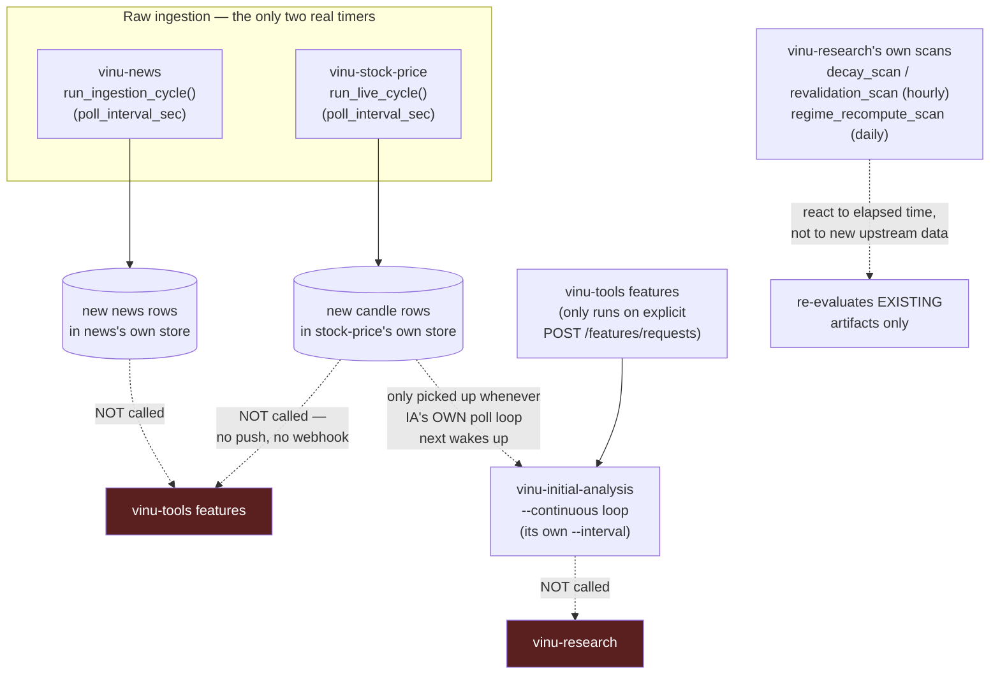

# Scenario C — A New Candle or News Item Arrives

## The short answer, stated plainly because it's the one people get wrong

**Storing a new candle or news item never triggers anything downstream.**
There is no event chain from raw data into features, initial-analysis, or
research anywhere in this codebase — confirmed by grepping the ingestion
code paths for any webhook/notify/downstream-API call and finding none.
Every stage past raw ingestion runs on its **own independent poll timer**
or requires an **explicit manual trigger** — never because new data just
landed one layer below it.

## What's actually automatic (the two real ingestion timers)

- **`vinu-stock-price`**: `run_live_cycle()` (`vinu_stock/service.py:158-170`
  → `vinu_stock/live/ingest_cycle.py:95`) runs on a real timer when the
  service is started with its continuous loop, resuming each symbol from
  its `last_bar_ts` forward to "now" — interval is `poll_interval_sec`
  from config.
- **`vinu-news`**: `run_ingestion_cycle()` (`vinu_news/service.py:543`)
  runs the same way on its own poll interval, pulling from RSS feeds or
  ticker-news providers.

Both of these write new rows into their own storage. That's it — neither
one calls any other service afterward.

## What's NOT automatic (this is the important part)

- A new candle landing in `vinu-stock-price` does not trigger
  `vinu-tools` to recompute features for that symbol.
- A new feature row does not trigger `vinu-initial-analysis` to re-run.
- `vinu-initial-analysis`'s own `--continuous` loop re-runs on **its own**
  interval, re-pulling whatever candles/features exist *at that moment* —
  it's coincidentally likely to pick up recent data because it polls
  often, not because anything told it new data arrived.
- New initial-analysis output does not trigger `vinu-research` to
  recompute anything. `vinu-research`'s own automatic scans
  (`decay_scan`, `revalidation_scan` hourly; `regime_recompute_scan`
  daily — `vinu_research/scheduled/executor.py:238-275`) run on their own
  clock and re-evaluate existing artifacts; they are not reacting to new
  candles or news.

Every one of these is a **separate, independent poll loop**, not a
pipeline. If you stop any one loop, everything downstream of it simply
keeps re-processing stale data on its own schedule — it does not error,
wait, or notice.

## Diagram



## If you actually need fresh downstream output right now

Waiting for independent poll loops to happen to line up is not a real
strategy for testing — trigger each stage explicitly, in order, the same
way [`02-component-triggers-and-verification.md`](../end-to-end-test/02-component-triggers-and-verification.md)
does:

```bash
# 1. Force fresh candles/news now, don't wait for the poll interval
curl -X POST http://localhost:8081/stock/ingest/trigger
curl -X POST "http://localhost:8080/news/backfill/trigger?ticker=AAPL"

# 2. Explicitly recompute features from that new data
curl -X POST http://localhost:8082/features/requests \
  -H "Content-Type: application/json" \
  -d '{"title": "refresh-AAPL", "symbols": ["AAPL"], "from_ts": ..., "to_ts": ..., "preset": "trend_pack", "run_immediately": true}'

# 3. Explicitly re-run initial-analysis against the new features
curl -X POST "http://localhost:8083/analysis/run/AAPL?from_ts=...&to_ts=..."

# 4. Explicitly re-run research if you need updated strategy output
curl -X POST http://localhost:8087/research/run \
  -H "Content-Type: application/json" \
  -d '{"symbol": "AAPL", "from_date": "...", "to_date": "..."}'
```

Note step 2's feature request is content-hashed
(`_hash_request`, `vinu_tools/service.py:290-301`) — if the exact same
`symbols`/`from_ts`/`to_ts`/`preset` was already requested and completed,
this returns the existing result instead of recomputing, even though new
candle data has landed underneath it. If you need a genuinely fresh
recompute after new data arrives, change `to_ts` to the current moment
rather than reusing an old request's range.
