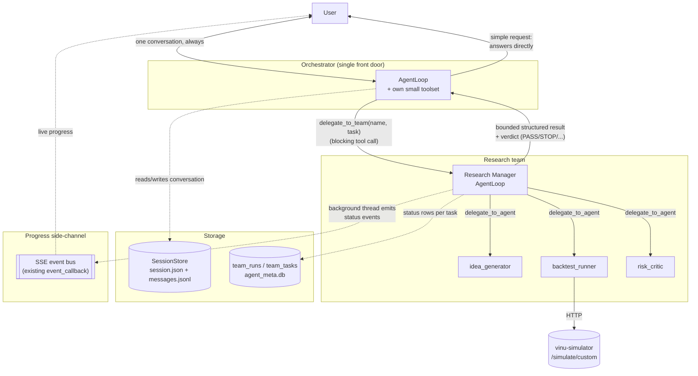

# vinu-agent restructure — orchestrator + teams

## Why this restructuring

Today `vinu-agent` is a single flat agent (one `AgentLoop`, one big shared
tool registry) plus a separate `swarm/` subsystem that runs a static,
declarative DAG of independent tasks from a YAML preset. Neither gives a
clean way to grow into distinct specialized "teams" (research, enhancer,
...) that can each be built and extended independently.

Separately, `vinu-research` is being deleted as a standalone service — but
its actual computation isn't being thrown away. It calls `vinu-simulator`'s
`/simulate/custom` endpoint to run backtests (confirmed via
`vinu_research/tools.py:32,86` — `vinu-research` never re-implements
simulation itself, `vinu-simulator` is the execution engine). What
`vinu-research` actually owns beyond that is the *loop*: generate a
strategy idea via LLM, call the simulator, run a risk critic, iterate until
PASS/STOP. That loop becomes the **research team** under the new
structure instead of a separate always-running service.

## Architecture diagram



Key things this diagram is meant to make obvious:

- The user never talks to anything except the orchestrator — every other
  box is invisible to them except through the SSE side-channel's progress
  labels.
- `delegate_to_team` is one blocking tool call from the orchestrator's
  point of view; everything under "Research team" happens *inside* that
  one call.
- Only a bounded, structured result crosses back up from a team to the
  orchestrator — never the manager's or specialists' raw trace.
- Two separate storage paths: the orchestrator's own conversation
  (`SessionStore`) vs. a team run's execution/status tracking
  (`team_runs` / `team_tasks`) — not the same table, not the same file.

## The orchestrator (new, single front door)

- **You only ever have one conversation, with one agent.** Every message
  goes to the orchestrator; every reply comes from the orchestrator. Team
  managers and specialists never talk to the user directly — their output
  only flows *up* to the orchestrator.
- **It owns the actual conversation.** Session/history/memory reuse the
  existing `SessionService` / `SessionStore` as-is — nothing new needed
  there.
- **It decides: answer directly, or delegate.** It has its own small
  toolset for things it can resolve itself (price lookups, status checks).
  For anything that needs a team's real multi-step work, it calls a new
  tool: `delegate_to_team(team_name, task)`.
- **It only ever gets back a bounded, structured result** from a
  delegated team run — never the team's raw internal transcript. It's the
  one that translates that structured result into an actual conversational
  reply ("I found a mean-reversion idea on AAPL that passed backtesting
  with a 1.4 Sharpe...").
- **It has its own budget** (max iterations / time), same pattern as
  `vinu_research/models.py`'s existing `Goal.llm_calls_budget` /
  `time_budget_seconds`, so a runaway delegation chain can't blow up cost.

## Teams (new, config-driven)

- Every tier — orchestrator, team manager, specialist — is the **same
  underlying primitive**: an `AgentLoop` (`agent/loop.py`, unchanged)
  configured with a role, a system prompt, a skill subset, and a tool
  subset. What differs between tiers is *config*, not *code*. This is
  what makes adding a new team cheap later: a new folder with a couple of
  markdown files, not new Python classes.
- Each team = one manager + N specialists, defined by markdown files
  (`TEAM.md` for the manager, `agents/*/AGENT.md` per specialist) — same
  frontmatter + body convention already used by `SKILL.md` /
  `SkillsLoader` (`agent/skills.py`).
- The manager gets its own tool, `delegate_to_agent(agent_name, task)`,
  scoped only to its own team's specialists — no cross-team calling.
- The manager gets its own budget too, mirroring the orchestrator's.
- **Delegation is a tool call, not the existing `swarm/` DAG.** The
  current `swarm/runtime.py` runs a static list of independent tasks from
  a YAML preset — fine for a fixed pipeline, but a manager can't
  dynamically decide "I need one more backtest before I'm confident."
  Giving managers a delegation *tool* instead lets that branch and nest
  like a real conversation, reusing `AgentLoop`'s existing tool-calling
  machinery rather than a separate DAG engine. (`swarm/` can retire once
  teams cover its use case, or stay for genuinely static fixed-pipeline
  batch jobs — not required either way, not decided.)
- **Every sub-agent returns a small structured result up to its manager**,
  never its full trace — same discipline as the orchestrator/team
  boundary, applied one level down. This matters because `agent/loop.py`
  already has real, working machinery to fight unbounded context growth
  within a single agent (`_apply_context_layers`, auto-compact) — passing
  full transcripts up the chain would recreate that exact problem one
  level up.

### Research team (first team, replaces vinu-research)

- **Manager**: research manager — owns the "generate idea → test → critique
  → iterate until PASS/STOP" loop that `vinu_research/loop.py` used to own.
- **Specialists**:
  - `idea_generator` — generates a candidate strategy (was
    `vinu_research/llm_generator.py`).
  - `backtest_runner` — calls `vinu-simulator`'s `/simulate/custom`
    directly, unchanged from today.
  - `risk_critic` — the LLM critique step (was `vinu_research/llm.py`),
    now just an agent instead of a bespoke function.

## Shared, unchanged pieces

- `agent/loop.py`'s `AgentLoop` — the one reasoning primitive every tier
  runs on.
- `SKILL.md` + `SkillsLoader` — shared grounding info (APIs, project
  facts) any tier can load, not duplicated per team.
- The existing tool registry (`tools/build_registry`) stays one shared
  pool; each `TEAM.md` / `AGENT.md` just declares which subset it's
  allowed to touch.

## Folder structure

```
vinu_agent/
  orchestrator/
    ORCHESTRATOR.md          # orchestrator's system prompt + which skills/tools it can see

  teams/
    research/
      TEAM.md                 # research manager's prompt + declared skills/tools
      agents/
        idea_generator/AGENT.md
        backtest_runner/AGENT.md
        risk_critic/AGENT.md
    enhancer/                 # next team — added later, same shape, no new code
      TEAM.md
      agents/
        ...                    # not yet defined

  agent/
    loop.py                    # unchanged — the one reasoning primitive every tier runs on
    team.py                    # NEW — generic TeamManager: loads TEAM.md, builds sub-agents from AGENT.md
    skills.py                  # unchanged — SkillsLoader (SKILL.md convention)

  skills/
    <skill-name>/SKILL.md       # unchanged — shared grounding info (APIs, project facts)

  tools/
    delegate_tool.py            # NEW — delegate_to_team / delegate_to_agent as tool calls
    ...                          # existing tool wrappers, unchanged, shared pool

  session/
    store.py, service.py        # unchanged — orchestrator's own conversation storage

  storage/
    team_runs.py                 # NEW — team_runs / team_tasks tables (mirrors swarm/models.py + vinu-tools' feature_requests pattern)

  swarm/                        # existing — retire once teams cover its use case,
                                 # or keep for genuinely static fixed-pipeline batch jobs (not decided)

data/
  sessions/{session_id}/        # existing — SessionStore's session.json + messages.jsonl
  agent_runs/{run_id}/          # NEW — each team run's own working trace (manager +
                                 # specialist internal reasoning), separate from session messages
  agent_meta.db                 # NEW — holds the team_runs / team_tasks tables
```

A new team, going forward, is just a new folder under `teams/` with a
`TEAM.md` and some `agents/*/AGENT.md` files — no changes anywhere else in
this tree.

## Storage: conversation, verdicts, and run tracking

Two different things get stored, not one:

- **The user-facing conversation** — already solved, no change: stays in
  `SessionStore` (session.json + messages.jsonl per session).
- **Each team delegation is its own run**, with its own working trace
  *separate* from the user conversation — its own directory for the
  manager's internal reasoning/tool calls, so it's inspectable later
  without cluttering the chat history.

### `team_runs` table (mirrors `SwarmRun` / `vinu-tools`'s `feature_requests` / `vinu-research`'s `ResearchRunRecord` — same established pattern already used across this codebase)

| column | purpose |
|---|---|
| `run_id` | primary key |
| `team_name` | e.g. `research` |
| `triggered_by_session_id` | FK back to the orchestrator conversation that started this run — traceability, so a reply can later be traced to "backed by research run #42" |
| `status` | pending / running / done / failed / cancelled |
| `verdict` | short string (`PASS` / `STOP` / `ERROR` / ...) for quick filtering |
| `result_json` | full structured result payload |
| `llm_calls_used`, `time_used_seconds` | actual usage against the `Goal` budget, not just the ceiling |
| `created_at`, `updated_at`, `completed_at` | standard |

### `team_tasks` table (mirrors `SwarmTask` — one row per specialist dispatch within a run)

| column | purpose |
|---|---|
| `task_id` | primary key |
| `run_id` | FK to `team_runs` |
| `agent_name`, `role` | which specialist |
| `depends_on` | for answering "who's waiting on what" directly via a query |
| `status` | pending / running / completed / failed / skipped |
| `started_at`, `completed_at` | standard |

Large outputs (e.g. full backtest data) stay as file pointers on disk, not
DB blobs — same discipline `vinu-tools`/`vinu-simulator` already use
(`file_path` column, artifact on disk, not inline).

### Other things worth deciding before/while building

1. **Dedup** — `vinu-tools`'s `request_hash` pattern: if the same
   research question comes in twice, reuse a recent PASS instead of
   re-running the whole team? Not yet decided.
2. **Cancellation** — mirrors `SwarmRun.CANCELLED` and `AgentLoop.cancel()`'s
   existing `_cancel_event` — does cancelling mid-chat cancel an in-flight
   team run too? Not yet decided.
3. **Failure policy** — explicit, not implicit: does a manager retry a
   failed specialist, skip it, or fail the whole run? Not yet decided.

## Delegation UX: blocking call + side-channel progress

Decided: don't pick purely blocking or purely streaming — do both, cheaply,
reusing infrastructure that already exists rather than building a new
async model:

- `delegate_to_team` stays a **synchronous tool call** from the
  orchestrator's `AgentLoop` — exactly like every other tool it already
  calls (same pattern `research_tool.py` uses today: call, wait, get a
  result back). No new async model needed in the orchestrator's own
  reasoning loop.
- The team run itself executes in a **background thread** (same pattern
  `swarm/runtime.py` already uses —
  `threading.Thread(target=self._execute_dag, daemon=True)`) and
  **independently pushes lightweight status events** to the same
  session's existing SSE event bus as it goes — "risk_critic started",
  "backtest_runner finished, Sharpe 1.2". That event bus and
  `event_callback` plumbing already exist in `agent/loop.py` and are
  already wired to sessions.
- Net effect: live progress in the UI while a team works, without
  redesigning how tool calls work — the orchestrator just blocks on one
  tool call as normal, and the progress feed is a side channel reusing
  something that was already built for a different purpose.

## Explicitly deferred (not being addressed now)

- **Tool permission enforcement per agent.** `AGENT.md` declaring which
  tools a specialist may use is a *convention*, not yet an *enforced*
  filtered registry. This matters most for real order-execution machinery
  (`broker/order_guard.py`, `broker/kill_switch.py`, `trade_tool.py`) — a
  risk-critic or idea-generator specialist should never reach `trade_tool`
  in practice. Deliberately deferred: the current broker wiring was only
  ever a test connection, and will be revisited as part of a full broker
  restructure later, not as part of this change.

## Still open / not yet decided

- **Migration path**: does the orchestrator replace today's single-agent
  session/routes in place (`session/service.py`,
  `server/routes_sessions.py`), or run as a new, separate path alongside
  the existing one for a while? Not yet decided.
