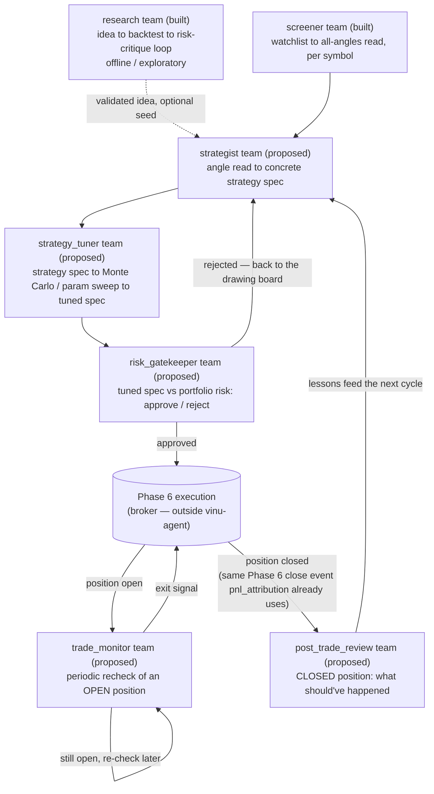

# Different teams across the trade lifecycle

Design reference: [../01-orchestrator-and-teams-architecture.md](../01-orchestrator-and-teams-architecture.md)
(the orchestrator/team mechanism itself — this doc doesn't repeat it, only
uses it). Build log: [../implementation/00-status.md](../implementation/00-status.md).

One file per team in this folder. This file is the map: what each team is
for, how they connect (the DAG), and — the part that isn't obvious from the
architecture doc alone — **not every team fits the same trigger shape**.
Two of these are only "active during a trade" or "after a trade" in the
sense of *when something else calls them*, not because vinu-agent grows a
new kind of always-on agent.

## The DAG

| # | Team | Role, one line | Status | Trigger shape |
|---|------|-----------------|--------|----------------|
| 1 | [research](07-research.md) | generate → backtest → risk-critique a strategy idea, iterate to PASS/STOP | built | user/orchestrator, in-conversation |
| 2 | [screener](01-screener.md) | for each symbol in a watchlist, synthesize all vinu-initial-analysis angles into an initial read | built | user/orchestrator, in-conversation |
| 3 | [strategist](02-strategist.md) | turn one symbol's angle read into a concrete, structured strategy spec | proposed | user/orchestrator, in-conversation |
| 4 | [strategy_tuner](03-strategy-tuner.md) | given a strategy spec, run real Monte Carlo / parameter-sweep backtests and converge on tuned parameters | proposed | user/orchestrator, in-conversation |
| 5 | [risk_gatekeeper](04-risk-gatekeeper.md) | approve or reject a tuned strategy against portfolio-level risk rules, right before it would go live | proposed | user/orchestrator OR the component that submits orders — not yet decided, see that file |
| 6 | [trade_monitor](05-trade-monitor.md) | while a position is open, periodically re-check it against fresh angle data and decide hold/flag/exit | proposed | **external scheduler**, not the user chatting |
| 7 | [post_trade_review](06-post-trade-review.md) | after a position closes, compare what actually happened to what was predicted and write down why | proposed | **external event** (position-close), not the user chatting |

## The one thing that isn't "out of the box" by default

`delegate_to_team` (the mechanism `screener`/`research` already use) is a
**synchronous, blocking tool call made from inside an orchestrator turn** —
the user says something, the orchestrator calls it, it runs, it returns,
the orchestrator replies. That shape works fine for 1–5: a person is
sitting there asking for a screen, a strategy, a tuning pass, or a
go/no-go check.

It does not work for `trade_monitor` or `post_trade_review`, because
nothing about "check on this open position" or "this position just closed"
is triggered by a user typing a message — a position can stay open for
hours or days across many separate orchestrator sessions, and a close event
happens whenever the broker says it happens, not when someone is chatting.

**The fix needs no new vinu-agent mechanism, only a new caller.**
`TeamManager` (`agent/team.py`) is already a plain class you can construct
directly and call `.run(task)` on — this is exactly how
`scratchpad/test_screener_team.py` exercised the screener team for real,
entirely bypassing the orchestrator and `delegate_to_team`. So:

- A lightweight external trigger (a scheduler polling open positions every
  N minutes, or a webhook handler on the broker's position-close event —
  neither exists yet, see `05-trade-monitor.md` / `06-post-trade-review.md`
  for what each would need) constructs `TeamManager` directly and calls
  `.run(...)`, the same way the test script does.
- Each invocation is still short and bounded — "check this one position
  right now," not one continuously-open call — so it reuses the exact same
  manager+specialist, `TEAM.md`/`AGENT.md`, `team_runs`/`team_tasks`,
  LLM-call-logging machinery as every other team, with zero new plumbing
  inside `vinu_agent` itself.
- The result lands in `team_runs`/`team_tasks` exactly like any other run,
  keyed by whatever `triggered_by_session_id`-equivalent makes sense for a
  non-chat trigger (a position id, most naturally) — visible to the
  orchestrator later ("what happened with my AAPL position while I was
  away?") without the orchestrator having been the one to kick it off.

So the real new work for these two teams isn't inside vinu-agent — it's a
small external scheduler/event-handler component, and (for both) a tool
that can answer "what's the current state of this position" from wherever
live positions actually live. Neither exists yet; see the per-team files
for exactly what's missing.

## Where this connects to already-decided project design

- `06-post-trade-review.md`'s trigger is not invented here — a real trade
  close already pushes into the `pnl_attribution` angle via
  `POST /pnl-attribution/{symbol}/record`, and every closed `Position`
  already carries an `artifact_id` linking back to the trade plan that
  authored it (confirmed in
  `New-talk-/04-enhancement-of-each-angle/22-pnl_attribution.md`, itself
  read against the real schema at `vinu-live/vinu_live/book/schema.py`).
  `post_trade_review` rides that same event and that same link — it
  doesn't need a new "trade closed" signal invented, and it doesn't
  duplicate `pnl_attribution`'s job (win/loss stats); it adds the
  LLM-narrated "why," which that angle's design doc explicitly flags as
  outside its own scope (a per-symbol aggregate, not a per-trade story).
- `strategy_tuner`'s Monte Carlo/parameter-sweep tool should sit on top of
  the walk-forward backtest harness from the (separately in-progress)
  shared backtest infrastructure plan, not reimplement its own sweep loop
  — see that plan for `run_walk_forward`'s real shape once it exists.

## Status of this doc

Nothing here is built. `screener` and `research` are real and already
exercised against a live local LLM (see
`../implementation/00-status.md`); everything else in this folder is a
proposal to review, not yet scaffolded as actual `TEAM.md`/`AGENT.md`
files under `vinu-components/vinu-agent/teams/`.
