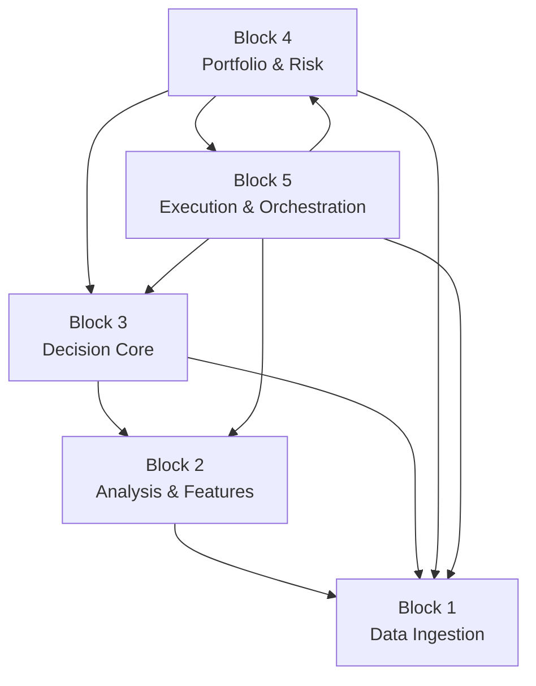
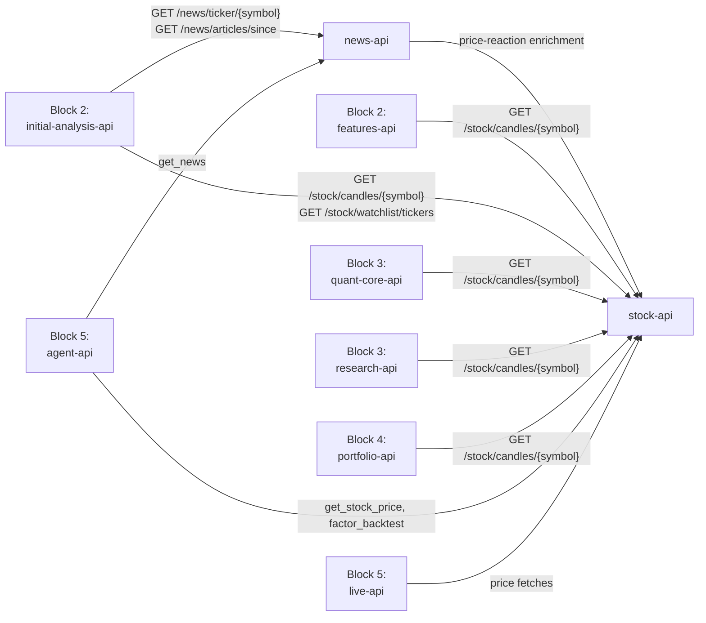
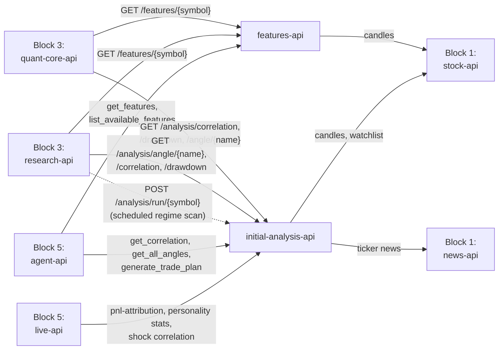
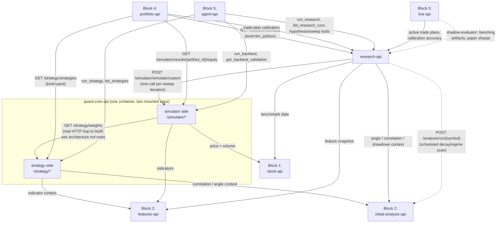
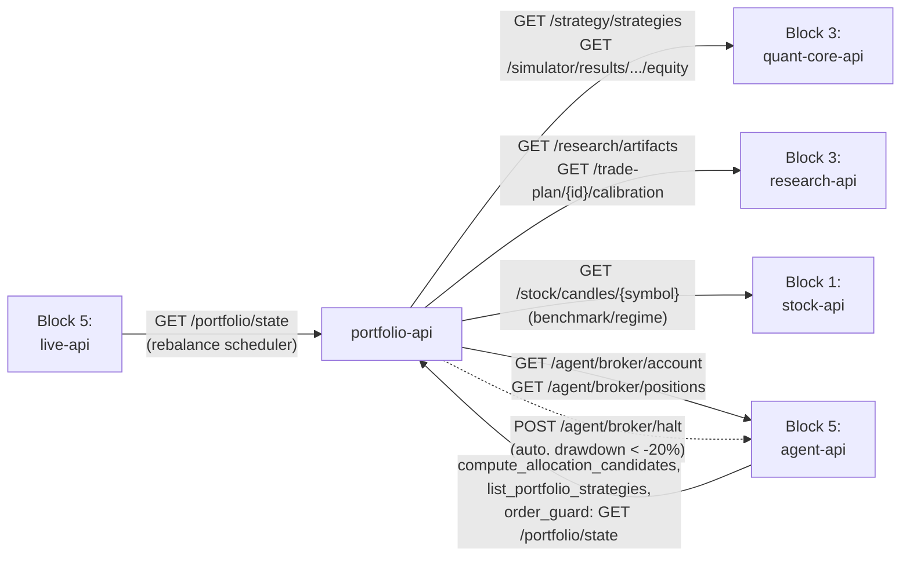
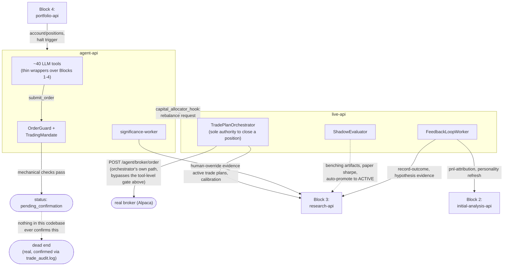

# vinu-components -- block-wise architecture

## How the blocks were drawn

A "block" here is not an arbitrary grouping -- it falls directly out of
the real `depends_on` graph and the real HTTP call graph in
`architecture.md` §2-3. Five blocks, in dependency order:

| Block | Services | One-line role |
|---|---|---|
| 1. Data Ingestion | news-api, stock-api | Owns all raw external data. Depends on nothing else in this system. |
| 2. Analysis & Features | features-api, initial-analysis-api | Turns raw data into indicators, correlation, and per-angle analysis. |
| 3. Decision Core | quant-core-api (strategy+simulator), research-api | Turns analysis into strategies, weights, backtests, and approved artifacts. |
| 4. Portfolio & Risk | portfolio-api | Turns strategies/artifacts into a real allocation, watches drawdown, can halt everything. |
| 5. Execution & Orchestration | agent-api, live-api | The LLM's tool surface, plus real order placement, shadow evaluation, and the feedback loop back into research. |

Arrows are caller `-->` callee, same convention as `architecture.md`.
Notice Block 5 is the only block every other block also reaches *into*
(Block 4 calls it for account/position data and to trigger a halt) -- it's
not a one-way top layer, it's the one block with real two-way traffic.
Every block below is read top-to-bottom in this same order; each one's
"Input" section is really just this table's incoming arrows expanded to
real endpoints, and "Output" is the outgoing ones.

---

## Block 1 -- Data Ingestion

**Services:** `news-api` (vinu-news), `stock-api` (vinu-stock-price)

### Scope of responsibility

- Owns acquisition of every piece of raw external data this system uses:
  OHLCV bars (from the broker/market-data provider) and news articles
  (from RSS feeds).
- Owns the catalog/backfill bookkeeping for what data is and isn't
  present yet (`symbol_catalog`, `backfill_jobs`, `backfill_status`).
- Owns story-threading and per-article price-reaction enrichment for news.
- **Does not** compute any technical indicator, sentiment score beyond
  what's captured at ingest time, or anything resembling a trading
  decision. If a consumer needs a moving average, that's Block 2's job,
  not this one's.
- **Depends on nothing else in this system** -- confirmed via
  `docker-compose.yml`: neither service has a `depends_on` entry.

### Input

External only:
- Broker/market-data provider (Alpaca) -> `stock-api`'s ingest worker.
- RSS feeds -> `news-api`'s ingest worker.

One real internal call inside this block: `news-api` -> `stock-api`
(`GET /stock/candles/{symbol}`), used by `_enrich_with_price_reaction()`
to compute how price moved after an article published.

### Output

| Endpoint | Real consumers |
|---|---|
| `stock-api` `GET /stock/candles/{symbol}` | features-api, initial-analysis-api (Block 2); quant-core-api both sides, research-api (Block 3); portfolio-api (Block 4); agent-api's `get_stock_price`/`factor_backtest`, live-api (Block 5) -- the single most widely-consumed endpoint in the whole system |
| `stock-api` `GET /stock/watchlist/tickers` | initial-analysis-api (Block 2) |
| `news-api` `GET /news/ticker/{symbol}` | initial-analysis-api (Block 2); agent-api's `get_news` (Block 5) |
| `news-api` `GET /news/articles/since` | initial-analysis-api (Block 2) |
| `news-api` `GET /news/search` | agent-api's `generate_trade_plan` (Block 5) |

---

## Block 2 -- Analysis & Features

**Services:** `features-api` (vinu-tools), `initial-analysis-api` (vinu-initial-analysis)

### Scope of responsibility

- Owns every technical indicator (SMA, RSI, ADX, ATR, MACD, etc. -- see
  `features-api`'s catalog) computed from raw bars.
- Owns the ~31 "angle" analyses (regime, correlation, drawdown, shock
  clustering, peer relative strength, news-price causality, and so on) --
  initial-analysis-api's real domain.
- Owns the `RunLog`/`angle_run_status` bookkeeping for which angle
  computations have actually completed for which symbol.
- **Does not** decide anything -- it answers "what does the data show,"
  never "what should we do about it." That line is Block 3's.

### Input

| Call | From |
|---|---|
| `GET /stock/candles/{symbol}` | Block 1 (both services) |
| `GET /stock/watchlist/tickers` | Block 1 (initial-analysis-api) |
| `GET /news/ticker/{symbol}`, `GET /news/articles/since` | Block 1 (initial-analysis-api) |

### Output

| Endpoint | Real consumers |
|---|---|
| `features-api` `GET /features/{symbol}` | quant-core-api strategy side, research-api (Block 3); agent-api's `get_features`/`list_available_features` (Block 5) |
| `features-api` `POST /features/requests` + `GET /features/requests/{id}/data` | agent-api's `get_features` (async job pattern, Block 5) |
| `initial-analysis-api` `GET /analysis/correlation/{symbol}`, `GET /analysis/drawdown/{symbol}`, `GET /analysis/angle/{name}/{symbol}` | quant-core-api strategy side, research-api (Block 3); agent-api's `get_correlation`/`get_all_angles`/`generate_trade_plan` (Block 5); live-api's shock-correlation and pnl-attribution calls (Block 5) |
| `initial-analysis-api` `POST /analysis/run/{symbol}` | research-api's scheduled regime-recompute scan (Block 3); live-api's `_refresh_personality_stats` (Block 5) |

---

## Block 3 -- Decision Core

**Services:** `quant-core-api` (vinu-strategy + vinu-simulator, merged into one container), `research-api` (vinu-research)

### Scope of responsibility

- `quant-core-api` strategy side: evaluates a registered YAML strategy's
  selection/allocation/timing/risk pipeline against current data,
  producing weights.
- `quant-core-api` simulator side: runs a weight series (from either a
  YAML strategy or LLM-authored code) against historical prices,
  producing PnL/Sharpe/drawdown metrics -- the one and only backtest
  engine in this system, called by both the strategy side, research-api,
  and directly by agent-api's `run_backtest` tool.
- `research-api`: owns the whole research loop -- idea intake, sweep/
  refine iterations, self-verdict, and the approval step that turns a
  finished run into a durable `Artifact` (see `architecture.md` §4 for
  the full ID handoff).
- **Does not** decide how much capital to put behind a strategy, or
  whether it fits the current portfolio -- that's Block 4's job. This
  block answers "is this a good strategy," never "should we fund it
  right now."

### Input

| Call | From |
|---|---|
| `GET /features/{symbol}` | Block 2 (both quant-core-api and research-api) |
| `GET /analysis/correlation`, `/drawdown`, `/angle/{name}` | Block 2 (both) |
| `GET /stock/candles/{symbol}` | Block 1 (simulator side, research-api's benchmark fetch) |
| `POST /strategy/strategies/{name}/evaluate` | Block 5 (agent-api's `run_strategy`) |
| `POST /simulator/simulate/custom` | Block 5 (agent-api's `run_backtest`); research-api itself (internal, see below) |
| `POST /research/run` | Block 5 (agent-api's `run_research`) |
| `GET /strategy/strategies` | Block 4 (portfolio-api), Block 5 (`list_strategies`) |
| `GET /research/artifacts` | Block 4 (portfolio-api), Block 5 (several tools) |

### Output

| Produces | Consumed by |
|---|---|
| Strategy weights (`GET /strategy/weights/{name}`) | Block 4 (portfolio-api's equity-curve fetch); Block 5 (live-api pulls weights for YAML-sourced positions) |
| Backtest results (`GET /simulator/results/{run_id}`) | Block 5 (agent-api's `get_backtest_validation`) |
| `Artifact` records (`artifact_id`, `source_run_id` link) | Block 4 (portfolio-api's `_list_llm_strategies`); Block 5 (live-api opens/tracks positions by `artifact_id`) |
| Hypothesis registry updates | Block 5 (agent-api's significance-worker writes human-override evidence back in) |

### Internal structure (this is the most tangled block -- worth its own diagram)

---

## Block 4 -- Portfolio & Risk

**Services:** `portfolio-api` (vinu-portfolio)

### Scope of responsibility

- Owns the unified view of every currently-ACTIVE strategy, YAML and
  LLM-authored alike (`list_active_strategies()`).
- Owns correlation-aware allocation sizing, concentration checks, and
  regime-tilt adjustments.
- Owns drawdown monitoring and is one of the two real triggers for the
  kill switch (the other being a direct human call) -- automatic, no
  human in this specific path.
- **Has no database of its own.** It reads vinu-research's
  `strategy_store.db` directly, in-process (falling back to HTTP), rather
  than maintaining a second copy of artifact state -- worth knowing since
  every other block owns real tables and this one deliberately doesn't.
- **Does not** place, hold, or track a single real order or position --
  that's entirely Block 5's job. This block only ever answers "how should
  capital be allocated," never "execute this."

### Input

| Call | From |
|---|---|
| `GET /strategy/strategies` | Block 3 (quant-core-api) |
| `GET /simulator/results/{artifact_id}/equity` | Block 3 (quant-core-api) |
| `GET /research/artifacts`, `/trade-plan/{artifact_id}/calibration`, `/trade-plan/{artifact_id}` | Block 3 (research-api) |
| `GET /stock/candles/{symbol}` | Block 1 (benchmark/regime candles) |
| `GET /agent/broker/account`, `GET /agent/broker/positions` | Block 5 (agent-api) -- yes, Block 4 calls *into* Block 5 for this, the one place the layering runs backward |

### Output

| Endpoint / action | Consumed by |
|---|---|
| `GET /portfolio/state` | Block 5 (agent-api's `get_portfolio_concentration`, `compare_portfolio`, order_guard); live-api's rebalance scheduler |
| `GET /portfolio/strategies` | Block 5 (agent-api's `list_portfolio_strategies`) |
| `POST /portfolio/evaluate-batch` | Block 5 (agent-api's `compute_allocation_candidates`) |
| `POST /agent/broker/halt` | fires automatically once drawdown crosses -20%, no caller needed to consume it -- it's an action, not data |

---

## Block 5 -- Execution & Orchestration

**Services:** `agent-api` (vinu-agent -- the LLM's tool surface), `live-api` (vinu-live -- real trading execution)

### Scope of responsibility

- `agent-api`: every LLM-facing tool in the system lives here -- ~40
  tools total, most of them thin HTTP wrappers around the other four
  blocks. Also owns the broker abstraction (`OrderGuard`, kill switch,
  trading mandate), memory/hypothesis write paths, and the
  significance-triage human-flagging worker.
- `live-api`: owns the actual live position book (`open_positions`,
  `closed_positions`, `fills`), the shadow-paper-twin comparison, the
  trade-plan orchestrator (sole authority over closing a live position),
  and the feedback loop that pushes closed-position outcomes back into
  research-api.
- **This is the only block every other block also calls into** --
  Block 4 reaches in for account/position data and to fire the kill
  switch; nothing else in this system is called from "above" it in the
  dependency order.
- **Does not** generate net-new market analysis or backtests itself --
  every number an agent tool returns was computed by an earlier block;
  agent-api's own job is deciding which tool to call and interpreting the
  result, not computing anything itself (`factor_analysis`/`factor_backtest`
  are the one exception -- in-process compute, not a network call).

### Input

Every real endpoint documented in Blocks 1-4's "Output" tables above is
this block's real input surface -- agent-api and live-api between them
are the single largest consumer of every other block in the system. Not
repeated here in full; see each block's Output table.

### Output

| Real action | Where it goes |
|---|---|
| `POST /agent/broker/order` (via `trade_tool.py`, live-api's orchestrator/scheduler) | the real broker (Alpaca) -- **but see the gate below: most orders stop one step short of this** |
| `POST /research/hypotheses/{id}/evidence` | Block 3 (research-api) -- significance-worker's human-override writes, live-api's feedback loop |
| `POST /research/trade-plan/{id}/record-outcome` | Block 3 (research-api) -- feedback loop closing the calibration loop |
| `POST /analysis/pnl-attribution/{symbol}/record`, `POST /analysis/run/{symbol}` | Block 2 (initial-analysis-api) -- feedback loop |
| `POST /live/trade-plan/rebalance-request` | live-api, from agent-api's `capital_allocator_hook` -- the one real agent-api -> live-api edge |

**The real gate worth drawing explicitly**: an order that clears every
mechanical check in `OrderGuard` still stops at
`order_pending_confirmation` by default (`TradingMandate.require_confirmation`
defaults `True`) and nothing in this codebase ever confirms it -- see
`architecture.md` §5b for the real log evidence. The diagram below draws
this as a dead-end node on purpose, not an oversight.

Note the one real asymmetry drawn above: `TradePlanOrchestrator` (inside
live-api) submits real orders through its own path, separate from
agent-api's `submit_order` tool -- the tool-level confirmation dead-end
does not block the orchestrator's own trading loop. Worth confirming
directly against current code before relying on this distinction for
anything safety-critical; it's stated here as read, not re-verified after
this doc's first pass.

---

## Reading order, if you're new to this system

1. Block 1 -> Block 2 -> Block 3 is the "how does an idea get evaluated"
   path -- start here to understand what data exists and how a strategy
   gets scored.
2. Block 3 -> Block 4 is "how does a good strategy get funded."
3. Block 4 <-> Block 5 and internally within Block 5 is "how does funded
   capital actually become a real position" -- read this last, and read
   the gate note above closely, since it's the block where a real,
   currently-unresolved gap lives.
