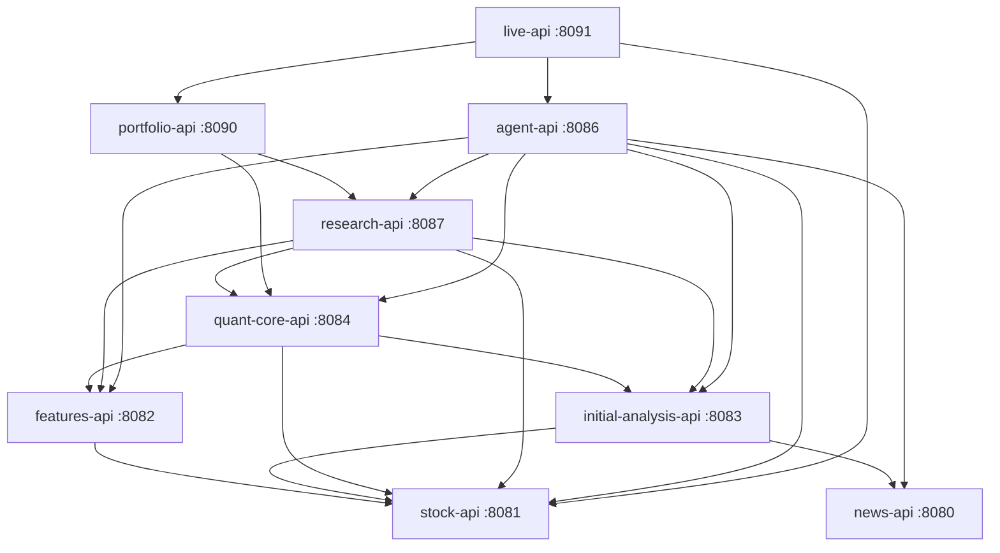
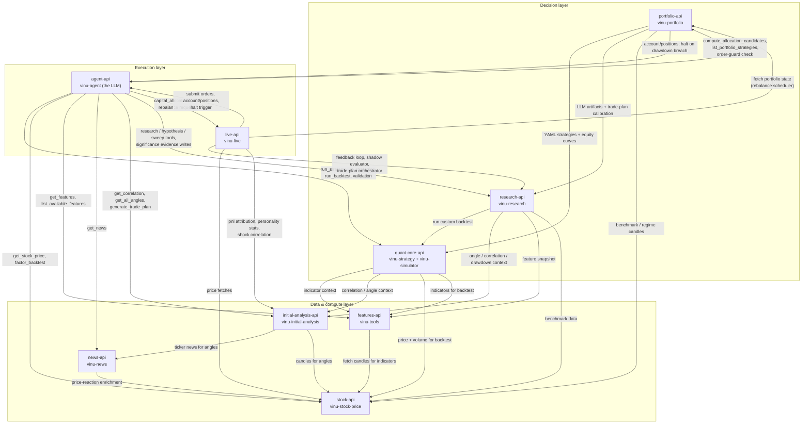
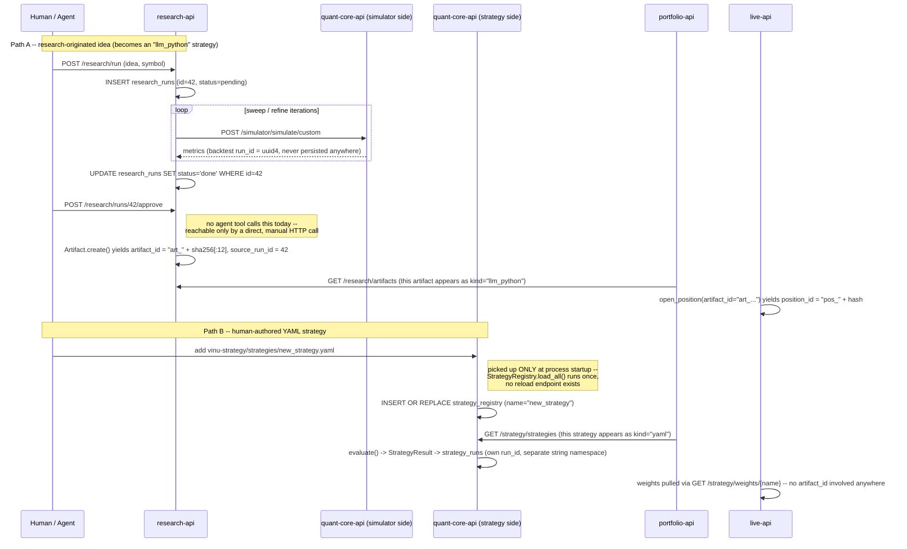

# vinu-components -- full architecture

## 1. What this system is

Nine FastAPI services, each its own Docker container, each with its own
SQLite storage, wired together over plain HTTP inside one docker-compose
network. There is no message queue, no shared database, no service mesh --
every cross-service interaction in this system is a synchronous HTTP call
to another container's REST API, resolved through a `VINU_*_API_URL`
environment variable. Two services (`vinu-strategy` and `vinu-simulator`)
are merged into one container (`quant-core-api`) but still talk to each
other over real HTTP, not a function call -- see §3.

Data flows in one broad direction -- market data and news in, through
analysis and decision-making, out to real broker orders -- but with real
loop-backs (research findings feed back into future decisions, live
trading outcomes feed back into research) covered in §4.

## 2. Service topology

| Service (compose name) | Package | Port | Health check |
|---|---|---|---|
| `news-api` | vinu-news | 8080 | `GET /news/health` |
| `stock-api` | vinu-stock-price | 8081 | `GET /stock/health` |
| `features-api` | vinu-tools | 8082 | `GET /features/health` |
| `initial-analysis-api` | vinu-initial-analysis | 8083 | `GET /analysis/health` |
| `quant-core-api` | vinu-strategy + vinu-simulator (merged, one container) | 8084 | `GET /strategy/health` **and** `GET /simulator/health` |
| `agent-api` | vinu-agent | 8086 | `GET /agent/health` |
| `research-api` | vinu-research | 8087 | `GET /research/health` |
| `portfolio-api` | vinu-portfolio | 8090 | `GET /portfolio/health` |
| `live-api` | vinu-live | 8091 | `GET /live/health` |

`quant-core-api` is not two containers -- `vinu_strategy/server/merged_app.py`
mounts both sides' routers (`prefix="/strategy"`, `prefix="/simulator"`)
into one FastAPI app, one process, one port. Every other service still
reaches it exactly as if it were two -- and its own simulator side reaches
its own strategy side over a real HTTP round-trip to `localhost`/its own
container hostname, not a function call (see §3's note on this).

**Background workers**, same container as their service's API, started by
`entrypoint.sh`, not separate compose services:
- `agent-api`: skill-audit-worker, planner-worker, significance-worker
- `live-api`: vinu-live-worker (portfolio rebalance), trade-plan-worker,
  feedback-worker, shadow-worker
- `portfolio-api`: in-process drawdown monitor scheduler
- `news-api`, `stock-api`, `features-api`, `initial-analysis-api`,
  `research-api`: each also run an ingest/compute background loop

### Deployment dependency graph

This is `docker-compose.yml`'s `depends_on` graph (every edge is
`condition: service_healthy` -- a dependent container won't even start
until its dependency passes its healthcheck):



Boot order this graph forces: `news-api`/`stock-api` first (no
dependencies) -> `features-api`/`initial-analysis-api` -> `quant-core-api`
-> `research-api` -> `portfolio-api` -> `agent-api` -> `live-api` last.

## 3. Real inter-service call graph (the actual runtime traffic)

The dependency graph above only says what must be *healthy first* -- it
doesn't say who actually calls whom, or why. This is the real traffic,
read directly from every service's HTTP client code, grouped into three
informal layers (data/compute at the bottom, decision-making in the
middle, execution at the top -- not enforced anywhere in code, just how
the real calls happen to flow):



**One quirk worth knowing**: `quant-core-api`'s simulator side calls its
own strategy side (`StrategyClient` -> `GET /strategy/weights`) over a
real HTTP request to its own container's hostname, even though both sides
now live in the same process since the Group-1 merge. Not a bug, just an
artifact of the merge keeping each side's original HTTP-client code
unchanged -- it works, it's just a real network round-trip to itself.

**Two known-broken fallback paths** (found while building this doc, both
inside vinu-agent, both real): `portfolio_comparison_tool.py`'s
`_fetch_portfolio`/`_fetch_artifacts` HTTP fallback and
`memory/sync_service.py`'s HTTP fallback both build request URLs missing
the target service's route prefix (e.g. `GET {url}/runs` instead of
`GET {url}/research/runs`). Every other call site correctly includes the
prefix. `sync_service.py` additionally appears to have zero callers
anywhere in the codebase today -- built, wired to nothing.

## 4. Life of a strategy -- the real ID/tagging scheme

**There is no single ID that threads end-to-end from "research idea" to
"live order."** This surprised us going in -- worth stating plainly rather
than implying a cleaner design than what's real. What actually exists is
several separately-issued IDs, connected by exactly one durable,
code-level handoff, plus a handful of loose string conventions.

### The two ways a strategy comes to exist



`vinu-portfolio`'s `list_active_strategies()` is the one place these two
paths are presented as one unified list -- it unions vinu-strategy's
`strategy_registry` table (tagged `kind: "yaml"`) with vinu-research's
`GET /research/artifacts` (tagged `kind: "llm_python"`). Everywhere else
in the system, they're two structurally different things: a YAML strategy
is keyed by its human-chosen `name` (a string primary key, no artifact
concept at all); an LLM-authored strategy is a vinu-research `Artifact`
with a hash-based `artifact_id`, and *that* id is what actually threads
into vinu-live's position book.

### The real ID formats, one by one

| ID | Format | Where it's born | Where it's referenced elsewhere |
|---|---|---|---|
| `research_runs.id` | plain autoincrement int | `ResearchStorage.insert_run()`, research-api | only inside research-api's own `research_meta.db` -- as `artifacts.source_run_id`, one-directional |
| `artifact_id` | `"art_" + sha256(type:name:timestamp:uuid4)[:12]` | `Artifact.create()`, research-api | `vinu-live`: `open_positions.artifact_id`, `closed_positions.artifact_id`; `vinu-agent`: `team_runs.related_artifact_id`; `vinu-portfolio`'s `weights_source` string for llm_python strategies |
| simulator backtest `run_id` | real `uuid.uuid4()` string | `WeightSimulator.run()`, quant-core-api (simulator side) | **nowhere** -- used only inside one research-loop iteration, then discarded; never stored on an `Artifact` or anywhere else |
| `strategy_runs` / `simulation_runs` `run_id` | human-readable string, e.g. `ma_crossover_20260706_143022` | vinu-strategy's `StrategyService`, own `strategy_runs` table | its own namespace only -- unrelated to research/artifact IDs |
| `position_id` | `"pos_" + sha256(symbol:opened_at)[:12]` | `open_position()`, vinu-live | `fills.position_id` (same db) |
| `team_runs.run_id` | `uuid4().hex[:12]` | vinu-agent's team orchestrator | `team_tasks.run_id`; sometimes appears as `ticker_ledger.ref_id` |
| `flag_id` | `uuid4().hex[:12]` | `significance_flags`, vinu-agent | written as `Evidence.ref_id` into vinu-research's `hypotheses.json` when a human responds |
| `hypothesis_id` | string, JSON-file-backed (`hypotheses.json`, not SQL) | `HypothesisRegistry`, vinu-research | read/written in-process by vinu-agent via `broker/research_link.py` |

**The one real, durable cross-service link**: `Artifact.create()` stamps
`source_run_id = research_runs.id` at approval time. From that point on,
**`artifact_id`, not the run_id, is what actually crosses every service
boundary** -- vinu-portfolio, vinu-live, and vinu-agent's `team_runs` all
key off `artifact_id`, never off the original research run's int id.

`ticker_ledger.ref_id` (vinu-agent) is the closest thing to a unifying
index across all of this -- a free-form pointer column, append-only, one
row per ticker-relevant event, where `ref_id` might point to an
`artifact_id`, a `run_id`, or a `hypothesis_id` depending on which stage
wrote it (`stage`/`event_type` tell you which). It's a narrative index
over the separate ID spaces, not a replacement for them -- there is still
no single value you could grep for across every service's database to
pull one strategy's entire life story in one query.

## 5. Where humans actually intervene

Four real gates, each behaving differently in practice:

### 5a. Research-run approval -- exists, but effectively unreachable

`POST /research/runs/{run_id}/approve` (vinu-research) is the intended
human checkpoint before a research finding becomes a real `Artifact`.
Confirmed by grepping every agent tool and every other service's client
code: **nothing calls it.** It only moves a run from `done` to `approved`
if called directly, by hand, over HTTP. As designed today, this is a real
gate -- it's just not wired into anything that makes it easy to use.

### 5b. Order confirmation -- a real gate that leads nowhere

`TradingMandate.require_confirmation` defaults to `True`. When an order
clears `OrderGuard`'s mechanical checks (kill switch, mandate limits,
concentration, active-artifact requirement) but confirmation is required,
`trade_tool.py` logs `order_pending_confirmation` and returns without
submitting the order -- on purpose, waiting for a human/second step to
confirm it.

**That second step doesn't exist anywhere in the codebase.** No endpoint,
no tool, nothing named `confirm_order` or similar. This isn't theoretical:
`data/agent/trade_audit.log` has real, dozens-deep `order_pending_confirmation`
entries for JNJ/TSLA/AAPL from 2026-08-03, repeating every few minutes,
with no `order_executing` ever following any of them. Every order this
system has proposed under the default mandate has silently gone nowhere.
(Replay/backtest mode explicitly bypasses this gate entirely -- it's only
live-mode orders that hit this dead end.)

### 5c. Significance Triage -- fire-and-flag, not a blocking gate

vinu-agent's `significance_triage.py` watches for three patterns
(repeated `risk_gatekeeper` rejections, unusually large funding, a thesis
contradiction) and, when one fires, writes a `significance_flags` row and
delivers it out-of-band (Discord/Telegram). It never blocks anything --
purely after-the-fact. A human's response is recorded through exactly one
path, `record_human_override()`, which writes an `Evidence(source=
"human_override", ref_id=flag_id)` back into vinu-research's hypothesis
registry -- the same method Monitor-style automated outcomes use, so a
human's override is visible to future decisions the same way a system
outcome would be, not a dead-end log entry.

### 5d. Kill switch -- both human- and machine-triggered

`POST /agent/broker/halt` is callable directly by a human (or the
`vinu-agent kill-switch` CLI command), **and** `vinu-portfolio`'s
`PortfolioDrawdownMonitor` calls the exact same endpoint automatically
once drawdown crosses -20% -- no human in that second path at all. Either
way, it's a real OS-level file lock (`fcntl`/`msvcrt`) that every
order-placement and rebalance-request code path checks before acting.
Global halt always takes precedence over a per-symbol halt; both scopes
exist.

## 6. Adding a new strategy (the real YAML rules)

This is the vinu-strategy YAML path (Path B above) -- for the
LLM-authored path, a new strategy is simply whatever `Artifact` a research
run's approval produces; there's no separate file convention for it.

**File location**: `vinu-strategy/strategies/*.yaml`

**Required top-level field**: `name` (string). If missing, the file is
silently skipped entirely by `StrategyRegistry.load_all()` -- no error,
no log beyond a generic skip.

**Optional top-level fields** (defaults shown):
```yaml
description: ""
schedule: "daily"
features_required: []
correlation_required: []
angles_required: []
universe: {source: watchlist}     # real files instead use:
                                   # {source: inline, inline: [AAPL, TSLA, JNJ]}
metadata: {}
```

**`pipeline`** -- the four stages every strategy defines, each a
`{method, ...params}` dict:

| Stage | Known methods | Stage-specific keys |
|---|---|---|
| `selection` | `all`, `threshold`, `top_n` | `on`, `min`, `n` |
| `allocation` | `equal`, `signal_scaled` | `signal` |
| `timing` | `none`, `rules` | `rules`: list of `{name, when: [{source, key, gt/lte/eq}], then: {action, value}}` |
| `risk` | `normalize`, `none` | `max_weight`, `max_short_weight`, `cash_floor`, `allow_short` |

An unrecognized `method` (e.g. `shock_aware`, used today by
`news_aware_momentum.yaml`) doesn't reject the file -- it just logs
`"Unknown risk method '...', will use fallback"` and falls back. Same
leniency for any unrecognized top-level key. This system fails open on
YAML typos, not closed.

**Filename vs. `name`**: not enforced. Files are indexed purely by the
in-file `name` field; the filename can be anything. All six real files
today happen to follow `{name}.yaml` as a human convention only.

**How a new file actually goes live -- read this carefully**:

`StrategyRegistry.load_all()` runs exactly once, synchronously, the first
time any request touches the strategy service (a lazy singleton in
`routes_read.py`). **There is no reload endpoint.** The `vinu-strategy
reload` CLI subcommand exists but constructs an entirely separate,
throwaway `StrategyRegistry` in its own process -- it never touches the
running server, never updates `meta.db`. The only way a new or edited
YAML file actually takes effect is a full service restart.

Separately, at that same startup moment, `_sync_registry()` copies
whatever was just loaded from disk into `meta.db`'s `strategy_registry`
table via `INSERT OR REPLACE` -- and that's the **only** direction this
sync ever runs, and the **only** time it ever runs. Nothing ever deletes a
`strategy_registry` row when its YAML file disappears later. This is
exactly the real bug found earlier this session: `meta.db` can report six
registered strategies while the actual `data/strategy/strategies/`
directory sitting under the running container is empty -- the service
just hasn't been restarted since the files were last present. `GET
/strategy/strategies` (the discovery endpoint) reads `meta.db` and will
happily report strategies that `POST /strategies/{name}/evaluate` will
then reject as `"Unknown strategy"`, because *that* call reads the
in-memory registry loaded from disk at startup, not `meta.db`.

**Practical rule going forward**: after adding or editing a YAML file
under `vinu-strategy/strategies/`, the `quant-core-api` container must be
restarted (`docker compose up -d --build quant-core-api` or at minimum a
restart without rebuild) before the new strategy is evaluable -- being
listed by `list_strategies`/`GET /strategy/strategies` is not proof it
will actually evaluate.

## 7. Database tables, service by service

Every table below is real SQLite, read directly from each service's
storage module. "Trigger" describes what causes an insert/update in plain
terms, not just the method name. No service in this system uses a shared
database -- every cross-service reference in the last column is a
convention (a string/int copied into another service's table), never a
real SQL foreign key, since SQLite can't enforce one across separate
files. The only real, PRAGMA-enforced `FOREIGN KEY` constraints found
anywhere are inside single db files: vinu-research's `strategy_store.db`
(four tables referencing `artifacts.artifact_id`) and vinu-news's
`articles`/`story_threads` tables.

### vinu-news (`vinu_news.db`)

| Table | Key columns | Insert trigger | Update trigger |
|---|---|---|---|
| `articles` | `id` (string, PK) | new RSS/enriched article persisted | never (immutable) |
| `article_ticker_mentions` | `article_id` FK, `ticker` | alongside each article insert | never |
| `story_threads` | `thread_id` (deterministic hash, PK) | first article of a new story | `last_seen_at`/`article_count` bumped when a later article matches |
| `thread_daily_snapshots` | `(thread_id, date)` composite PK | upsert on every article persisted into a thread | same statement (upsert) |
| `ticker_daily_stats` | `(ticker, date)` composite PK | same upsert pattern, keyed by dominant ticker | same |
| `feed_health` | `feed_id` (PK) | first poll of a feed | every subsequent poll (success resets `fail_streak`, failure increments it) |
| `news_analysis` | `url` (PK) | LLM analysis result cached | never |
| `article_price_reaction` | `article_id` (PK) | computed once price data is available | never |
| `ticker_reference` | `ticker` (PK) | schema-init sync from a reference list | replace-on-sync |
| `watchlist_tickers` | `ticker` (PK) | ticker added to watchlist | n/a (delete on removal) |
| `vinu_settings` | `key` (PK) | generic KV | on patch |
| `backfill_status` | `ticker` (PK) | backfill job queued (`pending`) | `pending -> in_progress -> completed` |

### vinu-stock-price (`vinu_stock_price.db`)

| Table | Key columns | Insert trigger | Update trigger |
|---|---|---|---|
| `symbol_catalog` | `symbol` (PK) | first bars land for a symbol | every subsequent ingest (upsert); `backfill_status`: `pending -> partial -> complete` |
| `backfill_jobs` | `id` autoincrement, `UNIQUE(symbol, year)` | backfill queued (`queued`) | `queued -> running -> failed` (no explicit success state seen -- row just stops changing) |
| `ingest_log` | `id` autoincrement | once per ingest run | never (append-only) |
| `watchlist_tickers` | `ticker` (PK) | ticker added | n/a |
| `vinu_settings` | `key` (PK) | generic KV | on patch |

### vinu-tools (features service)

| Table | Key columns | Insert trigger | Update trigger |
|---|---|---|---|
| `feature_requests` | `id` autoincrement | a feature-computation request submitted (`pending`) | `pending -> running -> done`, or `running -> failed`; any non-deleted status -> `deleted` (soft delete) |

### vinu-initial-analysis

| Table | Key columns | Insert trigger | Update trigger |
|---|---|---|---|
| `runs` (RunLog) | `id` autoincrement, `run_id` (string, unique) | one angle backtest run completes | `INSERT OR REPLACE` only -- append-only audit log in practice, not a row that transitions |
| `angle_run_status` | `id` autoincrement, `UNIQUE(batch_id, symbol, angle_name)` | a batch of angle jobs is planned (`pending`) | `pending -> running -> ok`, or `running -> failed` after retries exhausted; whole batch deleted once complete |

### vinu-strategy (part of `quant-core-api`)

| Table | Key columns | Insert trigger | Update trigger |
|---|---|---|---|
| `strategy_runs` | `id` autoincrement, `run_id` (string) | a strategy evaluation completes | never (always inserted already-`completed`) |
| `strategy_registry` | `name` (PK, string) | YAML file present at service startup | `INSERT OR REPLACE` at startup only -- see §6 for the real gap this causes |

### vinu-simulator (part of `quant-core-api`)

| Table | Key columns | Insert trigger | Update trigger |
|---|---|---|---|
| `simulation_runs` | `run_id` (string, PK) | a backtest completes | `INSERT OR REPLACE` -- written whole once, not incrementally |
| `simulation_catalog` | `(symbol, strategy_name)` composite PK | alongside each simulation run | `run_count` incremented, latest metrics replaced |

### vinu-research (two db files: `research_meta.db`, `strategy_store.db`)

| Table | Key columns | Insert trigger | Update trigger |
|---|---|---|---|
| `research_runs` | `id` autoincrement | research loop starts (`pending`) | `pending -> running -> done -> approved`; any state -> `deleted` (soft) |
| `research_catalog` | `symbol` (PK) | first research run for a symbol | upserted after every run; `exhausted` flips to 1 after 5 consecutive validation failures |
| `iteration_checkpoints` | `(run_id, iteration)` composite PK | each research-loop iteration | never (append-only; bulk-deleted together) |
| `artifacts` | `artifact_id` (hash string, PK) | a research run is approved (§4) | real state machine, see below |
| `bench_history` / `decay_snapshots` / `calibration_entries` / `angle_calibration_entries` | `id` autoincrement, `artifact_id` FK (real, PRAGMA-enforced) | each benching cycle / decay check / calibration point | never (append-only) |

**`artifacts.status` real state machine** (enforced, invalid transitions raise):
```
CREATED -> BENCHING | DISABLED
BENCHING -> PEND | ACTIVE | DISABLED        (BENCHING->ACTIVE: vinu-live's
                                              ShadowEvaluator auto-promoting,
                                              bypassing risk_gatekeeper's PEND step)
PEND -> ACTIVE | PENDBLOCK | DISABLED
PENDBLOCK -> ACTIVE | PEND | DISABLED
ACTIVE -> MONITORING | DISABLED
MONITORING -> PEND | ACTIVE | DECAYED | DISABLED
DECAYED -> DISABLED
DISABLED -> (terminal)
```

Also not SQL: `hypotheses.json` (vinu-research's `HypothesisRegistry`,
lock-file-guarded JSON, not SQLite) -- status enum `exploring -> testing ->
validated`, or `-> rejected` (terminal), transitions driven by Sharpe
thresholds on new evidence.

### vinu-portfolio

**No database of its own.** It opens vinu-research's `strategy_store.db`
directly, in-process, via `get_strategy_store()` (falling back to HTTP if
the in-process import fails) -- a pure compute/orchestration service.

### vinu-live (`trade_plan_book.db`, `rebalance_requests.db`)

| Table | Key columns | Insert trigger | Update trigger |
|---|---|---|---|
| `open_positions` | `position_id` (hash string, PK) | a position is opened | weighted-average add, partial reduce, stop-loss update; moved to `closed_positions` + deleted on full close |
| `closed_positions` | same shape + `closed_at`, `close_price`, `feedback_processed_at` | a position fully closes | `feedback_processed_at` set once the feedback loop has processed it |
| `fills` | `fill_id` (hash string, PK) | every open/add/reduce trade | never |
| `rebalance_requests` | `symbol` (PK, no surrogate id) | a rebalance request submitted -- one row per symbol, newer replaces older | consumed (deleted) once evaluated |

### vinu-agent (one SQLite file per store)

| Table | Key columns | Insert trigger | Update trigger |
|---|---|---|---|
| `team_runs` | `run_id` (`uuid4().hex[:12]`, PK) | an agent-team run kicks off (`pending`) | `pending -> running -> {done, failed, cancelled}`; `related_artifact_id` backfilled once known |
| `team_tasks` | `task_id` (uuid, PK) | a task within a run is queued (`pending`) | `pending -> running -> {completed, failed}` |
| `ticker_ledger` | `ledger_id` (uuid, PK) | any pipeline stage logs a ticker event | never (append-only) |
| `ticker_summaries` | `ticker` (PK) | first summary for a ticker | overwritten (not versioned) on every screener refresh |
| `llm_calls` | `call_id` (uuid, PK) | every LLM call anywhere in vinu-agent | never |
| `significance_flags` | `flag_id` (uuid, PK) | a significance pattern fires | `resolved` flipped once, on human response |
| `daily_limits` | `(symbol, date)` composite PK | first order for a symbol that day | count/volume incremented per subsequent order |
| `skill_edit_audit` | `entry_id` (uuid, PK) | a risk-relevant skill file's content hash changes | never |
| `memory_entries` | `id` (string, PK) | memory synced from a source | re-add (upsert) to change; explicit delete methods exist |
| `facts` | `id` (uuid, PK) | a fact recorded (`active`) | `active -> superseded` only, one-way |

## 8. Known gaps -- found while verifying this doc against real code

Listed here rather than silently fixed, since this is meant to be an
honest map of the system as it stands, not a claim it's all wired
correctly:

1. **`POST /research/runs/{run_id}/approve` is unreachable from any agent
   tool** -- the human-approval step in §5a exists in code and works if
   called directly, but nothing in the automated pipeline calls it.
2. **Order confirmation is a real dead end** -- `require_confirmation`
   defaults on, and nothing ever confirms a pending order (§5b), backed
   by real, repeating `order_pending_confirmation` log entries with no
   follow-through.
3. **Strategy registry can silently drift from disk** -- `meta.db`'s
   `strategy_registry` table only ever syncs one-way, at startup, and
   never deletes stale rows (§6). `list_strategies` can report a strategy
   that `run_strategy` then rejects as unknown.
4. **Two HTTP fallback paths build URLs missing their route prefix** --
   `portfolio_comparison_tool.py` and `memory/sync_service.py` (§3); the
   latter also appears to have zero callers anywhere in the codebase.
5. **Simulator backtest `run_id` is generated and immediately discarded**
   -- a real `uuid4()`, never persisted anywhere once the research
   iteration that produced it ends (§4).
