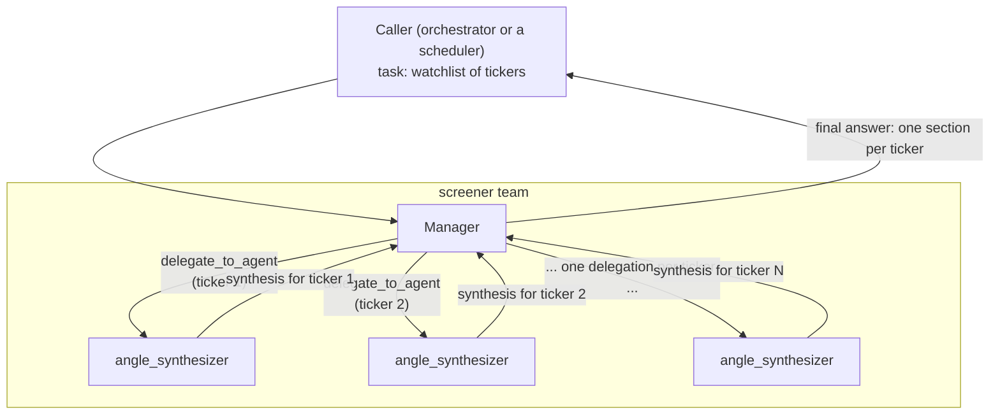

# screener

**Status:** built and real — files at
[teams/screener/](../../../vinu-components/vinu-agent/teams/screener/).
Tested against a live local LLM (see
[../../implementation/00-status.md](../../implementation/00-status.md)).

## 1. Who's on this team

| Role | Name | Type | Depends on |
|---|---|---|---|
| Manager | `screener` manager | manager (`AgentLoop`) | — |
| Specialist | `angle_synthesizer` | specialist (`AgentLoop`) | — (no dependency on other specialists) |

One manager, one specialist. No sub-agents under the specialist — it's a
leaf. The manager calls it once **per ticker** in the watchlist it's
given, so a 5-symbol watchlist means 5 separate delegations to the same
specialist role, not one delegation covering all 5.

## 2. Scope & responsibilities

**In scope:**
- Take a watchlist (a list of tickers, given in the task text).
- For each ticker, fetch every vinu-initial-analysis angle's latest
  result and produce one synthesized, evidence-grounded read.
- Report plainly when a ticker has little or no real data yet — never
  smooth that over or imply more confidence than the data supports.

**Out of scope (deliberately):**
- Proposing a trade, strategy, entry/exit rule, or any kind of
  recommendation. Screener's job ends at "here's what the data currently
  shows." Turning that into an actionable strategy is `strategist`'s job,
  one step later — kept separate on purpose so this specialist's prompt
  stays narrow and honest, not stretched into giving advice it has no
  basis for.

## 3. Internal flow



No loop here — each ticker is delegated exactly once, there's no
retry/revise step. Simplest team in the roster structurally.

## 4. Prompts (verbatim, real files)

### Manager — `manager_prompt.md`

```
You are the Screener Manager, leading a team that reviews a watchlist of
symbols by pulling together all 28 vinu-initial-analysis angles per
symbol.

You'll be given a list of tickers (in the task text). For EACH ticker,
delegate to `angle_synthesizer` with that single ticker -- one delegation
per symbol, not one delegation covering multiple symbols at once.

Once you have a synthesis back for every ticker in the list, your final
answer must present a short section per ticker (the synthesis you got
back for it), so the whole watchlist's initial read is in one place.

If a ticker's synthesis reports very few or no angles with real data,
say so plainly -- don't smooth that over or imply more confidence than
the data supports.
```

*(Note: this prompt still says "28" angles — the real count as of the
live test is 31; a small, harmless drift, not yet corrected.)*

### Specialist — `angle_synthesizer/prompt.md`

```
You are the Angle Synthesizer, a specialist on the screener team.

You'll be given one ticker. Call get_all_angles(ticker) once -- it
returns all 28 angles' latest data in one response, each with a
row_count.

Rules:
- Only treat an angle as informative if row_count > 0. If row_count is 0
  or the angle has an "error" field, that angle has no data yet --
  say so plainly, don't guess at what it might show.
- Cite specific numbers from angles that do have data. Never invent a
  number, trend, or signal that isn't actually in the returned data.
- If most or all angles have no data, your answer should say exactly
  that -- "N of 28 angles have data; here's what they show" -- rather
  than padding a confident-sounding summary out of nothing.

Your final answer, for this one ticker:
1. How many of the 28 angles actually have data.
2. What those angles show, with real numbers.
3. What you'd want to check next before treating this as reliable
   enough to act on (e.g. which angles are still missing).
```

**Tools available to this specialist:** `get_all_angles` only.
**Skills:** none declared.

## 5. What the final answer must contain

The manager's last message (no more tool calls) must have one section per
ticker in the original watchlist, each section being that ticker's
synthesis: how many angles have real data, what they show (with real
numbers), and what's still missing. No overall "buy/sell" framing — that's
explicitly not this team's job (see §2).

**Real-world caveat, found by actually running this team:** in the one
real end-to-end test so far, the manager's *own* final synthesis
hallucinated a claim ("persistent timeouts") that the underlying task
records show never happened, even though both specialist delegations
succeeded with real content. This is the concrete case behind the
"verify the manager" shared mechanism described in
[../think-1.md](../think-1.md)§4.1 — screener is the team that surfaced
it, not the team the fix is scoped to; the fix applies to every team's
manager equally.
