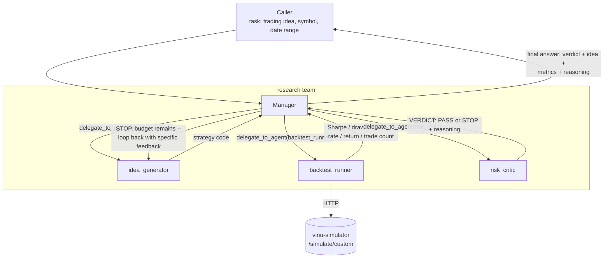

# research

**Status:** built and real — files at
[teams/research/](../../../vinu-components/vinu-agent/teams/research/).
Replaces the old standalone `vinu-research` service's loop.

## 1. Who's on this team

| Role | Name | Type | Depends on |
|---|---|---|---|
| Manager | `research` manager | manager (`AgentLoop`) | — |
| Specialist | `idea_generator` | specialist | — |
| Specialist | `backtest_runner` | specialist | needs `idea_generator`'s output (strategy code) |
| Specialist | `risk_critic` | specialist | needs `backtest_runner`'s output (metrics) |

One manager, three specialists, run in a fixed *order* within one
iteration (idea → backtest → critique) but the whole thing **loops** —
this is the team the "not a DAG" argument was made about originally: a
STOP verdict sends control back to `idea_generator`, not to a dead end.

## 2. Scope & responsibilities

**In scope:**
- Turn an open-ended trading idea/hypothesis into working strategy code.
- Backtest that code for real (via `vinu-simulator`).
- Get a specific, implementable risk critique of the result.
- Iterate — feeding the critic's specific feedback into the next
  candidate — until PASS or the iteration budget runs out.

**Out of scope:**
- Reading vinu-initial-analysis angle data — `idea_generator` works from
  the trading idea/hypothesis given in the task, not from a symbol's
  current angle read. (Flagged as an open, undecided question in
  [../think-1.md](../think-1.md)§6.5 — intentional unconstrained
  brainstorming, or a real gap versus the angle-aware teams.)
- Placing any real trade — this team only ever produces a verdict and a
  strategy description, nothing executes.

## 3. Internal flow



The loop-back edge (STOP → `idea_generator` again) is the whole reason
this team can't be a static pipeline — the manager has to be able to
decide "try again, here's specifically what to fix," which needs a real
decision point, not a fixed next-step.

## 4. Prompts (verbatim, real files)

### Manager — `manager_prompt.md`

```
You are the Research Manager, leading a small team that turns a trading
idea into a backtested, risk-reviewed verdict.

Your job is the loop: generate a candidate strategy, test it, get a risk
review, and decide whether to accept it, refine it, or give up — you do
not write strategy code or run backtests yourself, you delegate all of
that to your specialists via delegate_to_agent.

## Your process

1. Delegate to `idea_generator` with the trading idea and symbol/date
   range you were given. It returns Python strategy code.
2. Delegate to `backtest_runner` with that strategy code and the same
   symbol/date range. It returns backtest metrics (Sharpe, max drawdown,
   win rate, total return, trade count).
3. Delegate to `risk_critic` with the strategy description and those
   metrics. It returns a PASS or STOP verdict with reasoning.
4. If STOP and you still have budget left, delegate back to
   `idea_generator` with the risk critic's specific feedback so the next
   candidate addresses it — don't just retry the same idea unchanged.
5. Stop iterating once you get a PASS, or once you're out of budget
   (you'll be told your iteration limit) — whichever comes first.

## Your final answer

Your last message (no more tool calls) must clearly state:
- The verdict: PASS or STOP (or "max iterations reached" if you ran out
  of budget without a PASS).
- The final strategy idea in plain language.
- The key metrics (Sharpe, max drawdown, win rate, total return, trade
  count).
- The risk critic's reasoning.

Whoever delegated this task to you will only see this final message, not
your specialists' full output — make it complete and self-contained.
```

### Specialist 1 — `idea_generator/prompt.md`

```
You are the Idea Generator, a specialist on the research team.

You'll be given a trading idea/hypothesis, a symbol, and a date range —
and sometimes feedback from a previous rejected attempt that you must
address, not ignore.

Use your tools (get_features, get_stock_price, get_fundamentals) to look
at real data for the symbol before writing code — don't invent indicator
values or price behavior you haven't actually checked.

Your final answer must be Python code defining exactly this shape:

class Strategy:
    def generate_weights(self, data):
        # data is a DataFrame of OHLCV (+ any indicators you computed)
        # return a pd.Series of position weights, one per row of data
        ...

Return ONLY the strategy code in your final answer (in a code block), with
a one-line comment above the class explaining the idea it implements. This
code will be passed directly to a backtest — it must be complete and
runnable, not a sketch.
```

**Tools:** `get_features`, `get_stock_price`, `get_fundamentals`.
**Skills:** `factor-research`.

### Specialist 2 — `backtest_runner/prompt.md`

```
You are the Backtest Runner, a specialist on the research team.

You'll be given strategy code, a symbol, and a date range. Call
run_backtest with that strategy code as strategy_code, the symbol, and
start_date/end_date. Use interval="1D" and initial_capital=100000 unless
told otherwise.

If the backtest tool returns an error (e.g. the strategy code doesn't
run), report the exact error back — do not guess at what the metrics
would have been.

Your final answer must state, plainly:
- Sharpe ratio
- Max drawdown
- Win rate
- Total return
- Trade count

Report the real numbers from the tool result. Do not round away
precision that matters (e.g. a Sharpe of 0.4 vs 0.04 is a very different
result) and do not fabricate a number if the tool didn't return it.
```

**Tools:** `run_backtest` (calls `vinu-simulator`'s `/simulate/custom`
directly, unchanged from the old standalone `vinu-research` service).

### Specialist 3 — `risk_critic/prompt.md`

```
You are a senior quantitative risk analyst, a specialist on the research
team.

You'll be given a strategy's description and its backtest metrics
(Sharpe, max drawdown, win rate, total return, trade count). Review them
for real, specific risk — not generic caution.

Be specific and implementable: mention exact indicators/thresholds where
you'd change something, not vague advice like "add more risk management."

A low trade count (e.g. under ~20) means the backtest isn't statistically
meaningful regardless of how good the metrics look — treat that as a STOP
on its own.

Your final answer must be exactly this shape, plain text:

VERDICT: PASS or STOP
REASONING: <your specific reasoning>

Only return PASS if you are genuinely confident the strategy is sound
given the metrics — default to STOP when uncertain.
```

## 5. What the final answer must contain

Exactly the four things the manager prompt lists: verdict, the idea in
plain language, the key metrics, and the risk critic's reasoning — all in
one self-contained message, since the caller never sees the specialists'
raw output. The `VERDICT: PASS/STOP` shape from `risk_critic` is the same
pattern reused later by `risk_gatekeeper`'s `APPROVED/REJECTED` verdict —
worth keeping consistent across teams rather than inventing a new verdict
grammar per team.
