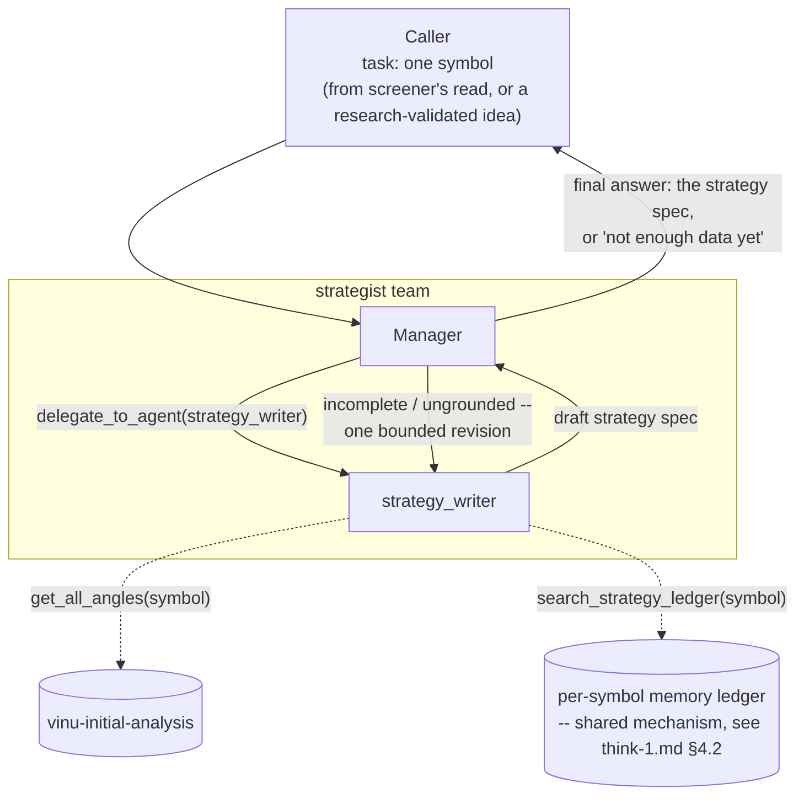

# strategist (proposed)

**Status:** not built. Prompts below are a first draft, written to the
same style as the real `screener`/`research` prompts, meant to be dropped
into `teams/strategist/` largely as-is once this design is approved — not
just a description of what it should do.

## 1. Who's on this team

| Role | Name | Type | Depends on |
|---|---|---|---|
| Manager | `strategist` manager | manager (`AgentLoop`) | — |
| Specialist | `strategy_writer` | specialist | — |

One manager, one specialist — deliberately the same thin shape as
`screener`, since a strategy spec is inherently a per-symbol,
single-pass-per-attempt artifact. The manager's only real judgment call is
whether to send `strategy_writer` back for one revision if the first
draft is incomplete.

## 2. Scope & responsibilities

**In scope:**
- One symbol at a time.
- Read that symbol's angle data (reuse `get_all_angles` — the same tool
  `screener` uses).
- **Required first step, not optional:** check the per-symbol memory
  ledger (§4.2 in [../think-1.md](../think-1.md)) for what's already been
  tried on this symbol/setup before, and what held up.
- Produce a structured strategy spec — every field traceable to a
  specific angle's real numbers or an explicit prior lesson, never
  invented.

**Out of scope:**
- Tuning parameters or backtesting the spec — `strategy_lab`'s job.
- Approving anything against portfolio risk — `risk_gatekeeper`'s job.
- If most angles for the symbol are empty, the honest output is "not
  enough data to propose a strategy yet" — never a confident-sounding
  guess to fill the gap.

## 3. The strategy spec (the artifact this whole team exists to produce)

Minimum fields, per [../think-1.md](../think-1.md)§3.3 — this shape is
what `strategy_lab`, `risk_gatekeeper`, and `capital_allocator` all
consume downstream, so it's worth settling once, here:

```json
{
  "symbol": "AAPL",
  "direction": "long | short",
  "entry_condition": "plain-language rule, tied to specific angle(s)",
  "exit_condition": "plain-language rule",
  "stop_loss": "plain-language rule (e.g. 1.5x ATR)",
  "position_size_rule": "plain-language rule",
  "angles_used": ["list of angle names this spec is grounded in"],
  "angles_missing": ["list of angle names that would strengthen this but have no data yet"],
  "prior_lessons_considered": ["short notes from the memory ledger, if any existed for this symbol"]
}
```

## 4. Internal flow



## 5. Prompts (drafted)

### Manager — `manager_prompt.md` (draft)

```
You are the Strategist Manager, leading a small team that turns one
symbol's angle data into a concrete, structured strategy spec.

You'll be given a single symbol (in the task text), and sometimes an
already-validated idea from the research team to build from instead of
starting cold.

Delegate to `strategy_writer` with the symbol (and the research idea, if
you were given one). It will check the symbol's angle data and its prior
history before writing a spec.

If the spec it returns is missing required fields, or claims something
not grounded in a real angle or a real prior lesson, send it back to
`strategy_writer` once with exactly what's wrong -- don't accept a spec
you can see is incomplete, and don't loop more than once; if the second
attempt still isn't grounded, your final answer should say plainly that
there isn't enough real data to propose a strategy for this symbol yet.

Your final answer is either:
- The strategy spec, in the agreed JSON shape, or
- A plain statement that there isn't enough data yet, and what's missing.

Never soften the second case into a spec that isn't really grounded.
```

### Specialist — `strategy_writer/prompt.md` (draft)

```
You are the Strategy Writer, a specialist on the strategist team.

You'll be given one symbol, and sometimes a research-validated idea to
build from.

Before writing anything:
1. Call search_strategy_ledger(symbol) -- see what's already been tried
   on this symbol before, and what held up or didn't. This is required,
   not optional; if the ledger has relevant entries, your spec must
   account for them (e.g. don't repeat an approach that was already
   tried and rejected, without saying why you think it's different this
   time).
2. Call get_all_angles(symbol) -- the same tool the screener team uses.
   Only treat an angle as informative if row_count > 0.

Then produce a strategy spec with these fields: symbol, direction,
entry_condition, exit_condition, stop_loss, position_size_rule,
angles_used, angles_missing, prior_lessons_considered.

Rules:
- Every field in entry_condition/exit_condition/stop_loss/
  position_size_rule must trace back to a specific angle in angles_used
  that actually has data, or to a specific entry in
  prior_lessons_considered. Never invent a rule that isn't grounded in
  one of those two things.
- If there isn't enough real angle data to justify a real strategy, say
  so directly instead of writing a plausible-sounding spec anyway --
  list what's in angles_missing and stop there.

Your final answer is the strategy spec in the agreed JSON shape, or a
plain statement that there isn't enough data yet.
```

**Tools:** `get_all_angles`, `search_strategy_ledger` (new — part of the
shared per-symbol memory mechanism, not yet built).
**Skills:** likely `factor-research` (shared with `research`'s
`idea_generator`), not yet decided.

## 6. What the final answer must contain

Either the strategy spec in the exact JSON shape above, fully populated
and traceable, or an explicit, honest "not enough data yet" with a list of
what's missing — never something in between that sounds confident but
isn't really grounded.

## 7. Open questions (carried from think-1.md, not re-litigated here)

- Exact JSON shape — drafted above, not yet finalized.
- Whether `strategy_writer` ever handles more than one symbol per
  delegation (leaning no, see [../think-1.md](../think-1.md)).
