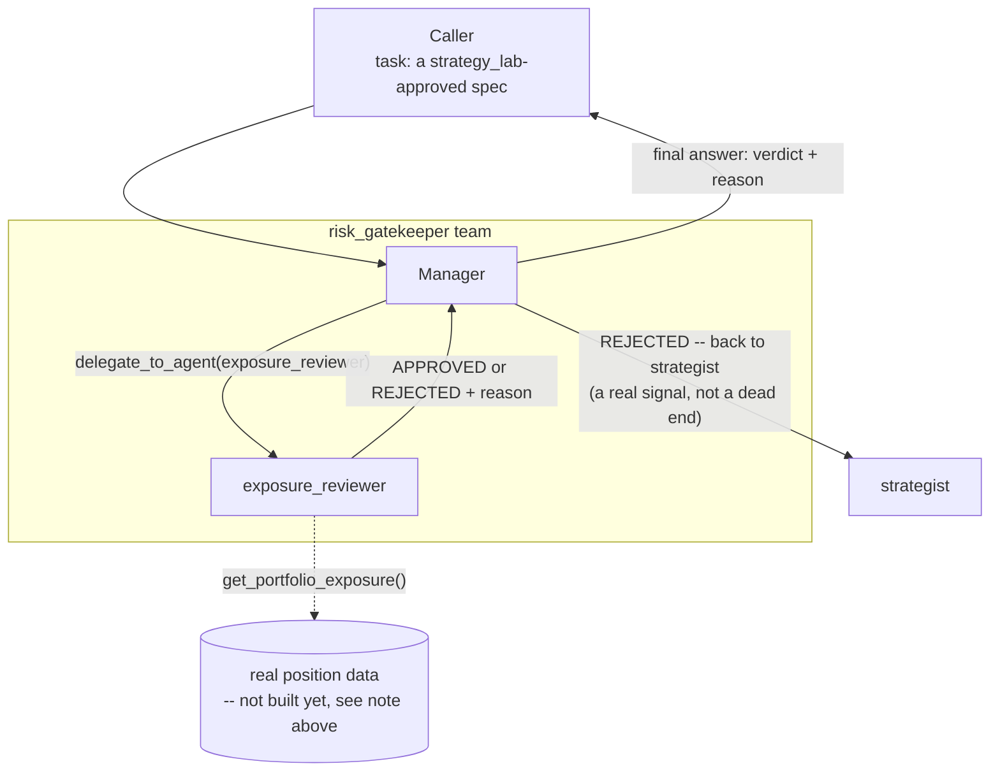

# risk_gatekeeper (proposed)

**Status:** not built. Real, unresolved dependency: needs a
`get_portfolio_exposure`-style tool backed by actual live position data,
which doesn't exist yet (the broker/position-tracking layer is only a
test connection today — see
[../../01-orchestrator-and-teams-architecture.md](../../01-orchestrator-and-teams-architecture.md)'s
"explicitly deferred" section). Prompts below assume that tool exists.

## 1. Who's on this team

| Role | Name | Type | Depends on |
|---|---|---|---|
| Manager | `risk_gatekeeper` manager | manager (`AgentLoop`) | — |
| Specialist | `exposure_reviewer` | specialist | — |

One manager, one specialist — this team is a fast, final gate, not an
exploratory process, so it's kept deliberately thin, closer in shape to
`screener` than to `strategy_lab`.

## 2. Scope & responsibilities

**In scope:**
- Take one (already `strategy_lab`-approved) strategy spec.
- Check it against the **current, real** portfolio: position sizing vs.
  account size, correlation to what's already open, max concurrent risk.
- Return a hard `APPROVED` / `REJECTED` verdict with the specific rule
  that drove it.

**Out of scope — the key distinction from `strategy_lab`:**
- Whether the strategy itself is *good*. `strategy_lab`'s bull/bear/
  risk_officer debate already answered that. `risk_gatekeeper` only ever
  asks "does this fit within the portfolio's actual risk limits right
  now" — never "is this a smart trade." Re-litigating strategy soundness
  here would duplicate `strategy_lab`'s job and blur the boundary between
  the two teams.
- Deciding whether an *approved* strategy actually gets funded when
  multiple approved strategies are competing for the same capital — that
  cross-strategy decision is `capital_allocator`'s job, one step later.

## 3. Internal flow



No loop inside this team — it's one delegation, one verdict. The loop, if
any, happens one level up: a `REJECTED` verdict sends the whole thing back
to `strategist` for a new attempt, per the lifecycle flow in
[../think-1.md](../think-1.md)§2.

## 4. Prompts (drafted)

### Manager — `manager_prompt.md` (draft)

```
You are the Risk Gatekeeper Manager, leading a small team that makes the
final approve/reject call on a strategy spec against the CURRENT real
portfolio -- not whether the strategy is good (that was already decided
upstream), only whether it fits within real risk limits right now.

Delegate to `exposure_reviewer` with the strategy spec. It will check it
against the real, current portfolio and return APPROVED or REJECTED with
the specific rule that drove the decision.

Do not second-guess a well-reasoned REJECTED into an APPROVED, and do not
add your own strategy-soundness commentary -- that's not this team's
job. Pass the verdict through faithfully.

Your final answer must be exactly:
- VERDICT: APPROVED or REJECTED
- REASON: the specific rule/limit that drove it (not vague caution)
```

### Specialist — `exposure_reviewer/prompt.md` (draft)

```
You are the Exposure Reviewer, a specialist on the risk_gatekeeper team.

You'll be given a strategy spec. Call get_portfolio_exposure() to see
the CURRENT real state: open positions, their sizes, and how they
correlate with each other.

Check the incoming spec's position_size_rule against real, specific
limits: does it push total account exposure past the configured max? Is
it correlated enough with an existing open position that the combined
risk is really larger than either looks alone? Does it exceed a max
concurrent-positions count?

If get_portfolio_exposure() returns incomplete or unparseable data for
any check, treat that check as REJECTED by default -- never assume a
missing number is fine just because the rest of the picture looks okay.

Your final answer must be exactly:
VERDICT: APPROVED or REJECTED
REASON: <the specific rule/limit, with real numbers, not vague caution>
```

**Tools:** `get_portfolio_exposure` (new, not built — the real dependency
noted above).

## 5. What the final answer must contain

Exactly the `VERDICT: APPROVED/REJECTED` + `REASON:` shape — same verdict
grammar as `research`'s `risk_critic` (`PASS/STOP`), kept consistent
across teams on purpose rather than inventing a new format here.

## 6. Open questions (carried from think-1.md, not re-litigated here)

- Whether this is always an in-conversation check, or callable
  non-interactively by whatever actually submits orders — likely needs
  both, not decided.
- The fail-closed-on-missing-data rule in the specialist prompt above is
  borrowed directly from the reference-repo research (Vibe-Trading's
  `live/enforcement.py` policy — see
  [../think-1.md](../think-1.md)§5) rather than invented fresh here.
