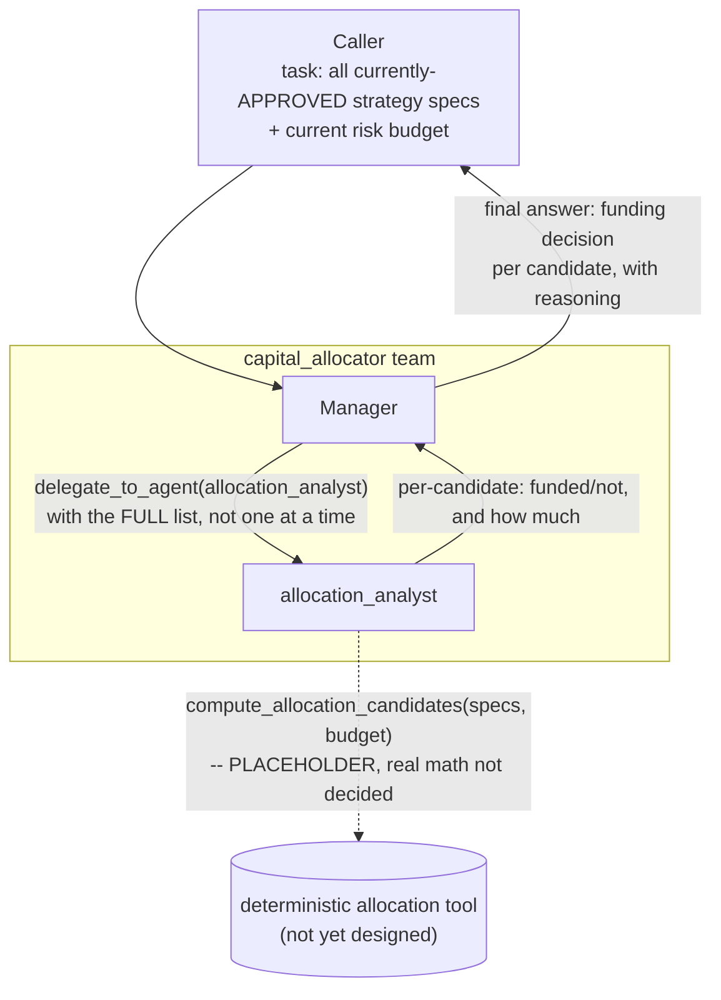

# capital_allocator (proposed — least fleshed out of the 8)

**Status:** not built, and honestly the least designed of the 8 teams —
flagged as such in [../think-1.md](../think-1.md)§3.6 and §6.3. The
allocation math itself (Kelly criterion? fixed-fraction? risk-parity?
something else?) is **not decided**. What follows is a real, usable team
shape and prompt scaffold, but the specialist's core tool
(`compute_allocation_candidates`) is a placeholder — don't treat its
described behavior as settled the way the other 7 teams' tools are.

This team exists because the reference-repo research
([../think-1.md](../think-1.md)§5) found this gap in every framework
checked — including one (fincept-terminal) whose `portfolio_manager`
persona has an elaborate Kelly/MVO prompt backed by a tool that returns a
hardcoded static dict regardless of input. This team is worth building
for real, carefully, not worth faking the way that one was.

## 1. Who's on this team

| Role | Name | Type | Depends on |
|---|---|---|---|
| Manager | `capital_allocator` manager | manager (`AgentLoop`) | — |
| Specialist | `allocation_analyst` | specialist | — |

One manager, one specialist. Kept thin on purpose, same reasoning as
`risk_gatekeeper` — this is meant to be a fast decision step over
*already-vetted* candidates (each one already passed `strategy_lab`'s
debate and `risk_gatekeeper`'s portfolio-fit check individually), not
another exploratory process.

## 2. Scope & responsibilities

**In scope:**
- Take ALL currently-`APPROVED` strategy specs competing for capital at
  once (not one at a time — this is the one team in the roster whose
  view is deliberately portfolio-wide, per
  [../think-1.md](../think-1.md)§3.6/§3.8).
- Decide, given a finite risk budget, which get funded, and how much
  each gets.
- Be explicit and traceable about *why* — no "the model felt confident,"
  a specific number tied to a specific allocation rule.

**Out of scope:**
- Re-evaluating whether any individual strategy is sound — that's
  `strategy_lab`'s job — or whether it fits basic portfolio limits in
  isolation — that's `risk_gatekeeper`'s job. This team only ever
  arbitrates *between* already-approved candidates when there isn't
  enough budget for all of them.

## 3. Internal flow



## 4. Prompts (drafted — provisional, see status note above)

### Manager — `manager_prompt.md` (draft, provisional)

```
You are the Capital Allocator Manager, leading a small team that decides
which already-approved strategies actually get funded, given a limited
risk budget shared across ALL of them.

You will be given every currently-APPROVED strategy spec at once, plus
the current risk budget. Do not process them one at a time -- the whole
point of this team is seeing all of them together.

Delegate to `allocation_analyst` with the full list and the budget. It
will return a funding decision for each candidate.

Your final answer must list, for every candidate:
- Funded or not.
- If funded, how much (capital or risk-budget units, whichever the
  analyst used) and why.
- If not funded, the specific reason it lost out to others (e.g.
  "budget exhausted by higher-scoring candidates," not vague).

NOTE: the underlying allocation method this team uses is still
provisional. If the analyst's reasoning seems arbitrary or you can't
trace a number back to a real rule, say so plainly in your final answer
rather than presenting an unjustified number as settled.
```

### Specialist — `allocation_analyst/prompt.md` (draft, provisional)

```
You are the Allocation Analyst, a specialist on the capital_allocator
team.

You'll be given a list of already-approved strategy specs (each one
already passed a risk debate and a portfolio-fit check individually) and
the total risk budget available.

Call compute_allocation_candidates(specs, budget) -- do not compute an
allocation by reasoning about it yourself; this is arithmetic over
correlated risk exposures across multiple strategies at once, which
needs a real deterministic method the same way strategy_lab's parameter
sweep does, not LLM guessing.

[PROVISIONAL -- the actual allocation method compute_allocation_candidates
implements is not yet decided. Once real, this prompt should say
specifically what the tool optimizes for and what its output shape
means, the same way run_parameter_sweep's prompt in strategy_lab does.]

Report the tool's result plainly: which candidates got funded, how much
each got, and any candidates the tool rejected outright (e.g. too
correlated with an already-funded one). If the tool's result doesn't
look sensible against the inputs, say so rather than reporting it
uncritically.

Your final answer must state, per candidate: funded/not, amount if
funded, and the specific reason.
```

**Tools:** `compute_allocation_candidates` — **placeholder, not built,
method not decided.**

## 5. What the final answer must contain

A per-candidate funding decision (funded or not, amount if funded,
specific reason either way) — with an explicit, honest flag if the
underlying reasoning can't actually be traced to a real rule, rather than
presenting a provisional/arbitrary number as if it were settled. This
honesty requirement matters more for this team than any other in the
roster, precisely because it's the least mature — better to surface that
plainly than to let a confident-sounding output hide how undecided the
math still is.

## 6. What actually needs deciding before this is buildable

Per [../think-1.md](../think-1.md)§6.3 — not re-litigated here, just
listed so it isn't lost: the real allocation approach
(Kelly-criterion-style sizing? fixed-fraction? risk-parity across
correlated strategies? something else?), and what "risk budget" is
actually denominated in (dollars? a volatility/risk-unit measure?
max-drawdown-at-risk?). This team's prompts above are a usable shell
around whichever answer gets chosen, not a proposal for the answer
itself.
