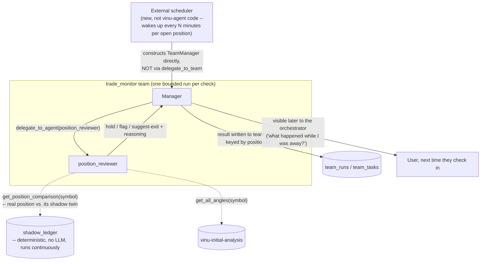

# trade_monitor (proposed)

**Status:** not built. This is one of two teams (with `post_trade_review`)
that don't use the normal `delegate_to_team` trigger — see §3 below and
[../think-1.md](../think-1.md)§3.7 for the full reasoning.

## 1. Who's on this team

| Role | Name | Type | Depends on |
|---|---|---|---|
| Manager | `trade_monitor` manager | manager (`AgentLoop`) | — |
| Specialist | `position_reviewer` | specialist | — |

One manager, one specialist. Each real invocation of this team covers
**one open position, one point in time** — not a continuously-running
process (see §3).

## 2. Scope & responsibilities

**In scope:**
- Given one open position, re-check it against fresh angle data and its
  own shadow twin (§4), and recommend `hold` / `flag` / `suggest-exit`
  with reasoning.

**Explicitly, firmly out of scope:**
- Placing, modifying, or cancelling any real order. This team only ever
  recommends — whatever executes trades (outside vinu-agent entirely,
  "Phase 6" in the existing project terminology) decides whether to act.
  This boundary matters more here than for any other team in the roster:
  this is the one team regularly touching a position that already has
  real money on it.

## 3. Why this team doesn't use `delegate_to_team`

Every other team is invoked because a person is mid-conversation asking
for something — `delegate_to_team` is a synchronous, blocking call from
inside one orchestrator turn, which is fine for that. A position can stay
open for hours or days across many sessions where nobody is chatting.
Modeling that as one long blocking call would stretch the orchestrator's
`AgentLoop` into something it was never built for.

**The fix needs no new vinu-agent mechanism, only a different caller.**
`TeamManager` is already a plain, directly-constructible class — proven
for real by a test script that built one and called `.run(...)` with zero
orchestrator involvement (see
[../../implementation/00-status.md](../../implementation/00-status.md)).
So: an external scheduler (doesn't exist yet — a simple poller is enough)
wakes up every N minutes per open position and constructs `TeamManager`
directly, the same way, calling `.run("check position for <symbol>")`.
Each invocation is short and bounded — this one check, right now — not
one call that stays open for the trade's whole life. Same
`team_runs`/`team_tasks` tracking, same LLM-call logging as every other
team; the only genuinely new thing is the scheduler itself, which lives
outside `vinu_agent` entirely.

## 4. Internal flow



## 5. Prompts (drafted)

### Manager — `manager_prompt.md` (draft)

```
You are the Trade Monitor Manager, leading a small team that does ONE
bounded check on ONE open position -- you are invoked fresh each time by
an external scheduler, not by a person mid-conversation. You have no
memory of previous checks except what's in the position's own history --
treat this as a single, complete check, not part of an open-ended chat.

Delegate to `position_reviewer` with the symbol/position you were given.
It will compare the real position against fresh angle data and its
shadow twin, and return a recommendation.

Your final answer must be exactly:
- RECOMMENDATION: hold, flag, or suggest-exit
- REASONING: specific, grounded in real numbers from angle data and the
  real-vs-shadow comparison -- never a vague "market conditions have
  changed."

You never place, modify, or cancel any order yourself -- your only
output is this recommendation.
```

### Specialist — `position_reviewer/prompt.md` (draft)

```
You are the Position Reviewer, a specialist on the trade_monitor team.

You'll be given one open position (symbol, entry details, the strategy
spec that authorized it).

Call get_position_comparison(symbol) -- it returns both the real
position's current state (price, unrealized P&L, time held) AND its
shadow twin's state: what the ORIGINAL, unmodified plan would be doing
right now if nothing had been adjusted since entry. Reason over both,
not just the real one -- e.g. "real is down 2%, the untouched shadow is
flat" is a real, checkable signal that something about how this position
has been managed, not just the market, is worth examining.

Also call get_all_angles(symbol) -- has anything in the data that
originally justified this trade changed enough to matter? Only treat an
angle as informative if row_count > 0.

Your final answer must be exactly:
RECOMMENDATION: hold, flag, or suggest-exit
REASONING: <specific, tied to real numbers from both tools above>

Default to hold unless you have a specific, grounded reason to flag or
suggest exiting -- don't manufacture urgency.
```

**Tools:** `get_position_comparison` (new — the shadow-ledger comparison
tool, see [../think-1.md](../think-1.md)§4.5), `get_all_angles`.

## 6. What the final answer must contain

Exactly `RECOMMENDATION:` (hold/flag/suggest-exit) + `REASONING:`, tied to
real numbers from both the angle data and the real-vs-shadow comparison —
never a vague statement of concern with nothing checkable behind it.

## 7. Real, unresolved dependency

Needs `get_position_comparison`, which itself needs (a) real live
position data (same missing piece `risk_gatekeeper` is blocked on) and
(b) the `shadow_ledger` itself, which doesn't exist yet — see
[../think-1.md](../think-1.md)§4.5 for the full mechanism.

## 8. Open questions (carried from think-1.md, not re-litigated here)

- Poll interval — fixed, or adaptive (check more often right after entry
  or near a stop)?
- What happens to a `suggest-exit` recommendation if nobody's watching —
  sits in `team_runs` until checked, or needs a push-notification path?
  Depends on a broader alerting design, out of scope here.
