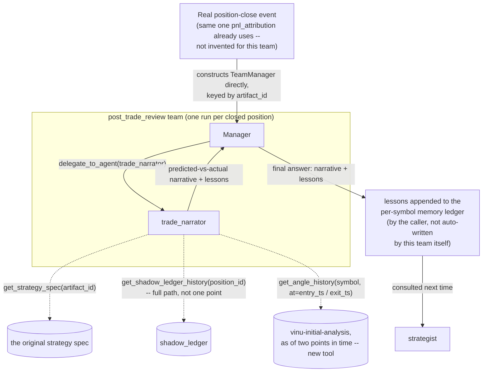

# post_trade_review (proposed)

**Status:** not built. Like `trade_monitor`, this team doesn't use the
normal `delegate_to_team` trigger — see §3.

## 1. Who's on this team

| Role | Name | Type | Depends on |
|---|---|---|---|
| Manager | `post_trade_review` manager | manager (`AgentLoop`) | — |
| Specialist | `trade_narrator` | specialist | — |

One manager, one specialist. Each invocation covers exactly **one closed
position** — a single, complete review, run once.

## 2. Scope & responsibilities

**In scope:**
- After a position closes, compare what actually happened to what was
  predicted when it opened, and explain *why* — which part of the
  original reasoning held up, which didn't.
- Pull the strategy spec that authorized the trade (via its
  `artifact_id` link) and the shadow twin's full path (§4) for a real
  "what if we'd left it alone" comparison, not a guess.
- Produce lessons that flow back into the per-symbol memory ledger for
  `strategist` to consult next time.

**Explicitly out of scope:**
- Recomputing win/loss statistics — the existing `pnl_attribution` angle
  (already real, already correctly implemented — win rate, avg win/loss
  %, proper confidence intervals) does that. This team adds the per-trade
  narrative that angle's own design doc explicitly says is missing; it
  doesn't duplicate the aggregate math.
- Automatically changing anything. Its output is lessons for the *next*
  proposal, not a live write to any current strategy — feedback, never
  autopilot.

## 3. Why this team doesn't use `delegate_to_team`

A real trade close already fires a real event in this project:
`POST /pnl-attribution/{symbol}/record`, confirmed directly against the
real `pnl_attribution` design doc and the real `Position` schema in
`vinu-live/vinu_live/book/schema.py`. Every closed `Position` already
carries an `artifact_id` linking back to the trade plan that authored
it — exactly what this team needs, with no new signal or lookup mechanism
required. So whatever already handles that close event is the natural
place to also construct `TeamManager` directly (same non-orchestrator
pattern as `trade_monitor`) and kick off a review, keyed by the
position/`artifact_id` — not something a person triggers by chatting.

## 4. Internal flow



## 5. Prompts (drafted)

### Manager — `manager_prompt.md` (draft)

```
You are the Post-Trade Review Manager, leading a small team that reviews
exactly ONE closed position -- you are invoked once, by the position-
close event, not by a person in conversation. This is a single complete
review, not part of an ongoing chat.

Delegate to `trade_narrator` with the closed position's id (and its
artifact_id link back to the original strategy spec). It will pull the
original prediction, the shadow twin's full path, and the angle data at
both entry and exit, and produce a narrative.

Your final answer must include:
- What the original strategy predicted, in plain language.
- What actually happened, including how it compares to the shadow twin
  (what the untouched original plan would have done).
- Which part of the original reasoning held up, and which didn't --
  grounded in real numbers, not a vague "market moved against us."
- Specific lessons for next time on this symbol/setup -- concrete enough
  that `strategist` could act on them directly, not generic advice.

You do not recompute win/loss statistics -- that's pnl_attribution's job,
already done correctly elsewhere. Your value is the "why," not the "what."
```

### Specialist — `trade_narrator/prompt.md` (draft)

```
You are the Trade Narrator, a specialist on the post_trade_review team.

You'll be given a closed position and its artifact_id.

1. Call get_strategy_spec(artifact_id) -- the original entry_condition,
   exit_condition, stop_loss, and which angles it was grounded in.
2. Call get_shadow_ledger_history(position_id) -- the FULL path of the
   untouched, original-plan shadow twin over the position's whole life,
   not just its value at close. Compare this against what actually
   happened to the real position.
3. Call get_angle_history(symbol, at=entry_timestamp) and again with
   at=exit_timestamp -- what did the angles that justified this trade
   actually do, from entry to exit?

Write a narrative covering:
- What was predicted, and on what specific evidence.
- What actually happened, including any point where the real position
  diverged from its shadow twin, and what caused that divergence (a
  human/agent adjustment? a stop that triggered? something else?).
- Which specific part of the original reasoning was right, which was
  wrong, grounded in the real angle values at entry vs. exit -- never a
  vague "the market moved."
- Concrete lessons for the next strategy proposal on this symbol/setup --
  specific enough to be useful (e.g. "the entry angle's signal reversed
  within 2 days on 3 of the last 4 trades on this symbol -- consider a
  faster stop"), not generic advice like "be more careful."

Your final answer is this narrative, ending with a short, explicit
"LESSONS:" section.
```

**Tools:** `get_strategy_spec` (new — reads via `artifact_id`),
`get_shadow_ledger_history` (new — the shadow ledger's full path, not
just its current value), `get_angle_history` (new — angle data as of a
specific past timestamp; per
[../think-1.md](../think-1.md)§3.8, doesn't exist yet even though
`AngleStorage`'s real `run_id`-based "latest" resolution suggests it's a
small addition, not a redesign).

## 6. What the final answer must contain

The narrative described in the manager prompt, ending with an explicit
`LESSONS:` section specific enough for `strategist` to act on directly.
The manager's output is **feedback, not an automatic change** — nothing
in this team writes to a live strategy; whatever triggered this run is
responsible for appending the lessons to the per-symbol memory ledger
(§4.2 in [../think-1.md](../think-1.md)), which `strategist` is separately
required to consult before its next proposal on that symbol.

## 7. Real, unresolved dependencies

`get_shadow_ledger_history` needs the `shadow_ledger` itself (not built —
see [../think-1.md](../think-1.md)§4.5) to keep its *entire* history, not
just current state, since this team needs the full path, not a point
value. `get_angle_history` (point-in-time angle lookup) doesn't exist yet
either — flagged as an open question in
[../think-1.md](../think-1.md)§6.

## 8. Where the lessons actually land — still open

Per [../think-1.md](../think-1.md)§3.8: a new field on the strategy-spec
schema, a separate lessons store, or just plain text a human skims before
the next `strategist` run — not decided. Whichever it is, `strategist`'s
"must consult before proposing" rule (§4.2) is what makes this loop real
rather than aspirational.
