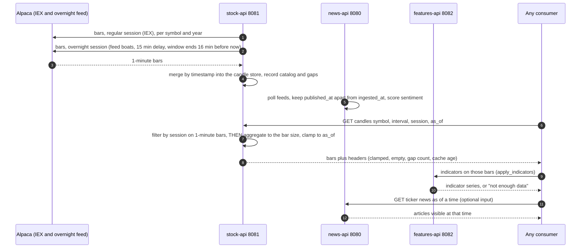
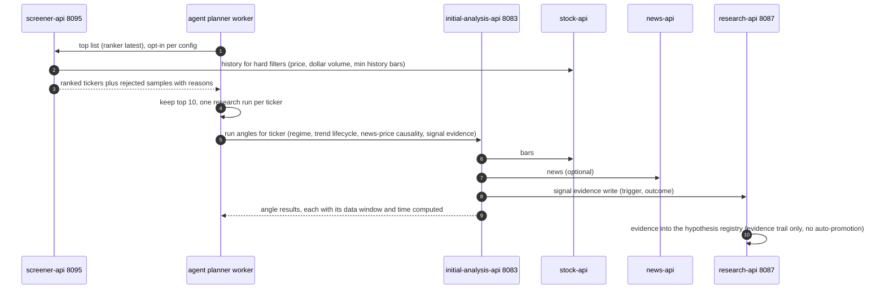
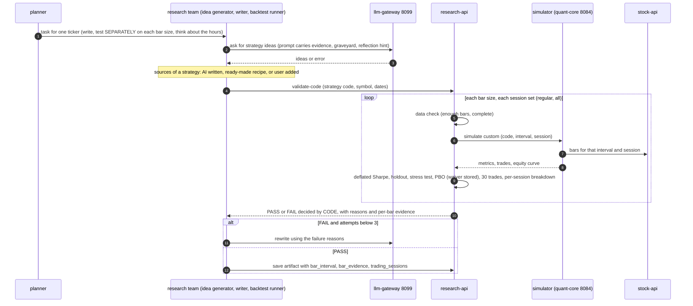
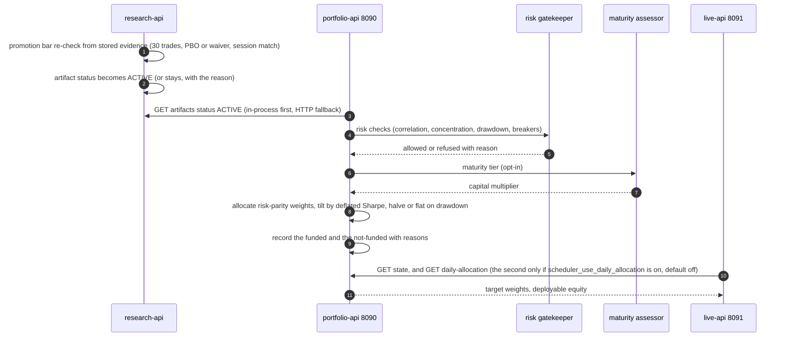
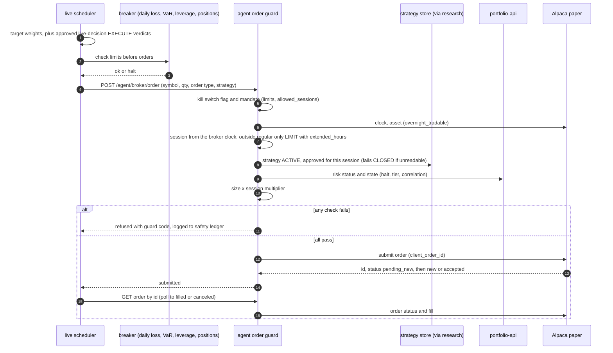
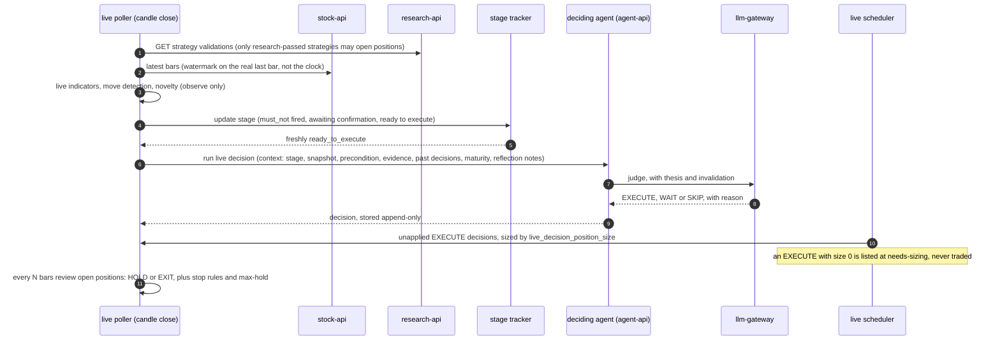
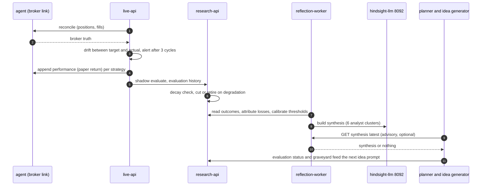
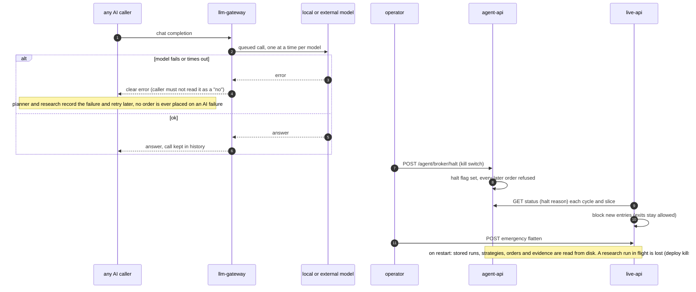

# Sequence diagrams (8), traced from the vision

How to use: take any functional question from the vision (for example "who stops a bad order?" or "what happens at night?"). The coverage matrix at the end names the diagram that answers it. If a vision case has no diagram, the matrix shows it as a gap.

Arrows come from the connection manifest `vinu-infra/pipeline_edges.yaml` (41 entries) and from the code. Notes in each diagram say what is **default off**, what is a **known gap**, and the **status on the real system**:
- PROVEN = ran on the real stack and the values were checked.
- TESTED = ran only in tests, or only on the synthetic planted-edge chain.
- UNPROVEN = never run end to end.

Diagrams are Mermaid. In VS Code use the "Markdown Preview Mermaid Support" extension, or paste a block into mermaid.live.

---

## D1. Data inflow (prices, overnight bars, news, features)
Answers: where does data come from, how is each session covered, how is the future kept out.
Vision: A1, A14, B1, B6 (#19), D3.1.

Status: PROVEN for stock candles and the overnight backfill (150 symbol-years). Gap: pre-market and after-hours bars are thin (IEX only). Holidays not modelled.

## D2. Discovery and analysis (top 10, then analysis)
Answers: how the top 10 are picked and what is known about each before a strategy is written.
Vision: A1, A2, A18 (selectivity funnel), A13 (analogues), B1, B5 #5, B6 #18.

Status: PROVEN for screener top list and analysis runs. Gap: angles use regular-session bars, no per-session regime tag yet.

## D3. Strategy writing, research and retry
Answers: how a strategy is written (AI, ready-made, user), who decides PASS, what happens on failure.
Vision: A10, A11, B2 (#1, #2), B5 (#1 to #4), B11, D3.3 to D3.5. Decisions 2026-10-07: code decides PASS, one strategy tested on all bar sizes, 30 trades, 3 attempts.

Status: PROVEN that validate-code gives correct values on a real ticker (AMD, all bar sizes) and honestly rejects. TESTED that a pass is possible (planted-edge chain). No real strategy has passed yet. Gap: a deploy kills a running research run. Simulator session-hash fix pending verification.

## D4. Promotion and the fate keeper (gatekeeper, then allocator)
Answers: how a passed strategy becomes ACTIVE, who limits it, how much capital and which sessions.
Vision: A6, A7, A11, A12, A18, B8 (#22, #23), B9 (maturity).

Status: TESTED on the synthetic chain only. UNPROVEN on a real strategy (there are 0 real ACTIVE strategies). Gaps: the allocation does not carry approved sessions or size multipliers (the order guard reads them from the strategy store itself, see D5). Daily allocation is default off.

## D5. Order flow (target to broker, with every guard)
Answers: who can stop an order, in what order, and what the order looks like at the broker.
Vision: A6 (kill switch), A7, A8, A18, D2 and D3.7.

Status: the Alpaca side is PROVEN by a real 1-share SPY overnight round trip (placed directly through the broker connection, reconciled). The guard chain is TESTED in code only. UNPROVEN: a real order through live-api and the guard. Gaps: the scheduler does not write its own positions into the book the breaker checks (manifest entry `book.writes->live.scheduler`, status gap). Several guards are default off: entry guards (cooldown, turbulence, data freshness), exits exempt from halts, precondition enforcing.

## D6. The live decision loop (24 hours)
Answers: how a live signal is noticed, judged and handed to execution at any hour.
Vision: A3, A4, A5, A9, A10, B12 (9 points).

Status: TESTED only. UNPROVEN on a real strategy. Gaps: REDUCE and ADD are not built. The bar delay for the overnight session is 15 minutes. Precondition enforcing is default off.

## D7. Feedback and learning
Answers: how real results change the next strategies.
Vision: A12, A15, A16, B9, B10, D3.8.

Status: UNPROVEN end to end (nothing live to learn from yet). Gaps: the agent's reflection tool points at an address with no HTTP port. Fills are not yet recorded per session. Spread and liquidity per session are not measured.

## D8. The language model door, kill switch and restart
Answers: what happens when the model is down, how everything is stopped, what a restart loses.
Vision: A5 (no-trade is a decision), A6 (kill switch), A17, B9.

Status: kill switch and halt TESTED, the gateway history PROVEN in use. Gap: no written rule for a gateway outage of hours. A deploy kills an in-flight research run.

---

## Coverage matrix: vision case to diagram

| Vision case | Diagram | Notes |
|---|---|---|
| A1 pre-trade intelligence, 30 angles | D2 | regime per session missing |
| A2 AI brain, hard risk layer, AI never touches broker | D3, D5 | the order guard sits between |
| A3 structured decision (why) | D6 | decision record with reason |
| A4 expected value | D3, D6 | metrics in D3, judgement in D6 |
| A5 right to say "I don't know" | D6, D8 | WAIT, SKIP, and no order on AI failure |
| A6 risk engine above the AI, kill switch | D4, D5, D8 | |
| A7 dynamic sizing | D4, D5 | portfolio sizing, session multiplier at the guard |
| A8 execution intelligence | D5 | slicing exists in live, not shown |
| A9 re-evaluation, thesis invalidation, time stop | D6 | review every N bars, stop rules |
| A10 bull vs bear vs risk | D3, D6 | committee is opt-in, async |
| A11 backtest is not enough (walk-forward, paper, scaling) | D3, D4 | walk-forward in D3, maturity scaling in D4 |
| A12 degradation detection | D7 | |
| A13 market memory (analogues) | D2, D6 | trend lifecycle rows feed the decision context |
| A14 alternative data | D1 | only search trends, rest deferred |
| A15 audit trail | D5, D7 | safety ledger, decision records |
| A16 post-trade learning | D7 | |
| A17 architecture and metrics | D1 to D8 | whole chain |
| A18 senior-trader rules (WAIT first, funnel, netting, kill switch) | D2, D4, D5, D6 | funnel D2, netting D4 |
| B1 layer map | D1, D2, D4 | |
| B2 items 1 to 10 (evidence, regime tag, pooling, news confound) | D2, D3, D6 | |
| B3 items 11 to 13 (tools, research, simulator audits) | D3 | simulator sandbox in D3 |
| B4 items 14 to 15 (sizing, backfill) | D1, D4 | |
| B5 item 16 (autonomy gaps) | D2, D3 | |
| B6 items 17 to 20 (seams, screener, data, indicators) | D1, D2 | |
| B7 item 21 (cross-cutting patterns) | D1, D3 | point-in-time D1, rejection log D2 and D4 |
| B8 items 22 to 24 (strategy, portfolio, live) | D4, D5 | |
| B9 item 25 (maturity, reflection brain) | D4, D6, D7 | |
| B10 item 26 (seams built) | D5, D6 | |
| B11 strategy schema (8 fields) | D3 | stored on the artifact |
| B12 live-decision 9 points | D6 | |
| B13 deferred items | not drawn | by design: nothing happens |
| D 24-hour system | D1, D3, D4, D5, D6 | sessions in data, test, approval, guard |

Not covered by any diagram (to add if the owner wants them): the user adding a strategy by hand (ready-made and user-added sources appear only as a note in D3), the UI (read-only), and the news-driven path (news only appears as an optional input).
