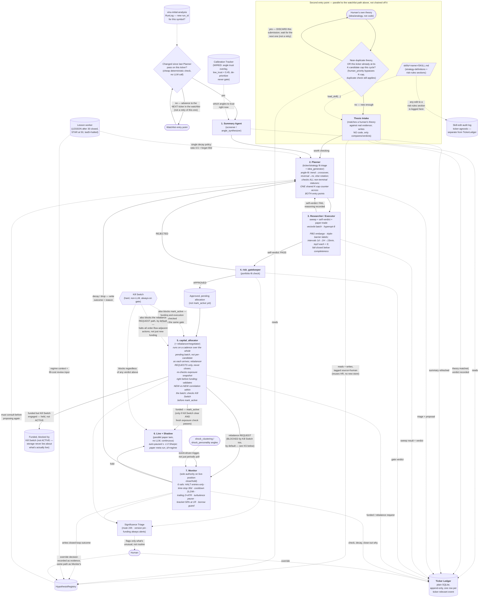

# Agentic workflow — current architecture (v2.2 2026-09-09)

This is the pipeline as it actually runs today after the 21-gap build (`questions-answers/gaps-implementation/`, 20 of 21 folders closed, only the 25 money gate still open — correctly, it needs time not code). Window is Full `2022-01-01` (`VINU_STAGE1_START_DATE`), timers fast per operator call (planner 60s, risk 60s, allocator 90s, shadow 90s, trade-plan 90s — not 1800/900). Diagram structure unchanged from v2.1 — only annotations moved, plus one new dotted node (Lesson worker).

## The diagram

Three loop-backs make this a cycle, not a one-shot funnel:

1. **Researcher/Executor fail → Planner.** The failure reasoning is what
   the next proposal on that ticker has to address.
2. **risk_gatekeeper REJECTED → Planner.** The artifact stays wherever it
   was (BENCHING/MONITORING, unchanged) but the *reason* reaches the
   Planner so it isn't blindly re-proposed.
3. **Monitor decay/drop → Planner**, via `HypothesisRegistry`. Every
   closed position's lesson becomes an input constraint on the *next*
   proposal for that ticker.

A second **entry point** sits alongside the watchlist/change-gate one: a
human can hand the pipeline a raw theory via **Thesis Intake**, which
matches it against real evidence and, if it clears the bar, feeds it into
the Planner exactly like a system-generated idea. Same downstream loop
either way — only the front door differs.

Everything drawn with a dotted line is a cross-cutting mechanism, not a
pipeline stage — it can fire from more than one place.

## Where the ticker's full story lives — `TickerLedger`

Plain SQLite, append-only, one row per ticker-relevant event: `ticker,
timestamp, stage, event_type, text, ref_id, source`. Every stage writes
exactly one entry when something happens; `ref_id` points back to the
real record in whichever specialized store owns that data (`artifact_id`,
`run_id`, hypothesis id) — the Ledger is a narrative index, not a
duplicate copy. Every stage in the pipeline has exactly one natural entry
point into it: Thesis Intake's verdict, Summary Agent refresh, Planner's
triage+proposal, Researcher/Executor's sweep result and verdict,
`risk_gatekeeper`'s verdict, `capital_allocator`'s funding/rebalance
decisions, every Monitor check plus decay/close-out narrative, and any
human override.

Live + Shadow's bookkeeping is continuous, not event-shaped — it doesn't
write a row every tick. Only Monitor's periodic comparisons (reading the
shadow twin's current state) produce Ledger entries; the shadow ledger
itself stays a separate, high-frequency store the Ledger references.

Plain SQLite over a vector DB / memory layer on purpose: the real query
pattern is "every event for AAPL, in exact order" — exact-match plus
sort, which SQL does natively. This project leans on exact traceability
(`artifact_id`, `run_id`, never-invent-a-number grounding) as a core
discipline, and a system built to reinterpret/consolidate memories works
against that. A vector layer on top of the Ledger for fuzzy cross-ticker
analogical search is a real, later capability — not scoped now.

**Taxonomy pinned 2026-09-07** (pending Row 10): `stage` `watchlist_gate | thesis_intake | summary_agent | planner_triage | planner_idea | sweep_execute | sweep_verdict | risk_gatekeeper | capital_allocator | live_shadow | monitor | kill_switch_gate | significance_triage`; `event_type` `changed | unchanged | summary_refreshed | triage | proposal | sweep_complete | verdict_PASS | verdict_FAIL | APPROVED | REJECTED | PEND | PENDBLOCK | funded | rebalance_requested | rebalance_blocked | hold | decay | close_out | halt | resume | flag_created`; `source` `watchlist | human | human_override | system`; `ref_id` points to real row, now verified via `ticker_ledger.py:19` `verify_ref_id(ref_id, strategy_store)` fail-open logs stale `BENCHING→PEND→ACTIVE` drift (H `0fc90e11`). Retention 90d / 1M rows then dated export — see `decisions/10-ledger-decision.md`.

## Per-agent detail

### 1. Summary Agent (`screener` / `angle_synthesizer`)

Calls `get_all_angles(ticker)` once, reports how many of the 28 angles
have real data (1D = 27/27 — `trend_session_structure` has no 1D by
design; 1H/4H/1min/5min/15min = 28/28), cites specific numbers from the
ones that do, states what to check next. Carries `low_trust_angles` from
the wired calibration overlay. Includes a cross-angle agreement/divergence check
(agree/diverge/insufficient) — do independent angles (e.g. `arima` vs
`chronos` forecast direction, `regime_analysis` vs `trend_lifecycle`)
actually agree. Verified live against a real model.

**Grounding discipline:** only treats an angle as informative if
`row_count > 0` — never invents a number. This is why it stays useful
even when most angles have no data yet: it says so plainly instead of
padding a confident summary.

**Trigger:** watches `vinu-initial-analysis`'s `RunLog` for a new
`run_id` per symbol — only then does the Summary Agent refresh, and only
then does the downstream change-gate have anything new to compare
against. Little fix A `scheduler_workers.py` dedupes via
`ticker_summary_store.get_summary` `updated_at` within 300s before
invoking `screener` LLM team. **Calibration overlay wired 2026-09-09:**
the summary carries `low_trust_angles` (rated < 0.45) so the Planner
de-prioritizes weak angles without gating on them.

**Runbook rule 2026-09-09 (23):** ATS 15min wiring run before Full —
`full-pattern/03-full-runbook.md:3`. ATS catches plumbing in ~14min;
Full trusts metrics only after ATS green.

### 2. Planner (triage + `idea_generator`)

Two jobs in one role.

- **Triage:** for each watchlist ticker, reads the Summary Agent's stored
  read (`TickerSummaryStore`) and what's already running on it
  (`SqliteStrategyStore.list_artifacts_for_symbol`) — produces a fit tier
  (best/medium/least) and a priority informed by what's already ACTIVE.
  The status check spans every non-terminal state (CREATED, BENCHING,
  ACTIVE, MONITORING), not ACTIVE alone.
- **Idea shaping:** picks a recipe (`list_sweep_recipes`, wired into
  `idea_generator`'s recipe-first path) and a coarse parameter search
  space, tied to the angle characteristics that motivated it. Raw code
  generation is the exception path, not the default.

Consults `HypothesisRegistry` before proposing on a ticker — what's been
tried before, what failed and why. Only runs when the change-gate says
something actually changed, on a cheap/fast model tier by default; a
stronger model is reserved for tickers that flip to "needs a real look."

Caps itself at K distinct candidates per ticker per cycle — a shared
counter with Thesis Intake. **K=3 shared, human_priority bypasses K-cap
(duplicate check still applies)** — a human's genuinely new theory is
never blocked by machine proposal count (`thesis_intake_gate.py:check(human_priority=...)`).
**Timers fast 2026-09-09** per operator: planner 60s, risk 60s, allocator
90s (`VINU_AGENT_PLANNER_INTERVAL=60`, `.env:260-262`).

Triage now picks recipe by angle fit first — trend/momentum/breakout →
`crossover`, reversal/mean-reversion → `rsi`, else rotation by in-flight
count (`planner_triage_hook.py:check(ticker, angles)`). The LLM refines
downstream; the hook only picks a reasonable start.

### 2b. Thesis Intake (second entry point, alongside the Planner)

Takes a human's own theory — an idea or analogy, not code — and checks it
against the real evidence already gathered for that ticker
(`TickerLedger`, `HypothesisRegistry`, the Summary Agent's stored read).
Reads a strategy-definitions section (what shapes of strategy exist to
test a theory like this) and a risk-rules section (what would disqualify
it outright) via the skill pattern. If the theory holds up, it produces a
verdict — "worth checking" — and the theory enters the same Planner →
Researcher/Executor loop as a system-generated idea. If not, it says so
with the contradicting evidence.

Writes **no code, ever** — purely reads, compares, verdicts. The human's
theory is written into `HypothesisRegistry` tagged `source="human"` — no
separate store.

A cheap, deterministic check runs ahead of any LLM call: has a
near-duplicate theory already been evaluated for this ticker recently,
or is this ticker already at the shared K-cap this cycle? Only "no"
reaches an LLM.

Placeholder `skills/thesis-intake/SKILL.md` with `strategy-definitions` + `risk-rules` now exists (pending Row 11 `decisions/11-thesis-intake-decision.md`). Any edit to the risk-rules skill section is written to a ticker-agnostic
skill-edit audit log, separate from `TickerLedger`.

### 3. Researcher / Executor (one team, three roles, loops internally)

**Role a — receive the plan.** Takes the Planner's recipe + search space
and its reasoning. Little fix D `loop.py:141` caches `angle_context` + `feature_snapshot` via `LRUCache` keyed `symbol:interval` / `symbol` before `tools.get_angle_context` / `get_feature_snapshot`, avoiding repeated `features-api:8082` + 4× `get_angle_rows` per `research_from:research_to` `f7e25081`.

**Role b — execute + back-propagate.** Runs the grid via
`run_sweep_candidate` (`vinu-research/sweep.py`, AST-based parameter
substitution) — deterministic Python, never LLM-authored code per
attempt. `run_sweep_grid` (`vinu-research/sweep_grid.py`) runs the whole
grid in one call with **vectorbt-style batch** (gather sem5, order kept,
rollback flag) and **hyperopt-8 coarse subsample** for oversized grids
(config-gated, fail-closed raise without config). **N=5
`max_iterations`** (`VINU_RESEARCH_MAX_ITERATIONS`). PBO now takes an
**embargo** (`pbo.py:embargo_periods`, `VINU_PBO_EMBARGO_PERIODS=0`
default) dropping OOS block boundaries; walk-forward already purges via
`gap_days=5`. **Triple-barrier labels** (`vinu-research/labels.py`, pure,
+1/-1/0) exist for outcome labeling. Sweep intervals run **1d → 1H →
15min** (`config.py:sweep_interval_list`), top3 per interval = 9 BENCHING
per ticker via `write_artifacts_from_top3` (idempotent, `TOP_N_PER_INTERVAL`
mirror). 15 `BUILTIN_RECIPES` are the backtest-safe set; 2+ succeeds
required else FAIL (null PBO = FAIL).

**Role c — self-verdict.** Reads the ranked table plus `pbo.py`'s
overfitting probability and the walk-forward stability verdict (both
folded into `sweep_evidence_verdict`) and decides PASS/FAIL. Treats
below-threshold `completeness` (N of M grid points actually succeeded, fail-closed <0.7) as
automatic FAIL, never a ranked PASS off partial data.

**Role d — paper-trade rehearsal. EXTENDED 2026-09-09.** Same simulator +
T+1 + Almgren-Chriss cost path as every backtest (cost-aware, verified
`tools.py:410` 0.001/0.0005). Window is **trading-days aware** (weekend
step-back, 7 calendar ≈ 5 trading), records **overlap 1.0** (honest:
rehearsal sits inside in-sample until WF gap excludes it), **regime tag**
(high-vol/trend/range from rehearsal Sharpe/DD), **run_id link**,
conditions + lineage `data_hash` per run (`models.py:lineage_hash`,
`loop.py`). Paper store keeps the same shape (`performance_store.py`
`meta_json` v2: run_id+regime+conditions). Degradation >50% vs in-sample
(or negative rehearsal Sharpe) fails, never blocks on no-data.

**Defining characteristic:** the LLM chooses which region of parameter
space to explore and interprets whether an improvement is real or noise
— it never computes the numbers itself.

**Accepted simplification 2026-09-07:** self-verdict is one voice, not
a bull/bear adversarial debate — kept for cost, mitigated by rehearsal + holdout 20% + 3-window walk-forward + PBO (see `decisions/06-verdict-decision.md`). Revisit if PASS + holdout fail >20%.

### 4. `risk_gatekeeper`

One spec in, one verdict out. Checks the already-approved candidate
against the real current portfolio — position sizing vs. account size,
correlation to what's already open — via `get_portfolio`. Position sizing is `fractional_kelly` quarter-Kelly `vinu-agent/agent/position_sizing.py` `full_kelly_fraction = (p*b - q)/b` ×0.25 with `fixed_fractional`/`atr_stop` fallback (`VINU_AGENT_POSITION_SIZING_METHOD`, `KELLY_FRACTION 0.25`, `RISK_PER_TRADE 0.02`, `ATR 2.0`) — **decided 2026-09-07** `decisions/05-sizing-decision.md`, not provisional. **Added 2026-09-09:** tail gate (CVaR exceeds threshold blocks) + vol targeting scale 0.25–1x. Artifacts now carry `regime_tag` + `freeze_hash` config lineage (store migration, writer passthrough, old rows default empty never backfilled). On `APPROVED`,
a manager-level Python hook moves the artifact into an "approved, pending
allocation" holding state instead of calling `mark_active` directly —
funding is `capital_allocator`'s decision, made across a batch.

Answers exactly one question — "does this fit current exposure" —
deliberately never re-litigates whether the strategy itself is sound.

REJECTED verdicts feed Significance Triage as well as the Planner loop-back
— a pattern of repeated exposure-driven rejections is signal a human
should see.

### 5. `capital_allocator` (+ rebalancer/negotiator role)

Ranks currently-ACTIVE artifacts by `deflated_sharpe`, funds
highest-ranked first, each capped at `approved_size` (risk_gatekeeper) and portfolio risk-parity weight × budget (`vinu-portfolio/service.py:210` `allocate_risk_parity` + `vinu-portfolio/evaluate-batch`), until
the budget runs out. Portfolio weighting adds bounded regime/outcome tilts (`compute_daily_allocation`) + vol-target 15% `sizing.py:14` — **decided 2026-09-07** `decisions/05-sizing-decision.md`.

Runs on a fixed cadence over the whole "approved, pending allocation"
batch since its last pass (**`VINU_AGENT_CAPITAL_ALLOCATOR_INTERVAL 90s`**
fast 2026-09-09), not per-candidate as each clears `risk_gatekeeper` —
avoids first-come-first-served funding. Re-runs a cheap exposure
snapshot check immediately before funding. Validates NEW-vs-NEW
correlation within the funded batch. Little fix F `allocation_tool.py`
retries before fail-closed `funding skipped` — one `portfolio-api`
hiccup no longer stalls the batch. **Portfolio guards added 2026-09-09
(`vinu-portfolio/service.py`, `circuit_breakers.py`):** DD ladder
halve −10% / flat −15% / halt −20% (`VINU_PORTFOLIO_DD_HALVE/FLAT`);
per-symbol regime (env-gated, default benchmark); style + interval
sleeves (`sleeves`, `interval_sleeves` parsed from writer-9 names, YAML =
daily); hysteresis (sub-0.02 changes hold, `MIN_WEIGHT_CHANGE`);
composition action cap 0.20/cycle (`MAX_ACTION`). All renormalize after.

The rebalancer role's unwind-request path is built and gated
(`capital_allocator_hook` → `rebalance_guard.check_rebalance_allowed` →
vinu-live's rebalance-request intake) — it never closes a position
itself, only sends Monitor a request. Monitor, as sole authority over
live-position close/hold, folds that request into its own judgment. **The "replace, not just fund" decision math — whether an existing, weaker ACTIVE strategy should be unwound to make room for a demonstrably better new one — is BUILT 2026-09-07:** `allocation_tool.py` emits `replace_recommendations` when best `PEND deflated_sharpe >= worst ACTIVE +0.8`, `capital_allocator_hook.py` deterministically emits the same `REQUEST` even when the LLM emits no `unwind` (same threshold), still via `RebalanceRequestQueue` → Monitor authority (`0c7cbb19`).

Checks the Kill Switch before calling `mark_active`; if engaged, the
artifact goes to a "funded, blocked by Kill Switch" holding state instead
— storage never claims a strategy is ACTIVE when the Kill Switch is
actually preventing it from executing. The Kill Switch also blocks the
rebalancer's request path by default (decided `block-all` `decisions/12-kill-switch-decision.md`).

Every funding decision reports a traceable reason per candidate — never a
black-box allocation. Composition gaps are now observable: `composition_view` `{gaps, suggestions}` on concentration >40%, max corr >0.8 (~ BUILT `7e4a0fe6`).

### 6. Live + Shadow (parallel execution)

`vinu-live/shadow_evaluator.py`'s `ShadowEvaluator` compares a BENCHING
artifact's paper-trading Sharpe against its backtest Sharpe and
auto-promotes to ACTIVE within tolerance (paper>0, degradation≤0.5).
Paper-days knob per interval (10 for 1D, 5 for 1H,
`VINU_SHADOW_MIN_PAPER_DAYS*`). **Auto-pause 2026-09-09:** paper Sharpe
≤ −1.0 (`VINU_SHADOW_AUTO_PAUSE_SHARPE`) → `auto_paused`, fast pause that
never promotes. `evaluate_all()` loops all BENCHING; paper store keeps
run_id+regime+conditions meta. interval 90s.

Once funded, the live position runs for real while an untouched paper
twin of the *original* plan runs in parallel, continuously, off the same
price feed. Pure deterministic bookkeeping — no LLM, no judgment.

At any moment, "what would this position be doing right now if left
alone" is a computed answer, not a guess. Pre-trade risk gateway now adds message throttle `10 orders/sec` deque `vinu-agent/broker/order_guard.py` `8325e893` (B20) and data lineage via `vinu_infra/freeze.py` `freeze_manifest()` `44e7e034` (B21) — tick wallet still spiked. Little fix J `service.py:42` `_returns_cache 60s` avoids double equity fetch.

### 7. Monitor (decay-watch + post-trade review)

`vinu-live/trade_plan/orchestrator.py`'s `TradePlanOrchestrator` owns
entry, invalidation-exit, and contingency actions every cycle — sole
authority over a live position's lifecycle. Shock trigger built
(`cycle_shock_batch`, debounced, auto-prioritized). **Six safety rails
built 2026-09-09 (all entries-only philosophy — exits never blocked):**
HALT `entries_only` + time-stop 30d (`MAX_HOLD_DAYS`) + cooldown 2
consecutive losses lock 24h (`COOLDOWN_LOSSES/HOURS`) + trailing 2×ATR
ratchet never loosen (`TRAILING_ATR_MULT`, `trailing_stop_for`) +
turbulence pause on 14d vol (`TURBULENCE_VOL=0.05`) + bracket 50% at 1R
(`partial_taken` book v3, needs a real stop or skips honestly) + borrow
guard (short blocked only on explicit `shortable=False` via
`GET /broker/asset`, fail-open otherwise). Orders carry
`client_order_id` idempotency (per-minute bucket, retries dedupe);
scheduler slices continue on failure with partial summary, remainder
next cycle via reconciler.

`capital_allocator`'s rebalancer can only request a close, never perform
one itself — Monitor is the sole authority.

Batching/prioritization via `cycle_shock_batch` + auto-wire; plain periodic poll remains fallback.

## Cross-cutting mechanisms (not pipeline stages)

- **Calibration Tracker** (`vinu-research/calibration.py`, **WIRED
  2026-09-09**) — feeds the Summary Agent which angles to trust via
  `scheduler_workers.py:_angle_trust`: rated angles below 0.45
  (`VINU_AGENT_CALIBRATION_MIN_ACCURACY`) are `low_trust`,
  de-prioritized never gated, unrated stays unrated (no-data ≠ low
  trust). See `decisions/08-calibration-decision.md`.
- **Lesson worker** (`vinu-live/lesson_worker.py`, **NEW 2026-09-09**) —
  LESSON JSON after 30 closed (`VINU_LESSON_MIN_TRADES`), STAR prefix at
  50 (`STAR_MIN`), each lesson carries fills + avg commission (slippage
  review input) + last5 W/L + halted context. Feedback loop already
  closed writes (calibration, pnl_attribution, personality, hypothesis
  evidence, ticker ledger). **Single decay policy**
  (`scheduled/executor.py:decay_scan`): ratio threshold 0.5
  (`VINU_DECAY_RATIO`) + forgetting — snapshots older than 90d
  (`VINU_DECAY_FORGET_DAYS`) count as stale → decayed.
- **HypothesisRegistry** — the Planner's pre-proposal check, where
  Monitor's closed-loop outcomes get written, and where Thesis Intake
  reads/writes human-submitted theories (tagged `source="human"`).
- **Kill Switch — real, always-on.** Checked before every real order at
  Live + Shadow (`OrderGuard` now also throttles `10/sec` deque + warns `also present as plain env` `0fc90e11` `8325e893` + `secrets_loader.py`), before `capital_allocator` calls
  `mark_active`, and before the rebalancer's unwind request path
  (`rebalance_guard.check_rebalance_allowed`) — halting all
  order-flow-adjacent actions by default, not just new funding
  (`block-all` decided `decisions/12-kill-switch-decision.md`).
  `broker/kill_switch.py` has a cross-process file lock closing the
  check-then-act race.
- **Significance Triage** — distinct from `audit/research_digest.py`
  (real but purely passive). Actively judges routine vs. unusual. Fed by
  `capital_allocator`, Monitor, `risk_gatekeeper` REJECTED. Human
  decisions write through `HypothesisRegistry.add_evidence(...)` tagged
  `source="human_override"`. **Hardened 2026-09-09
  (`significance_triage.py`):** `muted_until` + `mute_flag(24h,
  VINU_SIGNIFICANCE_MUTE_HOURS)` — muted flags don't re-deliver except
  `large_funding` which always alerts; `skill_version` pin per flag (git
  sha or env) + `skill_audit.current_skill_versions()` hash snapshot so
  pins are provable. **Credentials present** (`setup-secrets.sh --check`
  all present: Telegram/Discord/Alpaca/LLM/Tushare) — delivery gate
  resolved, see `decisions/09-triage-delivery-decision.md`.
- **Skill-edit audit log** — ticker-agnostic. Any edit to a risk-rules
  skill section Thesis Intake reads gets logged as a visible event. `skills/thesis-intake/SKILL.md` placeholder now exists (`decisions/11-thesis-intake-decision.md`).
- **TickerLedger ref_id verification** (`vinu_agent/storage/ticker_ledger.py:19` `verify_ref_id` `0fc90e11`) — checks `art_*/hyp_*` via `strategy_store` fail-open logs stale `BENCHING→PEND→ACTIVE` drift (H).
- **Freeze Manifest** (`vinu_infra/freeze.py`) — hashes `VINU_*` env + file
  hashes under `*_DATA_ROOT` + `contamination_check` drift (B21) +
  `secrets_loader` env-leak warning (I). **Per-artifact lineage
  2026-09-09:** `ResearchResult.data_hash` (`models.py:lineage_hash`,
  window+code) + `Artifact.freeze_hash` (config env hash at write,
  `freeze_config_hash()`) + `Artifact.regime_tag` — store migrations,
  old rows default empty, never backfilled.
- **Simulator fill parity 2026-09-09 (`costs.py`):** spread bps +
  queue pct on both cost models (env `VINU_SIM_SPREAD_BPS/QUEUE_PCT`,
  default 0 keeps old). Corp actions via adjusted prices end-to-end
  (ingest `has_adj_data`, query adjusted default, research
  `adjusted=True`).
- **Data pipeline 2026-09-09:** provider order alpaca→polygon→tushare→yahoo
  + `VINU_PROVIDER_ORDER` override (`registry.py`); gap refill — same
  year requeued on `gap_count` (`year_job.py`, merge dedupes, no double);
  **PIT test** (`test_pit.py`): as-of excludes future, indicators match
  sliced history (filter → aggregate → indicators, no future leak).
- **Read-only UI v1 2026-09-09 (`scripts/ui-status.py`):** checkbox
  (`--all`, 1D excludes `trend_session_structure` by design → AAPL 1D
  27/27), `--run-id` drill, `--pipeline` 0–7 ledger view, HALT banner
  (exit 2), `--csv` export. Web v2 later.
- **Message Throttle** (`vinu_agent/broker/order_guard.py` deque `10/sec`
  built `8325e893`) — blocks runaway loop — plus Summary dedupe `300s`
  (A), portfolio `_returns_cache 60s` (J), research simulator retry ×3
  (22).
- **Env knobs documented 2026-09-09:** `.env-example` gap section holds
  37 knobs, every name grep-verified against code (fixed 2 dead names:
  `DIVERSITY_REQUIRED`, `TOP_N_PER_INTERVAL`). Env only, no rebuild to
  flip. **Rule: new `VINU_` knob in code = one commented line here.**
- **Repo hygiene 2026-09-09 (24 Sec5):** 128 tracked `.pyc` untracked,
  gitignore covers; data/logs never staged.

## What's still not built — 2026-09-09

Kept separate from the "as built" sections above so it's not mistaken for
done. Everything here has an entry rule — nothing is silently dropped
(source: `questions-answers/gaps-implementation/00-STATUS-ALL.md`; only
the 25 money gate is genuinely open, and it needs time not code):

1. **Paper 30 days → the 5 proofs (25 gate).** Today: 1 closed position,
   0 paper days, 0 live days — fund NO. Ladder after proofs:
   paper → live10 (30d) → live50 (60d) → live100. Needs wall-clock time.
2. **Notebooks** (08 rank view, 14 side-by-side). Entry: 30d paper curves
   to plot; `--csv` covers interim.
3. **HRP / Black-Litterman allocator** (12, 13). Entry: 30 closed trades
   + 60d live (have 1 closed, 0d). Guards closed meanwhile: CVaR, vol
   targeting, DD ladder, action cap.
4. **Full market-regime feed in lessons** (20). Have last5+halted context
   + STAR now; full price-history join later.
5. **Image slim 6.5GB → 3.5GB** (22). Entry: after Full
   initial-analysis completes — zero runtime gain today (already CPU via
   code + `/models` mount), rebuild risks the running pipeline.
6. **Web UI v2** (17). CLI v1 covers checkbox + pipeline + banner + CSV;
   freqUI tables/plots/10s refresh later.
7. **Intradaday strategy registry** (19). Interval sleeves parse 1d/1H/15min
   from writer-9 names, but all 6 registry strategies are
   `schedule:daily` — 1H/15min sleeves split automatically once intraday
   strategies register.
8. **Task 01's capital-allocator-worker test gap** — worker runs correctly,
   test covers cycle not scheduling loop (acknowledged `decisions/16`).
9. **Tick-level wallet reconciliation** — Sharpe-only `daily_returns`
   today; lesson fill-costs (fills + avg commission) are the review input
   (was B24 spike).

## Open questions — now decided / pinned 2026-09-09

- Single-voice self-verdict — **accepted** with rehearsal+PBO mitigation (`decisions/06`).
- `capital_allocator` allocation math — **decided** `fractional_kelly 0.25` + risk-parity+tilts+vol-target (`decisions/05`).
- `risk_gatekeeper` / rebalancer interactive vs non-interactive — needs both, still open (no change).
- N/K/completeness/interval — **decided provisional** `N=5 K=3
  completeness 0.7`, intervals 1d/1H/15min, top3 each (`decisions/07`).
- Cadence — **fast 60/60/90** per operator 2026-09-09 (was 1800/900).
- `TickerLedger` retention/taxonomy — **pinned** + ref_id verified fail-open (`decisions/10`).
- Thesis Intake reference sections — **placeholder** `skills/thesis-intake/SKILL.md` (`decisions/11`).
- Kill Switch — **decided block-all**, entries-only HALT for Monitor (`decisions/12`).
- Window — **Full `2022-01-01`**, ATS kept as 15min regression (`03-full-runbook.md:3`).
- Env knobs — **37 documented** in `.env-example`, grep-verified; new-knob rule above.
- Jarvis-like watcher-agent — still explicitly deferred, not scoped.

Tuning against real cost/latency/data-reliability numbers remains
continuous — all are env knobs, not code changes.
