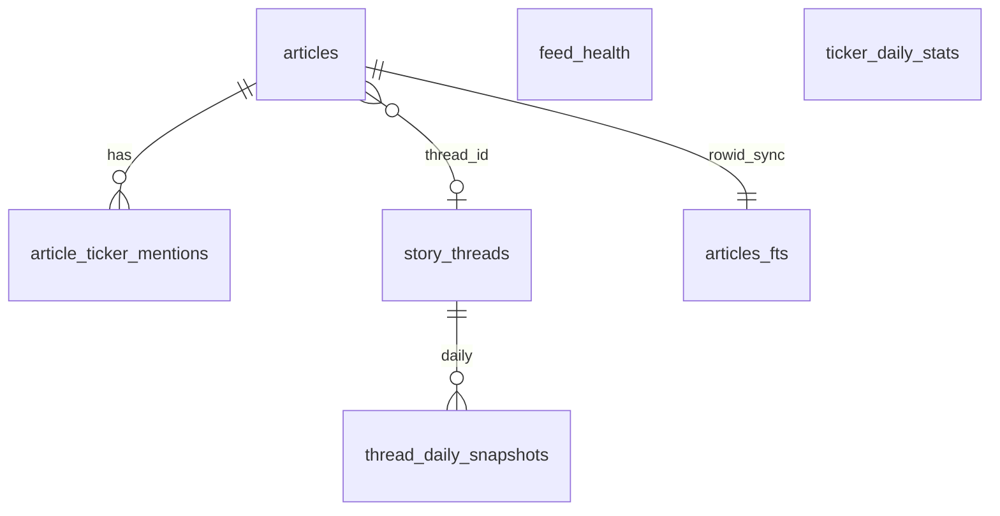

# News Derived Tables — Schema & Deep Research Guide

SQLite database for the news pipeline. All tables live in a **single file**:

```
vinu-news/vinu_news/analysis/data/news.db
```

Schema source of truth: [`vinu-news/vinu_news/analysis/storage/schema.sql`](../vinu-news/vinu_news/analysis/storage/schema.sql).

Related docs:
- Architecture and modules: [`complete_guide_news_analysis.md`](complete_guide_news_analysis.md)
- What's still missing: [`news_componete_still_missing.md`](../news_componete_still_missing.md)

---

## 1. Introduction

### Base vs derived

| Layer | Tables | Meaning |
|-------|--------|---------|
| **Base** | `articles`, `article_ticker_mentions` | One row per **lead** headline saved to DB |
| **Derived** | `story_threads`, `thread_daily_snapshots`, `ticker_daily_stats` | Rolled up from persist events (including thread matches that skip new article rows) |
| **Ops** | `feed_health` | RSS poll reliability |
| **Search** | `articles_fts` | FTS5 virtual table synced via triggers |

### News-only analytics

All tables below are built from **news articles only**. There is no OHLCV or price data. To correlate news intensity with market moves, join externally.

### How rows get written

Ingestion calls `persist_leads()` in [`vinu-news/vinu_news/analysis/storage/persist.py`](../vinu-news/vinu_news/analysis/storage/persist.py) after `process_batch()` returns lead articles.

---

## 2. Entity-relationship overview



---

## 3. Master table catalog

| Table | Type | Populated by | Primary research use |
|-------|------|--------------|----------------------|
| `articles` | base | `persist_leads` INSERT | Headlines, sentiment, FTS join |
| `article_ticker_mentions` | junction | `upsert_article` on insert | Per-ticker dominance queries |
| `story_threads` | derived | new thread / thread bump | Story span, active days, coverage count |
| `thread_daily_snapshots` | rollup | every persist event on a thread | Daily intensity, sentiment mix per story |
| `ticker_daily_stats` | rollup | every persist event with a ticker | Ticker news volume by day |
| `feed_health` | ops | `update_feed_health` each poll | Source reliability, latency |
| `articles_fts` | virtual FTS5 | triggers on `articles` | Keyword search (`MATCH`) |

---

## 4. Per-table reference

### 4.1 `articles`

**Purpose:** Store **lead** headlines only. Non-leads are dropped in-batch during post-processing; cross-batch duplicates may skip insert but still update thread rollups.

| Column | Type | Meaning |
|--------|------|---------|
| `id` | TEXT PK | SHA256 of `link` (stable article id) |
| `headline` | TEXT | Original RSS headline (not synonym-normalized) |
| `summary` | TEXT | HTML-stripped, max 300 chars |
| `source` | TEXT | Feed source label (e.g. REUTERS, AP) |
| `link` | TEXT | Canonical article URL |
| `sort_ts` | INTEGER | Unix seconds (UTC) from `pubDate` |
| `region` | TEXT | US, EU, GLOBAL, etc. |
| `tier` | INTEGER | Feed tier 1–4 (1 = highest quality) |
| `category` | TEXT | EARNINGS, MARKETS, ECONOMIC, etc. |
| `priority` | TEXT | FLASH, URGENT, BREAKING, ROUTINE |
| `sentiment` | TEXT | BULLISH, BEARISH, NEUTRAL |
| `sentiment_score` | INTEGER | Signed net keyword score |
| `impact` | TEXT | HIGH, MEDIUM, LOW |
| `tickers` | TEXT | JSON array string, max 5 tickers |
| `lang` | TEXT | Detected language code |
| `threat_level` | TEXT | Critical, High, Medium, Low |
| `threat_cat` | TEXT | Cyber, Regulatory, Geopolitical, etc. |
| `threat_conf` | REAL | Threat confidence 0.0–1.0 |
| `source_flag` | INTEGER | 0=trusted, 1=caution, 2=state media |
| `entities_json` | TEXT | JSON: `{"people": [...], "countries": [...]}` |
| `cluster_id` | TEXT | In-batch duplicate group hash |
| `is_lead` | INTEGER | Always 1 for stored rows |
| `thread_id` | TEXT | FK to `story_threads.thread_id` |

**Indexes:** `sort_ts`, `source+sort_ts`, `impact+sort_ts`, `cluster_id`, `thread_id`, `link`

**When rows appear:** Only on **new story** persist (not on thread match or duplicate URL skip).

**Python helpers:**
- `get_news_for_ticker(ticker, start_ts, end_ts, limit)`
- `get_news_for_date(date_str, limit)` — UTC calendar day
- `get_high_impact(since_ts, sentiment, limit)`
- `search_articles(query, limit)` — via FTS join
- `link_exists(link)` — URL dedup check

---

### 4.2 `article_ticker_mentions`

**Purpose:** Junction table for per-ticker dominance (extension beyond Fincept flat ticker list).

| Column | Type | Meaning |
|--------|------|---------|
| `id` | TEXT PK | `{article_id}:{ticker}` hash |
| `article_id` | TEXT FK | References `articles.id` |
| `ticker` | TEXT | Uppercase symbol (AAPL, MSFT, …) |
| `dominance` | REAL | 0.0–1.0, sums to 1.0 per article |
| `is_primary` | INTEGER | 1 = dominant ticker for the headline |

**When rows appear:** On article INSERT via `upsert_article`.

**Query pattern:**
```sql
SELECT a.headline, a.sentiment, m.dominance, m.is_primary
FROM article_ticker_mentions m
JOIN articles a ON a.id = m.article_id
WHERE m.ticker = 'AAPL'
ORDER BY a.sort_ts DESC
LIMIT 20;
```

---

### 4.3 `story_threads`

**Purpose:** Cross-batch story identity — track when a narrative started, how long it ran, how much coverage it received.

| Column | Type | Meaning |
|--------|------|---------|
| `thread_id` | TEXT PK | SHA256 of norm_text + ticker + sort_ts on create; reused on match |
| `first_seen_at` | INTEGER | Unix ts when thread was first created |
| `last_seen_at` | INTEGER | Unix ts of most recent persist event |
| `article_count` | INTEGER | Increments on thread match; not on duplicate URL only |
| `lead_headline` | TEXT | Headline from first lead article |
| `dominant_ticker` | TEXT | Primary ticker or NULL |
| `entities_json` | TEXT | NER snapshot from first article |
| `category` | TEXT | Category from first article |
| `last_article_id` | TEXT | Article id of first lead |
| `norm_text` | TEXT | Synonym-normalized text for cross-batch matching |

**Computed metrics:**
```sql
-- Days active (calendar-agnostic span)
(last_seen_at - first_seen_at) / 86400.0 AS days_active
```

**When updated:**
| Event | `article_count` | `last_seen_at` |
|-------|-----------------|----------------|
| New story | set to 1 | set to article ts |
| Thread match | +1 | max(existing, new ts) |
| Duplicate URL | unchanged | max(existing, new ts) |

**Python helpers:** `get_thread(thread_id)`, `get_active_threads(since_ts, limit)`

---

### 4.4 `thread_daily_snapshots`

**Purpose:** Daily rollup of news **intensity** and **sentiment mix** per story thread (UTC dates).

| Column | Type | Meaning |
|--------|------|---------|
| `thread_id` | TEXT | FK to `story_threads` |
| `date` | TEXT | `YYYY-MM-DD` UTC from article `sort_ts` |
| `article_count` | INTEGER | Persist events that day on this thread |
| `bullish_count` | INTEGER | Articles with sentiment BULLISH |
| `bearish_count` | INTEGER | Articles with sentiment BEARISH |
| `neutral_count` | INTEGER | Articles with sentiment NEUTRAL |
| `flash_count` | INTEGER | Articles with priority FLASH |

**Primary key:** `(thread_id, date)`

**Computed metrics:**
```sql
bullish_count * 1.0 / NULLIF(article_count, 0) AS bull_ratio
```

**Important:** Counts increment even when no new `articles` row is inserted (thread match or duplicate URL still upserts snapshot).

**Python helper:** `get_thread_timeline(thread_id)`

---

### 4.5 `ticker_daily_stats`

**Purpose:** Per-ticker daily rollup — how much news, sentiment skew, top thread that day.

| Column | Type | Meaning |
|--------|------|---------|
| `ticker` | TEXT | Uppercase symbol |
| `date` | TEXT | `YYYY-MM-DD` UTC |
| `article_count` | INTEGER | Persist events mentioning ticker as primary |
| `bullish_count` | INTEGER | BULLISH events |
| `bearish_count` | INTEGER | BEARISH events |
| `neutral_count` | INTEGER | NEUTRAL events |
| `top_thread_id` | TEXT | Last thread_id written that day (not necessarily highest volume) |

**Primary key:** `(ticker, date)`

**Python helper:** `get_ticker_daily_stats(ticker, start_date, end_date)`

---

### 4.6 `feed_health`

**Purpose:** Track RSS feed reliability after each poll cycle.

| Column | Type | Meaning |
|--------|------|---------|
| `feed_id` | TEXT PK | From `feeds.yaml` id |
| `last_success_at` | INTEGER | Unix ts of last successful poll |
| `last_failure_at` | INTEGER | Unix ts of last failure |
| `fail_streak` | INTEGER | Consecutive failures (reset on success) |
| `total_polls` | INTEGER | Lifetime poll count |
| `total_failures` | INTEGER | Lifetime failure count |
| `avg_latency_ms` | REAL | Rolling average on successful polls |
| `last_error` | TEXT | e.g. `timeout`, `empty_feed`, `html_cloaking_detected` |

**Populated by:** [`vinu-news/vinu_news/rss/storage/feed_health.py`](../vinu-news/vinu_news/rss/storage/feed_health.py)

---

### 4.7 `articles_fts` (virtual)

**Purpose:** Full-text search on headline + summary (Fincept §7 pattern).

- Tokenizer: `porter unicode61`
- External content table: `articles` (synced via INSERT/UPDATE/DELETE triggers)
- Initialized in [`vinu-news/vinu_news/analysis/storage/fts.py`](../vinu-news/vinu_news/analysis/storage/fts.py)

**Query syntax (FTS5 MATCH):**
```sql
SELECT a.* FROM articles a
JOIN articles_fts ON a.rowid = articles_fts.rowid
WHERE articles_fts MATCH 'Powell AND rates'
ORDER BY rank
LIMIT 20;
```

**Python:** `repo.search_articles("Powell AND rates")`

---

## 5. Persist → table effects matrix

| Event | `articles` | `story_threads` | `thread_daily_snapshots` | `ticker_daily_stats` |
|-------|------------|-----------------|--------------------------|----------------------|
| **New story** | INSERT | INSERT | UPSERT | UPSERT (if primary ticker) |
| **Thread match** | skip | count++, last_seen | UPSERT | UPSERT |
| **Duplicate URL** | skip | last_seen only | UPSERT | UPSERT |

Decision flow in `persist_leads()`:

1. If `link_exists(link)` → skip insert; bump thread if known; update snapshots
2. Else if `find_matching_thread()` → skip insert; increment thread count; update snapshots
3. Else → insert article + new thread + snapshots

---

## 6. Deep research playbooks

### Playbook A — Story lifecycle

**Goal:** When did a story start? How many days active? Is it fading?

**SQL:**
```sql
SELECT
    thread_id,
    lead_headline,
    dominant_ticker,
    article_count,
    datetime(first_seen_at, 'unixepoch') AS first_seen,
    datetime(last_seen_at, 'unixepoch') AS last_seen,
    (last_seen_at - first_seen_at) / 86400.0 AS days_active
FROM story_threads
WHERE last_seen_at >= strftime('%s', 'now', '-7 days')
ORDER BY article_count DESC;
```

**Python:**
```python
from vinu_news.analysis.storage.repository import NewsRepository
import time

since = int(time.time()) - 7 * 86400
with NewsRepository() as repo:
    threads = repo.get_active_threads(since)
    for t in threads[:10]:
        timeline = repo.get_thread_timeline(t["thread_id"])
        print(t["lead_headline"], timeline)
```

**Interpretation:**
- High `article_count` + recent `last_seen_at` → hot ongoing story
- Flat `thread_daily_snapshots.article_count` trailing off → fading narrative

---

### Playbook B — Ticker news intensity

**Goal:** Is AAPL getting abnormal coverage? Mostly bullish or bearish?

**SQL:**
```sql
SELECT
    date,
    article_count,
    bullish_count,
    bearish_count,
    ROUND(bullish_count * 1.0 / NULLIF(article_count, 0), 2) AS bull_ratio
FROM ticker_daily_stats
WHERE ticker = 'AAPL'
  AND date >= date('now', '-30 days')
ORDER BY date;
```

**Python:**
```python
with NewsRepository() as repo:
    stats = repo.get_ticker_daily_stats("AAPL", "2026-06-01", "2026-06-30")
    articles = repo.get_news_for_ticker("AAPL", limit=50)
```

**Interpretation:** Spike in `article_count` vs prior days → elevated news flow; `bull_ratio` shift → narrative tone change.

---

### Playbook C — Macro narrative (Powell / rates)

**Goal:** Find rate-related threads and track sentiment over days.

**Step 1 — FTS search:**
```python
hits = repo.search_articles("Powell AND rates")
thread_ids = {h["thread_id"] for h in hits if h["thread_id"]}
```

**Step 2 — Timeline per thread:**
```python
for tid in thread_ids:
    print(repo.get_thread(tid))
    print(repo.get_thread_timeline(tid))
```

**Interpretation:** Compare `bullish_count` vs `bearish_count` day-over-day on same `thread_id` for narrative flip detection (rule-based, not LLM).

---

### Playbook D — Source quality

**Goal:** Which feeds are failing or slow?

**SQL:**
```sql
SELECT feed_id, fail_streak, total_failures, total_polls,
       ROUND(avg_latency_ms, 0) AS avg_ms, last_error
FROM feed_health
WHERE fail_streak > 0 OR total_failures > 0
ORDER BY fail_streak DESC, total_failures DESC;
```

**Interpretation:** High `fail_streak` → investigate URL or disable feed in `feeds.yaml`; high `avg_latency_ms` → consider timeout tuning.

---

### Playbook E — Entity-driven research

**Goal:** Find articles mentioning Jerome Powell or China (CN).

**SQL (JSON text search — simple):**
```sql
SELECT headline, source, datetime(sort_ts, 'unixepoch') AS pub
FROM articles
WHERE entities_json LIKE '%Jerome Powell%'
ORDER BY sort_ts DESC
LIMIT 50;
```

**Python (preferred):**
```python
import json
with NewsRepository() as repo:
    rows = repo.search_articles("Powell")
    for r in rows:
        entities = json.loads(r["entities_json"])
        if "Jerome Powell" in entities.get("people", []):
            print(r["headline"])
```

---

## 7. SQL cookbook

```sql
-- Articles for one UTC day
SELECT headline, source, sentiment, impact
FROM articles
WHERE sort_ts >= strftime('%s', '2026-06-29')
  AND sort_ts <  strftime('%s', '2026-06-30')
ORDER BY sort_ts DESC;

-- HIGH impact bullish since timestamp
SELECT headline, source, sort_ts
FROM articles
WHERE impact = 'HIGH' AND sentiment = 'BULLISH'
  AND sort_ts >= strftime('%s', 'now', '-1 day')
ORDER BY sort_ts DESC;

-- Join article to thread metadata
SELECT a.headline, a.sentiment, t.lead_headline, t.article_count
FROM articles a
JOIN story_threads t ON a.thread_id = t.thread_id
WHERE a.thread_id IS NOT NULL
ORDER BY a.sort_ts DESC
LIMIT 20;

-- Peak day for a thread
SELECT date, article_count, bullish_count, bearish_count
FROM thread_daily_snapshots
WHERE thread_id = ?
ORDER BY article_count DESC
LIMIT 1;

-- FTS phrase search
SELECT a.headline FROM articles a
JOIN articles_fts ON a.rowid = articles_fts.rowid
WHERE articles_fts MATCH '"Federal Reserve" AND rates'
ORDER BY rank;
```

---

## 8. Python API reference

All methods on `NewsRepository` ([`repository.py`](../vinu-news/vinu_news/analysis/storage/repository.py)):

| Method | Returns | Use |
|--------|---------|-----|
| `link_exists(link)` | bool | URL dedup check |
| `get_thread_id_for_link(link)` | str \| None | Thread for existing URL |
| `upsert_article(enriched)` | bool | Low-level insert (tests) |
| `upsert_batch(list)` | int | Legacy batch insert |
| `get_active_threads(since_ts, limit)` | list[dict] | Recent stories |
| `get_thread(thread_id)` | dict \| None | Thread metadata |
| `get_thread_articles(thread_id, limit)` | list[dict] | Articles in thread |
| `get_thread_timeline(thread_id)` | list[dict] | Daily snapshots |
| `get_ticker_daily_stats(ticker, start, end)` | list[dict] | Ticker rollups |
| `search_articles(query, limit)` | list[dict] | FTS5 search |
| `get_news_for_ticker(ticker, start_ts, end_ts, limit)` | list[dict] | Ticker news |
| `get_news_for_date(date_str, limit)` | list[dict] | UTC day filter |
| `get_high_impact(since_ts, sentiment, limit)` | list[dict] | HIGH impact filter |

**Persist layer** ([`persist.py`](../vinu-news/vinu_news/analysis/storage/persist.py)):

```python
from vinu_news.analysis.storage.persist import persist_leads, PersistResult

result: PersistResult = persist_leads(repo, leads)
# result.inserted, url_skipped, thread_matched_skipped,
# threads_created, threads_updated
```

---

## 9. Limits and caveats

| Topic | Limit |
|-------|-------|
| **Batch vs cross-batch dedup** | In-batch cosine dedup runs in memory; cross-batch only at persist via thread matcher (48h lookback, threshold 0.30) |
| **Snapshot vs article rows** | `thread_daily_snapshots.article_count` can exceed count of rows in `articles` for that thread (matches without insert still count) |
| **Sentiment** | Rule-based keyword scoring — not market ground truth |
| **Dates** | All snapshot dates are **UTC** from article `sort_ts` |
| **top_thread_id** | Last thread written that day, not computed "biggest story" |
| **OHLCV** | Not in this database — join price data externally for market reaction studies |
| **Non-lead articles** | Syndicated duplicates in same poll are dropped before persist; not stored |

---

## 10. Future tables (not built)

See [`news_componete_still_missing.md`](../news_componete_still_missing.md):

| Table | Purpose |
|-------|---------|
| `news_analysis` | LLM deep analysis cache per URL |
| `ticker_summaries` | LLM daily digest per ticker |
| OHLCV join | External price data correlation |
