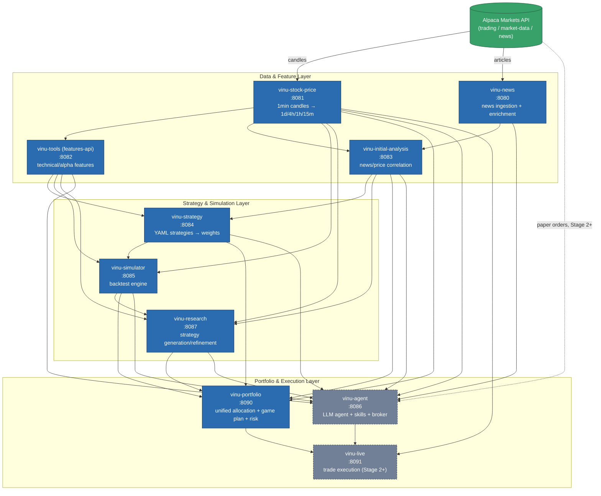

# System Architecture

Definition-phase reference diagram — reflects `vinu-components/docker-compose.yml`
as of 2026-07-31. See [full-plan.md](full-plan.md) for the validation plan
this supports, and [scope-responsibilities/](scope-responsibilities/) for
per-component detail.

## Service dependency graph

**Legend:** blue = in scope for Stage 1 (historical validation, this
document's focus). Grey/dashed = Stage 2+ only (paper/live trading),
explicitly deferred. Green = external data source.

## Stage 1 execution flow (historical simulation)

```mermaid
sequenceDiagram
    participant U as Operator
    participant SP as vinu-stock-price
    participant FT as vinu-tools
    participant NW as vinu-news
    participant IA as vinu-initial-analysis
    participant ST as vinu-strategy
    participant SM as vinu-simulator
    participant RS as vinu-research
    participant PF as vinu-portfolio

    U->>SP: fetch 1min candles (2022-01-01 to 2026-06-30)
    SP->>SP: aggregate to 1d / 4h / 1h / 15m
    U->>NW: fetch historical news (best-effort coverage)
    par Feature & correlation prep
        FT->>SP: request candles
        FT->>FT: compute technical/alpha features
        IA->>NW: request articles
        IA->>SP: request candles
        IA->>IA: compute correlation/impact
    end
    U->>ST: evaluate strategy YAMLs (easy / medium / complex)
    ST->>FT: request features
    ST->>IA: request correlation context
    ST-->>U: target weights per rebalance point
    U->>SM: POST /simulate (per strategy)
    SM->>ST: fetch weights
    SM->>SP: fetch prices
    SM-->>U: Sharpe, drawdown, win rate, Calmar, baseline comparison
    U->>RS: complex-tier strategy generation (LLM-assisted)
    RS->>FT: features
    RS->>SM: backtest candidate
    RS-->>U: strategy artifact recorded
    U->>PF: historical-simulate --days N
    PF->>ST: fetch strategies
    PF->>SP: fetch returns
    PF-->>U: unified allocation result (risk-parity + regime tilt only)
    Note over U,PF: Stage 1 output: real Sharpe/drawdown/win-rate numbers,<br/>go/no-go input for Stage 2
```

## Notes on scope boundaries

- `vinu-live` and `vinu-agent`'s broker layer are drawn but **not
  exercised** in Stage 1 — see
  [scope-responsibilities/vinu-live.md](scope-responsibilities/vinu-live.md)
  and
  [scope-responsibilities/vinu-agent.md](scope-responsibilities/vinu-agent.md).
- The dependency arrows mirror `docker-compose.yml`'s `depends_on` chains
  exactly — this is the real current topology, not an aspirational one.
- `vinu-portfolio` is drawn as calling `vinu-stock-price`,
  `vinu-strategy`, `vinu-simulator`, `vinu-initial-analysis` directly (per
  its `config.py`), on top of the docker-compose `depends_on` set
  (`strategy-api`, `research-api`, `simulator-api`) — the extra edges
  reflect what its code actually calls at runtime, not just container
  startup ordering.
