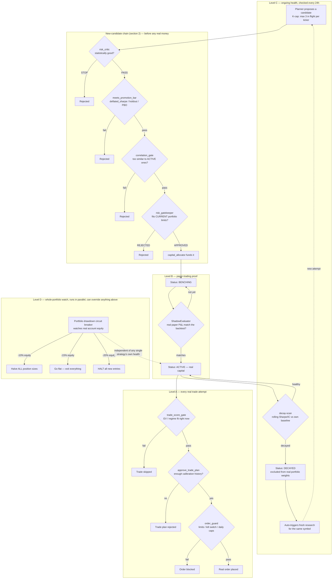

# Strategy enhancer — detailed explanation

Everything in this file was verified against real code on 2026-09-21,
during a live end-to-end test run of the system (main docker-compose
stack + a local qwen3.5-4B LLM), not designed from assumptions. Every
file/line cited was actually read.

## 1. What the K-cap is, and the real bug in it

**What it's for**: `K_CAP_DEFAULT = 3`
(`vinu-agent/vinu_agent/agent/thesis_intake_gate.py:21`) limits how many
distinct trade-candidate ideas the Planner will let exist "in flight" for
one ticker at once. It's a safety brake — without it, if a ticker looks
interesting, the system could keep proposing candidate after candidate
for it indefinitely. The intent (confirmed by the code's own comment,
"Provisional, not tuned") is a *live, resettable* limit: 3 ideas at a
time, not 3 ideas ever.

**The real bug, found live**: `planner_triage_hook.py`'s check
(`PlannerTriage.check()`, line ~103) calls:
```python
count = self._ticker_ledger.count_events(ticker, event_type=CANDIDATE_PROPOSED_EVENT_TYPE)
```
`count_events()` (`vinu-agent/vinu_agent/storage/ticker_ledger.py:181`)
supports an optional `since:` parameter specifically for scoping the
count to a rolling time window — but this call site never passes it. So
the count is **all-time, lifetime**, with no reset. Confirmed against a
real ticker (AAPL): it had exactly 3 `candidate_proposed` events on its
ledger, all from **2026-09-08** (13 days before this was found), and
the Planner has been silently skipping it ever since with the message
`"ticker at distinct-candidate cap (3/3) this cycle"` — a message that's
itself misleading, since nothing about the check is actually scoped to
"this cycle."

**Consequence**: once a ticker accumulates 3 lifetime proposals — whether
they were rejected, expired, or successful — the Planner will **never**
propose a new one for it again. Silently. This is very likely not the
intended behavior; it directly contradicts the cap's own name
("distinct-candidate cap... this cycle") and its evident design intent
(a live rate limit, not a permanent ban).

## 2. The real evaluation/rejection chain — where strategy quality is actually judged

Traced live, in the order a strategy artifact actually passes through
them. There are (at least) **7** real steps, not the 6 first guessed at
before a `correlation_gate.py` was found on a second pass — worth
keeping in mind that this list may still not be fully exhaustive; it
reflects two focused search passes, not an exhaustive audit.

| # | Step | File | Kind | What it actually checks |
|---|---|---|---|---|
| 1 | `risk_critic` | `vinu-agent/teams/research/agents/risk_critic/prompt.md` | LLM specialist | **This is where "is the strategy good" is judged.** Reviews backtest metrics (Sharpe, drawdown, win rate, trade count) + statistical validation (Monte Carlo, bootstrap, walk-forward). Hard rules: trade count under ~20 is an automatic STOP regardless of metrics; failed statistical validation is a STOP even with a good Sharpe. |
| 2 | `meets_promotion_bar()` | `vinu-research/vinu_research/promotion.py:30` | Deterministic | BENCHING → ACTIVE/MONITORING gate. Checks `deflated_sharpe` above a config threshold, an out-of-sample holdout pass, and PBO (Probability of Backtest Overfitting) below a threshold. Pure math, no LLM judgment. |
| 3 | `check_correlation_gate()` | `vinu-research/vinu_research/gates/correlation_gate.py` | Deterministic | Is the candidate too correlated with strategies already ACTIVE? Returns `CorrelationVerdict(eligible: bool, avg_correlation, max_correlation, ...)` with real per-strategy correlation numbers. |
| 4 | `risk_gatekeeper` | `vinu-agent/teams/risk_gatekeeper/manager_prompt.md` | LLM team | **Not a quality check.** Its own prompt states this explicitly: *"not whether the strategy is good (research's own risk_critic already decided that), only whether it fits within real risk limits right now."* Checks portfolio exposure/concentration against the CURRENT real positions. Also computes `approved_size`. |
| 5 | `capital_allocator` | `vinu-agent/vinu_agent/cli.py` (`capital-allocator-worker`) | Deterministic worker | Funds PEND artifacts on its own batched cadence, decides real dollar sizing. |
| 6 | `trade_score_gate` | `vinu-research/vinu_research/gates/trade_score_gate.py` | Deterministic | A separate, per-trade-plan-authoring check (not artifact-level) — evaluated fresh each time a trade plan is actually generated for a symbol. |
| 7 | `order_guard` | `vinu-agent/vinu_agent/broker/order_guard.py` | Deterministic | The final, real-time gate immediately before an order is placed — symbol limits, kill switch, daily order caps, etc. |

## 3. Whether rejection reasoning is actually saved anywhere — the real, mixed state

This matters directly for the "strategy enhancer" idea in section 7: you
can't learn from a rejection whose reason was never recorded.

- **`risk_gatekeeper` REJECTED**: reason **is** durably saved.
  `risk_gatekeeper_hook.py:63-74` writes a real `TickerLedger` row
  (`event_type="REJECTED"`, `text=<the LLM's stated reason>`,
  `ref_id=artifact_id`) — confirmed by reading the actual write call.
- **`meets_promotion_bar()` rejected (`verdict.eligible == False`)**:
  reason is **only printed to the CLI's stdout**
  (`vinu-research/vinu_research/cli.py:713`,
  `print(f"    -> hold: {'; '.join(verdict.reasons)}")`) — confirmed
  nothing writes `verdict.reasons` to any table. **The moment that CLI
  command's process ends, the reason is gone.** Real gap, would need a
  new writer.
- **`risk_critic` STOP reasoning**: used live within the *same* research
  loop run (`vinu-research/vinu_research/loop.py:450-465`) to iteratively
  refine the strategy across iterations of that one run
  (`self._suggestion_results`) — not confirmed to persist anywhere a
  later, separate process (like a future candidate-generation prompt)
  could read back. Likely also needs a new writer, not yet checked in
  as much depth as the other two.
- **`correlation_gate`/`trade_score_gate`/`order_guard` rejections**: not
  checked for persistence in this pass — flagged, not guessed at.

## 4. What happens *after* a strategy goes live — three more real mechanisms, at three different levels

Section 2's 7 steps only cover a **new candidate's** path up to getting
real money (CREATED → ... → ACTIVE). Once a strategy is actually trading,
there are **three separate, real "hold/pause" mechanisms**, each
watching a different scope. Found live, 2026-09-21, while checking every
service's real scheduled background workers (`grep`'d every
`entrypoint.sh` in the repo, then read each worker's real code — not
assumed from a name).

### Level A — one trade plan (narrowest, checked every single time)

**`trade_plan_approval_worker`** → `vinu_research.trade_plan_authoring.
approve_trade_plan()`. Fail-closed: a specific trade plan about to
execute is rejected if there isn't enough real calibration history to
trust it yet — even if the strategy behind it is already ACTIVE.

*Situation*: an ACTIVE strategy generates a trade plan for a symbol it
hasn't traded much yet. Not enough calibration history exists to
statistically back this specific plan → rejected, no order placed, even
though the strategy itself is fine.

### Level B — one strategy's real-vs-backtest match, before real money ever touches it

**`ShadowEvaluator`** (`vinu-live/vinu_live/shadow_evaluator.py`).
Compares real **paper-trading** P&L against what the backtest predicted.
A strategy sits in BENCHING — held, not yet promoted — until paper
performance actually matches. This belongs in section 2's chain too,
missed on the first pass: it's effectively step 2.5, between the
promotion bar and real capital.

*Situation*: a strategy clears `risk_critic`, `meets_promotion_bar()`,
and `correlation_gate` on paper — good backtest stats. It starts paper
trading. Real paper P&L comes in noticeably worse than the backtest
predicted → it never gets promoted to ACTIVE. It just stays in BENCHING
indefinitely, correctly held, until (or unless) it starts matching.

### Level C — one strategy's *ongoing* health once it's already live

**`decay-scan`** (`vinu-research schedule-decay --interval-hours 24`,
real automatic background loop, confirmed in `research-api`'s startup
script). Watches every ACTIVE/MONITORING strategy's rolling Sharpe/IC/IR
against its own historical baseline.

*Situation*: a strategy has been ACTIVE and trading real money for
months, performing fine. Market conditions shift and its edge decays →
`decay-scan`'s next 24-hour check marks it DECAYED → `vinu-portfolio`
only ever pulls `ArtifactStatus.ACTIVE` artifacts for real weight
computation, so a DECAYED strategy is automatically excluded from real
capital the moment it's marked, not just labeled. **And then it
auto-triggers fresh research for that same symbol** — a real, already-
working precedent for "failure → automatically try again," just for
decay, not (yet) for a K-cap rejection.

### Level D — the whole portfolio, watched in parallel, can override everything

**Portfolio drawdown circuit breaker**
(`vinu-portfolio/vinu_portfolio/circuit_breakers.py` +
`drawdown_scheduler.py`). Not about any one strategy — watches the
**whole account's real equity**, continuously, independent of how any
individual strategy is doing. A graduated ladder, not one on/off switch:

| Drawdown | Action |
|---|---|
| -10% | Halve **all** position sizes, portfolio-wide |
| -15% | Go flat — exit everything |
| -20% | HALT all new entries (real kill switch, via `agent-api`'s `/broker/halt`) |

*Situation*: several strategies are individually fine on paper (none
DECAYED, none hit their own limits), but a broad market move drags the
whole account's equity down 12% in a short window → this trips
independently of any per-strategy check, halves every position size
immediately, regardless of which individual strategies caused it.

### Why the levels matter for the enhancer idea

These three are already real, live "hold on degradation, react
automatically" mechanisms — the strategy-enhancer idea in section 7 is
proposing a **fourth**, for the *pre-ACTIVE* K-cap-rejection case
specifically. Level C (decay-scan's auto-retrigger) is the closest
existing precedent and worth reusing the shape of, not reinventing.

## 5. Is any of this actually unbypassable? — verified for the one that matters most

A fair follow-up question: even with 10 real checks documented above, if
one gets missed or has a bug, does anything *actually* stop a bad order
from executing, or is it just hope? Checked for real, not asserted —
this is the most important one to get right, since it's the difference
between "should this be considered" and "does money actually move."

**Traced every real caller of the broker's `submit_order()` across the
whole codebase.** There is exactly **one** file that calls it:
`vinu-agent/vinu_agent/tools/trade_tool.py` (2 call sites). Both are
preceded by `OrderGuard.check(...)`, and the result is genuinely
enforced, not just logged:

```python
result = guard.check(symbol, side, qty, ...)
if not result and not needs_reauth:
    AuditLogger.log("order_rejected", {...})
    return json.dumps({"status": "rejected", ...})   # real early return
```

**Every other real caller is forced through the same file.** The HTTP
endpoint `/broker/order` (`vinu-agent/vinu_agent/server/routes_broker.py:273`)
carries an explicit comment confirming this was deliberate:

> *"Any caller that needs to place a live order (vinu-live's scheduler
> included) goes through this, not a direct `AlpacaBroker.submit_order()`
> call, so the safety layer can't be silently bypassed by a second code
> path."*

**Conclusion, verified not assumed**: for real order placement
specifically, the guardrail is structurally unbypassable — even if
something upstream (risk_critic, ShadowEvaluator, decay-scan, whatever)
gets missed or fooled, no code path exists that reaches the real broker
without passing through `OrderGuard`.

**Honest limit of this check**: this proof only covers order placement.
The same "is it structurally unbypassable, or just usually-called" trace
has **not** been done yet for the portfolio drawdown circuit breaker or
decay-scan — those are confirmed to exist and work, not confirmed
unbypassable the way order_guard now is.

**Also still open from the previous pass**: a broader filename sweep
(`*gate*.py`, `*guard*.py`, `*monitor*.py`, `*evaluator*.py`,
`*circuit*.py`, `*breaker*.py`, whole repo) turned up 3 more real,
unexamined files that may be additional relevant checks:
`vinu-agent/agent/rebalance_guard.py`, `vinu-live/trade_plan/guards.py`,
and `vinu-live/trade_plan/correlation_monitor_store.py` (a live-pair
correlation-drift watcher, distinct from `correlation_gate.py`'s
new-candidate check). Not yet read.

## 6. The full lifecycle, one diagram



## 7. The proposed "strategy enhancer" idea

Raised in conversation, 2026-09-21: since the K-cap is meant to hold 3
*live* candidate slots per ticker, a rejection at any of the 7 steps
above should:

1. **Free that ticker's K-cap slot immediately** — requires fixing the
   bug in section 1 (pass a real `since:` window, or explicitly clear/
   discount terminal-rejected events from the count) so a rejection
   actually opens a slot rather than permanently consuming one.
2. **Trigger the Planner to propose a new candidate for that freed slot
   right away** — rather than waiting for whatever the next unrelated
   cycle happens to pick up.
3. **Feed the new candidate's generation with two pieces of real
   context**:
   - The other 1-2 candidates still in flight for this ticker, so the
     new idea doesn't just duplicate them.
   - The most recent rejection's actual reason (once section 3's gaps
     are closed and that reasoning is durably saved), so the new idea
     is generated *knowing* what specifically failed and why — not a
     blind retry.
4. **A visible pass/fail table**: for each ticker, each of the 7 steps
   a candidate went through, whether it passed, and — if it didn't —
   the real recorded reason. This is the same data section 3 needs to
   exist durably; the table is a read view over it, not a new source of
   truth.

This turns rejection from a dead end into a real input: each failed
attempt should make the next one more informed, which is what makes
this a "strategy enhancer" rather than just a bug fix to the cap.

**Reuse, don't reinvent**: section 4's Level C (`decay-scan`'s
auto-retrigger of fresh research on DECAYED) is a real, already-working
version of step 2 above, just for a different trigger. The new work here
is steps 3 and 4 — feeding the new attempt real context instead of a
blind retry, and persisting the reasoning to feed it with — not the
"detect a problem, kick off a new attempt" plumbing itself, which
already has a working precedent to copy the shape of.

**Scope note**: this is a real, multi-part build, not a one-line fix.
The pieces, roughly in dependency order:
1. Fix the K-cap counting bug (section 1) — self-contained, fully
   understood already.
2. Add the missing durable rejection-reason writers (section 3) — at
   least for the promotion bar, likely also risk_critic; correlation
   gate/trade_score_gate/order_guard need checking too.
3. Build the pass/fail-with-reasoning table (a read view once #2 exists).
4. Build the actual "next candidate reads siblings + failure reasoning"
   generation logic — the real enhancer loop, and the piece with the
   most open design questions (exact prompt shape, how much history to
   feed in, how to avoid it becoming an unbounded context as rejections
   accumulate).

Nothing here has been implemented yet — this file documents the
diagnosis and the proposed direction as of 2026-09-21, for whoever picks
this up next.
