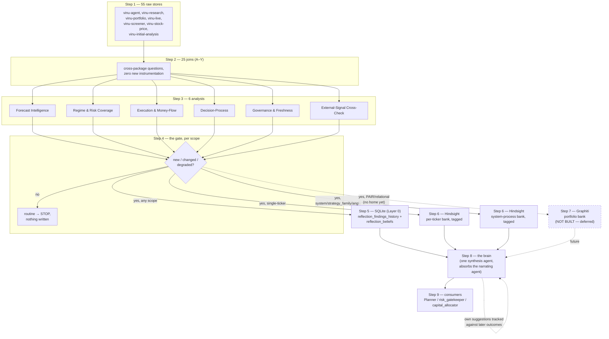

# The decided pattern: 55 stores → findings → memory → one brain

## Context

This is the settled, end-to-end narrative that came out of the
conversation following `25-A-Y-details/data-driven-analysis-opportunities.md`
(same folder), and three docs now relocated to
`personal-important/01-discussions-to-reach-conclusion/`:
`agents-implementation-plan.md`, `six-agents-critique-and-hindsight-memory-resolution.md`,
and `other-findings-methods.md`. Those four docs each cover one piece in
depth; this doc exists to walk the whole pipeline in one place, in plain
language, with a worked example — specifically to answer the question
"at which exact step does data reach Hindsight, and where does Graphiti
fit in" precisely, since that was the piece that needed a concrete
trace to actually land.

Like every doc in this folder: **this is the design**, and as of
2026-09-19 the first real slice of the implementation exists too --
`personal-important/01-discussions-to-reach-conclusion/agents-implementation-plan.md`'s
build order (Layer 0 → Decision-Process analyst → the rest → the brain)
has its first two steps done: Layer 0 (`vinu-infra/reflection.py`) plus
a real worker loop to run it, both living in their own `vinu-reflection`
service, not inside vinu-agent (`05-to-do.md` #5's 2026-09-19 update
explains why, and why moving it back later would be cheap if that turns
out to be the better call). **10 of the 25 analyses are built on top of
it**, one per cluster's easiest real slice plus the whole implementable
Decision-Process set — every remaining analysis was checked against real
code, not left unexamined. **For the full per-analysis status, why each
unbuilt one isn't, and where to continue, see
`25-A-Y-details/07-implementation-plan-status.md` — the single
reference for implementation status, kept current going forward instead
of this paragraph.**

## The 9 steps

1. **The raw material — 55 data points already on disk.** Every package
   (vinu-agent, vinu-research, vinu-portfolio, vinu-live, vinu-screener,
   vinu-stock-price, vinu-initial-analysis) already writes real data —
   forecasts, trade outcomes, risk checks, LLM call logs, screener
   rankings, ingest health, the earnings calendar. Cataloged in full in
   `project-understanding/05-full-recorded-information/README.md`. Today
   each package only reads its own tables — nothing joins across them.

2. **The joins — 25 analyses (A–Y).** Concrete questions, each one just
   a join across packages that doesn't happen today: "does a shaky LLM
   call predict a bad decision" (D), "does the screener's rank actually
   predict anything" (I), "do trades held through earnings lose more"
   (Y). No new instrumentation — every signal already exists.

3. **Grouping — 6 analysts.** The 25 questions cluster into 6 themes
   (forecasting, risk coverage, execution, decision-process, governance,
   external corroboration). Each becomes one small, non-LLM program —
   count real rows, compare to a threshold, write what's found — running
   on a schedule (daily/weekly), not per-decision.

4. **The gate — per scope, per cycle.** Each analyst's check runs once
   per thing-it's-scoped-to (per ticker, per pair, system-wide,
   whatever `scope_type` that analysis is). For each one: is this new,
   meaningfully changed, or degraded? If it's routine/unchanged —
   **stop, nothing gets written.** Most days, most tickers, produce
   nothing that passes this gate. That's the correct outcome, not a gap.

5. **SQLite (Layer 0) — the hard, always-trustworthy storage.** Only
   for what passed step 4: written to `reflection_findings_history`
   (raw, append-only, pruned over time like every other log in this
   system) and `reflection_beliefs` (the current-answer table — one row
   per analyst+topic, *overwritten* on update, not appended). This is
   the source of truth the brain can always fall back to.

6. **Hindsight (long-term memory) — same moment as step 5, not a later
   step.** If (and only if) a finding passed step 4's gate, it's *also*
   sent to Hindsight right then, into the relevant permanent bank,
   tagged by date/regime/source-analyst. Hindsight never gets the full
   daily output of every analyst — only what already cleared the
   significance bar. It refines its own internal belief per tag
   combination on its own; that's Hindsight's job, not something built
   by hand.

   **Three bank types, not one** — routed the same way as step 7 below,
   by the finding's own `scope_type`, never by which analyst wrote it:
   - `scope_type=ticker` → that ticker's own permanent bank (the TSLA
     example below).
   - `scope_type=ticker_pair` → the portfolio/correlation bank —
     structurally the same routing rule as Graphiti below, so today,
     before Graphiti exists, a pair finding goes to SQLite only (see
     the AAPL↔MSFT example below); once the portfolio bank is real,
     pair findings move there instead.
   - `scope_type=system` / `strategy_family` / `angle` → the
     **system-process bank** — one shared bank for every finding that
     isn't tied to a single ticker or a pair (D, K, L, M, N, F, O, and
     H's governance piece). This bank type is easy to lose track of
     because none of it is ticker-shaped, but it's a real, separate
     part of the resolved design, not an afterthought — a Decision-
     Process finding about LLM call quality belongs here, never
     invented as a fake "ticker" to force it into a per-ticker bank.

7. **Graphiti — reserved, not built, for one specific kind of finding.**
   See the dedicated section below — this is the step most worth
   tracing carefully, because it's the one piece of the pattern that
   doesn't have a real home yet.

8. **The brain — one synthesis agent.** Reads the current beliefs from
   Layer 0 (step 5) plus Hindsight's richer memory (step 6) across all
   6 clusters, and does what no single dumb analyst can: notice when
   two separate findings from *different* clusters are actually one
   story. It absorbs what was separately called the "narrating agent" —
   one seat, not two. It can only ever *suggest* — flag, propose a
   bounded nudge — never place an order or touch the kill switch.

9. **Consumers, and the brain earning trust in itself.** The brain's
   output (a maturity *profile* across 6 axes, not one scalar) feeds
   Planner's prompt, `risk_gatekeeper`'s decisions, `capital_allocator`'s
   `reserve_fraction` — each reading only the axis relevant to its own
   decision. The brain's own past suggestions get tracked against what
   actually happened afterward, and it only earns more influence once
   it has its own track record — the same discipline every calibration
   mechanism in this codebase already applies to everything else,
   applied here to the brain's confidence about itself.

## Where Graphiti actually comes in

This is the part that needed a concrete trace, so here it is precisely.

**The short version**: Graphiti never receives anything today, because
it isn't built. When it *is* built (a deliberately deferred, later
step — see `personal-important/01-discussions-to-reach-conclusion/other-findings-methods.md`), it only ever receives
**pair/relational** findings — never single-ticker findings, which
always go to Hindsight instead.

**Why the split**: a single-ticker finding ("TSLA's momentum strategy
degraded this week") is a narrative about *one thing* — Hindsight's
retain → consolidate → reflect pipeline is built for exactly that
shape. A pair/relational finding ("AAPL and MSFT's correlation climbed
for three weeks, then broke") is a fact about the *relationship between
two things*, changing over time — a graph edge with a validity window,
not a narrative about either ticker alone. That's Graphiti's native
shape, independently confirmed by it scoring 71.2% vs. Mem0's 49% on
LongMemEval's temporal-reasoning benchmark.

**The routing rule, concretely**: which analyst produced a finding
never decides where it goes — only the finding's own `scope_type` does.
Analyst **E** (Regime & Risk Coverage's correlation piece) can, in the
same cycle, write a single-ticker finding (→ Hindsight, per-ticker
bank) *and* a pair finding (→ would-be Graphiti, once it exists) — the
routing follows the fact, not the analyst that wrote it.

**Where a pair finding lives *today*, since Graphiti doesn't exist
yet**: SQLite only — `reflection_beliefs`, tagged `scope_type=ticker_pair`.
It has no long-term-memory home at all until the portfolio bank
(Graphiti) is actually built. This is a real, current gap, not an
oversight — explicitly deferred because there's no real correlation
history yet to justify standing up a second self-hosted database
(Neo4j/FalkorDB) for it.

**One hard rule, once Graphiti is built**: a pair fact (AAPL↔MSFT
correlation) gets written **once**, to the shared portfolio bank —
never duplicated into both AAPL's own bank and MSFT's own bank. Two
independent copies of the same fact, each subject to that bank's own
separate consolidation, would let the two banks drift toward different
"beliefs" about the identical correlation over time — the same
two-copies-of-the-truth risk the whole DB-as-source-of-truth
architecture already exists to avoid, just recreated inside memory
instead of the database.

## Diagram

## One worked example

Five tickers on the watchlist: **AAPL, MSFT, TSLA, NVDA, GOOGL**. The
**Regime & Risk Coverage** analyst (owns B, E, N, V) runs its weekly
cycle.

**Step 4, per ticker:**
- AAPL — nothing changed → stop.
- MSFT — nothing changed → stop.
- TSLA — this week's check shows TSLA's momentum strategy has quietly
  degraded in a high-vol regime. New, significant → **passes.**
- NVDA — nothing changed → stop.
- GOOGL — nothing changed → stop.

Only TSLA produced anything. Normal outcome.

**Steps 5 and 6, together, for TSLA only:**
- `reflection_beliefs`' TSLA row is updated (SQLite).
- The same finding is sent to **TSLA's own Hindsight bank**, tagged
  `regime=high_vol, source_analyst=regime_risk_coverage, date=...`.

**Same cycle, a different finding from the same analyst (its "E" —
correlation — piece):** AAPL and MSFT's correlation has been climbing
for three straight weeks. This is a *pair* fact, not a single-ticker
one → **passes the gate too**, but routes differently:
- `reflection_beliefs` gets a new row, `scope_type=ticker_pair,
  scope_key=AAPL|MSFT`.
- It does **not** go to Hindsight (not TSLA's bank, not a per-ticker
  bank at all — pair facts don't belong there).
- It does **not** go to Graphiti either — not built yet. Today, it has
  nowhere to go but SQLite. Once the portfolio bank exists, this exact
  finding is the shape that would move there instead.

**Same cycle, a third finding — this time from Decision-Process ("D"),
not Regime & Risk Coverage:** the `forecast_skill` LLM role's
retry-rejection delta moved outside its own trailing band this week.
This is a `scope_type=system` fact — not TSLA's, not a pair's — so it
routes to the third bank type:
- `reflection_beliefs` gets a new row, `scope_type=system,
  scope_key=llm_role:forecast_skill`.
- It's sent to the **system-process bank** — not TSLA's bank (this
  finding has nothing to do with TSLA specifically), not the portfolio
  bank (it's not a relational fact between two tickers). One shared
  bank for every finding shaped like this one.

**Step 8, next brain cycle:** the brain reads `reflection_beliefs` and
sees both the TSLA degradation and the AAPL/MSFT correlation climb in
the same window. Read separately, they're two findings. Read together —
which only the brain can do — they might be one story (e.g., a
regime-wide risk-off move touching correlated names at once). That
cross-cluster connection is exactly the thing no single analyst, and no
single SQLite row, could have surfaced on its own.

## Scope note

Like every doc in this folder: a design and a worked trace, not an
implementation. Nothing described here has been built.
