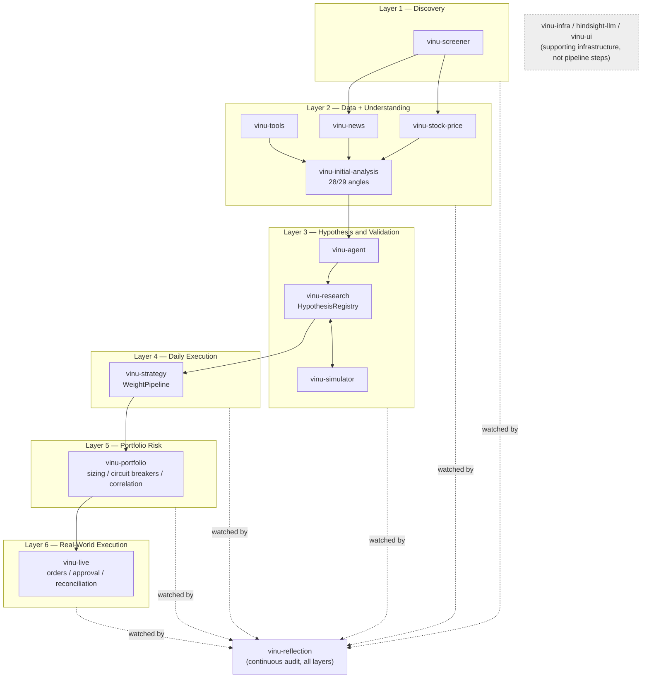

# The full system, layer by layer

**Status: this is a map of what exists, not a new design.** Every
component named here is real code in `vinu-components/`, checked
directly (file paths and real module contents cited below), not guessed
from names. Where something is only partially built or not fully traced
end-to-end, that's said explicitly rather than implied.

## The sequence

```
Layer 1: vinu-screener
Layer 2: vinu-stock-price, vinu-news, vinu-tools, vinu-initial-analysis
Layer 3: vinu-agent, vinu-research, vinu-simulator
Layer 4: vinu-strategy
Layer 5: vinu-portfolio
Layer 6: vinu-live
   (running alongside all six, not a step in the sequence: vinu-reflection)
   (infrastructure supporting every layer, not a step: vinu-infra, hindsight-llm, vinu-ui)
```

## Layer 1 — Discovery: `vinu-screener`

Produces the ticker list — the candidates worth looking at at all, before
any real analysis happens. Everything downstream operates on symbols
this layer surfaces (directly, or via the seed-list mechanism described
in `02-open-questions-strategy-and-simulation.md` item #16's "ticker
discovery" gap — see that item for the real caveat that Layer 3's actual
ticker source today is a locally-persisted, statically-seeded list, with
`vinu-screener` wired in only as an optional contributor to that seed,
not the live source of truth it should eventually be).

## Layer 2 — Data + Understanding: `vinu-stock-price`, `vinu-news`, `vinu-tools`, `vinu-initial-analysis`

This is where raw market reality becomes structured, computed
information:
- `vinu-stock-price` — the raw OHLCV bar data every other layer is built
  on top of.
- `vinu-news` — raw news/headline data, currently not wired into either
  Track (see item #9's news-confound flagging idea — a real gap, not
  yet connected to evidence).
- `vinu-tools` — the shared, real indicator-computation library (the 28
  real technical indicators the "52 indicators" in Track 1 are built
  from — see `../how-to-use-29th-angle/01-track1-how-it-works-today.md`). Every other layer that
  needs an indicator value should compute it here, once, correctly — the
  entire reason `06-mistake-duplicated-indicator-logic.md` mattered.
- `vinu-initial-analysis` — runs the 28 (now 29, including
  `signal_evidence`) angles over each ticker's bars, producing the
  computed analysis (regime classification, angle outputs, the Track 1
  must-condition recorder itself) that everything downstream reads.

**By the end of this layer, a ticker has been genuinely analyzed** — not
just priced, but understood across every angle the system knows how to
compute.

## Layer 3 — Hypothesis & Validation: `vinu-agent`, `vinu-research`, `vinu-simulator`

This is where the system decides **what's actually worth trusting**, not
just what's true right now. Confirmed as a real, working end-to-end path
by direct trace (see item #16 in `02-open-questions-strategy-and-simulation.md`
for the full citation trail):
- `vinu-agent` — the orchestration/tool-calling layer. Its
  `planner-worker` loop reads the ticker list, gates how many strategy
  candidates are already in flight per ticker (`K_CAP_DEFAULT = 3`), and
  hands qualifying tickers to the research team.
- `vinu-research` — `LlmStrategyGenerator` drafts candidate strategies
  (fed real Layer 2 output — `angle_context`/`feature_snapshot`, not a
  blind brainstorm), matches or creates a `Hypothesis` in
  `HypothesisRegistry`, and orchestrates the actual backtest call.
- `vinu-simulator` — runs the real backtest (via HTTP from
  `vinu-research`), returns real metrics, which flow back into the
  matched hypothesis's evidence trail.

**By the end of this layer, a strategy either has real, recorded evidence
behind it, or it's been rejected** — at least for the evidence stream
this specific loop produces (see the "three disconnected evidence
streams" note below — this is not the *only* place evidence gets
produced in this system, which is itself a real finding, not a design
choice).

## Layer 4 — Daily Execution of an Approved Strategy: `vinu-strategy`

Once a strategy has cleared Layer 3, `vinu-strategy`'s `WeightPipeline`/
`StrategyRegistry` (`vinu_strategy/service.py`) is what actually **runs**
it day to day: given the strategy's definition (`selection`/`allocation`/
`timing`/`risk` stages — see `03-strategy-definition-full-schema.md` for
what a complete definition should carry) plus today's features/
correlation data, it computes **today's target weight per symbol**. This
layer executes an already-validated recipe; it does not re-decide whether
the recipe is good — that judgment call belongs to Layer 3.

## Layer 5 — Portfolio-Level Risk: `vinu-portfolio`

Multiple strategies from Layer 4 each produce their own target weights.
`vinu-portfolio` is where those get reconciled into **one coherent,
risk-controlled portfolio**, not just summed:
- `sizing.py` — vol-targeting position sizing (see item #14's discussion
  of `vinu-simulator`'s equivalent `PositionSizer` classes; this is the
  live-side counterpart).
- `risk_budget.py` — capital allocation across strategies.
- `circuit_breakers.py`/`drawdown_scheduler.py` — throttles exposure
  after real losses (checked directly in item #14: this is NOT a
  drop-in for backtesting, since it's built for live polling against a
  running agent API, not a pure function — a real, flagged gap).
- `shock_correlation.py` — Gerber correlation, GARCH conditional
  variance, DCC shock correlation, to catch two strategies secretly
  making the same bet.

**By the end of this layer, a single set of final position sizes exists**
— the actual answer to "how much of what should we hold right now,"
accounting for every strategy at once, not one at a time.

## Layer 6 — Real-World Execution: `vinu-live`

The only layer that touches real money:
- `signal_translator.py` — turns Layer 5's target weights into concrete
  `OrderInstruction`s (symbol, side, qty, slippage budget, strategy
  attribution).
- `trade_plan_approval_worker.py` — gates real execution behind an
  approval step.
- `reconciliation.py` — checks what actually filled against what was
  intended.
- `scheduler.py` — the live worker loop driving all of this.

## Running alongside all six, not a step in the sequence: `vinu-reflection`

`vinu-reflection` is a real, running worker (same `while True: cycle();
sleep()` shape as every other worker in this codebase —
`vinu_reflection/cli.py`) that continuously audits the **whole system's
own decision quality**, independent of which layer produced the decision:
`angle_trust`, `loss_attribution`, `correlation_coverage`,
`consistency_freeze`, `debate_value`, `decision_process`,
`dl_angle_backtest_health`, `event_holding_loss`, `ingest_health`,
`mandate_limit_friction`, and more — each its own check, writing findings
to its own `ReflectionStore` (`vinu_infra.reflection`).

**A real, non-obvious finding, worth stating plainly**: this is now the
**third** separate, isolated evidence/critique mechanism found in this
system that does not feed `HypothesisRegistry` — the same registry
already built with exactly the lifecycle (`exploring`/`testing`/
`validated`/`rejected`/`monitoring`/`mc_gate_failed`) and evidence
structure to consume this kind of finding:
1. Track 1's `signal_evidence` historical trigger/outcome data (item #1's
   update in `02-open-questions-strategy-and-simulation.md`).
2. The research loop's generation-time candidate scoring, discarded
   before backtest (item #16.2).
3. `vinu-reflection`'s findings, computed continuously but written to a
   separate `ReflectionStore`, never to `HypothesisRegistry`.

This is not three unrelated gaps — it's one recurring pattern: this
codebase keeps building new, well-designed places to record "here's what
we learned," and none of them connect to the one mechanism already built
specifically to consume exactly that. Worth treating as a single
unifying fix (a shared "evidence ingestion" contract every
evidence-producing component writes through) rather than three separate,
one-off wiring jobs done independently of each other.

## Infrastructure, not pipeline stages

- **`vinu-infra`** — the shared backend every layer depends on:
  `SQLiteBackend`, `internal_auth_headers`, `risk_math`, the model
  policy/manifest system from Decision 4. Present at every layer, not a
  stage in the sequence itself.
- **`hindsight-llm`** — a local LLM model server (a `Qwen3.5-4B` GGUF
  file), likely what `vinu-reflection` calls for cheap local commentary
  generation — not confirmed which component calls it in this session,
  flagged as unverified rather than assumed.
- **`vinu-ui`** — a pure frontend, talks to the FastAPI services over
  HTTP only, no shared backend code. Reads from every layer for display;
  writes nothing back into the pipeline.

## Honesty about verification depth

Layer 3's internal wiring (agent → research → simulator) was traced in
full, file-by-file, in item #16 of `02-open-questions-strategy-and-simulation.md`.
Layers 4-6 are confirmed to be real, substantial, working modules (not
stubs — `WeightPipeline`, `OrderInstruction`, `PortfolioDrawdownMonitor`
are all real, non-trivial code with tests), but their handoffs to each
other (does Layer 4's output shape match exactly what Layer 5 expects;
does Layer 5's output shape match exactly what Layer 6 expects) have not
been traced end-to-end the way Layer 3's internals were — a natural next
audit if this system's overall correctness needs the same scrutiny
Layer 3 already got in item #17's cross-service seam audit.

## Diagram


