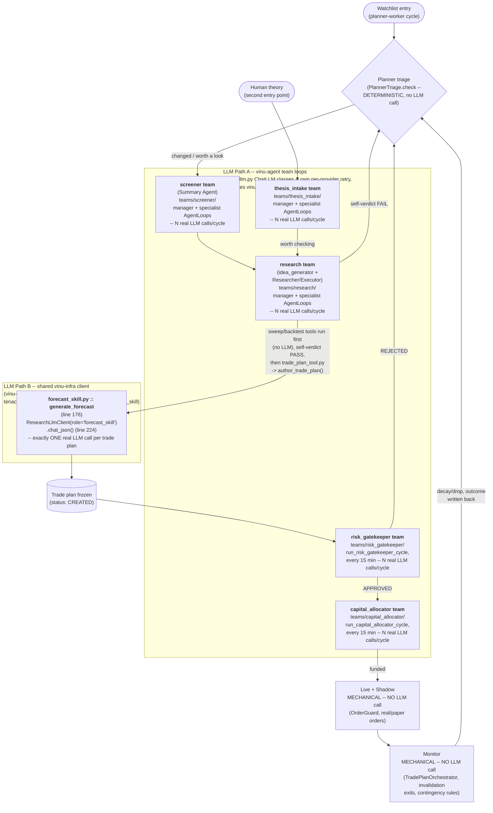

# Vigorous LLM testing — detailed explanation

Everything cited below was verified against real code on 2026-09-21, read
directly (`vinu-infra/llm/`, `vinu-agent/vinu_agent/agent/llm.py`,
`vinu-agent/vinu_agent/agent/loop.py`, `vinu-infra/telemetry.py`), not
assumed. Nothing in this folder has been built yet — this file is the
principle plus the real gaps already found by reading the code, written
down before any harness exists.

## 1. The principle: two stages, and this is the first one

Discussed in conversation, not invented from nothing: before trusting any
test that asks "did the LLM reach the *correct* decision," there has to be
a cheaper, earlier check that the call itself behaves — same input in,
does it come back in reasonable time, does it come back well-formed, does
it come back *the same way twice*. If that's already noisy, a
known-correct-answer scenario test downstream is unreadable — a failure
there could be a reasoning bug or just sampling/timeout noise, and you
can't tell which without this layer first.

So:

- **Stage 1 (this folder)** — fixed input, one real call site, run N
  times. Is it mechanically sound: response time, timeout handling,
  context-length handling, output consistency?
- **Stage 2 (already exists —
  `project-understanding/04-situation-test/llm-scenarios-test/`)** — given
  a sound call, does the *decision* match a known-correct answer?

**This isn't a new idea invented in parallel with Stage 2 — it's the
specific, already-named prerequisite for it.** `llm-scenarios-test/`
already has all 5 planned scenarios built (`01_clear_uptrend_signal`
through `05_news_vs_technicals`, 15 behavior tests, all passing against
the real `AgentLoop`) — but every one of them runs against `ScriptedLLM`
(`_scenario_helpers.py:43-55`), which just plays back a fixed script of
canned responses; `chat()` never calls a real model. That folder's own
README says plainly: *"Each scenario still only runs against a
ScriptedLLM, never a real model call — that's the next gap to close, not
yet started."* Swapping `ScriptedLLM` for a real LLM in those 5 scenarios
is exactly what this folder has to de-risk first — if you make that swap
before knowing the real call is stable, a scenario "failure" tells you
nothing about which layer actually broke.

## 2. The four things being checked, grounded in real code

### a. Response time / latency

Already measured per call, just never looked at. `LLMCallRecord.latency_sec`
(`vinu-infra/telemetry.py:59`) is written to `telemetry.db`'s `llm_calls`
table on every real call — on success (`client.py:219-234`) and on final
failure (`client.py:245-261`). But per the existing LLM-configuration audit
(`missing-pieces-of-system/(comp)llm-configuration-settings-system/`),
nothing reads any of the three LLM logging sinks back — "logging" today
means "recorded somewhere nobody looks." This folder's harness is the
first real reader of that specific number: hold one prompt fixed, call it
N times, compute p50/p95/max latency instead of relying on one anecdotal
run.

### b. Timeout

`VINU_LLM_TIMEOUT_SEC` (`vinu-infra/llm/config.py:16`, default `300.0`
seconds) is passed straight into `requests.post(..., timeout=self._config.timeout_sec)`
(`client.py:173`).

**A real gap found while reading this, not yet fixed:** `_should_retry()`
(`client.py:75-87`) retries a `requests.ConnectionError` unconditionally,
and an HTTP 429/5xx if `.response` is present — but a
`requests.exceptions.ReadTimeout` (the actual exception raised when a
model just takes too long to answer) is neither: it's a plain
`RequestException` with no `.response` object, so the
`status is not None and (...)` branch evaluates `False`. **A real timeout
gets zero retries**, while a dropped connection gets the full retry
budget — the opposite of what you'd want, since a timeout is often the
more transient condition (model warming up, one slow generation).

Also: `telemetry.py`'s own docstring lists `"timeout"` as a legal value
for `LLMCallRecord.outcome` (line 61: `# e.g. "completed", "error",
"timeout", "context_exceeded"`), but nothing in `client.py` ever actually
sets it — a real timeout is recorded as `outcome="all_endpoints_failed"`
(`client.py:244`), indistinguishable in `telemetry.db` from a genuine
connection failure or a misconfigured endpoint. Right now there is no way
to query "how often are calls timing out" — that finding didn't need a
harness to surface, just reading the code, but the harness in this folder
will be what demonstrates it happening live and gives it a real number.

### c. Context length

`LlmConfig.max_tokens` (`vinu-infra/llm/config.py:41`, default `8000`)
bounds only the **completion** — it's sent as `payload["max_tokens"]`
(`client.py:152`). The shared client never checks the **prompt's** length
against the model's real context window before sending; it just sends
whatever prompt got built and lets the provider reject or truncate it
however that provider does, with no pre-flight check and no distinct
error path.

`vinu-agent` already has a real, separately-built answer to this — but it
doesn't cover the shared client. `agent/llm.py`'s `resolve_context_window()`
(line 24) queries a live `/models` endpoint for the model's actual context
window (falling back to `_DEFAULT_CONTEXT_WINDOW = 8000`, line 20), and
`agent/loop.py`'s `self.max_context_tokens` (line 81) uses that value to
decide when to compact conversation history. This was built because of a
real, named incident — the comment at `agent/loop.py:16-18` says a
previous hardcoded `128000` was used against a real `32000`-token model.
That fix lives only inside `vinu-agent`'s own tool-calling loop, though.
`vinu-infra/llm/client.py` — the shared path `vinu-research`'s
`forecast_skill.py` and everything else outside `vinu-agent` actually
calls — has no equivalent context-window awareness at all. A large
`angle_digest` or a long accumulated prompt on that path could silently
exceed context with no warning before this folder's testing checks it.

### d. Output persistence / consistency ("no weirdo output")

Hold the input fixed, call `chat_json()` N times, check two separate
things:
- Does the JSON always parse (`_parse_json_content`, `client.py:67-72`),
  or does it occasionally come back malformed / wrapped differently?
- Does the *verdict* itself (direction, confidence, PASS/FAIL) stay
  stable across runs on identical input, or does it flip purely from
  sampling noise?

`temperature` is hardcoded to `0.2` in the shared client
(`client.py:151`) — low, but not zero, so some run-to-run variance is
expected by design. What this stage actually answers is whether that
variance stays inside a tolerable band (occasional wording differences,
same verdict) or crosses into a genuinely different decision on the same
input — which is the thing that would make Stage 2 scenario results
unreliable.

## 3. What this folder will actually build (not built yet)

1. Pick one real call site to start with — recommend
   `forecast_skill.py::generate_forecast` first: it's the highest-stakes
   call in the pipeline (the actual money-moving forecast) and the one
   with the most recent bug history (the 28-vs-2-angle disconnect,
   `project-understanding/01-new-full-explanation-v2.md`'s RESOLVED
   callout).
2. Hold one real input fixed — a captured real `angle_digest`/
   `TickerSummaryStore` read, not a synthetic one.
3. Run it N times against a real, configured LLM endpoint. Record per
   run: latency, retry_count, parse success/failure, and the verdict.
4. Separately, deliberately exercise the two edges found above — an
   artificially slow endpoint (to watch the timeout/no-retry path fire
   for real) and an oversized prompt (to see what actually happens on the
   shared client when nothing checks context length ahead of time) —
   rather than only trusting what the code implies should happen.
5. Cross-check the harness's own recorded numbers against what
   `telemetry.db` independently recorded for the same calls. Since
   nothing has ever read `telemetry.db` back before, this is also the
   first real check that what gets logged matches what actually
   happened.

## 4. Where this fits into the bigger testing picture

- **This folder (Stage 1)** — is the call mechanically sound: fast
  enough, correctly timed out and retried, not silently overflowing
  context, stable on identical input?
- **`project-understanding/04-situation-test/llm-scenarios-test/`
  (Stage 2, already built, `ScriptedLLM` only)** — given a sound call,
  does the decision match a known-correct answer? Swapping `ScriptedLLM`
  for a real model in `01_clear_uptrend_signal/` through
  `05_news_vs_technicals/` is that folder's own named next step, and it
  shouldn't be attempted until this stage gives a clean bill of health —
  otherwise a scenario "failure" against a real model can't be told apart
  from this stage's own open gaps (silent timeout drops, no retry, no
  context check).

## 5. Where the real LLM calls are made — the call-site map

Verified by reading `vinu-agent/vinu_agent/agent/team.py`,
`scheduler_workers.py`, the real `teams/` directory on disk, and
`forecast_skill.py`, not assumed from the architecture doc alone. There
are **two structurally different LLM call paths** in this system, not
one — worth knowing before testing either, since they have different
reliability layers underneath them:

- **Path A — `vinu-agent` team loops.** Five real team configs exist on
  disk (`vinu-agent/teams/{screener,research,risk_gatekeeper,
  capital_allocator,thesis_intake}/`, each a `manager_prompt.md` +
  `agents/`). Each is run via the same `run_team_for_ticker(service,
  team_name, task, session_id=...)` pattern (`scheduler_workers.py:105`,
  confirmed reused by planner/risk_gatekeeper/capital_allocator's own
  comments) — a manager `AgentLoop` that can delegate to specialist
  `AgentLoop`s (`team.py:266` sub-loop, `team.py:382` manager loop), each
  a full multi-turn, tool-calling conversation, potentially many real LLM
  calls per single cycle, not one. These go through `agent/llm.py`'s
  `ChatLLM` classes (`OpenAIChatLLM`/`AnthropicChatLLM`/`OllamaChatLLM`/
  `DeepSeekChatLLM`) — which, per the existing
  `(comp)llm-configuration-settings-system` audit, **bypass
  `vinu-infra/llm/client.py` entirely** and each carry their own,
  independently-drifted retry logic.
- **Path B — the shared `vinu-infra` client.** `forecast_skill.py`'s
  `generate_forecast` (line 176) builds a `ResearchLlmClient(config,
  role="forecast_skill")` (line 205) and calls `chat_json()` (line 224)
  — **one direct JSON call, not a team loop** — this is the actual
  `vinu-infra/llm/client.py` path this folder's section 2 findings
  (timeout/retry/context/telemetry) apply to directly. Planner's
  `idea_generator` lives inside the `research` team (Path A), not here —
  `PlannerTriage.check()` itself (`planner_triage_hook.py`) is a
  **deterministic gate, no LLM call at all**, ahead of the `research`
  team hand-off.

**Reading this diagram for testing purposes**: this folder's Stage 1
checks (response time, timeout, context length, output consistency) need
to be run against **both** paths separately, since they don't share a
retry/timeout/telemetry implementation — a clean result on Path B
(`forecast_skill`) says nothing about Path A's five team loops, and vice
versa. `forecast_skill.py::generate_forecast` (Path B) is still the
recommended first target from section 3: it's a single, isolable call
with one fixed prompt shape, rather than a multi-turn team loop where
"the response" is really N calls whose count itself can vary run to run.

## Status: not started

This file is grounding and principle only — the real gaps above were
found by reading the existing code, not by running anything yet. No
harness, no results.
