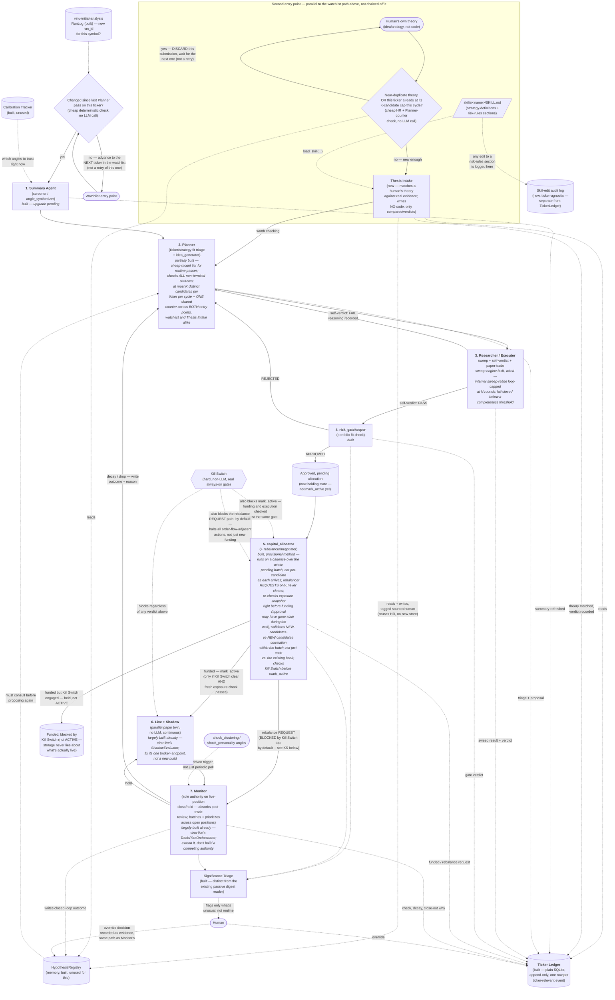

# Agentic workflow -- full picture

This is the pipeline as designed, stage by stage, with every loop-back
explicit. Built from what's real in the codebase today (`screener`,
`research`, `risk_gatekeeper`, `capital_allocator` — all shipped) plus the
gaps found by tracing real bugs this pass: raw LLM code generation for
strategy tuning, two disconnected indicator catalogs, and several agentic
roles nothing today actually plays. Where this explanation's status
markers have since been made stale by follow-up work, they are corrected
in place (see the `status:` frontmatter and the implementation-plan
tasks it references).

## The diagram

Three loop-backs matter and are easy to miss reading this as a straight
pipeline:

1. **Researcher/Executor fail → Planner.** Not a dead end — the failure
   reasoning is what the next proposal on that ticker has to address.
2. **risk_gatekeeper REJECTED → Planner.** The artifact isn't discarded,
   it stays wherever it was (real behavior today: BENCHING/MONITORING,
   unchanged) — but the *reason* still needs to reach the Planner so it
   isn't blindly re-proposed.
3. **Monitor decay/drop → Planner**, via `HypothesisRegistry`. This is
   the loop that makes the pipeline a cycle instead of a one-shot funnel
   — every closed position's lesson becomes an input constraint on the
   *next* proposal for that ticker, not just a log entry nobody reads.

There's also a second **entry point**, not just the watchlist/change-gate
one: a human can hand the pipeline a raw theory (not code, not even a
formal recipe) via **Thesis Intake**, which matches it against real
evidence and — if it clears the bar — feeds it into the Planner exactly
like a system-generated idea. Same downstream loop either way; only the
front door differs. See its own section below.

Everything drawn with a dotted line is a cross-cutting mechanism, not a
pipeline stage — it can fire from more than one place and doesn't wait
its turn in the main flow.

## Where the ticker's full story actually lives

A real gap found on review: nothing in the design so far is ticker-keyed
*and* chronological. Checked directly against the real code:

- `TickerSummaryStore`'s own docstring says it outright — "one row per
  ticker, overwritten (not versioned)... team_runs already keeps the full
  run history if that's ever needed."
- That punt doesn't actually work: `team_runs`' real schema has **no
  `ticker`/`symbol` column at all**. Nothing ties a run back to a symbol
  without a join path that doesn't exist.
- `SqliteStrategyStore`/`Artifact` is keyed per *strategy*, `HypothesisRegistry`
  per *hypothesis*, the shadow ledger per *position* — a ticker with five
  strategies tried over six months has five scattered rows across three
  different stores, no aggregate view.

**Fix: `TickerLedger`** — built, plain SQLite (append-only), one
row per ticker-relevant event: `ticker, timestamp, stage, event_type,
text, ref_id, source`. Every stage above writes exactly one entry when
something happens — `ref_id` points back to the real record in whichever
specialized store actually owns that data (`artifact_id`, `run_id`,
hypothesis id), so the Ledger is a narrative index, not a duplicate copy.
Schema stays generic on purpose — a future stage nobody's designed yet
just uses a new `stage` value, no migration needed. Checked end to end,
every stage in this design has exactly one natural entry point:
Thesis Intake's theory-matched verdict, Summary Agent refresh, Planner's
triage+proposal, Researcher/Executor's sweep result and verdict,
`risk_gatekeeper`'s verdict, `capital_allocator`'s funding/rebalance
decisions, every Monitor check plus its decay/close-out narrative, and
any human override. That's the complete set — nothing in the pipeline
produces a ticker-relevant decision that doesn't map to one of these.

One caveat worth stating: Live + Shadow's bookkeeping is *continuous*,
not event-shaped — it shouldn't write a Ledger row every tick. Only
Monitor's periodic comparisons (which read the shadow twin's current
state) produce the actual Ledger entries; the shadow ledger itself stays
a separate, high-frequency store the Ledger references, not writes into
directly.

**Why plain SQLite, not a vector DB / memory layer (Mem0, Hindsight, and
similar were checked directly):** those are built for fuzzy, semantic
recall and — Hindsight explicitly — *reflecting/updating beliefs over
time*. That's the right shape for personalization or multi-session chat
memory, and the wrong shape for an audit trail. The actual query pattern
here is "every event for AAPL, in exact order" — exact-match plus sort,
which SQL does natively and embedding similarity does worse, and this
project has repeatedly leaned on exact traceability (`artifact_id`,
`run_id`, never-invent-a-number grounding) as a core discipline, which a
system designed to reinterpret and consolidate memories works against,
not for. Also keeps the Ledger consistent with every other store in this
design — `TickerSummaryStore`, `SqliteStrategyStore`, `team_runs`,
`HypothesisRegistry` are all plain SQLite already.

**Where a vector layer would actually help — deferred, not needed now:**
a genuinely different, later capability — fuzzy cross-ticker analogical
search over the Ledger's accumulated text ("has anything like this shock
pattern happened before, anywhere, even on a ticker I wouldn't have
thought to check"). That's real semantic search SQL can't do well, and
it could sit *on top of* the Ledger once there's enough real history to
search — an addition, not a replacement, and not scoped for the initial
build.

## Per-agent detail

### 1. Summary Agent (`screener` / `angle_synthesizer`)

**Status:** built and tested against a real LLM, including the
cross-angle consensus check (agree/diverge/insufficient), verified live
against a real model (implementation-plan task 08).

**What it does today:** calls `get_all_angles(ticker)` once, reports how
many of the ~31 angles have real data, cites specific numbers from the
ones that do, states what to check next. Verified against the real,
shipped prompt (`teams/screener/agents/angle_synthesizer/prompt.md`) —
it lists angles individually; it does not cross-check them against each
other.

**Characteristic that defines it:** strict grounding discipline — "only
treat an angle as informative if `row_count > 0`," never invent a number.
This rule is why the team survived a real-LLM test where most angles had
no data yet: it said so plainly instead of padding a confident summary.

**The upgrade:** add a required agreement/divergence section — do
independent angles (e.g. `arima` vs `chronos` forecast direction,
`regime_analysis` vs `trend_lifecycle` characterization) actually agree?
This sits upstream of every other stage, so fixing it once here
strengthens everything downstream without any other agent needing to
re-derive consensus itself. Complementary to, not the same as, the
Calibration Tracker below — this checks *agreement right now*; that
checks *accuracy over time*.

**Trigger fix:** what causes this stage to re-run at all was previously
undefined. Fixed by watching `vinu-initial-analysis`'s own `RunLog`
(built, already the real "latest" resolution mechanism) for a new
`run_id` per symbol — only then does the Summary Agent refresh for that
ticker, and only then does the change-gate downstream have anything new
to compare against.

### 2. Planner (new triage stage + existing `idea_generator`)

**Status:** partially built. `idea_generator` is real and tested;
the ticker/strategy fit triage in front of it is new.

**What it does:** two jobs merged into one role.
- **Triage:** for each watchlist ticker, reads the Summary Agent's
  stored read (`TickerSummaryStore`, built) and what's already running on
  it (`SqliteStrategyStore.list_artifacts_for_symbol`, built, real method
  already used by `broker/order_guard.py`) — produces a fit tier
  (best/medium/least) and a priority informed by what's already ACTIVE,
  so it doesn't propose a near-duplicate. The status check must span
  every non-terminal state (CREATED, BENCHING, ACTIVE, MONITORING), not
  ACTIVE alone — otherwise a candidate mid-pipeline from a recent prior
  pass on the same ticker is invisible and can get proposed again.
- **Idea shaping:** picks a recipe (`list_sweep_recipes`, built, wired
  into `idea_generator`'s recipe-first path) and a coarse parameter
  search space, tied explicitly to the angle
  characteristics that motivated it. Raw code generation becomes the
  exception path — only for ideas no recipe covers — not the default it
  is today.

**Characteristic that defines it:** every proposal must be traceable to
a specific stored characteristic, not invented — same discipline as the
Summary Agent, one level up.

**Required addition:** must consult `HypothesisRegistry` (built, unused
for this) before proposing on a ticker — what's been tried here before,
what failed and why. Without this, a DECAYED strategy's specific failure
reason isn't remembered anywhere, and the same idea can get re-proposed
indefinitely.

**Efficiency addition:** only runs at all when the change-gate ahead of
the Summary Agent says something actually changed for this ticker, and
runs on a cheap/fast model tier by default — a stronger model is reserved
for tickers that flip to "needs a real look." Without this, triage cost
scales linearly with watchlist size regardless of how much is actually
new, every single cycle.

**Loop-termination fix:** caps itself at K distinct candidates per ticker
per cycle. This is a different cap from Researcher/Executor's internal
sweep-refine round limit — that one bounds tuning *within* one candidate;
this one bounds how many *different* candidates the Planner will keep
proposing after repeated FAIL/REJECTED verdicts before deferring to the
next cycle. Each retry here is a full sweep-plus-gate-check, so leaving
it uncapped was the more expensive of the two unbounded-loop risks.

**Shared-counter fix:** this K-cap is one counter shared with Thesis
Intake, not two independent limits. Without this, a human submitting K
genuinely distinct theories on one ticker could push it past the same
budget this cap exists to enforce, entirely within Thesis Intake's own
rules (which only reject *duplicates*, not budget overruns).

### 2b. Thesis Intake (new — second entry point, alongside the Planner)

**Status:** new, no existing code — but built almost entirely from
things that already exist.

**What it does:** takes a human's own theory — a stated idea or analogy,
not code, not even a formal recipe — and checks it against the real
evidence already gathered for that ticker (`TickerLedger`,
`HypothesisRegistry`, the Summary Agent's stored read). Reads two
reference sections while doing this: a strategy-definitions section (what
shapes of strategy exist to test a theory like this) and a risk-rules
section (what would disqualify it outright) — a natural fit for the
skill pattern, since this is reusable reference knowledge, not
computation. If the theory holds up against real evidence, it produces a
verdict — "this combination is worth checking" — and the theory enters
the *same* Planner → Researcher/Executor loop as any system-generated
idea. If it doesn't hold up, it says so, with the specific evidence that
contradicts it.

**Characteristic that defines it:** writes **no code, ever** — purely
reads, compares, and verdicts. This is a genuinely different cognitive
task from the Planner's: the Planner has to *invent* a recipe and
parameter space; Thesis Intake only has to judge whether a human's
already-stated idea lines up with what the evidence shows. Keeping that
boundary sharp is what stops this role from quietly turning into a second
idea-generator.

**Storage decision, stated on purpose:** the human's theory does **not**
get a new, separate store. It's written into `HypothesisRegistry` (real,
already built, already evidence-tracked with a status pipeline) tagged
`source="human"` — same pattern as the human-override fix for
Significance Triage. A dedicated "human theories" store would duplicate
a mechanism that already does this job well, and would fragment the
ticker's story right after `TickerLedger` was built specifically to stop
that from happening.

**Cost-control fix:** a cheap, deterministic `HypothesisRegistry` check
runs ahead of Thesis Intake — has a near-duplicate theory already been
evaluated for this ticker recently? Only "no" reaches an LLM call. Same
change-gate pattern as the watchlist path; without it, this entry point
had no protection against repeated or automated submission burning real
LLM calls on the same idea over and over. The same gate also checks the
Planner's shared K-cap counter, not just duplication — a ticker that's
already at budget this cycle gets deferred regardless of how novel the
next theory is.

**Governance fix:** any edit to the risk-rules skill section this role
reads is written to a new, ticker-agnostic skill-edit audit log —
separate from `TickerLedger` since it's not tied to one ticker. Without
this, someone could quietly weaken the risk-rules section and change
which theories clear the bar with no visible trail, unlike every other
risk-relevant action in this design.

### 3. Researcher / Executor (one team, three roles, loops internally)

**Status:** the core sweep mechanism is built, tested, and wired into the
research team's `backtest_runner` (`run_parameter_sweep`); the paper-trade
rehearsal role (d) doesn't exist yet.

**Role a — receive the plan.** Takes the Planner's recipe + search space
and its reasoning.

**Role b — execute + back-propagate.** Runs the grid via
`run_sweep_candidate` (`vinu-research/sweep.py`, real, AST-based
parameter substitution — not string hacking, can't corrupt code) —
deterministic Python, never LLM-authored code per attempt. The thin
wrapper this design called for now exists: `run_parameter_sweep`
(`vinu-agent/tools/run_parameter_sweep_tool.py`) loops the grid
internally and returns a ranked table via `comparison.py`'s
`rank_candidates` (wired into `run_sweep_grid`) in one call instead of
N LLM round-trips.

**Role c — self-verdict.** Reads the ranked table plus `pbo.py`'s
overfitting probability (wired into `run_sweep_grid`'s
`sweep_evidence_verdict`, which also folds in the walk-forward stability
verdict) and decides PASS/FAIL — same verdict shape `risk_critic` already
uses today, reused rather than reinvented.

**Role d — paper-trade rehearsal.** New. Runs the winning candidate
through a real historical week bar-by-bar (reuses `run_backtest`/
vinu-simulator, the same tool `backtest_runner` already calls), stores
the result, summarizes it.

**Characteristic that defines it:** the LLM's job is choosing which
region of parameter space to explore and interpreting whether an
improvement is real or noise — never computing the numbers itself. This
is the single biggest fix in the whole redesign: it's what the real bugs
this pass (hallucinated forecast columns, per-bar/whole-window
confusion) were actually symptoms of.

**Deliberate simplification, stated on purpose:** self-verdict is one
voice, not the bull/bear/`risk_officer` adversarial debate from the
earlier design pass. Cheaper, fewer calls — but a single voice can
rubber-stamp its own idea more easily than an adversarial pair. Worth
revisiting if PASS verdicts turn out too permissive in practice.

**Efficiency addition:** role b's grid-refine loop is capped at N rounds,
same `max_iterations` pattern the real `research` team's manager loop
already enforces. Left uncapped, this is the single stage most likely to
quietly dominate the whole pipeline's cost and latency, since it's the
only genuinely open-ended loop in the flow.

**Fail-closed addition (built):** `run_parameter_sweep` reports a
`completeness` field (N of M grid points actually succeeded). Role c's
self-verdict treats below-threshold completeness as automatic FAIL, never
a ranked PASS off partial data — closes a real gap, since the underlying
simulator is already known to silently zero-fill a failed candidate
rather than error loudly.

### 4. `risk_gatekeeper`

**Status:** built, real, tested.

**What it does:** one spec in, one verdict out. Checks the *already-
approved* candidate against the real current portfolio — position sizing
vs. account size, correlation to what's already open — via
`get_portfolio` (real, pre-existing tool, reused rather than building a
second position-fetching tool). On `APPROVED`, a manager-level Python
hook (never an agent-callable tool) now moves the artifact into a new
"approved, pending allocation" holding state instead of calling
`mark_active(...)` directly — funding is `capital_allocator`'s decision,
made across a batch, not this stage's alone (see the batching fix below).

**Characteristic that defines it:** answers exactly one question — "does
this fit current exposure" — deliberately never re-litigates whether the
strategy itself is sound. That's Researcher/Executor's job, one stage
back. Keeping the boundary sharp is what stops the two teams' concerns
from blurring together.

**Coverage fix (landed):** REJECTED verdicts now also feed Significance
Triage, not just `capital_allocator`'s and Monitor's outputs — a pattern
of repeated exposure-driven rejections is real signal a human should see,
not just a private loop-back to the Planner.

### 5. `capital_allocator` (+ new rebalancer/negotiator role)

**Status:** built, explicitly provisional allocation method.
**Rebalancer role:** unwind-request path built and gated
(`capital_allocator_hook` → `rebalance_guard.check_rebalance_allowed` →
vinu-live's rebalance-request intake); the "replace, not just fund"
decision math itself is not built.

**What it does today:** ranks currently-ACTIVE artifacts by
`deflated_sharpe` (already computed, no new math), funds highest-ranked
first, each capped at a fixed fraction of budget, until the budget runs
out. Labeled provisional everywhere on purpose — swapping the method
later only touches `allocation_tool.py`'s internals.

**The new piece:** today this only spends *fresh* budget on *new*
candidates. Nothing decides whether an existing, weaker ACTIVE strategy
should be unwound to make room for a demonstrably better new one that
just cleared the gate. That's a genuinely different decision type —
replace, not just fund/don't-fund — and nothing in the pipeline makes it
today.

**Coordination fix:** the rebalancer never closes a position itself —
it can only send Monitor a **request** ("unwind X to fund Y"). Monitor,
as the sole authority over live-position close/hold, folds that request
into its own judgment on X before deciding. Without this split, the
rebalancer and Monitor could independently decide the fate of the same
live position with no ordering rule between them — a correctness bug,
not just an inefficiency.

**Batching fix:** runs on a fixed cadence over the whole "approved,
pending allocation" batch since its last pass, not per-candidate the
instant each one clears `risk_gatekeeper`. Without this, funding is
effectively first-come-first-served — an early mediocre candidate can
exhaust the budget before a genuinely better one, from a ticker whose
pipeline just happened to finish later, ever gets ranked against it.

**Staleness fix:** re-runs a cheap exposure snapshot check immediately
before funding, not just at `risk_gatekeeper`'s original approval time.
The batching fix above means an approval can sit waiting for the next
cadence run — long enough for the real portfolio to have moved. This
isn't a full re-review, just confirming the picture `risk_gatekeeper`
approved against is still roughly true.

**Batch-collective fix:** validates NEW-candidates-vs-NEW-candidates
correlation within the funded batch, not just each candidate against the
existing book (already `risk_gatekeeper`'s job). `risk_gatekeeper` only
ever sees one candidate at a time, so nothing else in the pipeline checks
whether several individually-fine candidates are themselves correlated
with each other — two positions each fine alone could jointly land at a
concentration limit neither breached in isolation.

**Characteristic that defines it:** every funding decision must report a
traceable reason per candidate — never a black-box allocation.

**Consistency fix:** checks the Kill Switch before calling `mark_active`.
If engaged, the artifact goes to a new "funded, blocked by Kill Switch"
holding state instead — storage never claims a strategy is ACTIVE
(genuinely live) when the Kill Switch is actually preventing it from
ever executing. Without this, Monitor's shadow comparisons and the next
allocation cycle's ranking would both be reasoning over artifacts that
say ACTIVE but aren't really trading. The Kill Switch also blocks the
rebalancer's request path by default, not just `mark_active` — halting
all order-flow-adjacent actions, not only new funding, unless a future
pass deliberately carves out an exception for risk-reducing closes.

### 6. Live + Shadow (parallel execution)

**Status:** largely built already, not new. `vinu-live/shadow_evaluator.py`'s
`ShadowEvaluator` already compares a BENCHING artifact's paper-trading
Sharpe against its backtest Sharpe and auto-promotes to ACTIVE within
tolerance — its own docstring calls this "the paper-trading phase becomes
an automated gate." It now runs on a real schedule (implementation-plan
task 02 wired `evaluate_all()` into a vinu-live worker), and the
`/agent/broker/performance/{artifact_id}` endpoint it reads is
implemented (`routes_broker.py`, backed by `broker/performance_store.py`).

**What it does:** once funded, the live position runs for real while an
untouched paper twin of the *original* plan runs in parallel,
continuously, off the same price feed. Pure deterministic bookkeeping —
no LLM, no judgment, same category as the parameter sweep.

**Characteristic that defines it:** at any moment, "what would this
position be doing right now if left alone" is a computed answer, not a
guess — this is what makes Monitor's later comparisons concrete instead
of vague.

### 7. Monitor (absorbs decay-watch + post-trade review)

**Status:** largely built already, not new. `vinu-live/trade_plan/
orchestrator.py`'s `TradePlanOrchestrator` already owns entry,
invalidation-exit, and contingency actions every cycle — that already is
sole authority over a live position's lifecycle. Building a second,
separate Monitor inside vinu-agent would recreate, one layer up, the
exact "two things can independently close the same position" bug this
design fixed once already (Monitor vs. the rebalancer). The real work is
extending the orchestrator — shock-angle trigger, routing decay/drop
outcomes into `HypothesisRegistry`/`TickerLedger` — not building a
competing authority. See `phases/phase-5-monitor-extend/`.

**What it does:** periodically (and, once added, on a real shock-angle
trigger rather than only on a timer) compares the live position against
its shadow twin, decides hold / flag / suggest-drop, and — when a
position actually closes — writes the "why" narrative using the shadow
twin's full path, not just a single predicted-vs-actual point. Also now
the **sole authority** over closing a live position — `capital_allocator`'s
rebalancer can only request a close, never perform one itself.

**Characteristic that defines it:** never places, modifies, or cancels a
real order itself — only recommends and records. Whatever executes
trades decides whether to act.

**Required addition:** an event-driven trigger off `shock_clustering`/
`shock_personality` (angles that already exist) so a real shock forces
an immediate off-cycle check instead of waiting for the next scheduled
poll.

**Efficiency addition:** batches multiple open positions into fewer
calls and prioritizes ones showing early decay signs or recent
volatility, rather than polling every position identically on every
cycle. Without this, monitoring cost grows linearly with how many
positions are simultaneously open, which is the one number in this whole
design most likely to actually grow over time.

## Cross-cutting mechanisms (not pipeline stages)

These can fire from more than one point in the flow and don't wait a
turn — drawn dotted in the diagram on purpose.

- **Calibration Tracker** (`vinu-research/calibration.py`, built,
  currently unused) — feeds the Summary Agent which angles to actually
  trust right now, based on their own historical forecast accuracy.
  Different question from cross-angle agreement: this is "has this
  method been right *over time*," not "do the methods agree *right now*."
- **HypothesisRegistry** (built, unused for this purpose) — the
  Planner's required pre-proposal check, where Monitor's closed-loop
  outcomes get written, and now also where Thesis Intake reads/writes
  human-submitted theories (tagged `source="human"`, no separate store),
  so the cycle in the diagram is a real memory loop shared by both
  system- and human-originated ideas, not just an arrow.
- **Kill Switch, scope corrected — real and always-on.** Checked before
  every real order at `Live + Shadow` (`OrderGuard`, scope passed
  through), before `capital_allocator` calls `mark_active` (a halt
  blocks funding into `PENDBLOCK`), **and before the rebalancer's unwind
  request path** (`rebalance_guard.check_rebalance_allowed`, called by
  `capital_allocator_hook`) — halting all order-flow-adjacent actions by
  default, not just new funding, even if an LLM is wedged or looping.
  `broker/kill_switch.py` is a real, tested gate (with a cross-process
  file lock closing the check-then-act race), not a deferred stub.
- **Significance Triage** — built. Distinct from the existing
  `audit/research_digest.py`, which is real but purely passive (replays
  a summary the next time a symbol happens to come up in conversation).
  This role actively judges which autonomous decisions are routine
  (skip) versus unusual enough to surface to a human now, rather than
  waiting to be asked. Fed by `capital_allocator`, Monitor, **and now
  `risk_gatekeeper`'s REJECTED verdicts** — a repeated pattern of
  exposure-driven rejections is real signal, not just a private
  loop-back to the Planner. **Closes the loop back**, too: whatever a
  human decides in response gets written through
  `HypothesisRegistry.add_evidence(...)` — the same method Monitor
  already uses — tagged `source="human_override"`, so it's not a dead
  end. Without this, a human's correction is invisible to the Planner's
  next pass and the same thing can get proposed or flagged again as if
  nobody ever weighed in.
- **Skill-edit audit log** — new, ticker-agnostic. Any edit to a
  risk-rules skill section Thesis Intake reads gets logged as a visible
  event, closing the one access-control gap this design otherwise left
  open compared to how carefully everything else (status transitions,
  manager-level hooks) already guards who can change what.

## Open questions, carried forward on purpose

- Single-voice self-verdict (Researcher/Executor role c) vs. the fuller
  bull/bear/`risk_officer` debate — a deliberate simplification, not
  settled as final.
- `capital_allocator`'s allocation math is still provisional
  (fixed-fraction ranked by deflated Sharpe) — Kelly/risk-parity/other
  not decided.
- Whether `risk_gatekeeper` and the rebalancer role are always
  in-conversation checks or callable non-interactively by whatever
  submits real orders — likely needs both, not decided.
- A cross-ticker portfolio-composition view (does the *whole* portfolio
  need a certain kind of exposure it's currently missing) was raised as
  a further out-of-the-box role but has no existing code behind it,
  unlike everything else marked "built, unused" above — flagged as
  genuinely new, not scoped here.
- The exact N for the sweep-refine round cap, the exact K for the
  Planner's outer distinct-candidates-per-ticker cap, Monitor's
  batching/prioritization thresholds, and the completeness-threshold
  tolerance for role c's fail-closed check are not chosen yet — all need
  tuning against real cost/latency/data-reliability numbers, not guessed
  in advance.
- How often `capital_allocator`'s batched allocation cadence should run
  (§ Timing, race-condition & memory-loop fixes, item 3) — too slow and
  approved candidates sit idle waiting for funding; too frequent and the
  batch shrinks back toward first-come-first-served. Not decided.
- `TickerLedger` retention/pruning policy and its exact `event_type`
  taxonomy aren't pinned down — fine to let both grow organically as real
  stages get built, but worth a real decision before the table gets big
  enough that unpruned growth becomes its own problem.
- Thesis Intake's two reference sections (strategy-definitions,
  risk-rules) aren't written yet — content and exact skill/file location
  not decided, just the role's shape and its "no separate storage" rule.
- Whether the Kill Switch should ever let risk-*reducing* rebalance
  requests through during a halt is explicitly deferred, not decided —
  this design starts from the safer "block everything" default and
  treats an exception as a future, deliberate choice.

**Resolved, no longer open:**
- Whether the rebalancer and Monitor could independently act on the same
  position — fixed by making Monitor the sole authority and the
  rebalancer a requester only (§ Per-agent detail → `capital_allocator`'s
  Coordination fix, and → Monitor).
- What triggers the Summary Agent to refresh — fixed by watching
  `vinu-initial-analysis`'s `RunLog` for a new `run_id` per symbol
  (§ Per-agent detail → Summary Agent's Trigger fix).
- Whether the Planner could miss an in-flight candidate — fixed by
  checking all non-terminal statuses, not just ACTIVE (§ Per-agent detail
  → Planner's Triage bullet).
- Whether a human's override decision reaches the system's memory — fixed
  by routing it through `HypothesisRegistry.add_evidence(...)`, same as
  Monitor's own outcomes (§ Cross-cutting mechanisms → Significance
  Triage).
- What the batch-collective fix actually checks — fixed by stating it
  explicitly covers new-vs-new correlation within the funded batch, not
  just aggregate concentration (§ Per-agent detail → `capital_allocator`'s
  Batch-collective fix).
