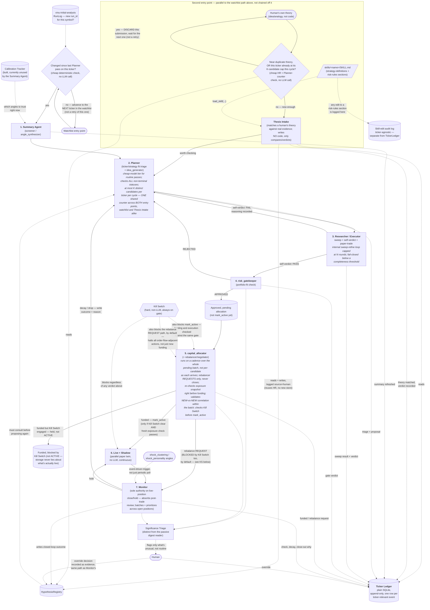

# Agentic workflow — current architecture

This is the pipeline as it actually runs today. Unlike
`00-full-initial-explanation.md` (which narrates the corrections made
against an earlier, partly-stale design), this file just states what's
true now. A handful of pieces are still genuinely not built — those are
called out plainly in their own section, not mixed into the "built"
narrative.

## The diagram

Three loop-backs make this a cycle, not a one-shot funnel:

1. **Researcher/Executor fail → Planner.** The failure reasoning is what
   the next proposal on that ticker has to address.
2. **risk_gatekeeper REJECTED → Planner.** The artifact stays wherever it
   was (BENCHING/MONITORING, unchanged) but the *reason* reaches the
   Planner so it isn't blindly re-proposed.
3. **Monitor decay/drop → Planner**, via `HypothesisRegistry`. Every
   closed position's lesson becomes an input constraint on the *next*
   proposal for that ticker.

A second **entry point** sits alongside the watchlist/change-gate one: a
human can hand the pipeline a raw theory via **Thesis Intake**, which
matches it against real evidence and, if it clears the bar, feeds it into
the Planner exactly like a system-generated idea. Same downstream loop
either way — only the front door differs.

Everything drawn with a dotted line is a cross-cutting mechanism, not a
pipeline stage — it can fire from more than one place.

## Where the ticker's full story lives — `TickerLedger`

Plain SQLite, append-only, one row per ticker-relevant event: `ticker,
timestamp, stage, event_type, text, ref_id, source`. Every stage writes
exactly one entry when something happens; `ref_id` points back to the
real record in whichever specialized store owns that data (`artifact_id`,
`run_id`, hypothesis id) — the Ledger is a narrative index, not a
duplicate copy. Every stage in the pipeline has exactly one natural entry
point into it: Thesis Intake's verdict, Summary Agent refresh, Planner's
triage+proposal, Researcher/Executor's sweep result and verdict,
`risk_gatekeeper`'s verdict, `capital_allocator`'s funding/rebalance
decisions, every Monitor check plus decay/close-out narrative, and any
human override.

Live + Shadow's bookkeeping is continuous, not event-shaped — it doesn't
write a row every tick. Only Monitor's periodic comparisons (reading the
shadow twin's current state) produce Ledger entries; the shadow ledger
itself stays a separate, high-frequency store the Ledger references.

Plain SQLite over a vector DB / memory layer on purpose: the real query
pattern is "every event for AAPL, in exact order" — exact-match plus
sort, which SQL does natively. This project leans on exact traceability
(`artifact_id`, `run_id`, never-invent-a-number grounding) as a core
discipline, and a system built to reinterpret/consolidate memories works
against that. A vector layer on top of the Ledger for fuzzy cross-ticker
analogical search is a real, later capability — not scoped now.

## Per-agent detail

### 1. Summary Agent (`screener` / `angle_synthesizer`)

Calls `get_all_angles(ticker)` once, reports how many of the ~31 angles
have real data, cites specific numbers from the ones that do, states what
to check next. Includes a cross-angle agreement/divergence check
(agree/diverge/insufficient) — do independent angles (e.g. `arima` vs
`chronos` forecast direction, `regime_analysis` vs `trend_lifecycle`)
actually agree. Verified live against a real model.

**Grounding discipline:** only treats an angle as informative if
`row_count > 0` — never invents a number. This is why it stays useful
even when most angles have no data yet: it says so plainly instead of
padding a confident summary.

**Trigger:** watches `vinu-initial-analysis`'s `RunLog` for a new
`run_id` per symbol — only then does the Summary Agent refresh, and only
then does the downstream change-gate have anything new to compare
against.

### 2. Planner (triage + `idea_generator`)

Two jobs in one role.

- **Triage:** for each watchlist ticker, reads the Summary Agent's stored
  read (`TickerSummaryStore`) and what's already running on it
  (`SqliteStrategyStore.list_artifacts_for_symbol`) — produces a fit tier
  (best/medium/least) and a priority informed by what's already ACTIVE.
  The status check spans every non-terminal state (CREATED, BENCHING,
  ACTIVE, MONITORING), not ACTIVE alone.
- **Idea shaping:** picks a recipe (`list_sweep_recipes`, wired into
  `idea_generator`'s recipe-first path) and a coarse parameter search
  space, tied to the angle characteristics that motivated it. Raw code
  generation is the exception path, not the default.

Consults `HypothesisRegistry` before proposing on a ticker — what's been
tried before, what failed and why. Only runs when the change-gate says
something actually changed, on a cheap/fast model tier by default; a
stronger model is reserved for tickers that flip to "needs a real look."

Caps itself at K distinct candidates per ticker per cycle — a shared
counter with Thesis Intake, so a human submitting many genuinely distinct
theories on one ticker can't push past the same budget from the other
door.

### 2b. Thesis Intake (second entry point, alongside the Planner)

Takes a human's own theory — an idea or analogy, not code — and checks it
against the real evidence already gathered for that ticker
(`TickerLedger`, `HypothesisRegistry`, the Summary Agent's stored read).
Reads a strategy-definitions section (what shapes of strategy exist to
test a theory like this) and a risk-rules section (what would disqualify
it outright) via the skill pattern. If the theory holds up, it produces a
verdict — "worth checking" — and the theory enters the same Planner →
Researcher/Executor loop as a system-generated idea. If not, it says so
with the contradicting evidence.

Writes **no code, ever** — purely reads, compares, verdicts. The human's
theory is written into `HypothesisRegistry` tagged `source="human"` — no
separate store.

A cheap, deterministic check runs ahead of any LLM call: has a
near-duplicate theory already been evaluated for this ticker recently,
or is this ticker already at the shared K-cap this cycle? Only "no"
reaches an LLM.

Any edit to the risk-rules skill section is written to a ticker-agnostic
skill-edit audit log, separate from `TickerLedger`.

### 3. Researcher / Executor (one team, three roles, loops internally)

**Role a — receive the plan.** Takes the Planner's recipe + search space
and its reasoning.

**Role b — execute + back-propagate.** Runs the grid via
`run_sweep_candidate` (`vinu-research/sweep.py`, AST-based parameter
substitution) — deterministic Python, never LLM-authored code per
attempt. `run_parameter_sweep` (`vinu-agent/tools/run_parameter_sweep_tool.py`)
loops the grid internally and returns a ranked table via `comparison.py`'s
`rank_candidates` in one call instead of N LLM round-trips. Capped at N
rounds, same `max_iterations` pattern the `research` team's manager loop
already enforces.

**Role c — self-verdict.** Reads the ranked table plus `pbo.py`'s
overfitting probability and the walk-forward stability verdict (both
folded into `sweep_evidence_verdict`) and decides PASS/FAIL. Treats
below-threshold `completeness` (N of M grid points actually succeeded) as
automatic FAIL, never a ranked PASS off partial data.

**Role d — paper-trade rehearsal. Not built yet.** Would run the winning
candidate through a real historical week bar-by-bar and store/summarize
the result. See "What's still not built" below.

**Defining characteristic:** the LLM chooses which region of parameter
space to explore and interprets whether an improvement is real or noise
— it never computes the numbers itself.

**Deliberate simplification, still open:** self-verdict is one voice, not
a bull/bear adversarial debate. Cheaper, fewer calls — but worth
revisiting if PASS verdicts turn out too permissive in practice.

### 4. `risk_gatekeeper`

One spec in, one verdict out. Checks the already-approved candidate
against the real current portfolio — position sizing vs. account size,
correlation to what's already open — via `get_portfolio`. On `APPROVED`,
a manager-level Python hook moves the artifact into an "approved, pending
allocation" holding state instead of calling `mark_active` directly —
funding is `capital_allocator`'s decision, made across a batch.

Answers exactly one question — "does this fit current exposure" —
deliberately never re-litigates whether the strategy itself is sound.

REJECTED verdicts feed Significance Triage as well as the Planner loop-back
— a pattern of repeated exposure-driven rejections is signal a human
should see.

### 5. `capital_allocator` (+ rebalancer/negotiator role)

Ranks currently-ACTIVE artifacts by `deflated_sharpe`, funds
highest-ranked first, each capped at a fixed fraction of budget, until
the budget runs out. Allocation method is explicitly provisional —
swapping it later only touches `allocation_tool.py`'s internals (see
"open questions" for the Kelly/risk-parity/other decision still pending).

Runs on a fixed cadence over the whole "approved, pending allocation"
batch since its last pass, not per-candidate as each clears
`risk_gatekeeper` — avoids first-come-first-served funding. Re-runs a
cheap exposure snapshot check immediately before funding, since an
approval can sit waiting for the next cadence run. Validates
NEW-vs-NEW correlation within the funded batch, not just each candidate
against the existing book.

The rebalancer role's unwind-request path is built and gated
(`capital_allocator_hook` → `rebalance_guard.check_rebalance_allowed` →
vinu-live's rebalance-request intake) — it never closes a position
itself, only sends Monitor a request. Monitor, as sole authority over
live-position close/hold, folds that request into its own judgment. The
"replace, not just fund" decision math itself — whether an existing,
weaker ACTIVE strategy should be unwound to make room for a demonstrably
better new one — is not built yet (see below).

Checks the Kill Switch before calling `mark_active`; if engaged, the
artifact goes to a "funded, blocked by Kill Switch" holding state instead
— storage never claims a strategy is ACTIVE when the Kill Switch is
actually preventing it from executing. The Kill Switch also blocks the
rebalancer's request path by default.

Every funding decision reports a traceable reason per candidate — never a
black-box allocation.

### 6. Live + Shadow (parallel execution)

`vinu-live/shadow_evaluator.py`'s `ShadowEvaluator` compares a BENCHING
artifact's paper-trading Sharpe against its backtest Sharpe and
auto-promotes to ACTIVE within tolerance. Runs on a real schedule
(`evaluate_all()` wired into a vinu-live worker); the
`/agent/broker/performance/{artifact_id}` endpoint it reads is live
(`routes_broker.py`, backed by `broker/performance_store.py`).

Once funded, the live position runs for real while an untouched paper
twin of the *original* plan runs in parallel, continuously, off the same
price feed. Pure deterministic bookkeeping — no LLM, no judgment.

At any moment, "what would this position be doing right now if left
alone" is a computed answer, not a guess.

### 7. Monitor (decay-watch + post-trade review)

`vinu-live/trade_plan/orchestrator.py`'s `TradePlanOrchestrator` owns
entry, invalidation-exit, and contingency actions every cycle — sole
authority over a live position's lifecycle. Periodically (and, once a
shock-angle trigger is added, on-event too) compares the live position
against its shadow twin, decides hold / flag / suggest-drop, and — when a
position actually closes — writes the "why" narrative using the shadow
twin's full path.

`capital_allocator`'s rebalancer can only request a close, never perform
one itself — Monitor is the sole authority.

Never places, modifies, or cancels a real order itself — only recommends
and records.

**Still open (not built):** an event-driven trigger off
`shock_clustering`/`shock_personality` so a real shock forces an
immediate off-cycle check instead of waiting for the next scheduled poll;
batching/prioritizing multiple open positions instead of polling each
identically every cycle.

## Cross-cutting mechanisms (not pipeline stages)

- **Calibration Tracker** (`vinu-research/calibration.py`, built,
  currently unused) — would feed the Summary Agent which angles to
  actually trust right now, based on their own historical forecast
  accuracy. Different question from cross-angle agreement: "has this
  method been right *over time*" vs. "do the methods agree *right now*."
- **HypothesisRegistry** — the Planner's pre-proposal check, where
  Monitor's closed-loop outcomes get written, and where Thesis Intake
  reads/writes human-submitted theories (tagged `source="human"`).
- **Kill Switch — real, always-on.** Checked before every real order at
  Live + Shadow (`OrderGuard`), before `capital_allocator` calls
  `mark_active`, and before the rebalancer's unwind request path
  (`rebalance_guard.check_rebalance_allowed`) — halting all
  order-flow-adjacent actions by default, not just new funding.
  `broker/kill_switch.py` has a cross-process file lock closing the
  check-then-act race.
- **Significance Triage** — distinct from `audit/research_digest.py`
  (real but purely passive). Actively judges which autonomous decisions
  are routine (skip) vs. unusual enough to surface to a human now. Fed by
  `capital_allocator`, Monitor, and `risk_gatekeeper`'s REJECTED
  verdicts. Closes the loop back: a human's decision is written through
  `HypothesisRegistry.add_evidence(...)` tagged `source="human_override"`.
  **Delivery to Telegram/Discord is code-complete but needs real
  credentials from the operator before it actually sends anything** — see
  `03-how-to-start.md` step 3/optional.
- **Skill-edit audit log** — ticker-agnostic. Any edit to a risk-rules
  skill section Thesis Intake reads gets logged as a visible event.

## What's still not built

Kept separate from the "as built" sections above so it's not mistaken for
done:

1. **Researcher/Executor role d — paper-trade rehearsal.** Running the
   winning sweep candidate through a real historical week bar-by-bar
   before it ever reaches `risk_gatekeeper`.
2. **`capital_allocator`'s "replace" decision.** Nothing today decides
   whether an existing, weaker ACTIVE strategy should be unwound to make
   room for a demonstrably better new one — only fund/don't-fund on fresh
   budget exists.
3. **Monitor's shock-angle trigger and position batching/prioritization.**
4. **A cross-ticker portfolio-composition view** — does the whole
   portfolio need a kind of exposure it's currently missing. Raised as an
   idea, no code behind it.
5. **Significance Triage live delivery** — code path is real, needs
   operator-supplied Telegram/Discord credentials to actually fire.
6. **Task 01's capital-allocator-worker test gap** — the worker itself
   runs correctly in practice, but its test only exercises the cycle
   function, not the actual scheduling loop.

## Open questions, carried forward on purpose

- Single-voice self-verdict vs. a fuller bull/bear/`risk_officer` debate
  — deliberate simplification, not settled as final.
- `capital_allocator`'s allocation math is still provisional
  (fixed-fraction ranked by deflated Sharpe) — Kelly/risk-parity/other
  not decided (see `02-reference-repos-core-logic.md` for the tradeoffs).
- Whether `risk_gatekeeper` and the rebalancer role are always
  in-conversation checks or callable non-interactively by whatever
  submits real orders — likely needs both, not decided.
- The exact N for the sweep-refine round cap, K for the Planner's outer
  cap, Monitor's batching thresholds, and the completeness-threshold
  tolerance are not chosen yet — need tuning against real
  cost/latency/data-reliability numbers.
- How often `capital_allocator`'s batched allocation cadence should run —
  too slow and approved candidates sit idle; too frequent and the batch
  shrinks back toward first-come-first-served. Not decided.
- `TickerLedger` retention/pruning policy and its exact `event_type`
  taxonomy aren't pinned down.
- Thesis Intake's two reference sections (strategy-definitions,
  risk-rules) aren't written yet — content and file location not decided.
- Whether the Kill Switch should ever let risk-*reducing* rebalance
  requests through during a halt — deferred, starts from "block
  everything" as the safer default.
- A Jarvis-like watcher-agent for system-health polling — mentioned in
  conversation, explicitly deferred, not scoped.
