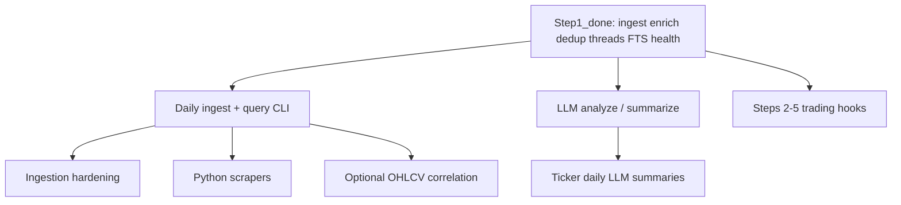

# News Component — Status & Still Missing

This document tracks what is **built** vs what remains to match the full Fincept news stack (from `personal_understanding/step_1_1_news.md`, `step1_ingestion_streaming.md`, and `news_intelligence_pipeline.md`).

**Detailed guides:** [`docs/complete_guide_news_analysis.md`](docs/complete_guide_news_analysis.md) · [`docs/news_derived_tables.md`](docs/news_derived_tables.md) · [`docs/README.md`](docs/README.md)

---

## Overall progress (~92% of full Fincept news)

| Layer | Folder | Status |
|-------|--------|--------|
| Rule-based enrichment (9 stages) | `vinu-news/vinu_news/analysis/enrichment/` | Done |
| Pre-enrichment validation + URL dedup | `vinu-news/vinu_news/analysis/pre_enrichment/` | Done |
| Post-enrichment: synonyms, NER, dedup, lead pick | `vinu-news/vinu_news/analysis/post_enrichment/` | Done |
| Story threads + cross-batch dedup | `vinu-news/vinu_news/analysis/storage/threading/` | Done |
| FTS5 search + thread/ticker analytics tables | `vinu-news/vinu_news/analysis/storage/` | Done |
| Feed health tracking | `vinu-news/vinu_news/rss/storage/` | Done |
| Per-ticker dominance + junction table | `vinu-news/vinu_news/analysis/enrichment/` | Done (extension) |
| RSS auto-fetch + stability | `vinu-news/vinu_news/rss/` | Done |
| LLM / scrapers / UI / trading hooks | — | Not built |

---

## What is done

### `vinu-news/vinu_news/analysis/` (Fincept Step 1.1)

- HTML strip + 300-char summary truncation
- Priority (FLASH → URGENT → BREAKING → ROUTINE)
- Weighted sentiment (BULLISH / BEARISH / NEUTRAL)
- Impact (HIGH / MEDIUM / LOW)
- Category waterfall (EARNINGS, CRYPTO, DEFENSE, …)
- Ticker extraction (regex + C++ 20-word stop list, max 5)
- Language detection (Unicode scripts)
- Threat classification (Critical / High / Medium + fallbacks)
- Source credibility flags (STATE_MEDIA, CAUTION)
- `pipeline.py` — `process_batch()` (validate → enrich → post-process → ready for upsert)
- Stage folders: `pre_enrichment/`, `enrichment/`, `post_enrichment/`, `storage/`
- `post_enrichment/synonyms/` — synonym normalization for dedup vectors
- `post_enrichment/ner/` — people + country entity extraction → `entities_json`
- `post_enrichment/cosine_dedup/` — TF-IDF + cosine ≥ 0.25 clustering
- `post_enrichment/lead_pick/` — best headline per cluster (tier, source, priority, impact)
- Extended ticker stop-words (Fincept Python NLP list)
- `config/analysis.yaml` — tunable dedup/lead/thread thresholds
- URL dedup (in-batch + DB link check)
- Cross-batch `story_threads` with `thread_id`, daily snapshots, ticker daily stats
- `storage/persist.py` — `persist_leads()` with thread matching
- FTS5 `articles_fts` + `search_articles()` query helper
- Feed health table updated each poll
- Tests: enrichment, synonyms, NER, dedup, persist, FTS, feed health

### `vinu-news/vinu_news/rss/` (Fincept Step 1)

- `config/feeds.yaml` — Tier 1–4 RSS URLs (AP, Fed, Bloomberg, ZeroHedge, etc.)
- Parallel fetch with 4s timeout (Fincept `kFeedTransferTimeoutMs`)
- HTML cloaking detection (`<html`, `<!doctype html`)
- Fail-soft per feed (one failure does not block others)
- RSS/Atom parse via `feedparser` → 7-field raw dict
- CLI: `run_ingestion.py` (`--once`, `--interval`, `--dry-run`, `--feeds`)
- Wired to `process_batch()` + `persist_leads()` → `vinu-news/vinu_news/analysis/data/news.db`
- Tests with mocked HTTP

---

## Previously completed (no longer missing)

These were gaps in earlier versions of this doc; all are implemented now:

- Cosine similarity clustering (TF-IDF, threshold 0.25, lead pick)
- NER (people + country codes → `entities_json`)
- Synonym normalization before dedup
- Cross-batch story thread tracking (`story_threads`, `thread_daily_snapshots`)
- FTS5 full-text search (`articles_fts`)
- Feed health SQLite table
- URL dedup + NER/ticker merge gates

---

## Remaining gaps

### 1. LLM deep analysis cache

**Fincept reference:** `step_1_1_news.md` §8 — `news_analysis` table

- `/news/analyze` — structured analysis from article URL
- Cache by URL in SQLite (`analysis_json`)
- On-demand (user opens article), not on every ingest

**Status:** Not built. Optional until you want AI key takeaways / entity extraction.

---

### 2. LLM headline summarization / market digest

**Fincept reference:** `step_1_1_news.md` §8 — `/news/summarize`

- Batch of headlines → single cohesive digest paragraph
- In-memory cache with 15-minute TTL (Fincept `CacheManager`)

**Status:** Not built.

---

### 3. Ticker daily summaries table (proposal)

**Fincept reference:** `step_1_1_news.md` §9 — `ticker_summaries`

- Per-ticker, per-day LLM digest
- Links back to source article IDs
- SHA-256 cache key from sorted article IDs

**Status:** Proposal only — not in Fincept as-shipped, not built here.

---

### 4. Python scrapers (non-RSS sources)

**Fincept reference:** `step1_ingestion_streaming.md` §5 — method 2

- Sites without clean RSS (e.g. Bank of Japan, economic calendars)
- `requests` + BeautifulSoup (or Selenium for hard cases)
- Per-row try/except; fail-soft like RSS feeds

**Status:** Not built. Listed as Phase 2 in `vinu-news/vinu_news/rss/Readme.md`.

---

### 5. Ingestion hardening (optional)

- Retry once on timeout
- Exponential backoff per dead feed
- Per-domain rate limiting
- `ETag` / `If-Modified-Since` caching

**Status:** Not built.

---

### 6. UI / GUI state columns

**Fincept reference:** `step_1_1_news.md` §4 Category 3

- `seen_at` — when user read the article
- `saved` — bookmark / star

**Status:** Omitted until a UI exists.

---

### 7. DataHub pub/sub + News UI

**Fincept reference:** `news_intelligence_pipeline.md` §6, `architectural_mind_map.md`

- JSON dispatch through DataHub
- `NewsScreen.cpp` — color-coded sentiment, threat badges

**Status:** Not applicable to Python research repo unless you build a UI later.

---

### 8. Trading pipeline integration (Steps 2–5)

**Fincept reference:** `stock_analysis_lifecycle.md`

| Step | What | Status |
|------|------|--------|
| Step 2 | Pub/sub event routing (DataHub) | Not built |
| Step 4 | News sentiment in condition evaluator | Not built |
| Step 5 | Risk + execution using news context | Not built |

News **data** can feed these later; the wiring is separate from ingestion/analysis.

---

## What ~92% means

**Step 1 is largely complete:** ingest → enrich → dedup → story threads → FTS search → feed health.

The remaining **~8%** is mostly **intelligence, ops polish, and trading integration** — not core news plumbing.

### Remaining work at a glance

| Area | What it adds | Effort |
|------|----------------|--------|
| **LLM deep analysis** | Open article → AI summary, key points, cached in DB | Medium–high (needs API key) |
| **LLM market digest** | Many headlines → one paragraph “what happened today” | Medium |
| **Ticker daily LLM summaries** | “AAPL today in one paragraph” from `ticker_daily_stats` | Medium |
| **Python scrapers** | BoJ, calendars, sites with no RSS | Medium |
| **Ingestion hardening** | Retry, backoff, ETag caching, rate limits | Low–medium |
| **UI / seen / saved** | Read/bookmark state | Only if you build a UI |
| **DataHub + News UI** | Fincept-style live screen | High (C++/GUI territory) |
| **Trading Steps 2–5** | News → signals → risk → execution | High (separate project) |

---

## Recommended next steps

### Without LLM (news-only, highest ROI first)

1. **Run real ingestion daily** — populate `story_threads`, snapshots, FTS with live data
2. **Simple query CLI or notebook** — active threads for a ticker, `search_articles("Powell rates")`, thread timeline
3. **Ingestion hardening** — retries + ETag (fewer timeouts, less duplicate fetch)
4. **1–2 targeted scrapers** — only for sources you actually miss (e.g. Bank of Japan)

### With LLM (smarter analysis)

5. **LLM analyze on-demand** — user picks URL, cache result in a `news_analysis` table
6. **LLM ticker digest** — built on existing `ticker_daily_stats` + source article IDs

### For trading use

7. **Wire news → strategy** — e.g. filter: HIGH impact + BULLISH on AAPL in last 2 hours
8. **Optional OHLCV join** — news intensity vs price move (separate price data source)

---

## Stopping points (honest guidance)

| Goal | Where you are |
|------|----------------|
| **Personal news research** | Usable now — run ingest, query threads/FTS, monitor `feed_health` |
| **“Complete” Fincept Step 1** | Add LLM on-demand + one scraper → ~95–97% |
| **Full Fincept vision** | Requires UI + trading pipeline — different product layer |

**One-line priority:** Use what you built → harden ingestion → add LLM digest when ready → wire trading hooks when strategies need news.

---

## Suggested build order (remaining work)



1. **Use the pipeline** — daily `run_ingestion`, explore `story_threads` and FTS
2. **Query tooling** — CLI/notebook for threads, search, ticker daily stats
3. **Ingestion hardening** — retries, ETag, backoff
4. **Scrapers** — non-RSS sources you care about
5. **LLM layers** — on-demand analysis and digests
6. **Trading integration** — when strategies need news signals
7. **OHLCV join** — optional; news intensity vs market reaction

---

## Quick reference: Fincept doc sections

| Topic | Document | Section |
|-------|----------|---------|
| RSS URLs & tiers | `step1_ingestion_streaming.md` | §3–§6 |
| Rule enrichment + SQLite schema | `step_1_1_news.md` | §1–§6 |
| FTS5 | `step_1_1_news.md` | §7 |
| LLM cache | `step_1_1_news.md` | §8 |
| Ticker summaries proposal | `step_1_1_news.md` | §9 |
| NER, clustering, UI | `news_intelligence_pipeline.md` | §4–§6 |

---

## End-to-end pipeline (current state)

```
[RSS feeds]     vinu_news.rss  (+ scrapers: NOT BUILT)
       ↓
[Validate + URL dedup]
       ↓
[Rule enrich]   vinu-news/vinu_news/analysis/enrichment/
       ↓
[Post-process]  NER, synonyms, batch dedup, lead pick
       ↓
[persist_leads] URL check, cross-batch story_threads, daily snapshots  ✓ DONE
       ↓
[SQLite]        articles, story_threads, thread_daily_snapshots,
                ticker_daily_stats, feed_health, articles_fts  ✓ DONE
       ↓
[LLM / UI / Trading]  ← REMAINING ~8%
```

**Entry points:**

```bash
python -m vinu_news.rss.run_ingestion --once
python -m pytest vinu-news/vinu_news/analysis/tests/ vinu-news/vinu_news/rss/tests/ -v
```

```python
from vinu_news.analysis.storage.repository import NewsRepository

with NewsRepository() as repo:
    repo.search_articles("Powell rates")
    repo.get_active_threads(since_ts=0)
    repo.get_thread_timeline(thread_id)
    repo.get_ticker_daily_stats("AAPL", "2026-06-01", "2026-06-30")
```
