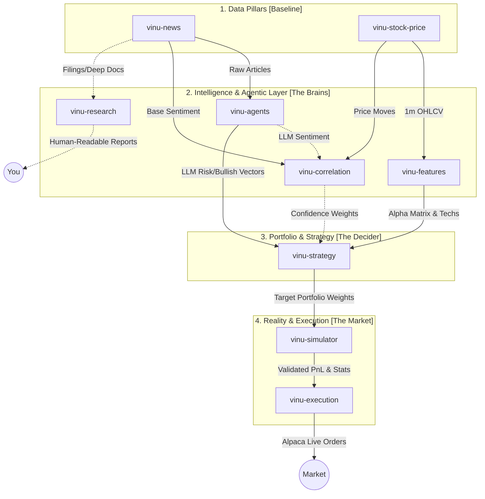
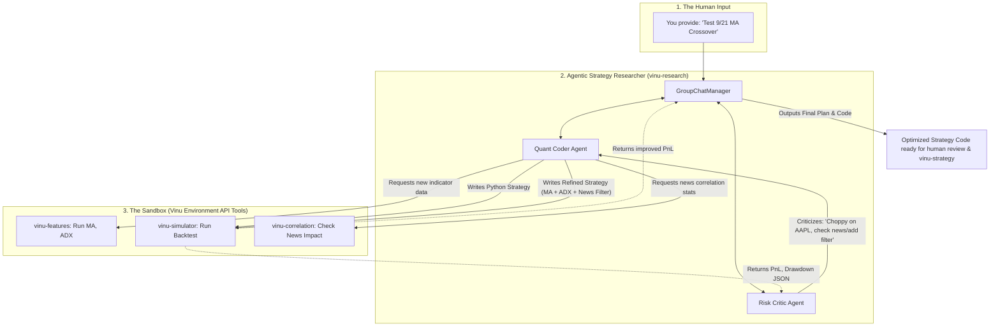

# The Agentic Strategy Researcher: Master Architecture

## High-Level Vision
This system is an **Agentic Strategy Researcher**, not just a static execution bot. The AI does not blindly execute live trades based on hunches. Instead, it acts as an iterative Quant Researcher in a safe sandbox. 

You give it a basic idea (e.g., "Test a 9/21 MA Crossover"). The multi-agent system writes the code, backtests it, criticizes the drawdowns, uses news-correlation tools to find flaws, rewrites the rules (e.g., "Add an ADX filter to handle choppy news days"), and finally outputs a highly optimized Python strategy script that a human approves before it ever touches the live execution pipeline.

---

## 1. Master Architecture Flow

---

## 2. Component Breakdown & Goals

Every component serves a dual purpose: first as a standalone quantitative engine, and second as a **tool exposed to the Agent API** for the `vinu-research` workflow.

### Phase 1: The Sandbox (Tools for the Agent)

*   **`vinu-stock-price` (Done) & `vinu-news` (Done)**
    *   **Goal:** Provide raw, deterministic facts (OHLCV candles, article sentiment scores).
    *   **Agent Usage:** Background data generation. The agent doesn't directly parse these; it uses higher-level tools.

*   **`vinu-features` (Done)**
    *   **Goal:** Translate ideas into fast numeric data matrices (from `microsoft/qlib`).
    *   **Agent Usage:** If the Agent decides "we need an ADX filter," it calls the tool `vinu_features.calculate("ADX", symbol="AAPL")`. It does NOT write raw Pandas code to calculate indicators from scratch.

*   **`vinu-correlation` (To be built)**
    *   **Goal:** Provide mathematical proof of news impact.
    *   **Agent Usage:** The Risk Critic Agent asks, "Did news cause the 15% drawdown on AAPL in August?" It calls `vinu_correlation.get_impact("AAPL")`. The tool returns: `{"high_impact_bearish_events": 4, "avg_price_drop_30m": -1.2%}`. The agent uses this fact to rewrite the strategy to avoid trading during high-impact news.

*   **`vinu-simulator` (To be built from `FinRL-Meta`)**
    *   **Goal:** The test track. A Gymnasium-style `env.step()` simulator applying 0.05% slippage and tracking equity.
    *   **Agent Usage:** The Quant Coder Agent submits a strategy. The simulator returns a clean JSON summary: `{"sharpe": 1.2, "max_drawdown": -0.15, "win_rate": 0.52}`.

### Phase 2: The Agentic Engine (The Brain)

*   **`vinu-research` (To be built from `FinRobot` autogen)**
    *   **Goal:** The multi-agent workflow that actually does the iterative "test -> criticize -> refine -> test" loop.
    *   **How it works:** It uses the `autogen` library. A **Quant Coder** agent writes the code and runs it in the simulator. A **Risk Critic** agent looks at the output, uses `vinu-correlation` to check for news interference, and tells the Coder how to fix the strategy. A **GroupChatManager** oversees the loop.

### Phase 3: Live Execution (The Real World)

*   **`vinu-strategy` (To be built from `FinRL-Trading`)**
    *   **Goal:** Host the finalized, human-approved code output by the Agent. It outputs target portfolio weights (e.g., `[AAPL: 0.20, CASH: 0.80]`).
    *   **Agent Usage:** The Agent **never** touches this. This is the isolated production server.

*   **`vinu-execution` (To be built from `FinRL-Trading`)**
    *   **Goal:** Take weights from `vinu-strategy`, run hard risk limits (stop-loss, max exposure), calculate differences vs. current holdings, and send Alpaca orders.
    *   **Agent Usage:** The Agent **never** touches this. Safety barrier ensures no hallucinated trades.

---

## 3. The Strategy Research Loop

This diagram details exactly what happens inside `vinu-research` when you ask it to optimize a strategy.

---

## 4. The Build Path to Reality

To achieve this specific Agentic Researcher vision safely, the components must be built in this exact order:

1.  **`vinu-correlation`**: Build this first. The Risk Critic Agent needs this API to mathematically query if news is causing the drawdowns it sees.
2.  **`vinu-simulator`**: Build this next. The Quant Coder Agent needs a fast, local environment to run its code and get a Sharpe ratio back. (An agent cannot code effectively without a compiler/tester).
3.  **`vinu-research`**: Build the Agent workflow. Hook up `autogen`, give the agents the tools built in steps 1 and 2, and start feeding it basic strategy ideas to see if the loop optimizes them.
4.  **`vinu-strategy` & `vinu-execution`**: Build these last. Once your Agentic Researcher is successfully printing out highly optimized, news-aware Python strategies, you build the live-trading pipeline to actually deploy them to Alpaca.
