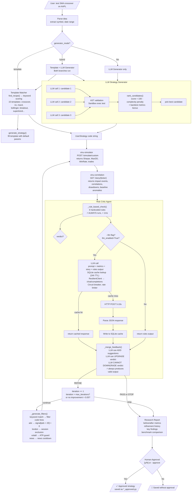
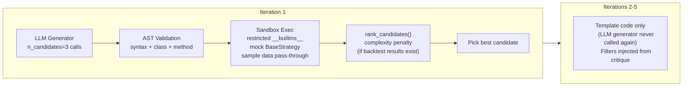

# How the Agentic Strategy Researcher Works

## 1. Overview

This project is an **Agentic Strategy Researcher** — an AI system that acts like a human quant researcher. You give it a strategy idea in plain English, and it:

1. **Generates** runnable Python strategy code from a template (or LLM)
2. **Backtests** it using realistic cost models
3. **Analyzes** why it fails using news-impact story blocks
4. **Refines** the strategy by adding filters
5. **Loops** until performance stabilizes or max iterations reached
6. **Outputs** a research report + optimized strategy code for human review

### LLM Call Budget

The system has **two independent LLM call sites**, each gated by different settings:

| Call Site | What For | Gated By | Per Iteration | Max Total |
|-----------|----------|----------|---------------|-----------|
| **Risk Critic** | Extra analysis suggestions | `--llm` flag | 1 | 5 (default iterations) |
| **Strategy Generator** | Novel code from description | `--llm` + `generator_mode=hybrid/llm` | `n_candidates` (default 3) only in **iteration 1** | 3 |

Without `--llm`: **0 LLM calls**. Everything runs on templates + deterministic rules.

With `--llm` + template mode: **1 call per iteration** (max 5).

With `--llm` + hybrid mode: **3 calls in iteration 1 + 1 per subsequent iteration** (max 8).

All LLM calls go through `ResilientClient` with circuit breaker (3 failures → 30s open), rate limiter (10/min), SQLite cache (24h TTL on risk critic only).

---

## 2. Complete Flow Diagram



---

## 3. LLM Call Details

### Call Site 1: Risk Critic Enhancement

| Property | Value |
|----------|-------|
| **Where** | `loop.py:_llm_enhanced_check()` → `llm.py:chat_json()` |
| **When** | Every iteration, if `--llm` flag is set |
| **Count** | 1 per iteration (max 5 by default, tunable via `max_iterations`) |
| **Prompt** | System: risk analyst role + JSON schema. User: backtest metrics + story blocks + rules output |
| **Output** | `{"additional_suggestions": [...], "verdict_upgrade": null\|"PASS"\|"STOP", "reasoning": "..."}` |
| **Caching** | SQLite, keyed by SHA256 of full prompt, 24h TTL |
| **Failure mode** | Any exception → returns `None` → merge returns rules output unchanged |

```
┌─────────────────────────────────────────────────────────┐
│ Iteration 1   2   3   4   5                             │
│ LLM calls:    │   │   │   │   │                         │
│   Risk Critic ✦   ✦   ✦   ✦   ✦  (if --llm enabled)    │
│   Generator   ✦✦✦                                     │
└─────────────────────────────────────────────────────────┘
```

### Call Site 2: Strategy Code Generator

| Property | Value |
|----------|-------|
| **Where** | `loop.py:_default_quant_coder()` → `llm_generator.py:generate()` |
| **When** | Only **iteration 1**, if `--llm` is set AND `generator_mode` is `hybrid` or `llm` |
| **Count** | `n_candidates` sequential calls (default 3, tunable via `llm_candidates` config) |
| **Prompt** | System: quant dev role + `BaseStrategy` interface + JSON schema. User: idea + symbol + period + indicators |
| **Output** | `{"strategy_code": "...", "features_required": [...], "reasoning": "...", "params": {...}}` |
| **Caching** | None currently |
| **Failure mode** | Failed calls are skipped (logged); remaining valid candidates used. If all fail → falls back to template |

### Complete Scenarios

#### Scenario A: No LLM (default)

```
vinu-research run "SMA crossover on AAPL" --from 2024-01-01 --to 2024-12-31
→ llm_enabled=False → self._llm = None
→ generator_mode="template" (default)
→ LLM calls: 0
```

#### Scenario B: LLM Risk Critic Only

```
vinu-research run "SMA crossover on AAPL" --from 2024-01-01 --to 2024-12-31 --llm
→ llm_enabled=True → self._llm = ResearchLlmClient()
→ generator_mode="template" (default)
→ LLM calls: 1 per iteration = max 5
```

#### Scenario C: Full Hybrid

```
vinu-research run "SMA crossover on AAPL" --from 2024-01-01 --to 2024-12-31 --llm
  -e VINU_RESEARCH_GENERATOR_MODE=hybrid
→ llm_enabled=True
→ generator_mode="hybrid"
→ LLM calls:
    Iteration 1: 3 (generator candidates) + 1 (risk critic) = 4
    Iterations 2-5: 1 (risk critic) each = 4
    Total: 8
```

#### Scenario D: LLM-Only Generator + Risk Critic

```
vinu-research run "SMA crossover on AAPL" --from 2024-01-01 --to 2024-12-31 --llm
  -e VINU_RESEARCH_GENERATOR_MODE=llm
→ llm_enabled=True
→ generator_mode="llm"
→ LLM calls: same as Scenario C (8 total), but template branch is skipped
```

---

## 4. Without LLM — Rules-Only Flow

This is the default mode. No external dependencies, deterministic, instant.

### Step-by-Step

```
$ vinu-research run "SMA20/SMA50 crossover on AAPL" --from 2024-01-01 --to 2024-12-31
```

**Stage 1 — Idea Parsing:**
- Regex extracts `AAPL` from the idea text (or uses `--symbol` if provided)
- Date validation: checks YYYY-MM-DD format, defaults to 2024-01-01 → 2024-12-31
- Keyword matching detects "crossover" → selects crossover template

**Stage 2 — Strategy Generation:**
- `generator.py:generate_strategy(recipe="crossover")`
- Fills template with defaults: fast_period=20, slow_period=50, allocation=0.98
- Produces `UserStrategy(BaseStrategy)` class with SMA crossover logic
- Strategy code is a string passed through the pipeline (not saved to disk yet)

**Stage 3 — First Backtest:**
- `ResearchTools.run_backtest()` sends the code via HTTP POST to `vinu-simulator:8085/simulate/custom`
- Simulator runs daily rebalance: buys when fast MA crosses above slow MA, sells when below
- Returns `BacktestResult` with:
  - Sharpe ratio, Max Drawdown, Win Rate, Total Return, Sortino, Calmar
  - Trade log, equity curve points

**Stage 4 — Story Fetch:**
- `ResearchTools.get_story()` calls `vinu-correlation:8083/story/AAPL?from=...&to=...`
- Returns structured facts:
  - Impact events on drawdown days
  - Per-session correlations (London r=-0.41, NY r=-0.18)
  - Baseline anomalies (high news volume days)
  - Drawdown events with news attribution

**Stage 5 — Risk Critic (Rules Only):**
- `_rule_based_check()` evaluates 6 conditions:

| # | Condition | Suggestion |
|---|-----------|------------|
| 1 | MaxDrawdown < -15% | "Add volatility guard (ATR filter)" |
| 2 | Sharpe < 0.5 | "Add ADX filter to avoid choppy markets" |
| 3 | WinRate < 40% | "Add session filter to skip London news volatility" |
| 4 | London drawdowns ≥ 2 | "Add London session exclusion filter" |
| 5 | Sharpe ≥ 1.5 AND MaxDD > -8% | **PASS** — stop iterating |
| 6 | Iteration ≥ 3 AND Sharpe < 0.3 | **STOP** — strategy is fundamentally flawed |

- Default verdict: **REFINE** with all matching suggestions

**Stage 6 — Refinement:**
- `_default_quant_coder()` receives the critique
- `_generate_filters()` matches keywords in suggestions:
  - "adx" → inserts `signal[adx < 20] = 0`
  - "london" → inserts `signal[session == 'london'] = 0`
  - "volatil" → inserts ATR guard
  - "news" or "cool" → inserts news cooldown
- Filter code lines are injected into `generate_weights()` body

**Stage 7 — Loop:**
- Repeats Stages 3-6 up to `max_iterations` (default 5)
- Stops early if:
  - Verdict is PASS or STOP
  - Sharpe hasn't improved > 0.05 in 2 consecutive iterations
  - MaxDD exceeds `max_drawdown_threshold` (default -0.25)

**Stage 8 — Report:**
- `generate_report()` formats:
  - Strategy description, ticker, time period
  - Before/After metrics table
  - Refinement history
  - Key findings
  - Optimized strategy code
  - Benchmark comparison (if benchmark data available)

**Stage 9 — Approval:**
- Strategy code saved to `output/{symbol}_{name}.py`
- Interactive prompt: "Approve this strategy for use? [y/N]"
- If approved: file renamed to `{name}_approved.py`
- If `--approve` flag set: auto-approved (non-interactive)

### Example Output (Without LLM)

```
[vinu-research] Strategy: SMA20/SMA50 crossover on AAPL
[vinu-research] Ticker: AAPL
[vinu-research] Period: 2024-01-01 → 2024-12-31
[vinu-research] Max iterations: 5
────────────────────────────────────────────
[Iteration 1] Quant Coder: Crossover strategy generated
[Iteration 1] Simulator: Sharpe=0.72, MaxDD=-18.3%, WinRate=51%
[Iteration 1] Risk Critic:
  → MaxDD -18.3% < -15% → add ATR volatility guard
  → Sharpe 0.72 > 0.5 → OK
  → WinRate 51% > 40% → OK
  → 3 drawdowns in London session → add London exclusion
  VERDICT: REFINE
────────────────────────────────────────────
[Iteration 2] Quant Coder: Added ATR filter + London session exclusion
[Iteration 2] Simulator: Sharpe=1.12, MaxDD=-9.8%, WinRate=56%
[Iteration 2] Risk Critic:
  → MaxDD -9.8% > -15% → OK
  → Sharpe 1.12 > 0.5 → OK
  → Improvement 0.40 > 0.05 → continuing
  VERDICT: REFINE
────────────────────────────────────────────
[Iteration 3] Quant Coder: Minor position sizing adjustment
[Iteration 3] Simulator: Sharpe=1.18, MaxDD=-8.2%, WinRate=58%
[Iteration 3] Risk Critic:
  → Improvement 0.06 > 0.05 → continuing
  VERDICT: REFINE
────────────────────────────────────────────
[Iteration 4] Simulator: Sharpe=1.22, MaxDD=-7.5%, WinRate=59%
[Iteration 4] Risk Critic:
  → Improvement 0.04 < 0.05 → STOP
  "Strategy stabilized. No further improvement."

=== FINAL RESEARCH REPORT ===
Strategy: SMA20/SMA50 Crossover (refined)
Ticker: AAPL
Time Period: 2024-01-01 → 2024-12-31

Refinements Applied:
  1. Volatility guard (ATR < 5% of close)
  2. London session exclusion

Before → After:
  Sharpe:         0.72 → 1.22
  Max Drawdown:  -18.3% → -7.5%
  Win Rate:      51% → 59%
  Total Return:  +8.2% → +12.4%

Optimized Strategy Code: saved to output/aapl_sma20_50.py

Approve this strategy for use? [y/N]
```

---

## 5. With LLM — Hybrid Enhancement

Run with: `vinu-research run "..." --llm`

Everything in the rules-only flow stays the same. The LLM adds an **extra layer** on top.

### What Changes

```
Stage 5 (Risk Critic) with LLM:

  ┌──────────────────────┐
  │  _rule_based_check() │ ← ALWAYS runs (same 6 rules)
  │  verdict + suggestions│
  └──────────┬───────────┘
             │
             v
  ┌──────────────────────┐
  │  LLM configured?     │──No──→ return rules output
  └──────────┬───────────┘
             │ Yes
             v
  ┌──────────────────────┐
  │  SQLite cache lookup │
  │  SHA256(propmt)      │──Hit──→ return cached response
  └──────────┬───────────┘
             │ Miss
             v
  ┌──────────────────────┐
  │  TokenBucket.wait()  │ ← 10 requests/min rate limit
  └──────────┬───────────┘
             │
             v
  ┌──────────────────────┐
  │  Call /chat/completions│
  │  via ResilientClient │
  │  (circuit breaker,   │
  │   retry 2x, 120s tout)│
  └──────────┬───────────┘
             │
             v
  ┌──────────────────────┐
  │  Parse JSON response │
  │  Write to SQLite     │
  └──────────┬───────────┘
             │ success     │ failure
             v             v
  ┌──────────────────┐   return None
  │  _merge_feedback()│ ← rules + LLM
  │  LLM can ADD      │
  │  LLM can UPGRADE  │
  │  CANNOT DOWNGRADE │
  └──────────────────┘
```

### Example LLM Prompt (Risk Critic)

```
SYSTEM: You are a senior quantitative risk analyst...
        Return JSON: {"additional_suggestions": [...], "verdict_upgrade": null}

USER: Strategy: SMA20/SMA50 crossover on AAPL
Period: 2024-01-01 → 2024-12-31

Backtest Results:
- Sharpe: 0.72
- MaxDD: -18.3%
- Win Rate: 51%
- Total Return: +8.2%

Rule-based suggestions:
  1. Max drawdown exceeds 15% — add volatility guard
  2. Multiple drawdowns in London session

Story Blocks:
  Drawdown events: 3 (drop -12.3%, sessions: london,ny_regular)
  Session correlations: london r=-0.41, ny_regular r=-0.18
  Baseline anomalies: 2 high-deviation days in London
```

### Example LLM Response

```json
{
  "additional_suggestions": [
    "Losses concentrate in London pre-market gap — add 30min cooldown after London news spikes",
    "Negative correlation in London (r=-0.41) suggests news-driven reversals — add RSI confirmation filter"
  ],
  "verdict_upgrade": null,
  "reasoning": "Rules caught the London issue but missed the specific cooldown timing and the RSI confirmation pattern visible in the London correlation data"
}
```

### Merged Result

- Rules suggestions: `["Add volatility guard", "Add London session exclusion"]`
- LLM suggestions: `["Add 30min cooldown after London news spikes", "Add RSI confirmation filter"]`
- Merged: `["Add volatility guard", "Add London session exclusion", "Add 30min cooldown after London news spikes", "Add RSI confirmation filter"]`
- Verdict: REFINE (rules said REFINE, LLM didn't upgrade)

---

## 6. LLM Generator Detail

When `generator_mode` is `hybrid` or `llm` AND `--llm` is set, the strategy code is generated by the LLM instead of (or in addition to) the template matcher.



```
┌─────────────────────────────────────────────────────────────┐
│ LlmStrategyGenerator.generate()                             │
│                                                             │
│  for i in range(n_candidates):  ← default 3                │
│    candidate = await _generate_one()                        │
│      │                                                      │
│      ├─ _build_generation_prompt()                          │
│      │    system:  "You are a senior quantitative analyst"  │
│      │    user:    "Generate SMA crossover for AAPL..."     │
│      │                                                      │
│      ├─ self._llm.chat_json(system, user)                   │
│      │    → HTTP POST /chat/completions                     │
│      │    → parse response JSON                             │
│      │                                                      │
│      ├─ validate_code()          ← AST parse & safety check │
│      ├─ validate_sandbox()       ← restricted exec()        │
│      └─ return LlmCandidate or None                         │
│                                                             │
│  return [candidate, candidate, ...]  ← only valid ones      │
└─────────────────────────────────────────────────────────────┘
```

---

## 7. Phase 2 Enhancements (Benchmark + Extended Generator)

The system has been extended with two major enhancements:

### Benchmark Comparison

- **New module**: `benchmark.py` — pure numpy/pandas, no simulator dependency
- Fetches benchmark data (SPY default) from `stock-price` service
- Computes: Alpha, Beta, Information Ratio, Tracking Error, Up/Down Capture, Market Correlation, Relative Max Drawdown, Excess CAGR
- Displayed in report as side-by-side comparison table
- Risk critic has 4 new benchmark-aware rules:
  - Negative alpha → "consider hedging"
  - IR < 0.5 → "strategy doesn't justify active risk"
  - Down capture > 1.2 → "amplifies losses vs benchmark"
  - Underperforming CAGR → "strategy trails benchmark"

### Strategy Generator Upgrade

| Feature | Before | After |
|---------|--------|-------|
| Templates | 3 (crossover, rsi, momentum) | 15 (added macd, vwap, bollinger, zscore, roc, breakout, volatility breakout, supertrend, adx_filtered, volume_breakout, momentum_mr) |
| Keyword routing | `if "crossover" in idea` | `find_recipe()` with scored matching (`score = n_matched * 500 - n_keywords * 10 + matched_length + word_hits * 5`) |
| LLM generation | None | `LlmStrategyGenerator` with AST validation + sandbox exec + ranking |
| Comparison | None | `rank_candidates()` scores by complexity penalty + backtest metrics |

---

## 8. Stage-by-Stage Breakdown

### Stage 1: Idea Parsing

| Aspect | Detail |
|--------|--------|
| **What happens** | Regex extracts ticker `[A-Z]{1,5}` from text, filters against known non-tickers ("FOR", "GET", etc.). Dates default to 2024-01-01 → 2024-12-31 if not provided. |
| **Code location** | `cli.py:_extract_symbol()`, `_validate_date()`, `run_main()` |
| **Tunable** | `--symbol`, `--from`, `--to` CLI flags override auto-detection |
| **Error sources** | No ticker found → defaults to AAPL. Invalid date format → ValueError with message. |
| **Deterministic?** | Yes — same input always produces same output |

### Stage 2: Strategy Generation

| Aspect | Detail |
|--------|--------|
| **What happens** | **Template path**: Keyword matching on user idea via `find_recipe()` → selects from 15 templates by scored match. Template filled with default params. **LLM path**: `LlmStrategyGenerator.generate()` makes `n_candidates` LLM calls, validates each with AST + sandbox, ranks results. **Hybrid path**: Both run, LLM candidate used in iteration 1. |
| **Code location** | `generator.py:generate_strategy()`, `loop.py:_default_quant_coder()`, `llm_generator.py` |
| **Tunable** | Template params via `params` dict. LLM candidates via `llm_candidates` config. Mode via `generator_mode`. |
| **Error sources** | Unrecognized idea → defaults to crossover template. LLM fails → falls back to template. Sandbox fails → candidate skipped. |
| **Deterministic?** | Template: Yes. LLM: No. |

### Stage 3: Backtest

| Aspect | Detail |
|--------|--------|
| **What happens** | Strategy code sent to `vinu-simulator:8085/simulate/custom` via `ResilientClient.post()`. Simulator imports the code, runs `UserStrategy.generate_weights()` on OHLCV data, simulates daily rebalance with costs. Returns JSON with metrics + trade log. Response parsed into `BacktestResult` dataclass. |
| **Code location** | `tools.py:run_backtest()`, `loop.py:_run_backtest()` |
| **Tunable** | `initial_capital`, `transaction_cost_pct`, `slippage_pct`, `allow_short` via config or CLI flags. Indicators list via `--indicators`. |
| **Error sources** | **Simulator service down** → `ResilientClient` retries 2x, then raises `RuntimeError`. **Missing price data** → simulator returns zero metrics. **Strategy code has syntax error** → simulator returns 422 HTTP error. **Timeout** → circuit breaker opens after 3 failures, subsequent calls fast-fail. |
| **Deterministic?** | Yes (same code + same data = same result) |

### Stage 4: Story Fetch

| Aspect | Detail |
|--------|--------|
| **What happens** | Calls `vinu-correlation:8083/story/{symbol}` via `ResilientClient.get()`. Returns impact events, per-session correlations, drawdown events, baseline anomalies. Cached in memory via `_LRUCache` (max 64 entries) — same symbol+dates range only fetched once per run. |
| **Code location** | `tools.py:get_story()`, `loop.py:run()` (cache logic) |
| **Tunable** | Not directly tunable — depends on correlation service configuration |
| **Error sources** | **Correlation service down** → returns None → Risk Critic skips story-dependent rules. **Empty data for symbol** → returns empty events list → rules still run on metrics only. **Timeout** → `ResilientClient` returns fallback=None. |
| **Deterministic?** | Yes (same symbol + dates = same story) |

### Stage 5: Rule-Based Check

| Aspect | Detail |
|--------|--------|
| **What happens** | 6 if-statements evaluated in order. Each checks a metric threshold and appends a text suggestion. Early return for PASS (Sharpe≥1.5 + MaxDD>-8%) or STOP (iteration≥3 + Sharpe<0.3). Default returns REFINE with all matched suggestions (or generic suggestion if none matched). Then 4 benchmark rules check if benchmark data is available. |
| **Code location** | `loop.py:_rule_based_check()` |
| **Tunable** | Thresholds are hardcoded in the method. `max_drawdown_threshold` and `improvement_threshold` from config affect the **loop** stop conditions (not the rule check itself). |
| **Error sources** | **Story is None** → London drawdown rule skipped. **Metrics are all zeros** → all rules fire, generic suggestion added. **No crash possible** — always returns a valid `CriticFeedback`. |
| **Deterministic?** | Yes — same metrics + story = same output |

### Stage 6: LLM Check (Optional)

| Aspect | Detail |
|--------|--------|
| **What happens** | Checks if `self._llm` exists and `is_configured()`. Checks SQLite cache by SHA256 prompt hash. If miss: builds prompt with metrics + story + rules output. `TokenBucket.wait()` for rate limit. Calls `POST /chat/completions` via `ResilientClient` with 120s timeout. Response cached in SQLite for 24h. JSON parsed and returned. ANY exception → logs warning, returns None. |
| **Code location** | `llm.py:ResearchLlmClient.chat_json()`, `loop.py:_llm_enhanced_check()` |
| **Tunable** | `llm_enabled`, `llm_base_url`, `llm_model`, `llm_api_key`, `llm_ttl_sec` via config/env. Model temperature hardcoded to 0.2. |
| **Error sources** | **LLM unreachable** → `ResilientClient` retries 2x, then returns None → fallback to rules. **Bad JSON response** → `_parse_json()` returns None → not cached, returns None. **Rate limited** → `TokenBucket.wait_async()` blocks until token available (max ~6s). **Circuit breaker open** → returns None immediately. **Timeout** → 120s timeout, returns None. **Cache hit** → returns cached response, no HTTP call. |
| **Deterministic?** | No — LLM can give different responses for same input |

### Stage 7: Merge

| Aspect | Detail |
|--------|--------|
| **What happens** | If LLM returned None → rules output returned unchanged. If LLM returned suggestions → deduplicated against rules suggestions, appended. If LLM set verdict_upgrade and rules verdict is REFINE → upgraded to PASS or STOP. LLM cannot change a rules PASS or STOP. |
| **Code location** | `loop.py:_merge_feedback()` |
| **Tunable** | Not tunable |
| **Error sources** | **No crash possible** — always returns valid `CriticFeedback`. LLM None → return rules. LLM has bad keys → `llm.get("additional_suggestions", [])` returns empty list. |
| **Deterministic?** | Yes — same inputs always produce same merge |

### Stage 8: Code Generation

| Aspect | Detail |
|--------|--------|
| **What happens** | Takes the critique suggestions, matches keywords ("adx", "session", "london", "volatil", "cool", "news"), inserts corresponding filter code lines into the strategy template's `generate_weights()` method. Only recognized keywords produce code — unrecognized suggestions are ignored. |
| **Code location** | `loop.py:_generate_filters()` |
| **Tunable** | Adding new filter patterns requires editing `_generate_filters()` in `loop.py`. |
| **Error sources** | **No crash possible** — unrecognized suggestions produce no filter lines. Strategy template always produces valid Python. |
| **Deterministic?** | Yes |

### Stage 9: Report Generation

| Aspect | Detail |
|--------|--------|
| **What happens** | Formats before/after metrics comparison, iteration history table (Iter \| Sharpe \| MaxDD \| WinRate \| Verdict), key findings deduplicated from all critiques, optimized strategy code block. If benchmark data exists, adds side-by-side comparison (CAGR, Sharpe, MaxDD, Vol, Win Rate) and conditional Alpha/Beta/Capture sub-sections. Outputs Markdown string. |
| **Code location** | `report.py:generate_report()` |
| **Tunable** | Not tunable |
| **Error sources** | **No crash possible** — always produces valid Markdown. Empty history → shows "Final Metrics" without before/after comparison. No best result → skips benchmark comparison. |
| **Deterministic?** | Yes |

### Stage 10: Approval

| Aspect | Detail |
|--------|--------|
| **What happens** | If `--approve` flag → auto-approved. If interactive TTY → `input("Approve? [y/N]")`. If non-TTY or EOF → not approved. Approved file renamed to `*_approved.py`. |
| **Code location** | `cli.py:run_main()` |
| **Tunable** | `--approve` flag |
| **Error sources** | **Non-TTY stdin** → defaults to not approved. **File write permission denied** → error message printed, strategy code still in result object. **KeyboardInterrupt during prompt** → treated as not approved. |
| **Deterministic?** | Yes (conditional on user input) |

---

## 9. Without LLM vs With LLM — Comparison

| Aspect | Without LLM | With LLM |
|--------|-------------|----------|
| **Critic intelligence** | 6 hardcoded threshold rules | Rules + LLM reading full story blocks |
| **Catches** | Common patterns (ADX for low Sharpe, ATR for high volatility, London session for win rate) | Nuanced patterns ("losses cluster 30min after London news spikes", "negative London correlation suggests RSI confirmation needed") |
| **Strategy generation** | 15 templates with keyword routing | LLM generates novel strategies + validates via AST + sandbox |
| **Speed per iteration** | Instant (< 1ms for critic) | +5-10s for LLM call (depends on model) |
| **Dependencies** | None — fully self-contained | Ollama or OpenAI-compatible API at `VINU_LLM_BASE_URL` |
| **Reliability** | 100% deterministic — same input always same output | Non-deterministic — LLM may give different suggestions each run |
| **Fallback behavior** | N/A — rules always work | LLM fails → rules output returned unchanged |
| **Cost** | Free | LLM compute time + token cost |
| **Verdict safety** | Rules are final | LLM can only upgrade REFINE→PASS/STOP, cannot downgrade PASS or STOP |
| **Caching** | Not needed | SQLite cache with 24h TTL — same prompt reuses cached response |
| **Rate limiting** | Not needed | TokenBucket at 10 requests/minute |
| **Circuit breaker** | Not needed | 3 failures → open for 30s → fast-fail with fallback |
| **LLM calls per run** | 0 | 1–8 depending on mode + iterations |

### Call Count by Mode

| Mode | `--llm` | `generator_mode` | Iter 1 | Iter 2-5 | Total |
|------|---------|------------------|--------|-----------|-------|
| Default | No | template | 0 | 0 | **0** |
| LLM Critic + Template | Yes | template | 1 | 1 each | **5** |
| LLM Critic + Hybrid | Yes | hybrid | 4 (3 gen + 1 critic) | 1 each | **8** |
| LLM Critic + LLM Gen | Yes | llm | 4 (3 gen + 1 critic) | 1 each | **8** |

---

## 10. Tunability Summary

All configurable via environment variables or CLI flags:

| Variable | CLI Flag | Default | What It Controls |
|----------|----------|---------|-----------------|
| `VINU_RESEARCH_MAX_ITERATIONS` | `--max-iterations` | `5` | Maximum refinement rounds |
| `VINU_RESEARCH_IMPROVEMENT_THRESHOLD` | — | `0.05` | Minimum Sharpe improvement to continue |
| `VINU_RESEARCH_MAX_DRAWDOWN_THRESHOLD` | — | `-0.25` | MaxDD below this → immediate stop |
| `VINU_RESEARCH_INITIAL_CAPITAL` | `--capital` | `1000000.0` | Starting portfolio value for backtest |
| `VINU_RESEARCH_TRANSACTION_COST_PCT` | — | `0.001` | Commission per trade (0.1%) |
| `VINU_RESEARCH_SLIPPAGE_PCT` | — | `0.0005` | Slippage per trade (0.05%) |
| `VINU_RESEARCH_ALLOW_SHORT` | — | `true` | Allow short positions |
| `VINU_RESEARCH_LLM_ENABLED` | `--llm`/`--no-llm` | `false` | Enable LLM-enhanced risk analysis |
| `VINU_LLM_BASE_URL` | — | `http://127.0.0.1:11434/v1` | OpenAI-compatible API endpoint |
| `VINU_LLM_MODEL` | — | `llama3.2` | Model name for chat completions |
| `VINU_LLM_API_KEY` | — | (none) | Bearer token for API auth |
| `VINU_RESEARCH_LLM_TTL_SEC` | — | `86400` | LLM response cache TTL (24h) |
| `VINU_RESEARCH_GENERATOR_MODE` | — | `template` | `template`, `hybrid`, or `llm` |
| `VINU_RESEARCH_LLM_CANDIDATES` | — | `3` | Number of LLM generator candidates |
| `VINU_STOCK_PRICE_API_URL` | — | `http://127.0.0.1:8081` | Stock price service for benchmark data |
| `VINU_RESEARCH_BENCHMARK_SYMBOL` | — | `SPY` | Benchmark symbol for comparison |

---

## 11. Common Error Scenarios & Recovery

| Error | Stage | What Happens | Recovery |
|-------|-------|-------------|----------|
| Simulator service down | 3 (Backtest) | `ResilientClient` retries 2x with backoff, then raises `RuntimeError`. Loop breaks with partial results. | Start simulator service. Run with smaller date range to reduce load. |
| Correlation service down | 4 (Story) | `ResilientClient` returns None → story is empty. Risk Critic skips London drawdown rule. Rules still run on metrics alone. | Start correlation service. System works with degraded analysis. |
| No news data for symbol | 4 (Story) | Story returns empty events list. Same as service down — rules run without story analysis. | Check news service has data for the symbol and date range. |
| LLM service down | 6 (LLM) | Circuit breaker opens after 3 failures → subsequent calls return None immediately. Merge returns rules output unchanged. User sees log warning. | Start Ollama/API service. System works without LLM. |
| LLM returns bad JSON | 6 (LLM) | `_parse_json()` returns None → not cached → `_llm_enhanced_check()` returns None. Merge returns rules output. | No action needed — result is same as LLM disabled. |
| LLM generator returns invalid code | 2 (Generator) | `validate_code()` or `validate_sandbox()` returns False → candidate skipped. If all 3 fail, falls back to template. | No action needed — system degrades gracefully. |
| Market data gaps | 3 (Backtest) | Simulator's internal forward fill handles missing bars. Fewer trades executed during gap periods. | Ensure stock-price service is ingesting data for the period. |
| Strategy code syntax error | 3 (Backtest) | Simulator returns 422 HTTP error. `ResilientClient` raises exception. Loop logs warning and breaks with best-so-far result. | Generated code is always valid Python — this would indicate a bug in generator. |
| All metrics zero | 3 (Backtest) | All rules fire, generic "try tightening position sizing" suggestion added. Loop continues refinement. | No crash — system handles gracefully but refinement may not improve. |
| Max iterations reached | 7 (Loop) | Loop exits normally with best result (may be from earlier iteration if recent ones didn't improve). Report shows all iterations. | Increase `--max-iterations` or check if strategy has fundamental issues. |
| Invalid date format | 1 (Parse) | `_validate_date()` raises `ValueError` with message. CLI catches and exits with error. User sees: "Invalid --from: 'date'. Expected format: YYYY-MM-DD". | Provide date in correct format. |
| KeyboardInterrupt | Any | `asyncio.run()` catches Ctrl+C → "Interrupted by user" → exits with code 130. Best-so-far result is lost (not saved). | Use `--quiet` to reduce output noise. Results are not persisted in CLI mode. |
| Benchmark service unavailable | 3 (Backtest) | `get_benchmark_data()` returns None → benchmark section omitted from report, benchmark rules skipped. | Start stock-price service. System works without benchmark comparison. |
