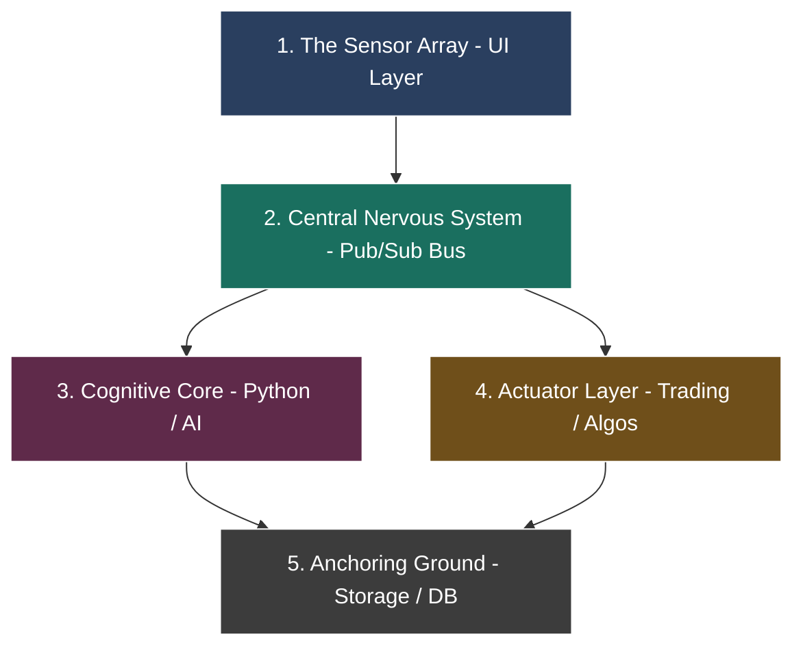

# Architectural Mind Map & Codebase Index

This document outlines the core mental model and the reorganized conceptual index for **Fincept Terminal**. It serves as a structural map of the systems, processes, and directory layouts that orchestrate this high-performance desktop workstation.

---

## 1. Core Architectural Analogies

To understand the system at a high level, we organize the codebase into five distinct core analogies:



### 🧠 The Central Nervous System (Data Bus)
This layer acts as the system's communication backbone. Instead of direct connections between components, a central publisher-subscriber broker manages all communications, maintaining loose coupling and scalability.
*   **Key File:** [DataHub.cpp](file:///c:/Users/vinay/Desktop/FinceptTerminal/fincept-qt/src/datahub/DataHub.cpp) - Coordinates thread-safe subscriptions and real-time event dispatching for tickers, news, and executions.

### ⚙️ The Actuator Layer (Execution & Rules Engine)
This layer translates signals and analysis into actions, such as calculating technical indicators, checking account limits, and executing trades.
*   **Key Files:** 
    *   [AlgoEngine.cpp](file:///c:/Users/vinay/Desktop/FinceptTerminal/fincept-qt/src/algo_engine/AlgoEngine.cpp) - The main loop managing algo strategy lifecycles.
    *   [PaperTrading.cpp](file:///c:/Users/vinay/Desktop/FinceptTerminal/fincept-qt/src/trading/PaperTrading.cpp) - Local simulated order matching.

### 💡 The Cognitive Core (Python, NLP, & AI)
This layer runs calculations that are easier to implement in Python or require machine learning. It hosts the embedded Python interpreter and model integration interfaces.
*   **Key Files:**
    *   [PythonRunner.cpp](file:///c:/Users/vinay/Desktop/FinceptTerminal/fincept-qt/src/python/PythonRunner.cpp) - Executes Python modules asynchronously.
    *   [McpClient.cpp](file:///c:/Users/vinay/Desktop/FinceptTerminal/fincept-qt/src/mcp/McpClient.cpp) - Manages Model Context Protocol configurations to let LLMs access terminal functions.

### 👁️ The Sensor Array (UI & Custom Display)
Handles human-computer interaction, docking window layout states, custom graphics rendering, and theme application.
*   **Key Files:**
    *   [main.cpp](file:///c:/Users/vinay/Desktop/FinceptTerminal/fincept-qt/src/app/main.cpp) - Application bootstrapping.
    *   [WindowFrame.cpp](file:///c:/Users/vinay/Desktop/FinceptTerminal/fincept-qt/src/app/WindowFrame.cpp) - Custom OS-integrated borderless framing.
    *   [DockScreenRouter.cpp](file:///c:/Users/vinay/Desktop/FinceptTerminal/fincept-qt/src/app/DockScreenRouter.cpp) - Flexible viewport panel operations.

### 🗄️ The Anchoring Ground (Storage & Security)
Handles local configuration persistence, SQLite historical databases, secure encrypted wallets, and session logs.
*   **Key Directory:** [storage/](file:///c:/Users/vinay/Desktop/FinceptTerminal/fincept-qt/src/storage)

---

## 2. Re-Indexed Folder Structure (Modular View)

If we were to reorganize the project directories to map directly to these chapters, the physical structure would align as follows:

```
fincept-qt/
├── core_os/                   # Chapter 1: The Core Infrastructure
│   ├── app/                   # App shell, main entry points, window frame managers
│   ├── core/                  # Session, logging, crash handlers, i18n translation
│   └── datahub/               # Thread-safe pub-sub message broker
│
├── cognitive_core/            # Chapter 2: The Cognitive Engine
│   ├── python/                # Embedded C++ Python runtime host & workers
│   ├── mcp/                   # Model Context Protocol client & server handlers
│   └── services/llm/          # Direct API clients for generative LLM integration
│
├── actuators/                 # Chapter 3: Execution Runtimes
│   ├── trading/               # Broker interfaces, accounts, order validators
│   └── algo_engine/           # Indicators, scanners, backtester engines
│
└── presentation/              # Chapter 4: The Interface Layer
    ├── ui/                    # Reusable charts, tables, themes, markdown controls
    ├── screens/               # Modular dashboards (Markets, News, Crypto, etc.)
    └── services/              # Screen backends matching presentation layers
```

> [!NOTE]
> Separating the system into these specific folders allows developers to isolate frontend presentation changes from core real-time trading logic or background Python computations.
