# News Intelligence Pipeline

This document explains the architecture of the real-time news analysis, enrichment, and natural language processing (NLP) system within the Fincept Terminal.

---

## 1. Pipeline Flow

```mermaid
graph LR
    Ingress[1. Ingress Raw News] --> Gatekeeper[2. Ingestion & Credibility Check]
    Gatekeeper --> Evaluator[3. Sentiment & Threat Evaluation]
    Evaluator --> Assoc[4. NER & Synonym Matching]
    Assoc --> Cluster[5. Cosine Similarity Clustering]
    Cluster --> UI[6. UI Dispatch & Rendering]

    style Ingress fill:#4c6ef5,stroke:#fff,color:#fff
    style Gatekeeper fill:#12b886,stroke:#fff,color:#fff
    style Evaluator fill:#fa5252,stroke:#fff,color:#fff
    style Assoc fill:#fab005,stroke:#fff,color:#fff
    style Cluster fill:#7950f2,stroke:#fff,color:#fff
    style UI fill:#2b8a3e,stroke:#fff,color:#fff
```

---

## 2. Ingestion & Credibility (The Gatekeeper)
When raw news arrives from external APIs or scrapers, it is filtered for reliability and priority:
*   **Source Credibility Mapping:** Sources are cross-referenced with a defined credibility library:
    *   *State Media:* Outlets like `XINHUA` and `RT` are tagged as `STATE MEDIA` to alert the user of potential bias.
    *   *Caution Outlets:* Unverified or speculative blogs (e.g., `ZEROHEDGE`) are flagged with `CAUTION`.
*   **Priority Classification:** Headlines are checked for urgent markers:
    *   "breaking" / "alert" $\rightarrow$ `FLASH`
    *   "urgent" / "emergency" $\rightarrow$ `URGENT`
    *   "announce" / "report" $\rightarrow$ `BREAKING`
*   **Language Parsing:** Evaluates script unicode blocks to auto-detect language feeds (Japanese, Chinese, Arabic, Russian, Hindi, or English).

---

## 3. Sentiment & Threat Evaluation (The Evaluator)
Implemented in [news_classifier.py](file:///c:/Users/vinay/Desktop/FinceptTerminal/Z_Vinayaka/news/python_news_code/news_classifier.py), this module scores incoming articles based on financial impact:

### A. Net Sentiment Score
The algorithm assigns positive and negative weights to key financial verbs:
*   **Positives:** *Surge, soar, skyrocket, boom* carry $+3$ weights; *rally, gain, jump, rebound* carry $+2$; *strong, robust, stellar* carry $+1$.
*   **Negatives:** *Crash, plunge, collapse, bankruptcy* carry $-3$ weights; *fall, drop, slump, recession* carry $-2$; *weak, loss, fear, warning* carry $-1$.

$$\text{Net Sentiment Score} = \sum(\text{Positive Weights}) - \sum(\text{Negative Weights})$$

*   $\text{Score} \ge 1 \rightarrow$ **BULLISH**
*   $\text{Score} \le -1 \rightarrow$ **BEARISH**
*   Otherwise $\rightarrow$ **NEUTRAL**

### B. Impact Level
*   **HIGH:** If priority is `FLASH`/`URGENT` or sentiment strength (absolute net score) is $\ge 6$.
*   **MEDIUM:** If priority is `BREAKING` or sentiment strength is $\ge 3$.
*   **LOW:** Default baseline.

### C. Threat Vector Classification
Matches headlines against threat levels to gauge macroeconomic and geopolitical risks:
*   **CRITICAL:** Matches like "nuclear strike", "war declared", "market crash" ($85\%\text{--}95\%$ confidence).
*   **HIGH:** Matches like "invasion", "military deploy", "bankruptcy filing", "profit warning".
*   **MEDIUM:** Matches like "protest", "tariff", "regulation", "layoff".

---

## 4. Entity Extraction & Synonyms (The Association Engine)
Implemented in [news_nlp_processor.py](file:///c:/Users/vinay/Desktop/FinceptTerminal/Z_Vinayaka/news/python_news_code/news_nlp_processor.py), this step parses text to identify relevant metadata:
*   **Known Figure NER:** Maps generic names to unified tags (e.g., "Powell" $\rightarrow$ "Jerome Powell", "Musk" $\rightarrow$ "Elon Musk").
*   **Geopolitical NER:** Maps country variations to ISO country codes (e.g., "Beijing", "Shanghai", "China" $\rightarrow$ `CN`).
*   **Equity Ticker Capture:** Extracts uppercase 2-5 letter tokens, excluding common stop-words (like `GDP`, `ETF`, `CEO`).
*   **Synonym Normalization:** Resolves synonyms to common base tokens to ensure calculations are accurate (e.g., *sanctions, sanctioned* $\rightarrow$ *sanction*; *rates, rate* $\rightarrow$ *interest_rate*).

---

## 5. Semantic Cosine Similarity Clustering
To prevent news feeds from being cluttered with duplicate or syndicated articles, the NLP engine clusters related reports together:
1.  **Tokenizer:** Sanitizes text, removes noise, and maps synonyms.
2.  **TF-IDF Vectorization:** Constructs term vectors using Term Frequency normalized by Document Frequency:
    $$\text{TF-IDF} = \frac{\text{Term Count}}{\text{Total Terms}} \times \left( \ln\left(\frac{N + 1}{\text{DF} + 1}\right) + 1 \right)$$
3.  **Cosine Proximity:** Evaluates the cosine angle between two article vectors $A$ and $B$:
    $$\text{Similarity}(A, B) = \frac{A \cdot B}{\|A\| \|B\|}$$
4.  **Clustering:** Articles with a similarity score $\ge 0.25$ are grouped into a single thread. The user interface collapses these duplicate entries, highlighting the "Lead Headline."

---

## 6. UI Dispatch & Consumption
*   Once enriched, the article data is formatted as JSON and dispatched through the DataHub.
*   The C++ widget [NewsScreen.cpp](file:///c:/Users/vinay/Desktop/FinceptTerminal/fincept-qt/src/screens/news/NewsScreen.cpp) receives the payload, formatting it with visual indicators (green highlight for bullish, red for bearish, hazard badges for high threat levels) for the end-user.
