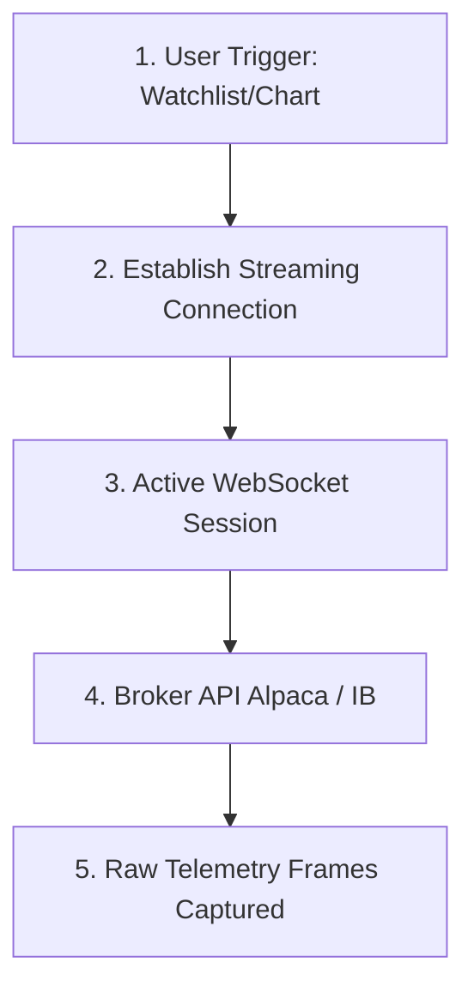

# Step 1: Ingestion & Streaming (The Ingress)

This document details the first phase of the stock analysis lifecycle: establishing streaming connections and capturing raw market telemetry.

---

## 1. Streaming Architecture

---

## 2. Ingestion Operations

### A. Connection Triggers
*   **Manual Trigger:** A user opens a stock chart or adds a symbol to a monitor.
*   **Automated Trigger:** A background scanning daemon initializes a scan for a specific sector.

### B. Stream Connection Type
The system uses real-time WebSockets to streaming data APIs.
*   **Interactive Brokers Adapter:** Handled via custom sockets.
*   **Alpaca Adapter:** Establishes TLS-secured streaming WebSocket connections to process tick feeds.

### C. Capturing Raw Telemetry Frames
The stream captures two classes of real-time packets:
1.  **L1 Market Trades & Quotes:** Inside bid/ask quotes and volume sizes are read continuously.
2.  **OHLCV Bar Intervals:** Periodically (every minute, hourly, or daily), the feed pushes completed bars representing high, low, open, close, and volume markers.

---

## 3. The 4 Tiers of News Explanation
The news intelligence parser groups incoming information into four distinct priority levels to weight their impact on stock analysis:
*   **Tier 1: Wire Services & Regulators (High Priority):** Raw press wires (AP), corporate disclosures (SEC filings), and central bank announcements (Federal Reserve, ECB, BoE). These are primary sources that drive immediate interest rate and policy shifts.
*   **Tier 2: Global & Financial Media (Medium Priority):** Institutional outlets (Bloomberg, WSJ, CNBC, MarketWatch, Nikkei, SCMP) providing market reporting, regional macro updates, and expert analysis.
*   **Tier 3: Specialized Blogs & Geopolitical Intelligence (Low Priority):** Macro commentary blogs (ZeroHedge, Calculated Risk) and defense portals (Bellingcat) for tracking alternative financial views and conflict developments.
*   **Tier 4: Curation Forums & Tech Blogs (Informational):** Technology outlets (TechCrunch, Wired) and developer aggregators (Hacker News) that highlight emerging sectors or micro-trends.

---

## 4. News API and RSS Source Links
The following table outlines the exact RSS and XML endpoints queried in the background:

### Tier 1 Feed Links
*   **AP Top News:** `https://rsshub.app/apnews/topics/ap-top-news`
*   **SEC Press Releases:** `https://www.sec.gov/news/pressreleases.rss`
*   **Federal Reserve Feed:** `https://www.federalreserve.gov/feeds/press_all.xml`
*   **European Central Bank (ECB) Press:** `https://www.ecb.europa.eu/rss/press.html`
*   **Bank of England (BoE) News:** `https://www.bankofengland.co.uk/rss/news`
*   **UN News:** `https://news.un.org/feed/subscribe/en/news/all/rss.xml`

### Tier 2 Feed Links
*   **Bloomberg Markets:** `https://feeds.bloomberg.com/markets/news.rss`
*   **WSJ Markets:** `https://feeds.a.dj.com/rss/RSSMarketsMain.xml`
*   **WSJ World News:** `https://feeds.a.dj.com/rss/RSSWorldNews.xml`
*   **CNBC Finance:** `https://search.cnbc.com/rs/search/combinedcms/view.xml?partnerId=wrss01&id=100003114`
*   **MarketWatch Stories:** `https://feeds.marketwatch.com/marketwatch/topstories/`
*   **Seeking Alpha Currents:** `https://seekingalpha.com/market_currents.xml`
*   **Investing.com:** `https://www.investing.com/rss/news.rss`
*   **The Economist (Finance):** `https://www.economist.com/finance-and-economics/rss.xml`
*   **Nikkei Asia Feed:** `https://asia.nikkei.com/rss/feed/nar`
*   **South China Morning Post (SCMP):** `https://www.scmp.com/rss/91/feed`
*   **BBC World Feed:** `http://feeds.bbci.co.uk/news/world/rss.xml`

### Tier 3 & 4 Feed Links
*   **ZeroHedge:** `https://feeds.feedburner.com/zerohedge/feed`
*   **Calculated Risk:** `https://feeds.feedburner.com/CalculatedRisk`
*   **Wolf Street:** `https://wolfstreet.com/feed/`
*   **Bellingcat Feed:** `https://www.bellingcat.com/feed/`
*   **Hacker News Frontpage:** `https://hnrss.org/frontpage`

---

## 5. News Fetching Logic (Simplified)
To balance speed and capability, the terminal fetches news using two distinct methods:

1.  **C++ Polling (Standard RSS Feeds):**
    *   **How it works:** The terminal periodically downloads standard RSS feeds using high-speed C++ networking.
    *   **Parsing:** It parses the XML data directly using `QXmlStreamReader`.
    *   **Cleaning:** It strips standard HTML tags (like ` ` or `<a>`) using lightweight Regular Expressions to ensure that parsing summaries is fast and does not cause the user interface to stutter.
    
2.  **Python Scraping (Complex Websites):**
    *   **How it works:** For websites that do not publish clean RSS feeds (such as the Bank of Japan website or economic calendar tables), the C++ program runs background Python workers.
    *   **Parsing:** The Python workers use `requests` to fetch the raw web page, and **`BeautifulSoup`** to find, isolate, and extract specific values (such as interest rate numbers or calendar tables) from the HTML structure.
    *   **Return:** The cleaned data is returned to the C++ application as structured JSON.

---

## 6. Error Handling & Resilience
To prevent connection drops, dead endpoints, or format shifts from breaking the terminal, the ingestion engine uses the following error-handling strategies:

### A. C++ Feed Ingestion Resilience
*   **Request Timeouts:** Each RSS HTTP request is configured with a strict timeout limit (`kFeedTransferTimeoutMs = 4000` or 4 seconds). If a server hangs, the socket is destroyed to prevent resource leakage.
*   **HTML Cloaking Detection:** Captcha pages, cloudflare protections, or Akamai access-denied pages return HTML rather than RSS XML. The code scans the first 20 bytes of incoming data for `<html` or `<!doctype html` strings, logging the access block and skipping parsing to avoid corrupting the article cache.
*   **Parallel Accumulation:** The network manager polls feeds in parallel. If one or more endpoints fail (returning HTTP 404, 503, or connection timed out), the successful feeds are still merged and dispatched to the UI. The failed feeds are logged with their HTTP code and error string without crashing the lifecycle.

### B. Python Scraping Resilience
*   **Graceful Row Skipping:** During HTML node parsing, the scrapers isolate individual items in a `try-except` block. If a single table row contains malformed elements or format shifts, the parser logs the error and proceeds to the next item (`continue`) rather than terminating the script.
*   **Resource Cleanup:** Web automation drivers (Selenium) are wrapped inside a `try-finally` construct, ensuring that `driver.quit()` is invoked under all circumstances, preventing memory leaks and orphaned background processes.

---

## 7. Reference Files
*   [UnifiedTrading.cpp](file:///c:/Users/vinay/Desktop/FinceptTerminal/fincept-qt/src/trading/UnifiedTrading.cpp) - Manages session bindings and routing.
*   [AccountDataStream.cpp](file:///c:/Users/vinay/Desktop/FinceptTerminal/fincept-qt/src/trading/AccountDataStream.cpp) - Processes real-time incoming data streams.

