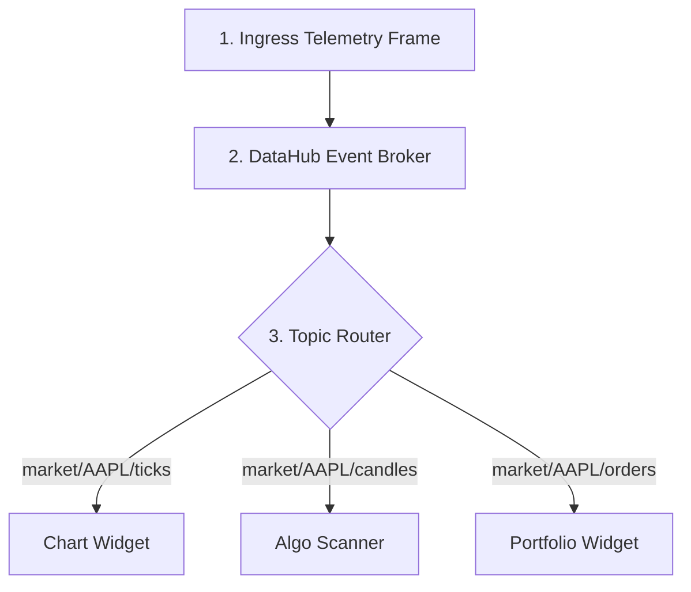

# Step 2: Pub-Sub Event Routing (The Distribution)

This document details the second phase of the stock analysis lifecycle: thread-safe event routing using the pub-sub pattern to dispatch raw ticks to active terminal modules.

---

## 1. Routing Model

---

## 2. Pub-Sub Architecture

### A. The DataHub Event Broker
*   **The Hub:** Implemented in [DataHub.cpp](file:///c:/Users/vinay/Desktop/FinceptTerminal/fincept-qt/src/datahub/DataHub.cpp), the broker acts as a central distribution board.
*   **Thread Safety:** Since data streams run on background networking threads, the DataHub uses mutex locks to prevent resource collisions when writing to queues.

### B. Topic Channel Namespace
The DataHub divides events into explicit namespaces:
*   `market/<ticker>/ticks` - Real-time execution ticks (e.g., `market/AAPL/ticks`).
*   `market/<ticker>/candles` - Normalized candle intervals (e.g., `market/MSFT/candles`).
*   `trading/orders/<order_id>` - Status updates for active orders.

### C. Subscription Routing Options
*   **Exact Matching:** Subscribing to `market/AAPL/ticks` receives only AAPL ticks.
*   **Pattern Matching:** Subscribing to `market/*/ticks` receives all ticks from all active streams, useful for macro scanners.

---

## 3. Reference Files
*   [DataHub.cpp](file:///c:/Users/vinay/Desktop/FinceptTerminal/fincept-qt/src/datahub/DataHub.cpp) - The central pub-sub implementation.
*   [TopicPolicy.h](file:///c:/Users/vinay/Desktop/FinceptTerminal/fincept-qt/src/datahub/TopicPolicy.h) - Defines queues, rates, and eviction policies for slow subscribers.
df