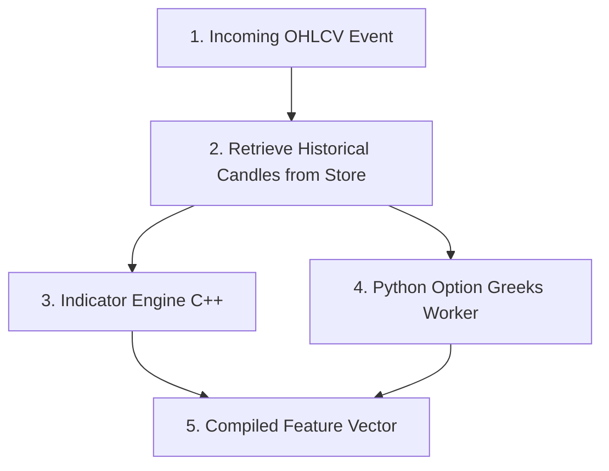

# Step 3: Feature Engineering & Indicators (The Calculations)

This document details the third phase of the stock analysis lifecycle: feature engineering, indicator calculation, and options-analytics offloading.

---

## 1. Feature Calculations Workflow

---

## 2. Calculation Pipelines

### A. Technical Indicator Calculations
The [IndicatorEngine.h](file:///c:/Users/vinay/Desktop/FinceptTerminal/fincept-qt/src/algo_engine/IndicatorEngine.h) reads historical candle frames (e.g., last 100 days of data) and computes standard technical indicators:
*   **Trend Vectors:** Simple Moving Averages (SMA), Exponential Moving Averages (EMA), Aroon, and Supertrend.
*   **Momentum Indicators:** Relative Strength Index (RSI), Moving Average Convergence Divergence (MACD), Stochastic oscillators, and Chaikin Money Flow.
*   **Volatility Metrics:** Average True Range (ATR) and Bollinger Bands.

### B. Python Option Greeks Integration
Because option calculations are computationally intensive and require specialized mathematical libraries, they are offloaded to background threads:
*   **The Dispatch:** The C++ engine starts an async task worker.
*   **The Runtime:** Managed by [PythonRunner.cpp](file:///c:/Users/vinay/Desktop/FinceptTerminal/fincept-qt/src/python/PythonRunner.cpp), the worker computes:
    *   **Implied Volatility (IV):** Derived from current option pricing.
    *   **The Greeks:** Delta, Gamma, Theta, Vega, and Rho.
*   **The Return:** Calculated values are passed back to the C++ core to join the feature vector.

---

## 3. Reference Files
*   [IndicatorEngine.h](file:///c:/Users/vinay/Desktop/FinceptTerminal/fincept-qt/src/algo_engine/IndicatorEngine.h) - C++ technical analysis calculator.
*   [PythonRunner.cpp](file:///c:/Users/vinay/Desktop/FinceptTerminal/fincept-qt/src/python/PythonRunner.cpp) - Embedded Python runner interface.
*   [OptionGreeksWorker.cpp](file:///c:/Users/vinay/Desktop/FinceptTerminal/fincept-qt/src/python/OptionGreeksWorker.cpp) - Options analytics dispatcher.
