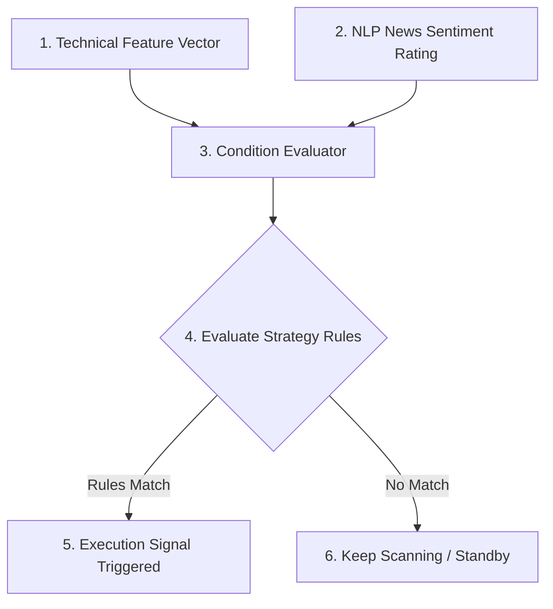

# Step 4: Condition Evaluation & Rule Matching (The Decision Gate)

This document details the fourth phase of the stock analysis lifecycle: running strategy rules against indicators and integrating qualitative news sentiment context.

---

## 1. Decision Matching Flow

---

## 2. Decision Logic

### A. Technical Rule Matching
The [ConditionEvaluator.cpp](file:///c:/Users/vinay/Desktop/FinceptTerminal/fincept-qt/src/algo_engine/ConditionEvaluator.cpp) parses active strategy definitions. For example, it evaluates boolean expressions such as:
$$\text{RSI}(14) < 30 \quad \text{AND} \quad \text{Close} > \text{SMA}(50)$$

### B. NLP News Sentiment Multiplier
Before a signal is sent to the execution engine, the system checks the qualitative news pipeline:
*   **Sentiment Capture:** The [news_classifier.py](file:///c:/Users/vinay/Desktop/FinceptTerminal/Z_Vinayaka/news/python_news_code/news_classifier.py) evaluates recent news articles for the target stock.
*   **Score Adjuster:** If news has high credibility and positive sentiment (e.g., net sentiment score $\ge 3$, indicating bullish outlook), the stock's trigger rating increases.
*   **Geopolitical Threat Filtering:** If a target stock matches high geopolitical or macro threat vectors (e.g., active regional embargo or war), triggers may be overridden or blocked.

---

## 3. Reference Files
*   [ConditionEvaluator.cpp](file:///c:/Users/vinay/Desktop/FinceptTerminal/fincept-qt/src/algo_engine/ConditionEvaluator.cpp) - Strategy logic evaluator.
*   [news_classifier.py](file:///c:/Users/vinay/Desktop/FinceptTerminal/Z_Vinayaka/news/python_news_code/news_classifier.py) - NLP news categorizer.
