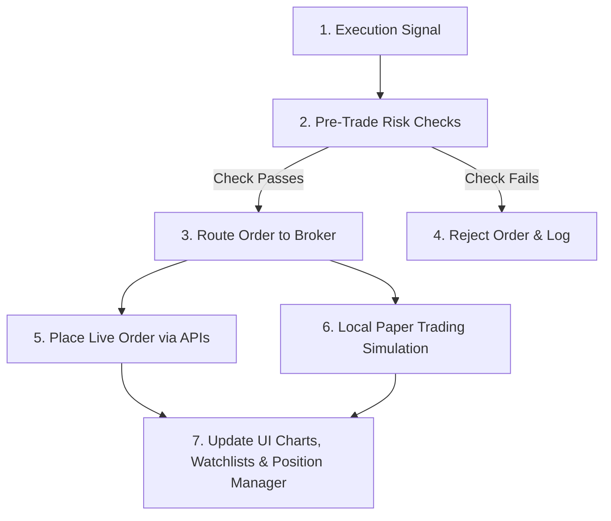

# Step 5: Risk Checks & Order Execution (The Actuator)

This document details the fifth and final phase of the stock analysis lifecycle: pre-trade validation, broker routing, paper trading matching, and UI feedback loops.

---

## 1. Execution Pipeline

---

## 2. Order Execution & Feedback

### A. Pre-Trade Risk Validation
The [OrderValidator.cpp](file:///c:/Users/vinay/Desktop/FinceptTerminal/fincept-qt/src/trading/OrderValidator.cpp) checks all orders before submission:
*   **Buying Power:** Confirms there are sufficient funds for the transaction.
*   **Position Sizing:** Ensures the order size does not exceed the maximum allocation limit set for a single asset.
*   **Risk parameters:** Verifies that stop-loss and take-profit bounds are present.

### B. Broker Routing & Simulation
*   **Live Port:** Passes orders to Alpaca or Interactive Brokers.
*   **Local Paper Engine:** Simulates order matching based on bid/ask sizes.

### C. Watchlist Update & Position Management
*   **State Updates:** Order execution events are published back to the DataHub.
*   **UI Update:** Watchlist rows, active position details, P&L calculations, and chart icons update in real time.
*   **Monitoring:** The [PositionManager.cpp](file:///c:/Users/vinay/Desktop/FinceptTerminal/fincept-qt/src/algo_engine/PositionManager.cpp) tracks the active trade to execute trailing stop-losses.

---

## 3. Reference Files
*   [OrderValidator.cpp](file:///c:/Users/vinay/Desktop/FinceptTerminal/fincept-qt/src/trading/OrderValidator.cpp) - Risk pre-clearance logic.
*   [PaperTrading.cpp](file:///c:/Users/vinay/Desktop/FinceptTerminal/fincept-qt/src/trading/PaperTrading.cpp) - Simulates real-time order matching.
*   [PositionManager.cpp](file:///c:/Users/vinay/Desktop/FinceptTerminal/fincept-qt/src/algo_engine/PositionManager.cpp) - Active risk-monitoring manager.
