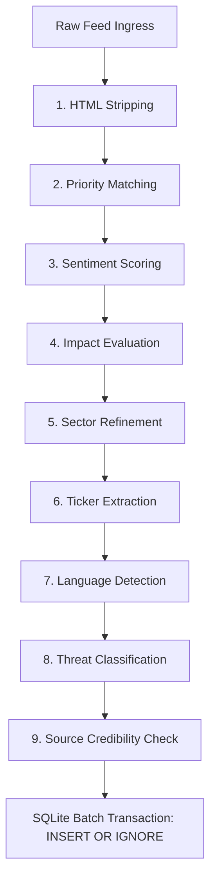

# Step 1.1: News Evaluation & SQLite Storage

This document details the database schema and the parsing/evaluation stages that news articles pass through before being persisted in the SQLite local store.

---

## 1. SQLite Storage Schema

The database persists articles and their extracted NLP attributes using three primary tables managed by the [NewsArticleRepository.cpp](file:///c:/Users/vinay/Desktop/FinceptTerminal/fincept-qt/src/storage/repositories/NewsArticleRepository.cpp) module:

### A. The `news_articles` Table
Stores raw article content alongside computed classification indicators:
*   `id` (TEXT, PRIMARY KEY): Unique identifier generated per article feed.
*   `headline` (TEXT): The title of the article.
*   `summary` (TEXT): The body/description (stripped of HTML and limited to 300 characters).
*   `source` (TEXT): Publisher tag (e.g., `BLOOMBERG`, `REUTERS`, `CNBC`).
*   `region` (TEXT): Geographic region (`GLOBAL`, `US`, `EU`, `ASIA`, `INDIA`, `MENA`).
*   `category` (TEXT): Sector type (`MARKETS`, `GEOPOLITICS`, `REGULATORY`, `CRYPTO`, `TECH`, `ENERGY`, `EARNINGS`, `DEFENSE`, `ECONOMIC`).
*   `link` (TEXT): Web link URL.
*   `sort_ts` (INTEGER): Unix timestamp (seconds) used for sorting news chronologically.
*   `priority` (TEXT): Action level (`FLASH`, `URGENT`, `BREAKING`, `ROUTINE`).
*   `sentiment` (TEXT): Sentiment category (`BULLISH`, `BEARISH`, `NEUTRAL`).
*   `impact` (TEXT): Market impact score (`HIGH`, `MEDIUM`, `LOW`).
*   `tickers` (TEXT): JSON array string of extracted stock symbols (e.g., `["AAPL", "TSLA"]`).
*   `tier` (INTEGER): Publisher credibility tier (1 to 4).
*   `lang` (TEXT): Auto-detected language code (`en`, `zh`, `ru`, `ja`, `ko`, `hi`, `ar`).
*   `threat_level` (TEXT): Threat intensity (`CRITICAL`, `HIGH`, `MEDIUM`, `LOW`, `INFO`).
*   `threat_cat` (TEXT): Risk type (`conflict`, `market`, `cyber`, `regulatory`, `natural`, `general`).
*   `threat_conf` (REAL): Confidence level of threat detection (0.0 to 1.0).
*   `source_flag` (INTEGER): Credibility flag (0 = None, 1 = `STATE_MEDIA`, 2 = `CAUTION`).
*   `seen_at` (INTEGER): Unix timestamp when the user read the article.
*   `saved` (INTEGER): Bookmark toggle flag (1 = Starred, 0 = Default).

### B. The `news_fts` Table (FTS5 Virtual Table)
A full-text search table that shadows the `news_articles` table, indexing the `headline` and `summary` columns to allow instantaneous keyword-based searches with relevance rankings.

### C. The `news_analysis` Table
Caches deep AI-generated analyses to avoid duplicate credit consumption:
*   `url` (TEXT, PRIMARY KEY): Link to the article.
*   `analysis_json` (TEXT): Detailed JSON payload storing AI key takeaways, sentiment details, market prediction summaries, and extracted entities (people, locations, and organizations).
*   `created_at` (INTEGER): Unix timestamp when the record was saved.

---

## 2. Ingestion Evaluation Stages (C++ Pipeline)

Before an article is written to SQLite, it runs through **nine evaluation stages** in [NewsService_Parsing.cpp](file:///c:/Users/vinay/Desktop/FinceptTerminal/fincept-qt/src/services/news/NewsService_Parsing.cpp):



### The 9 Processing Stages:
1.  **HTML Stripping & Truncation:** Summary text is cleaned of HTML tags via C++ regular expressions and truncated to a maximum of 300 characters.
2.  **Priority Mapping:** Headline text is checked for keywords:
    *   *breaking / alert* -> `FLASH`
    *   *urgent / emergency* -> `URGENT`
    *   *announce / report* -> `BREAKING`
3.  **Weighted Sentiment Scoring:** Calculates a net score based on keywords:
    *   *Positives:* `surge` (+3), `gain` (+2), `beat` (+2), `buy` (+1).
    *   *Negatives:* `crash` (-3), `bankruptcy` (-3), `decline` (-2), `deficit` (-1).
    *   Net Score = sum(Positives) - sum(Negatives). Sets `BULLISH` (net >= 1) or `BEARISH` (net <= -1).
4.  **Impact Rating:** Combines priority level and sentiment strength. Sets `HIGH` if priority is `FLASH`/`URGENT` or sentiment strength (absolute net score) is >= 6. Sets `MEDIUM` if priority is `BREAKING` or strength >= 3.
5.  **Sector Refinement:** Scans the text for keywords to narrow down categories (e.g., "earnings/guidance" -> `EARNINGS`; "missile/military" -> `DEFENSE`).
6.  **Ticker Extraction:** Regex matches 2-5 letter uppercase words (e.g., `AAPL`, `TSLA`), filtering out common stop-words (`THE`, `FOR`, `AND`, `HAS`).
7.  **Language Detection:** Loops through character Unicode blocks to identify the script:
    *   *Hangul* block -> Korean (`ko`).
    *   *Kana* block -> Japanese (`ja`).
    *   *Cyrillic* / *Arabic* / *Devanagari* blocks -> Russian (`ru`), Arabic (`ar`), Hindi (`hi`).
8.  **Threat Classification:** Evaluates risk categories and confidence levels (e.g., "nuclear strike" -> `conflict` threat, `CRITICAL` level with 95% confidence).
9.  **Source Credibility Checks:** Matches the publisher string against a static registry:
    *   `XINHUA`, `RT`, `TASS` -> `STATE_MEDIA` warning.
    *   `ZEROHEDGE`, `INFOWARS` -> `CAUTION` warning.

---

## 3. SQLite Persistence (The Transaction)
Once evaluations are completed, the list of articles is passed to `NewsArticleRepository::upsert_batch()`:
*   **Transactions:** The repository wraps the writes in a single database transaction (`BEGIN TRANSACTION` / `COMMIT`) for rapid disk insertion.
*   **Duplicate Prevention:** Uses `INSERT OR IGNORE` queries. If an article with the same unique ID is already present, SQLite ignores the entry, preserving the first-seen enriched copy.

---

## 4. 3 Categories of Database Columns (Raw vs. Computed vs. User State)

Here is how the columns of the main `news_articles` table are categorized according to their lifecycle:

### Category 1: Raw Ingress Columns (Direct Feed Data)
These columns are stored exactly as parsed from the incoming RSS/XML feeds or read from the static configuration:
*   `id`: Unique identifier generated per article.
*   `headline`: The title of the article.
*   `link`: Web link URL to the original article page.
*   `sort_ts`: Unix timestamp (seconds) extracted from publication date.
*   `source`: Publisher tag (e.g., `BLOOMBERG`, `REUTERS`, `CNBC`).
*   `tier`: Feeder credibility priority ranking (1 to 4).
*   `region`: Geographic region of the feed (`GLOBAL`, `US`, `EU`, `ASIA`, `INDIA`, `MENA`).

### Category 2: Computed & NLP Evaluated Columns (Enriched Data)
These columns are cleaned, re-categorized, or run through NLP rule weighting before being committed:
*   `summary`: Raw HTML tags are stripped out and summary text is capped at 300 characters.
*   `category`: Initial feed channel category (e.g. `MARKETS`) can be dynamically overridden if the text contains specific sector keywords (e.g. `EARNINGS`, `DEFENSE`).
*   `priority`: Priority classification (`FLASH`, `URGENT`, `BREAKING`, `ROUTINE`) derived from keyword matches.
*   `sentiment`: Sentiment score (`BULLISH`, `BEARISH`, `NEUTRAL`) derived from weighted positive/negative financial verb counts.
*   `impact`: Derived via a logic matrix combining priority level and absolute sentiment score.
*   `tickers`: Serialized JSON array of stock symbols found in the text (e.g. `["AAPL", "TSLA"]`).
*   `lang`: Script code detected using character Unicode block scanning (e.g. `zh`, `ja`, `ru`, `en`).
*   `threat_level` / `threat_cat` / `threat_conf`: Classifies macro or geopolitical threats, their risk sectors, and rule confidence.
*   `source_flag`: Credibility flag assigned by matching publisher name against credibility blacklists (`STATE_MEDIA` or `CAUTION`).

### Category 3: User Interaction & State Columns (GUI State)
These columns are populated and updated after ingestion based on user actions in the user interface:
*   `seen_at`: Unix timestamp indicating when the user opened or read the article.
*   `saved`: Starred/bookmarked toggle state (1 = Starred, 0 = Default).

---

## 5. Bare Minimum Required Raw Data

To build the complete, highly enriched news article entry in the database, the system only requires **7 bare minimum raw data inputs**. The rest of the computed columns (like sentiment, priority, threat levels, language, and tickers) are derived locally in memory by the C++ engine.

### A. Raw Ingress Fields (Parsed from XML/RSS feed item)
1.  **Headline:** Extracted from the `<title>` tag. This is the primary text field used for keyword matches, language scripting scans, and ticker token extraction.
2.  **Summary:** Extracted from `<description>`, `<summary>`, or `<content:encoded>` tags. Combined with the headline to calculate sentiment weights and category keywords.
3.  **Link (URL):** Extracted from the `<link>` tag. It generates the unique primary key `id` and acts as the unique lookup key for the deep AI analysis database.
4.  **Date/Time (Timestamp):** Extracted from `<pubDate>` and converted to the Unix epoch format (`sort_ts`). Used for chronological feed ordering.

### B. Configuration Metadata (Assigned by the feed settings)
5.  **Source:** The publisher tag (e.g. `BLOOMBERG`, `REUTERS`) defined in the feed's download settings. Used to check the credibility Warning map (`source_flag`).
6.  **Region:** The target geographic market (e.g. `US`, `EU`, `GLOBAL`) set in the download configuration.
7.  **Tier:** The reliability rank (1 to 4) of the publisher assigned in the feed settings.

### Dictionary Format Example (Raw Input Data)
Before any NLP enrichment or local computations are run, the raw data structure holds only these 7 bare minimum values:
```json
{
  "headline": "ECB announces surprise rate cut to boost Eurozone growth",
  "summary": "The European Central Bank lowered interest rates by 25 basis points in a surprise move, aiming to stimulate economic activity.",
  "link": "https://www.reuters.com/markets/ecb-surprise-rate-cut-2026",
  "pubDate": "Sun, 14 Jun 2026 12:00:00 GMT",
  "source": "REUTERS",
  "region": "EU",
  "tier": 1
}
```

### Summary of Derived Calculations:
| Raw Data Inputs | Derived Database Columns |
| :--- | :--- |
| **Headline + Summary** | `category`, `priority`, `sentiment`, `tickers`, `threat_level`, `threat_cat`, `threat_conf` |
| **Headline Only** | `lang` |
| **Source Only** | `source_flag` |
| **Priority + Sentiment Strength** | `impact` |
| **Link (URL) Only** | `id` |
| **Date/Time Only** | `sort_ts` |

---

## 6. Column Calculation Logic (Category 2)
This section documents the step-by-step logic used to calculate and evaluate individual computed columns:

### A. Summary Column Processing
1. **XML Tag Extraction:** The parser extracts raw text from the `description`, `summary`, or `<content:encoded>` tag blocks of the downloaded feed item.
2. **HTML Tag Stripping:** It passes the text through a regular expression (`<[^>]*>`) to replace all HTML markup tags with empty strings. It then runs `.simplified()` to clean up double spaces, tabs, and newlines.
3. **Max-Length Truncation:** The cleaned string is truncated using `.left(300)` to ensure it never exceeds a maximum length of 300 characters, optimizing storage and UI lists.

### B. Category Column Refinement
1. **Default Feed Setup:** The article initially inherits the default category set in the source feed configuration (e.g. general `MARKETS`).
2. **Keyword Scan:** The combined headline and summary text is converted to lowercase and scanned using basic text checks (`.contains()`).
3. **Conditional Override (Waterfall Precedence):** The matching uses an `if-else if` waterfall structure. If multiple categories match, **only the first matching check is applied, and all subsequent checks are short-circuited (skipped).**
    *   *Precedence Order & Keyword Lists:*
        1.  **`EARNINGS`** = `("earnings", "quarterly results", "eps", "guidance")`
        2.  **`CRYPTO`** = `("crypto", "bitcoin", "ethereum", "blockchain")`
        3.  **`DEFENSE`** = `("missile", "troops", "pentagon", "military")`
        4.  **`ECONOMIC`** = `("fed ", "federal reserve", "inflation", "gdp", "interest rate", "central bank")`
        5.  **`MARKETS`** = `("s&p 500", "nasdaq", "dow jones", "stock market")`
        6.  **`ENERGY`** = `("energy", "crude", "opec", "natural gas", "oil price")`
        7.  **`TECH`** = `("tech", " ai ", "artificial intelligence", "semiconductor", "startup")`
        8.  **`GEOPOLITICS`** = `("nato", "ukraine", "russia", "china", "gaza", "sanctions", "geopolit")`
    *   *Example:* If a headline reads *"Fed warns of inflation, stock market reacts, tech sector down"*, the article is classified under `ECONOMIC` (first matched). The checks for `MARKETS` and `TECH` are completely bypassed.

### C. Priority Column Classification
1. **Local System Computation (Not from API):** These priority levels are computed 100% locally by the Fincept Terminal C++ engine upon feed download. The source RSS feed API only provides raw text; it is the Fincept parser that scans the text and flags the priority.
2. **Default Setup:** The article starts with a default priority of `ROUTINE` (renders in muted gray `#525252`).
3. **Waterfall Check:** The lowercase combined text is evaluated using a strict precedence check order:
    *   **Level 1 (`FLASH` - Red `#dc2626`):** Triggers if the text contains `"breaking"` or `"alert"`. Used for immediate market-shock alerts.
    *   **Level 2 (`URGENT` - Orange `#d97706`):** Triggers if the text contains `"urgent"` or `"emergency"`. Used for critical operations or warning reports.
    *   **Level 3 (`BREAKING` - Yellow `#ca8a04`):** Triggers if the text contains `"announce"` or `"report"`. Used for scheduled news releases.
    *   **Level 4 (`ROUTINE` - Default):** Assigned if no higher keywords are matched.
4. **Conflict Resolution (Short-Circuit Precedence):** The first condition that matches assigns the priority level and halts further checks.
    *   *Example:* A headline reading *"URGENT ALERT: ECB announces emergency bailout plan"* contains keywords for both `FLASH` (`"alert"`) and `URGENT` (`"urgent"`, `"emergency"`).
    *   *Result:* The C++ logic evaluates `FLASH` first. Since it contains `"alert"`, the article is set to `FLASH` (Red) immediately, and the checks for `URGENT` and `BREAKING` are bypassed.

---

### D. Sentiment Column Evaluation
1. **No Short-Circuiting (Cumulative Tally):** Unlike category and priority checks, the sentiment analyzer checks both positive and negative word lists completely.
2. **Weighted Dictionary Accumulation:** It scans the lowercase combined text and tallies scores based on the following complete word lists:
    *   **Positive Indicators (`positives`):**
        *   *Weight +3 (High Impact):* `surge`, `soar`, `skyrocket`, `breakthrough`, `boom`, `record high`.
        *   *Weight +2 (Medium Impact):* `rally`, `gain`, `rise`, `jump`, `climb`, `spike`, `rebound`, `boost`, `beat`, `exceed`, `upgrade`, `profit`, `growth`, `expand`, `recover`, `victory`, `ceasefire`, `treaty`, `reform`, `optimism`, `milestone`.
        *   *Weight +1 (Low Impact):* `strong`, `robust`, `stellar`, `buy`, `positive`, `success`, `win`, `approval`, `deal`, `confidence`, `dividend`, `progress`, `improve`, `hope`, `support`, `bolster`, `outperform`, `bullish`, `upside`, `favorable`, `momentum`, `launch`, `unveil`.
    *   **Negative Indicators (`negatives`):**
        *   *Weight -3 (High Impact):* `crash`, `plunge`, `collapse`, `devastat`, `catastroph`, `invasion`, `war crime`, `nuclear`, `bankruptcy`, `meltdown`.
        *   *Weight -2 (Medium Impact):* `fall`, `drop`, `decline`, `tumble`, `slide`, `slump`, `miss`, `disappoint`, `fail`, `recession`, `crisis`, `conflict`, `attack`, `kill`, `sanction`, `tariff`, `escalat`, `layoff`, `downgrade`, `default`, `fraud`, `scandal`, `coup`, `protest`, `disaster`.
        *   *Weight -1 (Low Impact):* `worst`, `weak`, `loss`, `deficit`, `fear`, `risk`, `threat`, `warning`, `sell`, `debt`, `inflation`, `slowdown`, `bearish`, `negative`, `volatile`, `uncertain`, `reject`, `ban`, `suspend`, `investigat`, `probe`, `hack`, `leak`, `shortage`, `disrupt`, `shrink`.
3. **Sentiment Classification:** The net score is calculated as: Net Score = pos - neg.
    *   `BULLISH` (Net Score >= 1, renders green `#16a34a`).
    *   `BEARISH` (Net Score <= -1, renders red `#dc2626`).
    *   `NEUTRAL` (Net Score = 0, renders yellow `#ca8a04`).
4. **Example Resolution:**
    *   *Headline:* *"NVIDIA profit surges, beats estimates, but chip shortage fears warning looms"*
    *   *Positive hits:* `profit` (+2), `surge` (+3), `beat` (+2) $\rightarrow$ `pos` = 7.
    *   *Negative hits:* `shortage` (-1), `fear` (-1), `warning` (-1) $\rightarrow$ `neg` = 3.
    *   *Net Score:* 7 - 3 = 4 $\rightarrow$ classified as **`BULLISH`**.

### E. Impact Column Evaluation
1. **Logical Matrix Mapping:** The impact level is determined using a logical combination of the article's priority and the absolute strength of its sentiment score.
2. **Relationship Comparison (Why they differ):**
    *   **Priority** represents **Publishing Urgency** (Is this a headline flash or a full-length article?) and is derived strictly from text keyword matches (e.g. `breaking`, `alert`).
    *   **Sentiment** represents **Direction** (Is this news positive or negative?) and is derived from positive vs. negative word counts.
    *   **Impact** represents **Magnitude** (How much will this news move the stock price?) and is calculated by checking *whichever is higher* between the Priority level and Sentiment Strength.
    *   *Key Distinction:* An article can be `ROUTINE` priority but `HIGH` impact if the sentiment score is extremely intense (e.g. an earnings beat with a score >= 6).
3. **Formula & Urgency Thresholds:**
    *   Let Sentiment Strength = absolute value of Net Sentiment Score.
    *   **HIGH Impact:** Assigned if Priority is `FLASH` or `URGENT`, or if Sentiment Strength is >= 6.
    *   **MEDIUM Impact:** Assigned if HIGH conditions fail, but Priority is `BREAKING` or Sentiment Strength is >= 3.
    *   **LOW Impact:** Assigned as the fallback default if no higher thresholds are met.
4. **Example Cases:**
    *   *Case 1 (Priority Overrides Sentiment):* Headline: *"FLASH ALERT: Severe earthquake hits Tokyo stock exchange, structural collapse, trading halted"*
        *   Priority is `FLASH` (triggered by "alert"). Sentiment Strength is 3 (collapse = -3). 
        *   *Result:* Classified as **HIGH** impact because the priority is `FLASH`.
    *   *Case 2 (Extreme Sentiment Overrides Priority):* Headline: *"Nvidia shares skyrocket as earnings surge, beats estimates on record high demand, guidance raised"*
        *   Priority is `ROUTINE`. Sentiment Strength is 11 (skyrocket = +3, surge = +3, beat = +2, record high = +3). 
        *   *Result:* Classified as **HIGH** impact because the sentiment strength is 11, which is >= 6.
    *   *Case 3 (Low Impact):* Headline: *"Tesla quarterly results miss estimates, profits drop"*
        *   Priority is `ROUTINE`. Sentiment Strength is 2 (miss = -2, profit = +2, drop = -2; net is -2).
        *   *Result:* Classified as **LOW** impact because it fails all HIGH and MEDIUM checks.

### F. Ticker Column Extraction
1. **Regex Candidate Selection:** The parser runs a C++ regular expression search using `\b[A-Z]{2,5}\b` over the headline and summary to capture uppercase words between 2 and 5 letters long.
2. **Stop-Word Filter (Exclusions):** To prevent common capitalized words in headlines from being falsely indexed as company symbols, candidates are matched against a stop-word list. If a candidate is in the list, it is blocked.
    *   *C++ Core List (20 words):* `THE`, `FOR`, `AND`, `BUT`, `NOT`, `FROM`, `WITH`, `THIS`, `THAT`, `HAVE`, `WILL`, `BEEN`, `THEY`, `WERE`, `SAID`, `HAS`, `ITS`, `NEW`, `ARE`, `WAS`
    *   *Python NLP List (Extended):* Includes all C++ words plus macro abbreviations: `WHO`, `HOW`, `WHY`, `ALL`, `CAN`, `MAY`, `NOW`, `SEC`, `GDP`, `CEO`, `CFO`, `IPO`, `ETF`, `CPI`, `PMI`
3. **Capping & Deduplication:** Matches are stored in a unique `QSet` to eliminate duplicate entries, and capped at a maximum of 5 tickers per article.

### G. Language Column Detection
1. **Unicode Script Scans:** The C++ parser loops through the characters of the headline, checking their Unicode integer code point blocks:
    *   Japanese Kana blocks (`0x3040` to `0x30ff`) -> Returns Japanese (`ja`) immediately.
    *   Korean Hangul blocks (`0xac00` to `0xd7af`) -> Returns Korean (`ko`) immediately.
2. **The 10% Majority Threshold:** The parser counts characters falling into Chinese (CJK), Russian (Cyrillic), Arabic, or Hindi (Devanagari) Unicode ranges. If a script matches more than 10% of the total character length of the headline, it is classified as that language:
    *   Chinese (`zh`), Russian (`ru`), Arabic (`ar`), or Hindi (`hi`).
3. **English Fallback:** If the headline contains only standard Latin characters, or if foreign scripts do not cross the 10% threshold, it defaults to English (`en`).

### H. Threat Classification (Level, Category, and Confidence)
1. **Rule-Based Lookup Matrix:** Unlike machine learning models, the threat engine does not generate dynamic embeddings or run runtime statistical calculations. Instead, it runs the merged lowercased text of the headline and summary against a static, pre-defined array structure (`PatternScore`) of risk keyword patterns in C++.
2. **The Static Pattern Table (C++ Matrix):** Each keyword in the pattern table is statically bound to specific values for Category (`threat_cat`), Severity Level (`threat_level`), and Confidence (`threat_conf`). The table evaluates keywords in priority order:
    *   **Critical Threats (Immediate Systemic Risks):**
        *   `"nuclear strike"` -> Category: `conflict`, Level: `CRITICAL`, Confidence: 0.95
        *   `"nuclear attack"` -> Category: `conflict`, Level: `CRITICAL`, Confidence: 0.95
        *   `"war declared"` -> Category: `conflict`, Level: `CRITICAL`, Confidence: 0.95
        *   `"market crash"` -> Category: `market`, Level: `CRITICAL`, Confidence: 0.90
        *   `"flash crash"` -> Category: `market`, Level: `CRITICAL`, Confidence: 0.90
        *   `"circuit breaker"` -> Category: `market`, Level: `CRITICAL`, Confidence: 0.85
        *   `"trading halt"` -> Category: `market`, Level: `CRITICAL`, Confidence: 0.85
        *   `"bank run"` -> Category: `market`, Level: `CRITICAL`, Confidence: 0.90
        *   `"sovereign default"` -> Category: `market`, Level: `CRITICAL`, Confidence: 0.90
    *   **High Threats (Serious Risks):**
        *   `"cyberattack"` -> Category: `cyber`, Level: `HIGH`, Confidence: 0.80
        *   `"ransomware"` -> Category: `cyber`, Level: `HIGH`, Confidence: 0.80
        *   `"data breach"` -> Category: `cyber`, Level: `HIGH`, Confidence: 0.75
        *   `"invasion"` -> Category: `conflict`, Level: `HIGH`, Confidence: 0.85
        *   `"airstrike"` -> Category: `conflict`, Level: `HIGH`, Confidence: 0.85
        *   `"missile launch"` -> Category: `conflict`, Level: `HIGH`, Confidence: 0.85
        *   `"military deploy"` -> Category: `conflict`, Level: `HIGH`, Confidence: 0.80
        *   `"coup attempt"` -> Category: `conflict`, Level: `HIGH`, Confidence: 0.85
        *   `"martial law"` -> Category: `conflict`, Level: `HIGH`, Confidence: 0.85
        *   `"bankruptcy fil"` -> Category: `market`, Level: `HIGH`, Confidence: 0.80
        *   `"rate hike"` -> Category: `market`, Level: `HIGH`, Confidence: 0.70
        *   `"rate cut"` -> Category: `market`, Level: `HIGH`, Confidence: 0.70
        *   `"earnings miss"` -> Category: `market`, Level: `HIGH`, Confidence: 0.75
        *   `"profit warning"` -> Category: `market`, Level: `HIGH`, Confidence: 0.75
        *   `"downgrad"` -> Category: `market`, Level: `HIGH`, Confidence: 0.70
        *   `"sanction"` -> Category: `regulatory`, Level: `HIGH`, Confidence: 0.70
        *   `"embargo"` -> Category: `regulatory`, Level: `HIGH`, Confidence: 0.75
        *   `"earthquake"` -> Category: `natural`, Level: `HIGH`, Confidence: 0.80
        *   `"tsunami"` -> Category: `natural`, Level: `HIGH`, Confidence: 0.85
        *   `"hurricane"` -> Category: `natural`, Level: `HIGH`, Confidence: 0.75
        *   `"pandemic"` -> Category: `natural`, Level: `HIGH`, Confidence: 0.80
    *   **Medium Threats (Moderate Stability Risks):**
        *   `"protest"` -> Category: `conflict`, Level: `MEDIUM`, Confidence: 0.60
        *   `"riot"` -> Category: `conflict`, Level: `MEDIUM`, Confidence: 0.70
        *   `"tension"` -> Category: `conflict`, Level: `MEDIUM`, Confidence: 0.50
        *   `"escalat"` -> Category: `conflict`, Level: `MEDIUM`, Confidence: 0.65
        *   `"tariff"` -> Category: `regulatory`, Level: `MEDIUM`, Confidence: 0.65
        *   `"regulation"` -> Category: `regulatory`, Level: `MEDIUM`, Confidence: 0.50
        *   `"antitrust"` -> Category: `regulatory`, Level: `MEDIUM`, Confidence: 0.60
        *   `"investigat"` -> Category: `regulatory`, Level: `MEDIUM`, Confidence: 0.55
        *   `"layoff"` -> Category: `market`, Level: `MEDIUM`, Confidence: 0.60
        *   `"recession"` -> Category: `market`, Level: `MEDIUM`, Confidence: 0.65
        *   `"inflation"` -> Category: `market`, Level: `MEDIUM`, Confidence: 0.55
        *   `"selloff"` -> Category: `market`, Level: `MEDIUM`, Confidence: 0.60
        *   `"sell-off"` -> Category: `market`, Level: `MEDIUM`, Confidence: 0.60
        *   `"volatil"` -> Category: `market`, Level: `MEDIUM`, Confidence: 0.50
        *   `"wildfire"` -> Category: `natural`, Level: `MEDIUM`, Confidence: 0.60
        *   `"flood"` -> Category: `natural`, Level: `MEDIUM`, Confidence: 0.60
3. **Short-Circuit Evaluation Order:** The matching stops at the first keyword found in the matrix hierarchy (Critical -> High -> Medium). No further patterns are evaluated.
4. **Fallback Default Logic:** 
    *   *Bearish Fallback:* If no keywords match but the article's sentiment is `BEARISH`, it defaults to: Category: `general`, Level: `LOW`, Confidence: 0.40.
    *   *Info Fallback:* If no keywords match and sentiment is not bearish, it defaults to: Category: `general`, Level: `INFO` (none), Confidence: 0.30.
5. **Concrete Examples:**
    *   **Example 1 (High Threat Cyberattack):** 
        *   *Headline:* "Breaking: Ransomware attack locks down municipal IT systems, group demands payment"
        *   *Matching:* It hits `"ransomware"` in the High/Critical list.
        *   *Outputs:* `threat_cat = "cyber"`, `threat_level = "HIGH"`, `threat_conf = 0.80`.
    *   **Example 2 (Medium Threat Regulatory Action):** 
        *   *Headline:* "Justice Department launches antitrust probe into tech giant's search dominance"
        *   *Matching:* Bypasses Critical/High, hits `"antitrust"` in the Medium list.
        *   *Outputs:* `threat_cat = "regulatory"`, `threat_level = "MEDIUM"`, `threat_conf = 0.60`.
    *   **Example 3 (Low Threat Sentiment Fallback):** 
        *   *Headline:* "Automaker reports disappointing delivery numbers as stock drops"
        *   *Matching:* Fails all Critical, High, and Medium threat keywords. Sentiment is computed as `BEARISH` (net score <= -1).
        *   *Outputs:* `threat_cat = "general"`, `threat_level = "LOW"`, `threat_conf = 0.40`.

### I. Source Credibility Flagging
1. **Source Flag Matrix:** The C++ engine evaluates the credibility or nature of the publishing source name by converting it to uppercase and checking it against a static lookup map (`QMap<QString, SourceFlag>`) in [NewsService_Classification.cpp](file:///c:/Users/vinay/Desktop/FinceptTerminal/fincept-qt/src/services/news/NewsService_Classification.cpp). It maps publishers to three specific integer flags:
    *   **Flag Value 0 (NONE):** 
        *   *Publishers:* Standard news agencies like `BLOOMBERG`, `REUTERS`, `CNBC`, `WSJ`.
        *   *Meaning & Behavior:* Normal reporting credibility. No warnings are applied.
    *   **Flag Value 1 (STATE_MEDIA):** 
        *   *Publishers:* `XINHUA`, `CGTN`, `GLOBAL TIMES`, `RT` (Russia Today), `TASS`, `SPUTNIK`, `PRESS TV`, `KCNA` (North Korea), `TRT WORLD`, `AL ARABIYA`.
        *   *Meaning & Behavior:* Government-owned, government-controlled, or state-funded news outlets. This alerts the trader that the headline might contain state propaganda or politically biased narratives.
    *   **Flag Value 2 (CAUTION):** 
        *   *Publishers:* `ZEROHEDGE`, `INFOWARS`, `DAILY MAIL`, `NY POST`.
        *   *Meaning & Behavior:* Outlets with a history of sensationalism, unverified market rumors, or looser editorial standards. This warns the trader to verify information before trading on it.
2. **C++ Lookup Implementation:** The C++ parser looks up the source name and defaults to `SourceFlag::NONE` if it is not in the predefined map:
    ```cpp
    auto it = flags.find(source.toUpper());
    return it != flags.end() ? it.value() : SourceFlag::NONE;
    ```
3. **UI Integration:** The terminal's graphical interface reads this `source_flag` column from SQLite. If the flag is non-zero, it overlays a prominent visual warning tag (e.g., a red/orange `[STATE MEDIA]` label or a yellow `[CAUTION]` label) on the article feed and detail panels. This helps traders instantly recognize news that requires secondary verification before executing trades.

---

## 7. SQLite Full-Text Search Engine (news_fts)

This system implements an advanced keyword-search utility using SQLite's **FTS5 (Full-Text Search)** virtual table extension. It allows users to run ultra-fast searches over thousands of archived articles, supporting word stemming and relevance ranking.

### A. What is FTS5?
Standard SQLite databases search text using linear scanning (e.g. `headline LIKE '%inflation%'`), which scans every single row in the database table one by one. This becomes extremely slow as the database grows.
FTS5 is a specialized virtual table module that creates an **inverted index** (a search index map linking each unique tokenized word directly to the row IDs where it occurs, similar to the index at the back of a textbook). This turns a linear-time search into a near-instant lookup.

### B. Table Definition & External Content Structure
The FTS virtual table is created as follows:
```sql
CREATE VIRTUAL TABLE IF NOT EXISTS news_fts USING fts5(
  id UNINDEXED,
  headline,
  summary,
  source UNINDEXED,
  content='news_articles',
  content_rowid='rowid',
  tokenize='porter unicode61'
);
```
*   **External Content (`content='news_articles'`):** Standard FTS tables copy all target text into their own internal storage, which doubles the size of the database. By specifying `content='news_articles'`, the system uses an *external content* layout. FTS only keeps a lightweight word-index map and pulls the actual text directly from the primary `news_articles` table at query time, saving massive disk space.
*   **Unindexed Columns (`id UNINDEXED`, `source UNINDEXED`):** Storing these fields in FTS is required to perform joins and query operations, but marking them as `UNINDEXED` tells SQLite not to waste CPU cycles tokenizing and indexing GUID strings or publisher tags.

### C. Advanced Tokenizer (`tokenize='porter unicode61'`)
The virtual table uses a dual-tokenizer configuration:
1.  **`unicode61` (Unicode Tokenizer):** Correctly tokenizes and parses international scripts (e.g., Cyrillic, Kanji, Devanagari) alongside Latin characters.
2.  **`porter` (Porter Stemming Tokenizer):** Automatically reduces English words down to their root/stem (base form) by removing grammatical suffixes. This allows queries to match word variations without requiring exact string matching.
    *   *Stemming Examples:*
        *   Searching for `"recession"` matches `"recessions"`.
        *   Searching for `"inflation"` matches `"inflationary"` or `"inflate"`.
        *   Searching for `"crashed"` matches `"crash"`, `"crashing"`, or `"crashes"`.

### D. Synchronization via Database Triggers
Because the FTS index is built on an external content table, standard writes to the base `news_articles` table do not automatically update the virtual search index. Three database triggers keep the FTS index in sync:
1.  **After Insert Trigger (`news_fts_ai`):** Automatically indexes new articles as they arrive:
    ```sql
    CREATE TRIGGER news_fts_ai AFTER INSERT ON news_articles BEGIN
      INSERT INTO news_fts(rowid, id, headline, summary, source)
      VALUES (new.rowid, new.id, new.headline, new.summary, new.source);
    END;
    ```
2.  **After Delete Trigger (`news_fts_ad`):** Removes index references when an article is deleted:
    ```sql
    CREATE TRIGGER news_fts_ad AFTER DELETE ON news_articles BEGIN
      INSERT INTO news_fts(news_fts, rowid, id, headline, summary, source)
      VALUES ('delete', old.rowid, old.id, old.headline, old.summary, old.source);
    END;
    ```
3.  **After Update Trigger (`news_fts_au`):** Clears the old index entry and inserts the updated one:
    ```sql
    CREATE TRIGGER news_fts_au AFTER UPDATE ON news_articles BEGIN
      INSERT INTO news_fts(news_fts, rowid, id, headline, summary, source)
      VALUES ('delete', old.rowid, old.id, old.headline, old.summary, old.source);
      INSERT INTO news_fts(rowid, id, headline, summary, source)
      VALUES (new.rowid, new.id, new.headline, new.summary, new.source);
    END;
    ```

### E. C++ Query & Ranking Logic
When a user searches from the UI, [NewsArticleRepository.cpp](file:///c:/Users/vinay/Desktop/FinceptTerminal/fincept-qt/src/storage/repositories/NewsArticleRepository.cpp) executes the following SQL:
```sql
SELECT a.id, a.headline, a.summary, a.source, a.region, a.category, a.link, a.sort_ts, ...
FROM news_fts f
JOIN news_articles a ON a.id = f.id
WHERE news_fts MATCH ?
ORDER BY rank LIMIT ?
```
*   **The MATCH Operator:** Uses SQLite's high-speed full-text comparison operator instead of slow `LIKE` string scans.
*   **Relevance Ranking (`ORDER BY rank`):** FTS5 assigns a relevancy score (`rank`) based on term frequency and document frequency. The more prominent a term is (e.g. matching in the `headline` versus a passing mention in the `summary`), the better the rank. Ordering by `rank` bubble-sorts the most relevant news to the top of the UI.
*   **FTS Quote Escaping:** Before passing user text to SQL, double quotes are stripped:
    ```cpp
    QString safe = query;
    safe.replace('"', ' ');
    ```
    This prevents raw quotes from breaking the FTS query syntax.
*   **Robust Fallback:** If the user's SQLite instance doesn't have FTS5 enabled, the repository catches the failure and performs a fallback standard `LIKE` query over the raw columns:
    ```sql
    WHERE headline LIKE ? OR summary LIKE ?
    ```

---

## 8. Deep AI Analysis & Headline Summarization Cache (news_analysis)

To enrich raw news feeds with advanced intelligence, the terminal integrates two remote AI features via [NewsService.cpp](file:///c:/Users/vinay/Desktop/FinceptTerminal/fincept-qt/src/services/news/NewsService.cpp): **Deep Article Analysis** and **Headline Summarization**. 

### A. Deep Article Analysis (`/news/analyze`)
*   **Purpose:** Provides a deep, structured analysis of a single article (key takeaways, sentiment breakdowns, market prediction forecasts, and extracted entities like people, locations, and organizations).
*   **The Cache Table (`news_analysis`):** Because calling the LLM endpoint consumes API credits and takes several seconds, the results are stored in the local SQLite table:
    ```sql
    CREATE TABLE IF NOT EXISTS news_analysis (
      url           TEXT PRIMARY KEY,
      analysis_json TEXT,
      created_at    INTEGER DEFAULT (strftime('%s','now'))
    );
    ```
*   **The Request Flow:**
    1.  **Check Cache:** When a user opens an article, the system calls `NewsArticleRepository::load_analysis(url)`. If cached JSON exists, it decodes it and displays it instantly (saving credit costs and time).
    2.  **API Call (Cache Miss):** If not cached, the client posts only the article's `url` in the JSON body:
        ```json
        { "url": "https://example.com/article-link" }
        ```
    3.  **Server Parsing:** The remote AI server uses the URL to fetch the article, extracts the text, generates the deep analysis, and returns the JSON payload.
    4.  **Save to Cache:** The client receives the analysis and writes it to SQLite:
        ```sql
        INSERT OR REPLACE INTO news_analysis (url, analysis_json, created_at) VALUES (?, ?, strftime('%s','now'));
        ```

### B. AI Headline Summarization (`/news/summarize`)
*   **Purpose:** Takes a batch of multiple headlines and rewrites/summarizes them into a single, consolidated market digest.
*   **The Request Flow:**
    1.  **Signatures & Cache Check:** The client extracts the top headlines (e.g. 5 to 10), sorts them alphabetically, joins them with `|`, and hashes the first 200 characters to form a signature key (e.g. `news:summary:abc...`). It checks if this key exists in the memory-cache manager (`CacheManager`).
    2.  **API Call:** If there is a cache miss, it posts the list of raw headlines directly in the body:
        ```json
        {
          "headlines": [
            "Fed raises interest rates by 25 basis points",
            "Tech stocks tumble following rate hike announcement",
            "Gold surges as safe-haven demand increases"
          ],
          "count": 3
        }
        ```
    3.  **Server Rewriting:** The remote LLM takes these raw input headlines, groups them semantically, and rewrites them into a cohesive summary paragraph.
    4.  **Cache Save:** The client caches this summary text under the signature key in the `CacheManager` with a short TTL (time-to-live) of 15 minutes, preventing redundant summaries as long as the headlines remain the same.

---

## 9. Custom Table Proposal: Ticker-Based Multi-Source Summaries (ticker_summaries)

This section outlines a proposed database design extension to persistently cache and map multi-source AI summaries for specific tickers over time.

### A. Table Name
`ticker_summaries`

### B. Purpose
To persistently store consolidated, LLM-generated summaries that merge multiple news articles for a specific stock ticker. This shifts the temporary in-memory `CacheManager` summaries into a permanent disk cache, saving API credit consumption, reducing latency, and creating a historical timeline of AI-interpreted news for each stock.

### C. Background (Table Column Explanation)
The proposed schema defines columns to associate each summary with a stock ticker, time window, and the exact source articles used:

*   `summary_id` (TEXT, PRIMARY KEY): A unique SHA-256 hash generated by concatenating and hashing the sorted unique row IDs of all articles included in the summary. This ensures that the exact same set of articles always resolves to the same cache key.
*   `ticker` (TEXT, INDEXED): The stock symbol (e.g. `AAPL`, `TSLA`). Indexed to support instantaneous lookup of historical summaries for a specific company.
*   `summary_text` (TEXT): The final cohesive paragraph returned by the LLM rewriting the merged headlines.
*   `article_ids` (TEXT): A JSON array of the unique row IDs of the source articles (e.g. `["reuters_01", "bloomberg_04"]`). This links the summary back to its original raw source entries in `news_articles` and `news_fts`.
*   `article_count` (INTEGER): The number of articles combined to create the summary.
*   `created_at` (INTEGER): A Unix timestamp of when the LLM summarization was performed. Used to calculate cache expiration (TTL checks).
*   `summary_date` (TEXT, INDEXED): The calendar date (format `YYYY-MM-DD`) when the summary was generated, allowing quick queries for daily digests.

### D. Conclusion: What We Achieve and Usefulness
By implementing the `ticker_summaries` table, the system achieves:
1.  **Strict Redundancy Prevention:** If the underlying articles for a ticker have not changed, their sorted IDs will hash to the same `summary_id`, preventing duplicate API calls and saving credits.
2.  **Linked Reference Transparency:** Because the original article IDs are stored in the row, the user interface can display the summary and list clickable links back to the original source articles (e.g. *"This summary was generated from these 3 stories"*).
3.  **Historical AI News Timeline:** By querying the database by `ticker` and sorting by `created_at`, the terminal can plot an AI-generated narrative timeline of events for a stock, helping traders review how news sentiment evolved over a week or month.

---

## 10. Reference Files
*   [NewsArticleRepository.cpp](file:///c:/Users/vinay/Desktop/FinceptTerminal/fincept-qt/src/storage/repositories/NewsArticleRepository.cpp) - Manages SQLite schema, SQL queries, and transactions.
*   [NewsService.cpp](file:///c:/Users/vinay/Desktop/FinceptTerminal/fincept-qt/src/services/news/NewsService.cpp) - Handles cached/deep analyses, headline summarizations, and auto-refresh intervals.
*   [NewsService_Parsing.cpp](file:///c:/Users/vinay/Desktop/FinceptTerminal/fincept-qt/src/services/news/NewsService_Parsing.cpp) - Coordinates XML parsing, HTML cleaning, and the 9 enrichment stages.
*   [NewsService_Classification.cpp](file:///c:/Users/vinay/Desktop/FinceptTerminal/fincept-qt/src/services/news/NewsService_Classification.cpp) - Exposes rules-based threat classification lookups.
