```mermaid
graph LR
    S1[Step 1: Ingestion] --> S1_1[Step 1.1: News Storage]
    S1_1 --> S2[Step 2: Pub-Sub Routing]
    S2 --> S3[Step 3: Indicators]
    S3 --> S4[Step 4: Decisions]
    S4 --> S5[Step 5: Execution]

    style S1 fill:#4c6ef5,stroke:#fff,color:#fff
    style S1_1 fill:#228be6,stroke:#fff,color:#fff
    style S2 fill:#12b886,stroke:#fff,color:#fff
    style S3 fill:#fa5252,stroke:#fff,color:#fff
    style S4 fill:#fab005,stroke:#fff,color:#fff
    style S5 fill:#7950f2,stroke:#fff,color:#fff
```

# Stock Analysis Lifecycle Overview

This document serves as the main index for the end-to-end stock analysis lifecycle in the Fincept Terminal. Click on any of the steps below to read a detailed breakdown of the logic, architectural models, and key source code file mappings.

---

---

## The Lifecycle Guide

1.  **[Step 1: Ingestion & Streaming](file:///c:/Users/vinay/Desktop/FinceptTerminal/z_complete_notes/step1_ingestion_streaming.md)**
    *   **Focus:** Establishing WebSocket sessions and reading raw market data feeds.
2.  **[Step 1.1: News Evaluation & SQLite Storage](file:///c:/Users/vinay/Desktop/FinceptTerminal/z_complete_notes/step_1_1_news.md)**
    *   **Focus:** Parsing feeds in C++, evaluating sentiment metrics, and persisting indexes to SQLite.
3.  **[Step 2: Pub-Sub Event Routing](file:///c:/Users/vinay/Desktop/FinceptTerminal/z_complete_notes/step2_pubsub_routing.md)**
    *   **Focus:** Broadcasting raw tick events through thread-safe broker topics in the DataHub.
4.  **[Step 3: Feature Engineering & Indicators](file:///c:/Users/vinay/Desktop/FinceptTerminal/z_complete_notes/step3_indicator_generation.md)**
    *   **Focus:** Generating technical indicators in C++ and calculating options parameters in background Python runtimes.
5.  **[Step 4: Condition Evaluation & Rule Matching](file:///c:/Users/vinay/Desktop/FinceptTerminal/z_complete_notes/step4_condition_evaluation.md)**
    *   **Focus:** Running strategy rules against indicator features and combining them with news sentiment tags.
6.  **[Step 5: Risk Checks & Order Execution](file:///c:/Users/vinay/Desktop/FinceptTerminal/z_complete_notes/step5_risk_execution.md)**
    *   **Focus:** Performing risk management checks, executing orders through brokers or simulation, and updating user displays.

