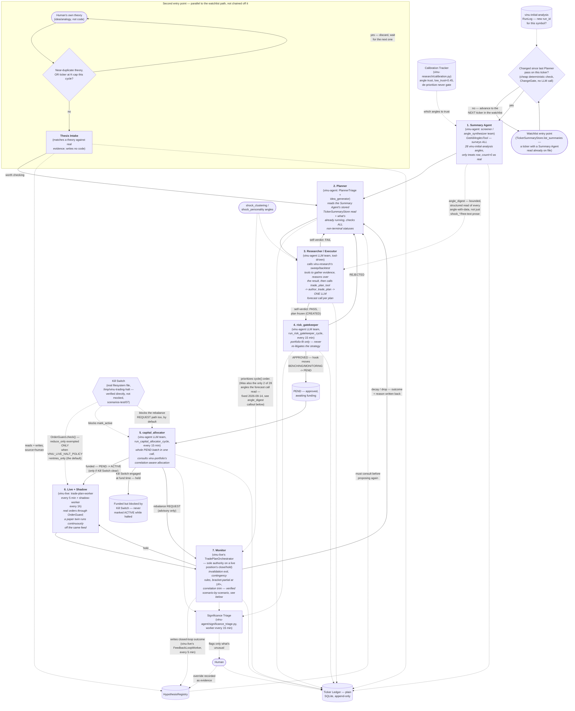

# Agentic workflow — current architecture (v4, 2026-09-15)

## The diagram

Structure is largely unchanged from v2.2 — the same stages, same
loop-backs — because that shape is still real, confirmed by reading the
current code (`vinu-agent/agent/scheduler_workers.py`,
`vinu-research/trade_plan_authoring.py`,
`vinu-live/trade_plan/orchestrator.py`), not assumed. What changed:
real cadences (not the 2026-09-09 fast-testing overrides), the real
Kill Switch mechanics (verified directly against the filesystem switch
in scenario 07), and one real disconnect found while writing this pass
— see the callout right after the diagram.

## RESOLVED (2026-09-14): the two separate 28-angle stories

**This was v3's headline finding — fixed this session, kept here as a
record of what changed and why, not as an open gap anymore.** The
original finding (verbatim from v3, still an accurate description of
what the problem *was*): the Summary Agent genuinely surveys all 28
`vinu-initial-analysis` angles via `GetAllAnglesTool`, but
`author_trade_plan`'s own forecast call
(`forecast_skill.py::generate_forecast`) built its prompt only from
`fetch_risk_state` + `fetch_personality_features`, which read **only 2
of the 28 angles** (`shock_personality`/`shock_clustering`) — the Summary
Agent's rich, all-28-angle narrative never reached the actual
money-moving decision.

**The fix**: `vinu-agent/vinu_agent/tools/angles_tool.py` gained
`build_angle_digest(angles_data)` — a generic, bounded (30-angle cap,
200-char string cap per field, no per-field-count cap after the initial
cap was deliberately removed) reduction of every angle-with-data into a
structured dict, computed once by the Summary Agent
(`agent/scheduler_workers.py::make_summary_agent_fn`) and stored
alongside the existing free-text summary in `TickerSummaryStore`'s new
`angle_digest` column. `trade_plan_authoring.py`'s
`_normalize_summary_context` carries a bounded copy of it through to
`forecast_skill.py::_build_forecast_prompt`, which now renders an
`=== Angle Digest ===` section in the actual forecast prompt. The
forecast call still also reads `fetch_risk_state`/
`fetch_personality_features` for its sizing math (unchanged, and
correctly so — sizing should come from real risk numbers, not angle
prose) — what changed is that the *forecast reasoning itself* now sees
structured data from every angle with real data, not just 2.

Also fixed alongside this, same audit: `Forecast.reasoning` (the LLM's
own justification) was write-only — persisted into `trade_plan_data` but
never read back anywhere — now surfaced at the top level of the
`GET`/`POST /trade-plan/{id}` API response
(`vinu-research/vinu_research/server/routes_trade_plan.py`).

## Real worker cadences (verified against `config.py` defaults in both services, not a temporary override)

| Worker | Service | Interval |
|---|---|---|
| planner-worker | vinu-agent | 1800s (30 min) |
| risk-gatekeeper-worker | vinu-agent | 900s (15 min) |
| capital-allocator-worker | vinu-agent | 900s (15 min) |
| significance-worker | vinu-agent | 900s (15 min) |
| skill-audit-worker | vinu-agent | 3600s (1h) |
| trade-plan-worker (Live) | vinu-live | 300s (5 min) |
| feedback-worker | vinu-live | 300s (5 min) |
| trade-plan-approval-worker | vinu-live | 300s (5 min) |
| shadow-worker | vinu-live | 3600s (1h) |
| drawdown-monitor | vinu-portfolio | 300s (5 min) |

v2.2's "planner 60s, risk 60s, allocator 90s" were a temporary fast
override for one operator's test session, not the shipped defaults —
worth knowing the difference between "what an operator dialed in for a
quick test" and "what actually ships."

## Per-agent detail

### 1. Summary Agent (`screener` / `angle_synthesizer`)

Calls `GetAllAnglesTool` (`get_all_angles(ticker)`), reports how many of
the 28 angles have real row-backed data, cites specific numbers from the
ones that do. Grounding discipline unchanged from v2.2 and still real:
only treats an angle as informative when `row_count > 0` — never invents
a number.

**Trigger**: `planner-worker` (every 30 min) → `RunLogTrigger.refresh_if_stale`
checks whether `vinu-initial-analysis` has a new `run_id` for this
ticker since the last Summary Agent pass; only refreshes if so.
`ChangeGate` then decides whether anything changed enough to bother the
Planner with. See `granularity-understanding/vinu-agent.md` for the full
step sequence.

### 2. Planner (triage + `idea_generator`)

Reads the Summary Agent's stored `TickerSummaryStore` read and every
non-terminal artifact status (CREATED/BENCHING/ACTIVE/MONITORING) for
that ticker, produces a fit tier + priority. Consults
`HypothesisRegistry` before proposing — what's been tried, what failed
and why.

### 2b. Thesis Intake (second entry point)

Unchanged in shape from v2.2: a human's raw theory checked against real
evidence, no code written, verdict feeds the same downstream loop as a
system-generated idea.

### 3. Researcher / Executor

**This is where v2.2's description and the direct code I read this
session diverge most, and where I'm being explicit about what's
re-verified vs. carried over**: `vinu-agent`'s research team has real
sweep/backtest tools available (`run_parameter_sweep_tool.py`,
`run_sweep_candidate_tool.py`, confirmed to exist) alongside
`trade_plan_tool.py` (which calls `author_trade_plan`). The team
presumably uses the sweep tools to gather backtest evidence before
authoring the actual plan — this matches v2.2's "sweep, self-verdict,
then author" shape. What's freshly, directly verified this session is
only the **final step** — `author_trade_plan`'s own forecast call and
what it reads (see the callout above) — not the full internal
tool-orchestration sequence the LLM team follows to get there. Treat the
sweep/PBO/triple-barrier specifics from v2.2 (vectorbt batch, hyperopt-8,
embargo periods, N=5/K=3/completeness 0.7) as **carried over from the
prior version, not re-checked in this pass** — real files
(`sweep.py`, `sweep_grid.py`, `pbo.py`, `labels.py`) do exist for all of
it, just not re-read line-by-line this time.

### 4. `risk_gatekeeper`

Every 15 min, `run_risk_gatekeeper_cycle` polls every BENCHING/MONITORING
artifact, hands each to the real LLM team
(`GetPortfolioTool` → `ComputePositionSizeTool` → verdict), the team's
own hook applies the state transition — the scheduler never mutates
state directly. See `granularity-understanding/vinu-agent.md`.

### 5. `capital_allocator`

Every 15 min, one call over the **whole PEND batch** (not per-candidate),
funds against the configured risk budget, consults `vinu-portfolio`'s
correlation-aware allocation (`build_portfolio()` — real HRP allocation,
`granularity-understanding/vinu-portfolio.md`). Checks the real Kill
Switch before `mark_active` — held in a "funded but blocked" state, never
silently marked ACTIVE while halted.

### 6. Live + Shadow

`vinu-live`'s trade-plan-worker (5 min) places real orders through
`OrderGuard`; `shadow-worker` (1h) runs `ShadowEvaluator.evaluate_all()` —
BENCHING → ACTIVE promotion against the real paper-trading track record
(`meets_promotion_bar`, `granularity-understanding/vinu-research.md`).

### 7. Monitor

`vinu-live`'s `TradePlanOrchestrator` — sole authority on a live
position's lifecycle. **This is the one stage with the deepest, most
recent direct verification in the whole pipeline** — every mechanism
below was driven through real engineered adverse scenarios, not just
read (`the-resaoning-ineffciency/scenarios-test/01-07`, all 7 closed):

- Invalidation exit reacts correctly to any size move, gradual or a
  single-bar -25% crash (scenario 01).
- A kill-switch halt blocks entries but never blocks a reduce-only exit
  in the same cycle (scenario 02) — and the actual authoritative
  enforcement (`OrderGuard.check()` against the real filesystem switch)
  makes the identical decision, independently confirmed (scenario 07).
- Tight noise never produces a spurious full exit (scenario 03).
- A real broker outage: the exit is still attempted, fails truthfully
  (never a false success), retries until the broker recovers (scenario 04).
- The correlation/concentration trim runs off real DCC/shrinkage math
  from actual price history, not a mocked number (scenario 05).
- A position closed overnight by its own resting stop is now correctly
  auto-reconciled — this was a **real, previously-live bug** (a
  confirmed-flat broker account was indistinguishable from a broker
  outage, meaning a stale position could sit forever and a later exit
  attempt could send a real sell order into an already-flat account),
  found and fixed this session (scenario 06).

Trailing-stop ratchet is bookkeeping only (never itself triggers an
exit — the actual dynamic exit logic is invalidation_conditions/
contingency_rules, evaluated fresh every cycle); bracket-partial at 1R+
scales with the R-multiple actually achieved (25% at 1R, 50% at 2R,
capped 75% — fixed this session from a flat 50%, `the-resaoning-ineffciency/00-audit.md`).

## Cross-cutting mechanisms

- **Calibration Tracker** (`vinu-research/calibration.py`) — feeds the
  Summary Agent which angles to de-prioritize (`low_trust < 0.45`, never
  a hard gate).
- **HypothesisRegistry** — the Planner's pre-proposal check, where
  Monitor's closed-loop outcomes (via `vinu-live`'s `FeedbackLoopWorker`,
  every 5 min) get written.
- **Kill Switch — real, filesystem-backed, verified directly this
  session.** `/tmp/vinu-trading-halt`, checked in `OrderGuard.check()`
  before every real order. A `reduce_only=True` order is exempted only
  when `VINU_LIVE_HALT_POLICY=entries_only` (the default) — confirmed
  against the real switch, not mocked, including that the exemption is
  genuinely policy-gated and not an unconditional bypass
  (`scenarios-test/07`). Also checked before `capital_allocator`'s
  `mark_active` and the rebalancer's request path.
- **Significance Triage** — worker every 15 min, judges routine vs.
  unusual, fed by `capital_allocator`/Monitor/`risk_gatekeeper`
  rejections.
- **Calibration log** (`vinu-infra/calibration_log.py`) — a plain
  append-only JSONL observation log for genuinely arbitrary threshold
  decisions (`bracket_partial`, `rebalance_protect`), gated to a
  confirmed real broker connection so test runs never pollute it. Not a
  decision store — nothing reads it back at runtime; it exists purely so
  these numbers leave a record checkable against what actually happened
  later.
- **LLM reliability layer** (new 2026-09-15,
  `missing-pieces-of-system/llm-configuration-settings-system/`) — every
  LLM call site (the shared `vinu-infra` JSON client and vinu-agent's
  tool-calling `ChatLLM` classes) now shares one `tenacity`-based retry
  policy (`vinu-infra/llm/retry.py`: backoff+jitter, Retry-After honored,
  retry-on-parse-failure — previously nothing retried a malformed
  response), one role-based model/endpoint config
  (`vinu-infra/llm/roles.py` + `roles.json`, ships inert), and a real
  failure-visibility path: `chat_json()` now raises `LlmCallFailed`
  instead of silently returning `None`, closing the specific gap where
  `forecast_skill.py` used to substitute a fake neutral forecast
  indistinguishable from a genuine low-signal read. A new, service-wide
  (not per-ticker) `detect_llm_failure_pattern` significance detector
  reads `telemetry.db` (written to on every call, previously write-only)
  and alerts via the existing Telegram/Discord path — an LLM outage or a
  bad model swap is now actually visible in real time, not just sitting
  in a log nobody queries.
- **Persisted foundation for a future maturity/narrating agent** (new
  2026-09-14/15, `missing-pieces-of-system/maturity-agentic-system/` and
  `narating-agents/`) — several stores were added specifically so a
  future self-evaluating agent has real history to read, not because
  anything reads them yet: `TickerSnapshotStore` (per-ticker daily
  angle-digest snapshots, vinu-agent), `AllocationHistoryStore`
  (per-day portfolio allocation incl. per-strategy `vol_annualized`,
  vinu-portfolio), `CorrelationMonitorStore` (per-cycle correlation-flag
  history, vinu-live). All write-only today by design — see
  `project-understanding/05-full-recorded-information/` for the full
  inventory of what's stored where, and which stores are genuinely
  consumed vs. built ahead of their reader.
- **A real latent bug found and fixed**: `trade_score_gate.py`'s
  approval-recheck used a fresh default-thresholds object instead of
  `load_active_thresholds()` (the same calibrated thresholds authoring
  itself uses) — meaning a plan could be authored against one bar and
  approved against a silently different one. Fixed to use the same
  calibrated thresholds at both points.

## Where things honestly stand — 2026-09-11

Replaces v2.2's "What's still not built" with the current, directly
answerable state (see `complete-plan/00-index.md` for the full 81-item
tracker and `the-resaoning-ineffciency/` for the reasoning-audit and
scenario-test work — those are the current source of truth, not the
`questions-answers/gaps-implementation` decisions this file used to
cite):

**Proven, not just built** — the mechanical order-management pipeline
(entry, exit, risk-trim, broker-outage recovery, kill-switch enforcement)
has been driven through engineered adverse scenarios with known-correct
answers and confirmed to behave correctly, catching one real bug along
the way (`scenarios-test/01-07`, all 7 closed).

**Still genuinely untested**:
1. **The LLM decision layer itself** — everything above (Summary Agent,
   Planner, Researcher/Executor, risk_gatekeeper, capital_allocator) has
   never been run through a scenario with a known-correct answer. The
   mechanical scenarios deliberately bypass the LLM entirely.
   `llm-scenarios-test/` exists as a folder with a README stub — not
   started.
2. **`vinu-screener`** — fully decoupled from this whole pipeline
   (confirmed zero imports into `vinu-agent`/`vinu-research`/`vinu-live`),
   currently only consumed manually via Telegram `/rank`. Zero scenario
   coverage.
3. **No live track record.** Every scenario so far is synthetic,
   deterministic, offline. Nothing here has survived a real incident.
4. ~~The 28-vs-2-angle disconnect~~ — **fixed 2026-09-14**, see the
   RESOLVED callout above. No open item here anymore.

Two of the genuinely-arbitrary Category C thresholds from the reasoning
audit have been fixed with real reasoning (scaled by a measured
quantity instead of a flat constant, matching the pattern other
audited repos — `abu.py`, Hummingbot — already use); the remaining seven
are being observed via the new calibration log rather than re-guessed.
