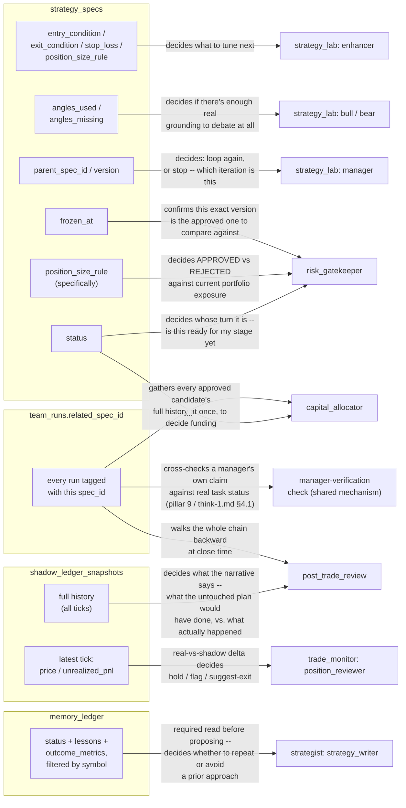

> **Synced, not thrown out.** The `strategy_specs`/`memory_ledger`
> stores below were designed before finding that `vinu-research` already
> has real versions — `Artifact`/`SqliteStrategyStore` and `Hypothesis`/
> `HypothesisRegistry` (see
> [../../../implementation/13-vinu-research-in-process-migration.md](../../../implementation/13-vinu-research-in-process-migration.md)).
> §0 below maps this file's original schema onto the real one, field by
> field, and flags exactly which parts of the original thinking are
> still worth adding to the real system as genuine improvements, not
> discarded. `shadow_ledger_snapshots` (§4) is unaffected — nothing real
> does a continuous live-vs-shadow twin anywhere, so that part is still
> the live, unbuilt proposal it always was.

## §0. Mapping this file's schema onto the real one

| This file proposed | Real equivalent | Verdict |
|---|---|---|
| `strategy_specs` table, `spec_id` | `vinu_research.models.Artifact`, `artifact_id`, stored in `SqliteStrategyStore` (`vinu_research/storage/strategy_store.py`) | **Use the real one.** More mature — already has `deflated_sharpe`, `holdout_passed`, `stress_test_passed`, bench/decay/calibration history tables this file didn't even propose. |
| `status` enum (`drafted → lab_approved → gate_approved → funded → live → closed`) | `ArtifactStatus` enum: `CREATED → BENCHING → ACTIVE → MONITORING → DECAYED → DISABLED`, gated by `vinu_research/promotion.py::meets_promotion_bar` | **Use the real one.** Real gate is stricter (deflated Sharpe + holdout + stress test + correlation, not just a manager's verdict) — see pillar 6 sync below for what's still worth *adding* to it. |
| `memory_ledger` table, `ledger_id` | `vinu_research.models.Hypothesis`/`Evidence`, stored via `HypothesisRegistry` (`vinu_research/hypothesis_registry.py`) | **Use the real one.** Already does status (`exploring/testing/validated/rejected/monitoring`), evidence history, `query_by_symbol`, `search` — everything this file's `memory_ledger` proposed, already built. |
| `team_runs.related_spec_id` (traceability link) | `Artifact.source_run_id` doesn't fit (it's an `int`, vinu-agent's `run_id` is a hex string — confirmed a real mismatch while building this, see [../../../implementation/14-research-team-artifact-writing.md](../../../implementation/14-research-team-artifact-writing.md)) | **Done.** `team_runs.related_artifact_id` built and migration-tested — see [../../../implementation/00-status.md](../../../implementation/00-status.md) row 15. `store.list_by_artifact_id(artifact_id)` answers "every run that touched this artifact" for real now. |
| `shadow_ledger_snapshots` | `broker/performance_store.py::PaperPerformanceStore` is related but simpler (in-memory, per-artifact daily returns only, "v1") | **Still an open gap**, not superseded — see §4 below, unchanged. |

# Pillar 5 — schema design and field visibility

Reference: [../archi-think-1.md](../archi-think-1.md) (the 9 pillars),
[../../think-1.md](../../think-1.md) (the 8-team design this schema
serves). This file is the concrete answer to pillar 5 specifically —
what each new store's rows actually look like, and, since a schema is
only useful once you know who reads which field for what, a field-level
map of what every downstream team actually looks at to decide what to do
next.

**Revised after pillar 6** — the `status` enum below and the
append-only claim are now kept in sync with
[02-pillar6-immutability-and-deletion-policy.md](02-pillar6-immutability-and-deletion-policy.md),
which is the actual source of truth for the state machine and the
content-vs-lifecycle distinction. Updating this file in place rather than
letting it drift, so the two don't quietly disagree with each other.

## The core decision: 4 new stores, not one per team

`team_runs`/`team_tasks` already exist and already record what each team
did, when, with what result — no new table needed for a risk debate's
output, rehearsal metrics, a gate verdict, or an allocation decision; all
of that is just the `result_json` on that team's own `team_runs` row.
Real position/exposure data is external (owned by `vinu-live`, not
duplicated here). What's genuinely new: the artifact those runs act on
(`strategy_specs`), the cross-cycle lesson store (`memory_ledger`), and
the one truly continuous, time-series store (`shadow_ledger_snapshots`) —
plus one new column on the table that already exists.

## 1. `strategy_specs` — the central, versioned artifact

```json
{
  "spec_id": "uuid",
  "parent_spec_id": "uuid | null",
  "version": 1,
  "symbol": "AAPL",
  "status": "drafted | lab_approved | lab_rejected | gate_approved | gate_rejected | funded | not_funded | live | closed",
  "direction": "long | short",
  "entry_condition": "...",
  "exit_condition": "...",
  "stop_loss": "...",
  "position_size_rule": "...",
  "angles_used": ["..."],
  "angles_missing": ["..."],
  "prior_lessons_considered": ["ledger_id", "..."],
  "created_at": "...",
  "frozen_at": "... | null",
  "created_by_run_id": "team_runs.run_id"
}
```

**Content fields are write-once** — every re-enhancement is a new row
(`parent_spec_id` points back), never an in-place edit. **`status` is the
one field allowed to change on a given row**, and only forward through
the state machine in
[02-pillar6-immutability-and-deletion-policy.md](02-pillar6-immutability-and-deletion-policy.md)§2
— `drafted → lab_approved/lab_rejected → gate_approved/gate_rejected →
funded/not_funded → live → closed`, enforced by a narrow
`advance_status()` method with no generic update path, not by convention
alone. `frozen_at` is set the moment `risk_gatekeeper` approves it — this
timestamp marks "this exact version is the one that went live," which
`post_trade_review` and `trade_monitor` key off of.

## 2. `team_runs.related_spec_id` — the traceability link (one new column, not a new table)

Every team along the pipeline — `strategy_lab`, `risk_gatekeeper`,
`capital_allocator`, `trade_monitor`, `post_trade_review` — tags its run
with the `spec_id` it operated on. `SELECT * FROM team_runs WHERE
related_spec_id = ? ORDER BY created_at` then answers "everything that
ever happened to this strategy" in one query.

**Revised in pillar 7:** `spec_id` isn't just modeled on
`pnl_attribution.artifact_id`'s pattern — it *is* that same ID, carried
across into `vinu-live`'s `Position.artifact_id` at execution time, not a
separate value reconciled against it. See
[03-pillar7-traceability.md](03-pillar7-traceability.md) for why that
one choice avoids needing a bridge table at the vinu-agent/vinu-live
boundary.

## 3. `memory_ledger` — per-symbol lessons

```json
{
  "ledger_id": "uuid",
  "symbol": "AAPL",
  "setup_type": "mean-reversion-oversold | ...",
  "status": "exploring | validated | rejected | monitoring",
  "spec_id": "the strategy_specs row this lesson is about",
  "summary": "short plain text",
  "lessons": "post_trade_review's LESSONS: text",
  "outcome_metrics": {"...": "..."},
  "created_at": "...",
  "created_by_run_id": "..."
}
```

Shape borrowed from Vibe-Trading's `HypothesisRegistry` (the one pattern
from the reference-repo research worth copying close to verbatim).
Append-only, same reasoning as `strategy_specs`.

## 4. `shadow_ledger_snapshots` — the one real time series

```json
{
  "shadow_id": "uuid, one per live position",
  "spec_id": "the frozen spec being shadowed",
  "position_id": "the real position it twins",
  "ts": "...",
  "price": "...",
  "unrealized_pnl": "...",
  "state": "..."
}
```

One row per update tick — deterministic, no LLM involved in writing it,
which is also why it never runs into the immutability question the way
an LLM-produced artifact does: every tick is just a new fact. This is
also the one store where volume matters enough to need a real pruning
policy, not just "keep everything forever" — see
[02-pillar6-immutability-and-deletion-policy.md](02-pillar6-immutability-and-deletion-policy.md)§4:
full per-tick resolution is kept for a retention window, then collapsed
to a permanent downsampled summary.

## 5. Field visibility — what each team actually reads to decide what happens next

This is the part a schema alone doesn't answer: a field only matters if
something downstream actually looks at it to make a call. Diagram below
traces, for each new store, which specific field(s) drive which team's
decision — not just "team X reads store Y."



## What this diagram makes explicit that the schema alone didn't

- **`angles_used`/`angles_missing` (F2) isn't read by `risk_gatekeeper` or
  `capital_allocator` at all** — only by `strategy_lab`'s bull/bear debate,
  while the strategy's own soundness is still in question. Once past that
  stage, downstream teams trust the `gate_approved`/`funded` status
  transition rather than re-deriving grounding themselves — deliberate,
  keeps each team answering only its own question (per each team's
  "explicitly out of scope" section in
  [../../agents-explanation-in-detail/](../../agents-explanation-in-detail/)).
- **`team_runs.related_spec_id` (F7) is the single busiest field in the
  whole design** — three different teams/mechanisms read it for three
  different reasons (funding decisions, post-trade narrative, manager
  verification). This is the concrete payoff of pillar 7 (traceability)
  landing as one column instead of a bespoke lookup per team.
- **`shadow_ledger_snapshots` has two genuinely different read patterns**
  — `trade_monitor` only ever needs the *latest* tick (F9, a live delta),
  while `post_trade_review` needs the *entire* history (F10, a path
  comparison). Same store, different query shape — worth keeping the API
  (pillar 1) able to serve both cheaply rather than always returning the
  full series.

## Still open

`capital_allocator`'s own output shape is deliberately not in this
diagram — it's blocked on the allocation math itself (Kelly /
fixed-fraction / risk-parity), a separate decision from schema design,
per [../../agents-explanation-in-detail/06-capital-allocator.md](../../agents-explanation-in-detail/06-capital-allocator.md).
