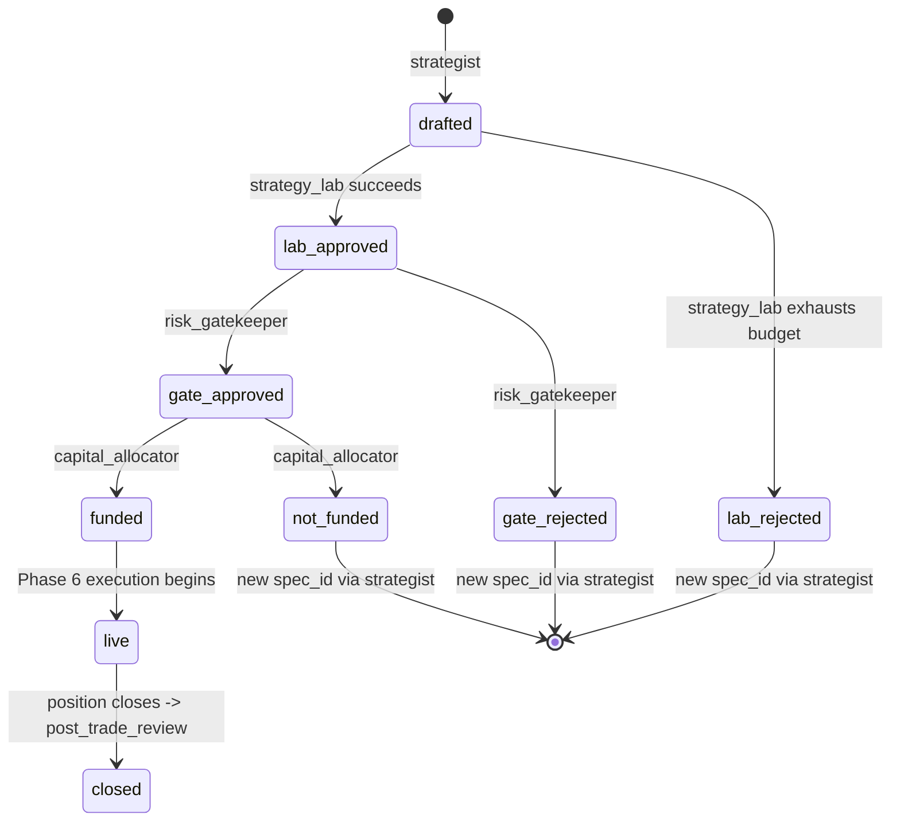

> **Synced, not thrown out.** vinu-research already has exactly the kind
> of state machine this file designed from scratch: `ArtifactStatus`
> (`CREATED → BENCHING → ACTIVE → MONITORING → DECAYED → DISABLED`),
> gated by `vinu_research/promotion.py::meets_promotion_bar` (deflated
> Sharpe, holdout, stress test, correlation — stricter than what this
> file proposed). §0 below maps the two and calls out the one real,
> still-worth-doing improvement this file's thinking suggests for the
> *real* store.

## §0. What's real already, and what's still worth adding

- **The state machine itself**: real, built, stricter than proposed here
  — use `ArtifactStatus`/`meets_promotion_bar`, not the `drafted →
  lab_approved → ...` chain this file invented.
- **Enforcement gap — now closed.** `SqliteStrategyStore.upsert_artifact()`
  is still `INSERT OR REPLACE` (unchanged, still able to overwrite any
  field including jumping `status` backward if a caller sets it directly
  and calls `upsert_artifact` themselves) — but there is now a narrow,
  validated alternative: `transition_status(artifact_id, to_status)` plus
  named wrappers `mark_benching`/`mark_active`/`mark_monitoring`/
  `mark_decayed`/`mark_disabled`, each checking the current status against
  a real transition table (`_ALLOWED_TRANSITIONS` in
  `vinu_research/storage/strategy_store.py`) before writing, raising
  `InvalidStatusTransition` otherwise. **Done** — 11 tests in
  `vinu-research/tests/test_strategy_store_transitions.py`. `upsert_artifact`
  itself is intentionally left as-is (still needed for the initial
  CREATED/BENCHING write in `research_artifact_writer.py`, which sets
  fields `transition_status` doesn't touch) — the hardening is an
  *additional* narrow path, not a replacement of the existing one.
- **The deletion policy below (§4) is still relevant as-is**: the real
  `SqliteStrategyStore.delete_artifact()` does a genuine hard delete
  (removes the row and its bench/decay/calibration history, no
  tombstone) — this file's original recommendation (load-bearing records
  are never hard-deleted, only superseded or tombstoned) still applies
  to the real method, unchanged from the original design below.

# Pillar 6 — immutability, and a proper deletion policy

Reference: [../archi-think-1.md](../archi-think-1.md) (the 9 pillars, plus
the retention/pruning note at the end), and
[01-pillar5-schema-and-field-visibility.md](01-pillar5-schema-and-field-visibility.md)
(the schemas this pillar governs).

**Correction to an earlier draft of this pillar:** it initially claimed
"no deletes, ever." That's wrong, and it directly contradicted
`archi-think-1.md`'s own retention/pruning item, which correctly points
out the memory ledger and shadow ledger both grow without bound and the
project already has a real "prunable" tier concept for exactly this. The
right rule isn't "never delete" — it's a distinction between records that
are load-bearing evidence and records that aren't, below.

## 1. Content vs. lifecycle — two different rules on the same row

- **Content fields** (`entry_condition`, `exit_condition`, `stop_loss`,
  `position_size_rule`, `angles_used`, `angles_missing`) — write-once.
  Never touched again after the row is created. Any real change means a
  new row (`parent_spec_id` pointing back), not an edit.
- **Lifecycle fields** (`status`, `frozen_at`) — allowed to progress, but
  only *forward*, through one defined state machine, never backward and
  never skipping a step.

## 2. The state machine

Every rejection path produces a **new** `spec_id` via `strategist`, never
a resurrected old one — a rejected spec stays exactly as rejected,
forever (subject to the pruning rule in §4, since it was never
load-bearing).

## 3. Enforcement — a convention isn't a guarantee

Append-only-by-convention doesn't stop a future bug (or a careless edit)
from `UPDATE`-ing a row directly — SQLite won't stop you on its own. The
real fix is the same shape the codebase already uses for `TeamRunStore`:
no generic `update(**kwargs)` method exists at all. `TeamRunStore` only
exposes narrow, purpose-built transitions (`mark_running`, `mark_done`,
`mark_failed`). The new `strategy_specs` store follows the same shape:

- `create_version(...)` — always inserts a new row, never updates one.
- `advance_status(spec_id, new_status)` — whitelists only the arrows in
  the diagram above; raises an error on anything else (same "enforced by
  raising, not by a prompt instruction" principle as the
  manager-verification mechanism, `think-1.md` §4.1).

There's no code path capable of touching a content field after creation,
because the method to do that is simply never written — the same
discipline this whole design keeps returning to: don't rely on an agent
(or a future developer) remembering a rule; make the rule the only thing
the code is capable of doing.

## 4. The corrected deletion policy

**Load-bearing → never deleted, no exceptions:**
- Any `strategy_specs` row that ever reached `gate_approved` or later
  (i.e. it was actually used to make a real decision, even if it was
  later rejected at a later stage — the *decision itself* is the
  evidence, not just the outcome).
- Every `memory_ledger` entry tied to a `closed` position — this is the
  actual accumulated trading history the whole "the org learns over
  time" idea depends on.
- A **summarized** shadow-ledger path for any closed position (see below
  for what "summarized" means).

**Not load-bearing → eligible for policy-driven pruning:**
- `strategy_specs` rows that never got past `drafted`/`lab_rejected` —
  nothing downstream ever depended on them.
- Superseded intermediate `enhancer` iterations within a single
  `strategy_lab` run, once that run concluded with a `lab_approved`
  choice — the winning version's full lineage chain (`parent_spec_id`)
  is enough provenance; the sibling branches that lost aren't separately
  load-bearing once the loop is over.
- A ledger entry that was itself superseded by a corrected one (the
  correction stays permanently per the rule above; the thing it corrected
  can eventually be pruned, since the correction's own text should say
  what it corrected).

**High-volume raw data → downsample, don't keep at full resolution
forever:**
- `shadow_ledger_snapshots` at full per-tick resolution is the one
  genuinely large store in this design — potentially thousands of rows
  per position. `post_trade_review` needs the *shape* of the path (major
  turning points, the divergence-from-real moments, start/end state), not
  infinite resolution forever. Policy: keep full resolution for some
  retention window (e.g. while the position is open, plus a short buffer
  after close for review), then collapse to a downsampled summary
  (matches the "load-bearing" bucket above) and prune the raw ticks.

**How deletion itself has to work — never silent:**
- No generic `delete(id)` exposed to any team or specialist — deletion is
  a narrow, named, policy-driven operation
  (`prune_older_than(store, cutoff)`), not something a run can invoke ad
  hoc.
- Every prune operation writes its own lightweight record — what was
  pruned, how many rows, the cutoff policy that triggered it, when — so a
  gap in the historical data is always explainable, never mysterious.
  This is the same principle as the manager-verification mechanism (§4.1)
  applied to the data layer itself: nothing about this system's state
  should ever be inferred by absence; if something's gone, there should
  be a record saying so.

## 5. Why this matters beyond just "tidy storage"

The whole reason pillar 6 exists is so `post_trade_review` and the
manager-verification mechanism can trust that what they're comparing
against is real and untampered. A blanket "never delete anything" would
have protected that same guarantee too aggressively, at real storage cost
for data that was never actually part of that guarantee in the first
place (a rejected draft nobody ever acted on). The corrected policy keeps
the guarantee exactly where it matters — anything that was ever load-
bearing evidence — while being honest that not everything this design
produces needs to live forever.
