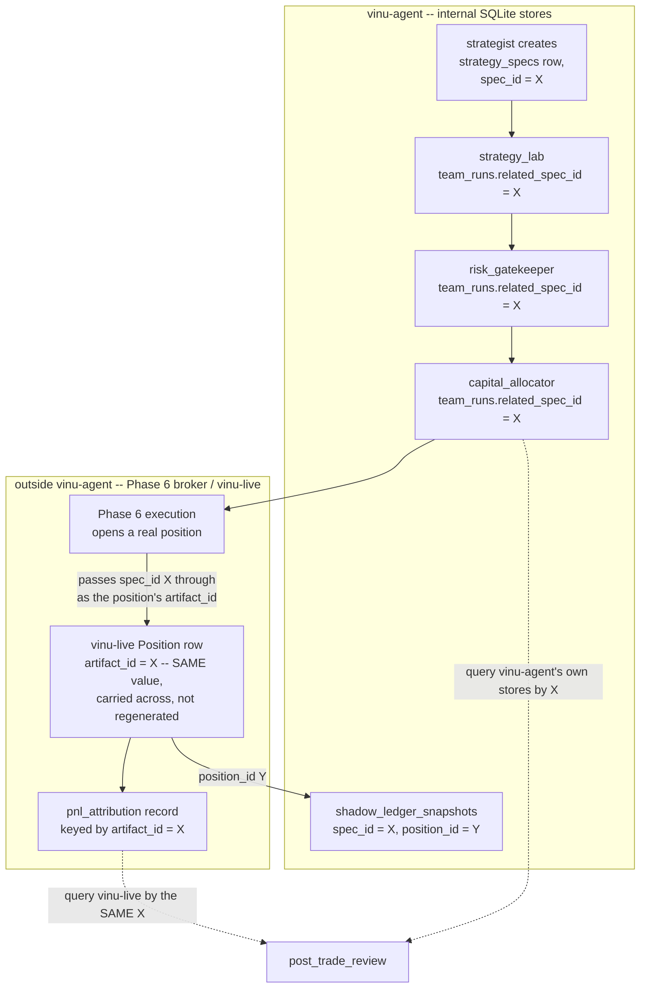

> **This one held up.** The core call here — `spec_id` should *be*
> `vinu-live`'s `Position.artifact_id`, not a second ID needing a bridge
> table — turned out to match reality even more directly than expected:
> it's literally `vinu_research.models.Artifact.artifact_id`, the real
> ID `SqliteStrategyStore` already uses. No correction needed. The
> `related_spec_id` link on `team_runs` this file assumes (from pillar 5)
> is still real and still worth adding — see pillar 5's sync note, table
> row on `related_spec_id`/`related_artifact_id`.

# Pillar 7 — traceability

Reference: [../archi-think-1.md](../archi-think-1.md) (the 9 pillars),
[01-pillar5-schema-and-field-visibility.md](01-pillar5-schema-and-field-visibility.md)
(where `team_runs.related_spec_id` was introduced),
[02-pillar6-immutability-and-deletion-policy.md](02-pillar6-immutability-and-deletion-policy.md)
(the state machine this chain walks through).

## What's already solved — not re-litigated here

`team_runs.related_spec_id` (pillar 5 §2) already answers "find every run
that ever touched this strategy" in one query, for the entire
pre-execution chain: `strategist → strategy_lab → risk_gatekeeper →
capital_allocator`. That part of pillar 7 is done; this file is about
what's left.

## The real remaining gap: the chain crosses a system boundary

Everything up through `capital_allocator` lives inside vinu-agent's own
SQLite stores, all keyed by `spec_id`. But once a strategy goes `live`,
Phase 6 execution happens **outside vinu-agent entirely** — the real
position lives in `vinu-live`'s own schema, which already has its own
identity concept: `Position.artifact_id`, confirmed directly against the
real schema and the `pnl_attribution` design doc, linking a closed
position back to "the Phase 4 frozen TradePlan artifact that authored
it." So there are, on paper, two IDs that need to line up: vinu-agent's
`spec_id` and vinu-live's `artifact_id`.

**The clean answer: don't let there be two IDs at all.** `spec_id` should
*be* the value used as `artifact_id` in `vinu-live` — the same UUID,
carried across the boundary, not translated or looked up via a mapping
table. Whatever triggers Phase 6 execution (reads a `funded` spec from
`capital_allocator`'s output and actually opens the position) is
responsible for passing that same `spec_id` value through as the
position's `artifact_id` at creation time. One ID, from the moment
`strategist` creates the spec to the moment `pnl_attribution` records the
closed trade — no bridge table, no second lookup, nothing to keep in
sync between two ID spaces.

## What this means concretely — one ID, two systems, no shared database

This is *not* a single SQL join across two databases — SQLite files in
different services can't do that, and shouldn't be made to. What
guaranteeing the same ID value buys you is that **each system can be
queried independently by the same key**, and the results line up without
either system needing to know about the other's schema:

`post_trade_review` (the one consumer that actually needs the whole
chain) issues two separate, independent queries — one into vinu-agent's
own `team_runs`/`strategy_specs`, one into `vinu-live`'s real records —
both keyed by the same `X`. Neither system needs write access to the
other's database; they just need to agree, once, that this one value
means the same thing in both places.

## One deliberately soft edge, not solved here

Traceability *upstream* of `strategist` — "why did we even look at this
symbol" (which `screener` run, or which `research` idea, prompted the
orchestrator to delegate to `strategist` in the first place) — isn't
given a hard database link in this design. That context already lives in
the orchestrator's own conversation history (`SessionStore`), and
duplicating it into a formal foreign key would be doing twice what's
already available once. If that turns out to matter later (e.g. someone
wants "show me every strategy that came from research idea Z" as a real
query, not a conversation to re-read), the fix is cheap: add one more
optional field to `strategy_specs` — `source_run_id` — but it's not built
now, on the theory that conversational context already covers this case
until proven otherwise.

## Net effect

Pillar 7 turns out to be small once pillar 5's `related_spec_id` link
exists: the only real design decision was refusing to let a second ID
space exist at the vinu-agent/vinu-live boundary. `spec_id` *is*
`artifact_id` — that single choice is what makes "walk backward from a
closed position to the original strategist call" actually a two-query
operation instead of a reconciliation problem.
