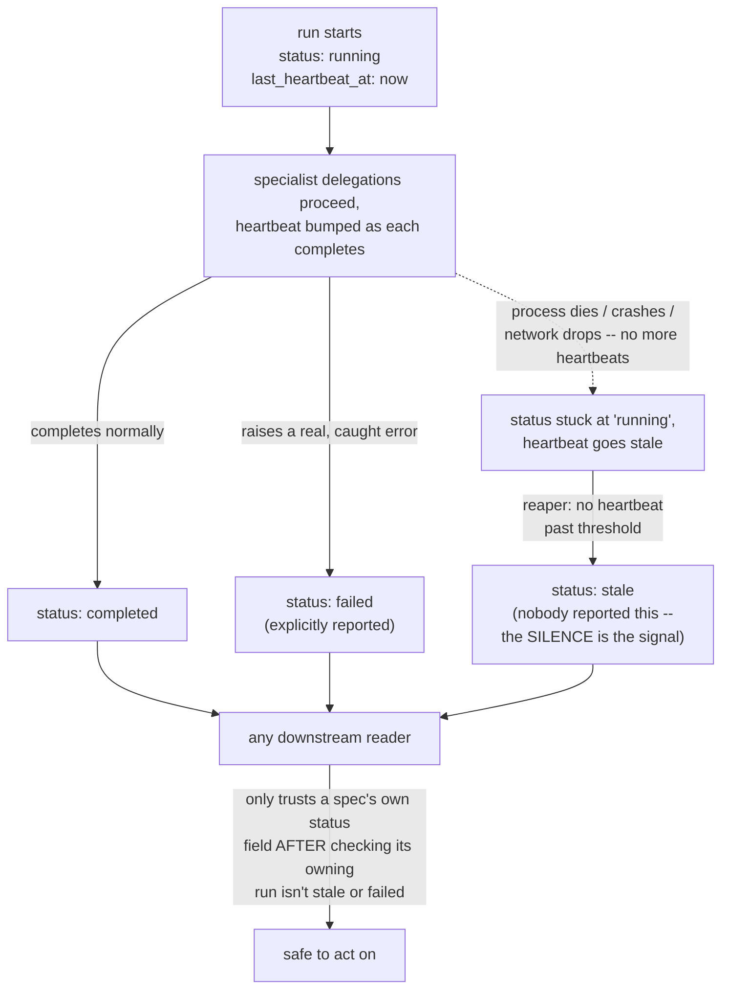

# Pillar 9 — partial and failed writes

Reference: [../archi-think-1.md](../archi-think-1.md) (the 9 pillars),
[../../think-1.md](../../think-1.md)§4.1 (the manager-verification
mechanism this pillar directly strengthens),
[02-pillar6-immutability-and-deletion-policy.md](02-pillar6-immutability-and-deletion-policy.md)
(the state machine whose transitions this pillar governs the honesty of).

## What's already solved

`team_runs`/`team_tasks` already has a real status enum
(`pending`/`running`/`completed`/`failed`/`cancelled`, mirroring
`SwarmRun`) — a run that explicitly errors out is already visible as
`failed`, not silently absent. That part of pillar 9 is done.

## The real gap: silence looks identical to "still working"

A single SQLite `INSERT`/`UPDATE` is already atomic — that was never the
risk. The actual risk is a **multi-step process getting interrupted
between steps**: `strategy_lab` crashes after `enhancer` writes a new
`strategy_specs` row but before `bull_advocate` even starts. Nothing
raised an error, so nothing sets `status: failed`. The row just... stops
changing. And a row that's genuinely still being worked on, mid-iteration,
looks *exactly the same* from the outside as one that crashed ten minutes
ago and nobody will ever touch again: same status, no error, no signal.
This is a real, well-known distributed-systems problem (not unique to
trading agents), and it needs the same fix every such system uses:
**a heartbeat, plus a reaper that acts on its absence.**

## The fix: heartbeat + reaper + an honest third status

- Every `team_runs` row gets a `last_heartbeat_at` timestamp, updated
  periodically while the run is genuinely in progress (each specialist
  delegation completing is a natural, cheap point to bump it — no new
  background thread needed, matching the same "reuse what's already
  running synchronously" reasoning the SSE side-channel used).
- A lightweight reaper (checked on read, or a periodic sweep — doesn't
  need to be fancy) looks for rows with `status: running` and
  `last_heartbeat_at` older than a threshold, and transitions them to a
  **new, distinct status: `stale`** — not `failed`. The difference
  matters: `failed` means the code itself caught and reported a real
  error; `stale` means nobody reported anything at all, and the silence
  itself is the signal. Conflating the two would let a genuinely
  crashed run masquerade as a normal, explained failure — the opposite
  of the honesty this whole design keeps insisting on.

## How this plays out per store — three genuinely different detection shapes

- **`strategy_specs`** — a spec's own `status` field alone isn't enough
  context. `capital_allocator` scanning for `gate_approved` candidates
  has to also check, via `team_runs.related_spec_id`, that the run which
  was supposed to advance this spec further isn't sitting `stale`. This
  is the same `related_spec_id` link from pillar 7, now doing
  double duty — not just an audit trail, but operationally required to
  correctly interpret what a status actually means right now.
- **`memory_ledger`** — if `post_trade_review` crashes before writing a
  ledger entry, there's simply no row — an absence, not a broken one.
  The visible signal isn't in this store at all; it's "a `pnl_attribution`
  record exists for a closed position, but no `post_trade_review` run
  with `related_spec_id` matching it ever reached `completed`." Same
  underlying mechanism as the point above, just checked from the other
  direction.
- **`shadow_ledger_snapshots`** — different failure shape entirely: a
  missed tick doesn't leave a broken row, it leaves a **gap in the
  timestamp sequence**. Any reader of the shadow ledger's history
  (`trade_monitor`, `post_trade_review`) should check for a gap larger
  than the expected update cadence and treat it as "not tracked during
  this window," not silently interpolate or assume continuity. This is a
  sequence-gap check, not a status check — worth keeping distinct rather
  than trying to force it into the same status-enum shape as the other
  two.

## Why this specifically strengthens the manager-verification mechanism

`think-1.md`§4.1's whole premise is cross-referencing a manager's final
claim against the real underlying task records — that check is only as
good as those records being honest about their own completeness. Without
the `stale` status, a manager whose own specialist genuinely crashed
mid-run would see that specialist's task sitting at `running` forever,
which the verification check has no clean way to flag as wrong (it isn't
`failed`, so what would the check even compare against?). With `stale` as
a real, distinct outcome, the verification check gets a third thing to
look for, not just two: does the manager's final answer account for any
task that's `failed` *or* `stale`, not just silently proceed as if
everything either succeeded or explicitly errored.

## Net effect

One new column (`last_heartbeat_at`), one new status value (`stale`), and
a cheap reaper — not a new subsystem. What it buys: nothing in this
design can sit in an ambiguous "maybe still working, maybe abandoned"
state forever, which matters everywhere a downstream team (or a human)
has to decide whether to trust what a status field is currently claiming.
