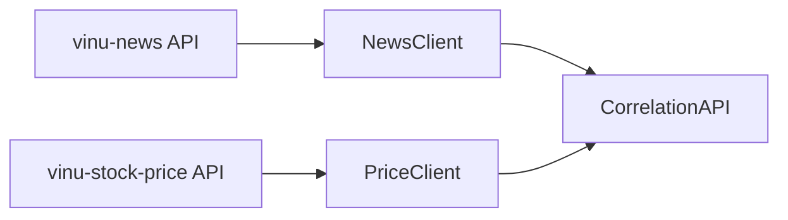

# Chapter 03 — Data source architecture

| Field | Value |
|-------|-------|
| **Package** | vinu-correlation |
| **Module** | `vinu_correlation/clients/` |
| **Status** | DRAFT |
| **Prerequisites** | ch01, ch02 |

## 1. Problem this module solves

vinu-correlation needs two external data streams — news articles and price candles. Rather than owning the data, it relies on the sister packages vinu-news and vinu-stock-price via HTTP APIs.

## 2. Position in pipeline

## 3. File map

| File | Responsibility |
|------|----------------|
| `clients/__init__.py` | Package init |
| `clients/news_client.py` | Fetch articles from vinu-news |
| `clients/price_client.py` | Fetch candles from vinu-stock-price |
| `net.py` | HTTP client with Docker fallback |

## 4. Configuration

Both clients read their base URL from config:

| Key | Env | Default |
|-----|-----|---------|
| News API URL | `VINU_NEWS_API_URL` | `http://127.0.0.1:8080` |
| Stock API URL | `VINU_STOCK_API_URL` | `http://127.0.0.1:8081` |
