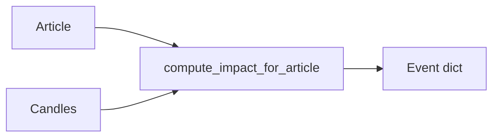

# Chapter 07 — News impact analysis

| Field | Value |
|-------|-------|
| **Package** | vinu-correlation |
| **Module** | `vinu_correlation/engine/impact.py` |
| **Status** | DRAFT |
| **Prerequisites** | ch03–ch05 |

## 1. Problem

When a news article is published, how much does the price actually move? Impact analysis measures the price change across multiple windows (5m, 15m, 30m, 1h, 1d) after each article.

## 2. Position in pipeline

## 3. File map

| Function | Responsibility |
|----------|----------------|
| `compute_impact_for_article()` | Compute price changes, abnormal return, classify impact label |
| `parse_tickers()` | Extract primary + secondary tickers |
| `aggregate_by_thread()` | Group events by story thread |
| `_compute_price_change()` | Calculate % change between two timestamps |
| `_classify_impact()` | Map sentiment + price change to impact label |

## 4. Impact labels

| Label | Condition |
|-------|-----------|
| `high_bearish` | Neg sentiment & abs(price_change) >= high_threshold |
| `high_bullish` | Pos sentiment & abs(price_change) >= high_threshold |
| `high` | abs(price_change) >= high_threshold (neutral sentiment) |
| `medium` | abs(price_change) >= medium_threshold |
| `low` | Everything else |

## 5. Thread aggregation

Events sharing a `thread_id` are aggregated into thread summaries with cumulative sentiment, max price change, and time span. Articles below the `min_thread_articles` threshold remain standalone.

## 6. Tests

| Test file | Asserts |
|-----------|---------|
| `tests/test_impact.py` | Impact classification, ticker parsing, thread aggregation |
