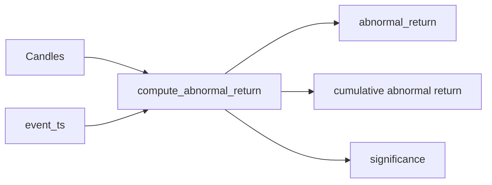

# Chapter 11 — Event study & abnormal returns

| Field | Value |
|-------|-------|
| **Package** | vinu-correlation |
| **Module** | `vinu_correlation/engine/event_study.py` |
| **Status** | DRAFT |
| **Prerequisites** | ch07 |

## 1. Problem

Beyond raw price change, event study methodology measures the *abnormal* return — the difference between actual return and the expected return estimated from a pre-event window.

## 2. Logic

### Estimation window

Pre-event window: 7 days (604,800 sec). Requires at least 10 pre-event candles.

### Event window

Post-event window: 30 minutes (1800 sec). Requires at least 2 event candles.

### Computation

1. Compute returns series for pre-event and event windows
2. Expected return = mean of pre-event returns
3. Abnormal return = event return - expected return
4. CAR = sum of abnormal returns over the event window
5. One-sample t-test against zero for significance

## 3. Data contract

| Field | Type | Description |
|-------|------|-------------|
| `abnormal_return` | float | First event-period abnormal return |
| `car` | float | Cumulative abnormal return |
| `ar_p_value` | float | T-test p-value |
| `significant` | bool | p < 0.05 |
| `expected_return` | float | Mean pre-event return |

## 4. Significance levels

| p-value | Label |
|---------|-------|
| < 0.01 | highly_significant |
| < 0.05 | significant |
| < 0.10 | marginally_significant |
| >= 0.10 | insignificant |

## 5. Tests

| Test file | Asserts |
|-----------|---------|
| `tests/test_event_study.py` | Abnormal return, CAR, significance classification |
