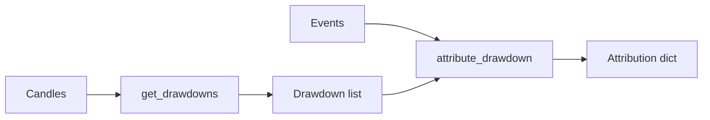

# Chapter 12 — Drawdown detection & attribution

| Field | Value |
|-------|-------|
| **Package** | vinu-correlation |
| **Module** | `vinu_correlation/engine/drawdown.py` |
| **Status** | DRAFT |
| **Prerequisites** | ch07, ch11 |

## 1. Problem

Identify significant price declines (drawdowns) and attribute them to news events, market beta, or unexplained factors.

## 2. Pipeline

### Drawdown detection

1. Walk through sorted candles, tracking running peaks
2. For each peak, scan forward until price drops >= `drop_threshold_pct` (default -3%)
3. Record peak_ts, trough_ts, drop_pct, peak_price, trough_price

### Drawdown attribution

1. Collect events before the peak timestamp for the symbol
2. Compute total absolute price impact of events
3. Fit OLS: `price_change_30m ~ impact_score`
4. News-driven % = `coeff / (coeff + 1)`, capped at reasonable bounds
5. Decompose into news_driven_pct, market_beta_pct, unexplained_pct

## 3. Data contract

| Field | Type | Description |
|-------|------|-------------|
| `drawdown_count` | int | Number of drawdowns found |
| `drawdowns` | list | Per-drawdown attribution |
| `→ drop_pct` | float | Peak-to-trough % |
| `→ attribution.news_driven_pct` | float | Fraction attributed to news |
| `→ attribution.market_beta_pct` | float | Fraction attributed to market |
| `→ attribution.unexplained_pct` | float | Residual fraction |
| `→ attribution.contributing_events` | list | Events ranked by impact |

## 4. Tests

| Test file | Asserts |
|-----------|---------|
| `tests/test_drawdown.py` | Peak detection, attribution, edge cases |
