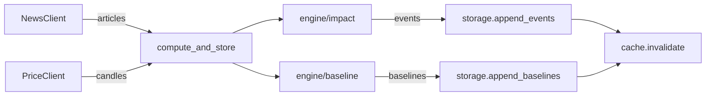

# Chapter 19 — Compute pipeline

| Field | Value |
|-------|-------|
| **Package** | vinu-correlation |
| **Module** | `vinu_correlation/api.py` (compute_and_store) |
| **Status** | DRAFT |
| **Prerequisites** | ch07–ch14, ch15–ch17 |

## 1. Problem

The compute pipeline orchestrates the full workflow: fetch data from both sources, run all engine modules, and persist results to storage.

## 2. Pipeline flow



## 3. Key method

```python
def compute_and_store(self, symbol, incremental=True):
    if incremental:
        last_ts = self._storage.get_last_computed_ts(symbol)
    articles = self._news_client.get_ticker_news(symbol, days=30)
    all_events = [compute_impact_for_article(a, self._price_client) for a in articles]
    self._storage.append_events(symbol, all_events)
    baselines = compute_baseline(articles)
    self._storage.append_baselines(symbol, baselines)
    self._cache.invalidate(symbol)
```

## 4. What it produces

- **Impact events**: per-article price changes + event study results → `{symbol}/{year}.parquet`
- **Baselines**: rolling news volume statistics per session → `{symbol}/{year}_baseline.parquet`

## 5. CLI invocation

```bash
vinu-correlation-compute AAPL MSFT GOOGL
vinu-correlation-compute --all
```
