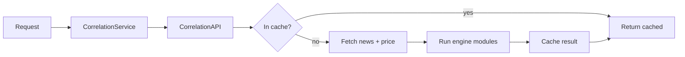

# Chapter 28 — Service facade

| Field | Value |
|-------|-------|
| **Package** | vinu-correlation |
| **Module** | `vinu_correlation/service.py` + `vinu_correlation/api.py` |
| **Status** | DRAFT |
| **Prerequisites** | ch22 |

## 1. Architecture

```
CLI / HTTP API
      |
CorrelationService  (service.py) — thin facade
      |
CorrelationAPI     (api.py) — business logic + orchestration
      |
  +---+---+
  |       |
clients  engine  storage  cache
```

## 2. CorrelationService

A thin wrapper around `CorrelationAPI` that provides:

```python
class CorrelationService:
    def get_impact(self, symbol, from_ts=None, to_ts=None)
    def get_events(self, symbol, from_ts=None, to_ts=None)
    def get_correlation(self, symbol, from_ts=None, to_ts=None)
    def get_drawdown(self, symbol, from_ts=None, to_ts=None)
    def get_baseline(self, symbol)
    def compute(self, symbol, incremental=True)
    def close(self)
```

## 3. CorrelationAPI

The core orchestrator that:

- Accepts a `VinuCorrelationConfig` (or loads from env)
- Creates `NewsClient`, `PriceClient`, `CorrelationStorage`, `CorrelationCache`
- Implements the full query-and-cache pattern:
  1. Check cache → return if hit
  2. Fetch from external APIs
  3. Run engine computations
  4. Cache the result
  5. Return

## 4. Request flow


