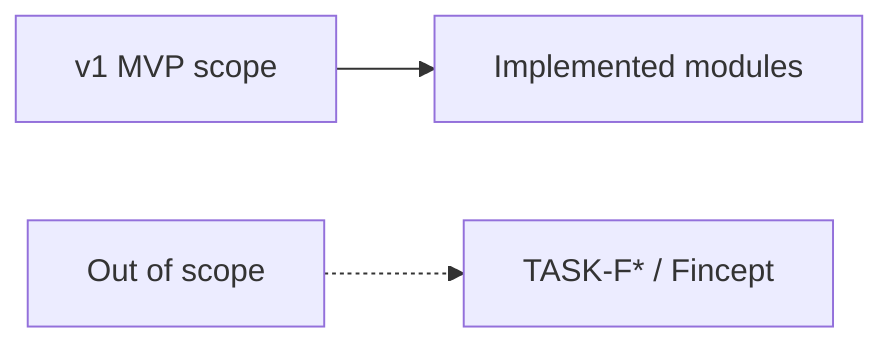

# Appendix C — Out of Scope for v1

| Field | Value |
|-------|-------|
| **Package** | vinu-features |
| **Module** | — |
| **Status** | REVIEW |
| **Verified** | 2026-07-06 |
| **Prerequisites** | Chapter 00 |

## Learning objectives

- List features explicitly excluded from v1 MVP.
- Avoid planning work that belongs in enhancement TASKs or Fincept-scale scope.
- Point stakeholders to roadmap appendix for planned follow-ups.

## 1. Problem this module solves

Without a clear **out-of-scope** boundary, contributors re-propose strategy evaluation, live feature databases, or multi-interval storage. This appendix records what **vinu-features v1 deliberately does not do**, sourced from [`complete_guide_features.md`](../../complete_guide_features.md).

## 2. Position in pipeline

| Step | Input | Output |
|------|-------|--------|
| Read this appendix | feature request | In-scope vs defer decision |
| Check apx-d | TASK id | Target chapter if planned |

## 3. File map

| File | Responsibility |
|------|----------------|
| `docs/complete_guide_features.md` | Legacy guide |
| `docs/book/part-5-appendices/apx-d-roadmap-gaps.md` | Planned work map |

## 4. Data contracts

### In scope (v1 summary)

| Capability | Module |
|------------|--------|
| SQLite request registry | `storage/sqlite_backend.py` |
| 23 TA indicators | `compute/indicators/` |
| 8 preset blueprints + 3 alpha sets | `compute/bigger_recipe/` |
| 9 ML models | `compute/ml_models/` |
| FastAPI + CLI | `server/`, `cli.py` |
| Web UI (React) | `web/` |
| Parquet run artifacts | `engine/engine.py` |

### Out of scope (explicit)

| Item | Notes | Future task |
|------|-------|-------------|
| Strategy / rule evaluation | Manifest stores conditions only | vinu-strategy (separate package) |
| Live feature DB | Runs are static parquet snapshots | — |
| Multi-interval native storage | Query-time fetch from vinu-stock-price | — |
| Real-time streaming features | Worker processes on demand | TASK-F01 |
| Cross-symbol feature stacking | Each symbol computed independently | TASK-F02 |
| Portfolio-level features | No portfolio context in engine | TASK-F03 |
| Automated model retraining | ML models train once per run | TASK-F04 |
| Full Fincept Step 4–5 pipeline | Conditions + execution only in manifest | — |
| WebSocket / push updates | HTTP poll for status only | — |

## 5. Logic (step by step)

1. If the feature requires **evaluating conditions or executing trades** → out of scope; use vinu-strategy.
2. If it requires **real-time streaming** → out of scope; use `worker --loop` polling.
3. If it requires **cross-symbol or portfolio context** → TASK-F02/F03.
4. If it requires **automated model lifecycle** → TASK-F04.
5. If it merges features + news + prices into one API → cross-package TASK-X.

## 6. Configuration

| Key | YAML/env | Default | Effect |
|-----|----------|---------|--------|
| — | — | — | No config for out-of-scope features |

## 7. Worked examples

### Example A — happy path (in-scope request)

"Compute RSI and SMA for AAPL last 90 days" → submit with `--preset basic_ta`. **In scope.**

### Example B — edge case (out-of-scope request)

"Run a strategy that buys when RSI < 30" → **out of scope**; vinu-features only materializes columns, vinu-strategy evaluates rules.

### Example C — borderline (partial)

"Retrain ML model weekly on new data" → TASK-F04; currently models train once per `submit`.

## 8. API / CLI (if applicable)

| Method | Path / Command | Params | Response |
|--------|----------------|--------|----------|
| — | — | — | No API for out-of-scope features |

## 9. SQL / queries (if applicable)

No SQL. Feature runs are queried via registry; parquet files are read by downstream tools.

## 10. Tests

| Test file | Asserts |
|-----------|---------|
| — | Out-of-scope features have no tests by design |

## 11. Troubleshooting

| Symptom | Likely cause | Fix |
|---------|--------------|-----|
| "Why no strategy backtest?" | Out of scope | Use vinu-strategy |
| "Can I get live streaming features?" | Not in v1 | TASK-F01 |
| "Features don't update automatically" | Worker runs once | Use `worker --loop` |

## 12. Fincept / reference repo mapping

| vinu-features v1 | Fincept full stack |
|------------------|-------------------|
| Per-request parquet snapshots | Live feature database |
| Rule-based indicators only | ML + NLP features |
| Manual `submit` → `worker` | Automated pipeline |
| 9 ML models | Full model zoo + HPO |

## 13. Related chapters

- [Appendix D — Roadmap & Gaps](apx-d-roadmap-gaps.md)
- [Chapter 00 — Preface](../part-0-getting-started/ch00-preface.md)
- [complete_guide_features.md](../../complete_guide_features.md)
