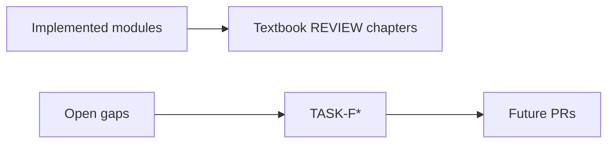

# Appendix D — Roadmap & Gaps

| Field | Value |
|-------|-------|
| **Package** | vinu-features |
| **Module** | — |
| **Status** | REVIEW |
| **Verified** | 2026-07-06 |
| **Prerequisites** | Chapter 01 |

## Learning objectives

- See what is built vs remaining gaps.
- Map enhancement tasks (TASK-F*, TASK-X*) to textbook chapters and code status.

## 1. Problem this module solves

Tracks **remaining work** so contributors do not duplicate effort. Source references: [`complete_guide_features.md`](../../complete_guide_features.md), code audit findings.

## 2. Position in pipeline

| Step | Input | Output |
|------|-------|--------|
| Read this appendix | enhancement idea | TASK category + target chapter |
| Check issue dates | `issues-plan-summary/` | Fixes delivered |

## 3. Enhancement tasks

### Implemented

| ID | Title | Status | Chapter |
|----|-------|--------|---------|
| TASK-F00 | Dashboard health fields fix | ✅ DONE | [ch13](../part-4-operations/ch13-web-ui.md) |
| TASK-F01 | Parallel symbol fetching | ✅ DONE | [ch06](../part-2-engine/ch06-worker-and-oom-safe-load.md) |

### Open

| ID | Priority | Title | Status | Spec | Document when done |
|----|----------|-------|--------|------|-------------------|
| TASK-F02 | MEDIUM | Cross-symbol feature stacking | **TODO** | Combine multiple symbols in one parquet with symbol dimension | [ch07](../part-2-engine/ch07-manifest-and-parquet.md) |
| TASK-F03 | MEDIUM | Portfolio-level features | **TODO** | Equal-weight / cap-weight composite features | [ch05](../part-2-engine/ch05-request-lifecycle.md) |
| TASK-F04 | LOW | Automated model retraining | **TODO** | Cron-triggered retrain on new data | [ch05](../part-1-presets/ch05-ml-models.md) |
| TASK-F05 | LOW | WebSocket status updates | **TODO** | Push run completion events | [ch10](../part-4-operations/ch10-http-api.md) |
| TASK-F06 | LOW | Feature drift monitoring | **TODO** | Compare feature distributions across runs | [ch04](../part-1-presets/ch04-indicator-catalog.md) |

## 4. Code audit gaps

The [2026-07-03 code audit](issues-plan-summary/20260703-issue.md) identified 37 issues across 6 phases. All 37 are fixed as of 2026-07-03.

| Phase | Issues | Status | Chapter |
|-------|--------|--------|---------|
| 1 — Storage concurrency | #1, #2, #9, #31 | ✅ FIXED | [ch08](../part-3-data/ch08-sqlite-registry.md) |
| 2 — Type safety | #5, #24, #27 | ✅ FIXED | [ch12](../part-4-operations/ch12-config-env.md) |
| 3 — Performance | #3, #6, #7, #8, #9, #10, #11, #18, #35 | ✅ FIXED | [ch06](../part-2-engine/ch06-worker-and-oom-safe-load.md) |
| 4 — Design | #4, #14, #16, #17, #19, #20, #21, #23, #25, #26, #27 | ✅ FIXED | [ch11](../part-4-operations/ch11-cli-reference.md) |
| 5 — Worker | #1, #32, #37 | ✅ FIXED | [ch06](../part-2-engine/ch06-worker-and-oom-safe-load.md) |
| 6 — Config | #34, #36, #12 | ✅ FIXED | [ch12](../part-4-operations/ch12-config-env.md) |

## 5. Related chapters

- [Appendix E — Yet to Build](apx-e-yet-to-build.md)
- [Appendix F — Issues Index](apx-f-issues-index.md)
- [INDEX.md](../INDEX.md)
